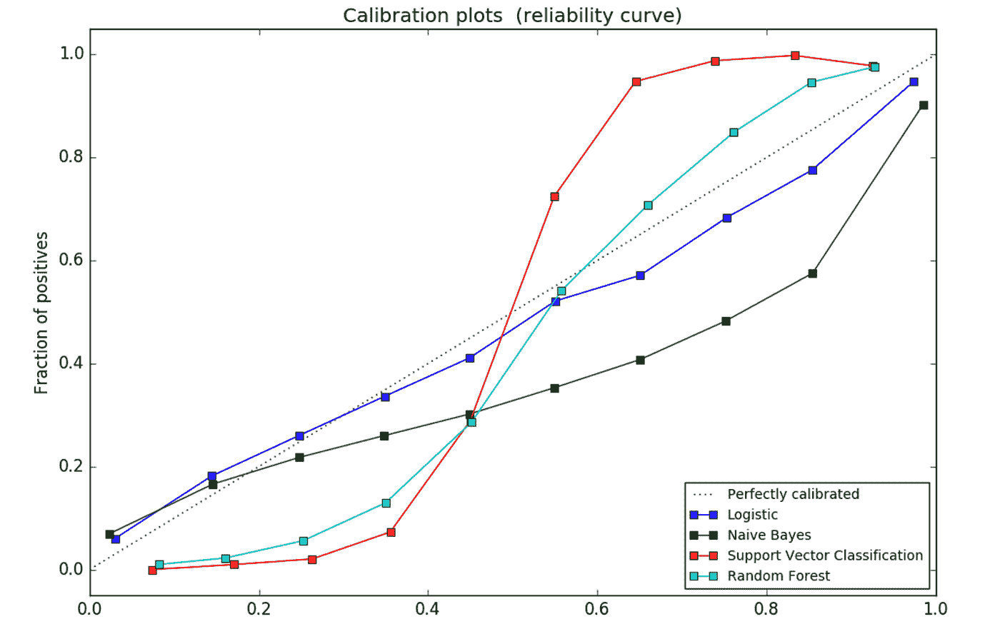
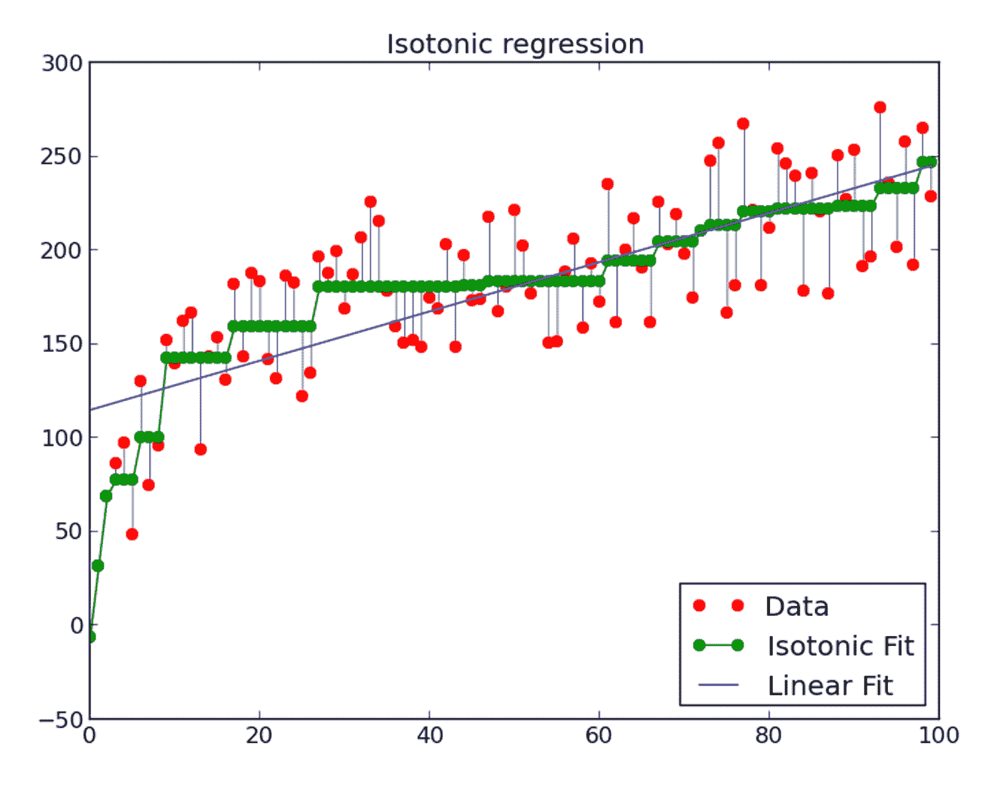

# 增强树的概率校准

> 原文：<https://towardsdatascience.com/probability-calibration-for-boosted-trees-24cbd0f0ccae?source=collection_archive---------2----------------------->

**背景:**概率校准的开创性论文:[http://www . cs . Cornell . edu/~ caru ana/Niculescu . scldbst . CRC . rev 4 . pdf](http://www.cs.cornell.edu/~caruana/niculescu.scldbst.crc.rev4.pdf)

增强决策树通常会产生良好的准确度、精确度和 ROC 面积。然而，因为来自增强的输出不是很好校准的后验概率，所以增强产生差的平方误差和交叉熵。它倾向于保守地预测概率，意味着更接近于中间值而不是极端值。以下是提升对预测概率的影响:

[校准良好的分类器是概率分类器，其模型的输出可以直接解释为置信度。例如，校准良好的(二元)分类器应该对样本进行分类，使得在它给出接近 0.8 的预测值的样本中，大约 80%实际上属于正类。](https://scikit-learn.org/stable/modules/calibration.html)下图比较了不同分类器的概率预测的校准情况:

默认情况下，LogisticRegression 返回校准良好的预测，因为它直接优化了对数损失。相反，其他方法返回有偏差的概率；带着不同的偏见。

执行概率预测校准的两种方法是:基于 Platt 的 sigmoid 模型的参数方法和基于保序回归的非参数方法。应使用不用于模型拟合的测试/验证数据进行概率校准。

## 普拉特标度:

普拉特的缩放相当于在分类器输出上训练逻辑回归模型。

您实际上创建了一个新的数据集，它具有相同的标签，但只有一个维度(未校准分类器的概率输出)。然后，在这个新的数据集上进行训练，并将未校准的分类器的概率输出作为这个校准方法的输入，该方法返回一个校准的概率。在 Platt 的情况下，我们本质上只是对未校准分类器相对于真实类别标签的概率输出执行逻辑回归。

逻辑回归模型是 f(x)= y。y 是输入数据的真实标签，x 是基本分类器的预测概率。现在，您使用逻辑回归的预测概率作为校准分类器的真实概率。

## 保序回归:

其思想是拟合分段常数非减函数，而不是逻辑回归。分段常数非递减意味着阶梯形。通过池相邻违规者算法(PAVA)实现。PAVA 是线性排序保序回归的线性时间(和线性记忆)算法。

训练保序回归的方法是相似的:

f(x) = y，y 是输入数据的真实标签，x 是基本分类器的预测概率。等渗模型将通过 x(基础分类器的预测概率)对数据进行分类，然后拟合一个阶跃函数来给出真实标签的概率。

其他资源:

[http://fastml . com/classifier-calibration-with-Platts-scaling-and-isotonic-regression/](http://fastml.com/classifier-calibration-with-platts-scaling-and-isotonic-regression/)

https://jmetzen.github.io/2015-04-14/calibration.html

【https://scikit-learn.org/stable/modules/calibration.html 