# 解释概率概念:参数估计的贝叶斯推断。

> 原文：<https://towardsdatascience.com/probability-concepts-explained-bayesian-inference-for-parameter-estimation-90e8930e5348?source=collection_archive---------0----------------------->

[Pixabay](https://pixabay.com/photos/ice-summer-delicious-ice-cream-cone-2764086/)

# 介绍

在之前的博文中，我提到了机器学习和统计模型中参数估计的最大似然法。在这篇文章中，我们将回顾另一种使用贝叶斯推理的参数估计方法。我还将展示如何将这种方法视为最大似然法的推广，以及在什么情况下这两种方法是等价的。

假设了一些概率论的基础知识，例如边际概率和条件概率。这些概念在我的[系列的第一篇文章](https://medium.com/@jonnybrooks04/probability-concepts-explained-introduction-a7c0316de465)中有解释。此外，了解高斯分布的一些基本知识也很有帮助，但这不是必需的。

# 贝叶斯定理

在介绍贝叶斯推理之前，有必要了解一下贝叶斯定理。贝叶斯定理真的很酷。它的有用之处在于，它允许我们使用一些我们已经拥有的知识或信念(通常称为*先验*)来帮助我们计算相关事件的概率。例如，如果我们想找出在炎热晴朗的日子里卖冰淇淋的概率，贝叶斯定理为我们提供了工具，让我们利用先验知识来判断在任何其他类型的日子里(下雨、刮风、下雪等)卖冰淇淋的概率。).我们稍后会详细讨论这一点，所以如果你还不明白，请不要担心。

## 数学定义

数学上，贝叶斯定理被定义为:

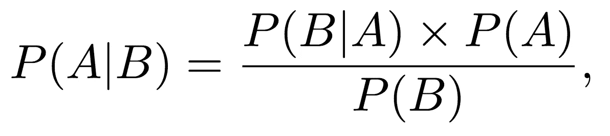

其中 *A* 和 *B* 是事件， *P(A|B)* 是事件 *A* 发生的条件概率，假设事件 *B* 已经发生( *P(B|A)* 具有相同的含义，但是具有 *A* 和 *B* 反转的角色)以及 *P(A)* 和

## *例子*

*数学定义常常让人觉得太抽象和可怕，所以让我们用一个例子来理解这一点。我在[介绍性博客文章](https://medium.com/@jonnybrooks04/probability-concepts-explained-introduction-a7c0316de465)中给出的一个例子是关于从一包传统扑克牌中挑选一张牌。一副牌中有 52 张牌，其中 26 张为红色，26 张为黑色。假设我们知道这张牌是红色的，那么这张牌是 4 的概率是多少？*

*为了把它转换成我们在上面看到的数学符号，我们可以说事件 A 是牌是 4 的事件，事件 B 是牌是红色的。因此，上式中的 *P(A|B)* 就是我们例子中的 *P(4|red)* ，这就是我们要计算的。我们之前计算出这个概率等于 1/13(有 26 张红牌，其中两张是 4)，但是让我们用贝叶斯定理来计算。*

*我们需要找到右边各项的概率。它们是:*

1.  *P(B|A) = P(red|4) = 1/2*
2.  *P(A) = P(4) = 4/52 = 1/13*
3.  *P(B) = P(红色)= 1/2*

*当我们将这些数字代入上述贝叶斯定理的方程时，我们得到 1/13，这就是我们所期待的答案。*

## *贝叶斯定理是如何让我们整合先验信念的？*

*上面我提到了贝叶斯定理允许我们整合先验信念，但是仅仅通过上面的等式很难看出它是如何允许我们这样做的。因此，让我们看看如何使用上面的冰淇淋和天气示例来实现这一点。*

*让 A 代表我们卖冰淇淋的事件，B 代表天气的事件。然后我们可能会问*在给定的天气类型下，在任何一天卖出冰淇淋的可能性有多大？*从数学上来说，这可以写成 P(A =冰淇淋销售额| B =天气类型),相当于等式的左侧。*

*右手边的 P(A)是被称为**先验的表达式。**在我们的例子中，这是 P(A =冰淇淋销售额)，即不管外面的天气如何，销售冰淇淋的(边际)概率。P(A)被称为先验，因为我们可能已经知道冰淇淋销售的边际概率。例如，我可以查看这样的数据:潜在的 100 人中有 30 人实际上在某个地方的某个商店购买了冰淇淋。所以我的 P(A =冰淇淋销售额)= 30/100 = 0.3，在我了解天气之前。这就是贝叶斯定理允许我们整合先验信息的方式。*

***注意:**我在上面提到过，我可以从商店中找到数据来获得先验信息，但是没有什么可以阻止我编造一个完全主观的先验，这个先验不是基于任何数据的。有人可能会根据个人经验或特定领域的知识得出一个先验知识，但重要的是要知道最终的计算将会受到这个选择的影响。我会在后面的文章中更详细地讲述先前信念的强度如何影响结果。*

# *贝叶斯推理*

## *定义*

*现在我们知道什么是贝叶斯定理以及如何使用它，我们可以开始回答问题*什么是贝叶斯推理？**

*首先，【统计】**推断**是从数据中推断出关于人口或概率分布的性质的过程。在我之前关于[最大可能性](/probability-concepts-explained-maximum-likelihood-estimation-c7b4342fdbb1)的文章中，我们做到了这一点。根据一组观察到的数据点，我们确定了平均值的最大似然估计。*

***贝叶斯推断**因此就是使用贝叶斯定理从数据*中推导出关于人口或概率分布的属性的过程。*就这样。*

## *对分布使用贝叶斯定理*

*到目前为止，我上面给出的例子都是用一个数字来表示贝叶斯定理方程中的每一项。这意味着我们得到的答案也是个位数。但是，也可能有单个数字不合适的时候。*

*在上面的冰淇淋例子中，我们看到卖冰淇淋的先验概率是 0.3。然而，如果 0.3 只是我的最佳猜测，但我对这个值有点不确定。概率也可以是 0.25 或者 0.4。在这种情况下，我们先前信念的分布可能更合适(见下图)。这种分布被称为**先验分布**。*

*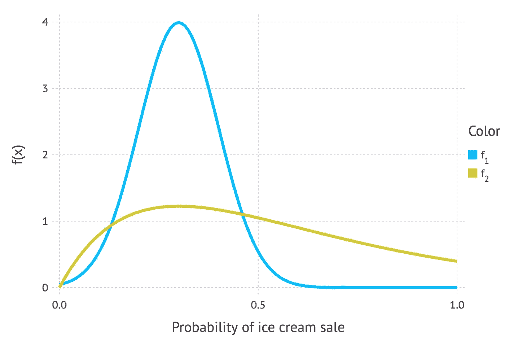*

*2 distributions that represent our prior probability of selling ice on any given day. The peak value of both the blue and gold curves occur around the value of 0.3 which, as we said above, is our best guess of our prior probability of selling ice cream. The fact that f(x) is non-zero of other values of x shows that we’re not completely certain that 0.3 is the true value of selling ice cream. The blue curve shows that it’s likely to be anywhere between 0 and 0.5, whereas the gold curve shows that it’s likely to be anywhere between 0 and 1\. The fact that the gold curve is more spread out and has a smaller peak than the blue curve means that a prior probability expressed by the gold curve is “less certain” about the true value than the blue curve.*

*以类似的方式，我们可以用分布来表示贝叶斯定理中的其他项。当我们处理模型时，我们通常需要使用分布。*

# *贝叶斯定理的模型形式*

*在上面贝叶斯定理的介绍性定义中，我使用了事件 A 和 B，但是当贝叶斯定理的模型形式在文献中陈述时，通常使用不同的符号。我们来介绍一下。*

*我们通常会看到θ，而不是事件 A，这个符号叫做θ。θ是我们感兴趣的，它代表了一组参数。因此，如果我们试图估计高斯分布的参数值，那么θ代表均值μ和标准差σ(数学上写为θ= {μ，σ})。*

*而不是事件 B，我们会看到*数据*或者 ***y =*** *{y1，y2，…，yn}。*这些代表数据，即我们拥有的一组观察值。我将在等式中显式使用*数据*，希望让等式不那么神秘。*

*所以现在模型形式的贝叶斯定理被写成:*

*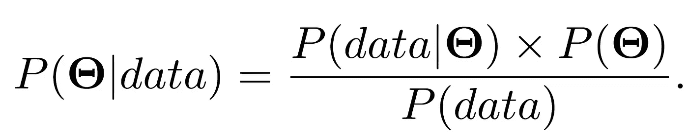*

*我们已经看到 P(θ)是先验分布。它代表了我们对参数真实值的信念，就像我们的分布代表了我们对卖冰淇淋概率的信念。*

**P(*θ*|数据)*左边称为**后验分布。**这是一个分布，代表我们对参数值的信念，在我们计算了右侧的所有数据后，将观察到的数据考虑在内。*

**P(data |*θ*)*是我们以前遇到过的东西。如果你坚持到我上一篇关于最大可能性的文章的结尾，那么你会记得我们说过 *L(数据；μ，σ)* 是似然分布(对于高斯分布)。嗯*P(data |*θ*)*正是这个，是**似然分布**的变相。有时候会写成ℒ*(*θ；*数据)*但这里是一回事**。***

*因此，我们可以使用用我们的*可能性更新的*先验信念*来计算我们参数的*后验分布*。**

*这给了我们足够的信息来通过一个使用贝叶斯推断的参数推断的例子。但是首先…*

## *为什么我完全不顾 P(数据)？*

*嗯，除了数据的边际分布之外，它并没有什么特别的名字，尽管它有时被称为**证据**。记住，我们只对参数值感兴趣，但是 *P(data)* 对它们没有任何引用。实际上， *P(数据)*甚至都没有评估到一个分布。只是一个数字。我们已经观察了数据，所以我们可以计算 *P(数据)*。一般来说，计算 *P(数据)*是**非常困难的**并且有很多方法可以计算它。Prasoon Goyal 的这篇[博客文章](https://blog.statsbot.co/probabilistic-graphical-models-tutorial-d855ba0107d1)解释了这样做的几种方法。*

**P(data)* 之所以重要，是因为得出的数字是一个归一化常数。概率分布的必要条件之一是一个事件所有可能结果的总和等于 1(例如，在 6 面骰子上掷出 1、2、3、4、5 或 6 的总概率等于 1)。归一化常数通过确保分布的和(我应该说是整数，因为它通常是一个连续分布，但现在这样说太迂腐了)等于 1，来确保最终的后验分布是一个真实的概率分布。*

*在某些情况下，我们不关心分布的这种性质。我们只关心分布的峰值出现在哪里，而不管分布是否正态化。在这种情况下，许多人把贝叶斯定理的模型形式写成*

*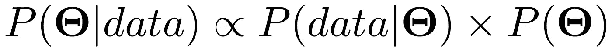*

*其中∝表示“成比例”。这清楚地表明，真实的后验分布不等于右侧，因为我们没有考虑归一化常数 *P(数据)*。*

# *贝叶斯推理例子*

*干得好，走了这么远。在所有那些理论之后，你可能需要休息一下。但是，让我们继续看一个推理可能会派上用场的例子。我们要用的例子是，计算氢键的长度。你不需要知道氢键是什么。我只是用这个作为例子，因为它是我在读博士期间想出来帮助一个朋友的(我们当时在生物化学系，这就是为什么它当时是相关的)。*

*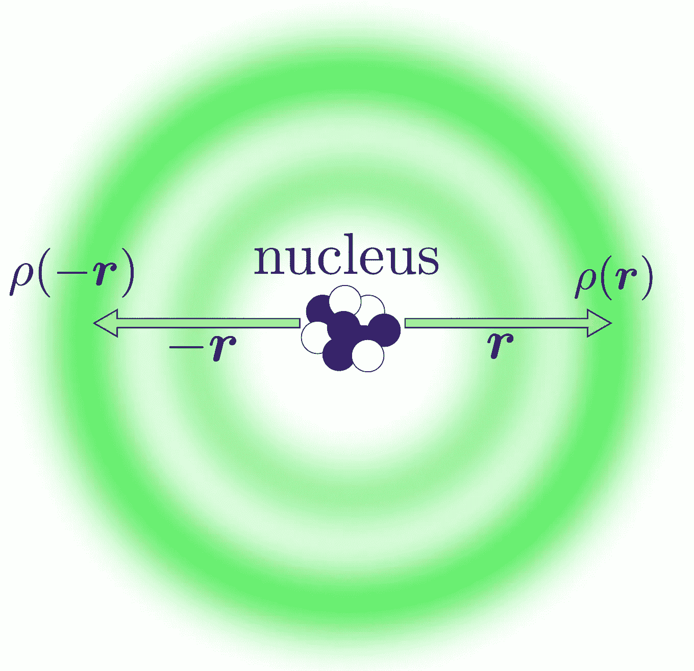*

*I’ve included this image because I think it looks nice, helps to break up the dense text and is kind of related to the example that we’re going to go through. Don’t worry, you don’t need to understand the figure to understand what we’re about to go through on Bayesian inference. In case you’re wondering, I made the figure with [Inkscape](https://inkscape.org/en/).*

*让我们假设氢键在 3.2-4.0 之间(在谷歌上快速搜索给了我这个信息。ngströ是一个距离单位，其中 1 等于 0.1 纳米，所以我们谈论的是非常微小的距离)。这些信息将构成我的先验知识。就概率分布而言，我将把它重新表述为均值μ = 3.6，标准差σ = 0.2 的高斯分布(见下图)。*

*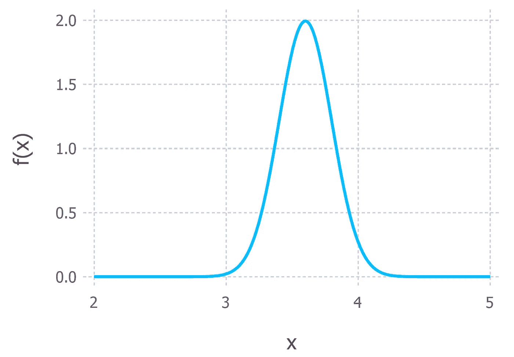*

*Our prior probability for the length of a hydrogen bond. This is represented by a Gaussian distribution with mean μ = 3.6Å and standard deviation σ = 0.2Å.*

*现在，我们看到了一些数据(5 个数据点是从平均值为 3，标准偏差为 0.4 的高斯分布中随机产生的，准确地说)。在现实世界中，这些数据将来自科学实验的结果，该实验给出了测量的氢键长度(图 3 中的金点)。我们可以从数据中推导出一个可能性分布，就像我们在上一篇关于最大可能性的文章中所做的那样。假设数据是从一个可以用高斯分布描述的过程中生成的，我们得到了一个由下图中的黄金曲线表示的似然分布。请注意，5 个数据点平均值的最大似然估计值小于 3(约 2.8)*

*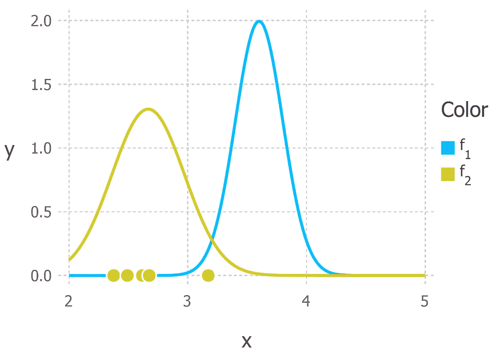*

*Prior probability for the distance of a hydrogen bond in blue and the likelihood distribution in gold derived from the 5 gold data points.*

*现在我们有两个高斯分布，蓝色代表先验，金色代表可能性。我们不关心归一化常数，所以我们有计算非归一化后验分布所需的一切。回想一下，表示高斯分布概率密度的等式是*

*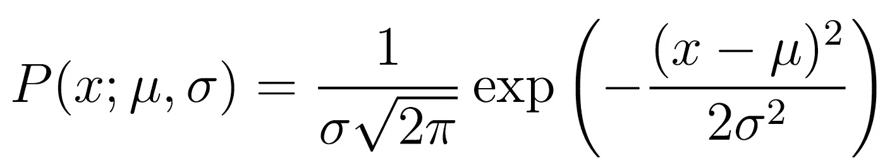*

*所以我们要把其中的两个相乘。我不会在这里讨论数学，因为它变得很乱。如果你对数学感兴趣，那么你可以在本文的前 [2 页看到它的表现。由此产生的后验分布在下图中显示为粉红色。](http://www.tina-vision.net/docs/memos/2003-003.pdf)*

*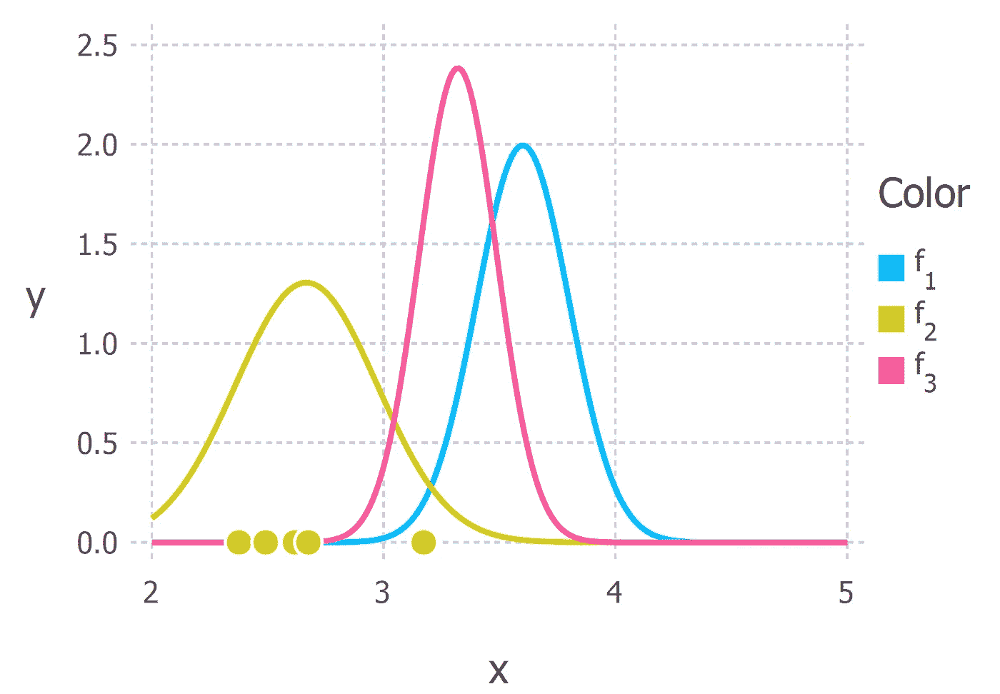*

*The posterior distribution in pink generated by multiplying the blue and gold distributions.*

*现在我们有了氢键长度的后验分布，我们可以从中得出统计数据。例如，我们可以使用分布的[期望值](https://en.wikipedia.org/wiki/Expected_value)来估计距离。或者我们可以计算方差来量化我们结论的不确定性。根据后验分布计算的最常见的统计数据之一是众数。这通常用作感兴趣参数真实值的估计，称为**最大后验概率估计**，或简称为**图**估计。在这种情况下，后验分布也是高斯分布，因此平均值等于众数(和中值),氢键距离的 MAP 估计值位于分布的峰值，约为 3.2。*

# *结束语*

## *为什么我总是用高斯函数？*

*你会注意到，在我所有涉及分布的例子中，我都使用高斯分布。一个主要原因是它使数学变得容易多了。但是对于贝叶斯推理的例子，它需要计算 2 个分布的乘积。我说这很乱，所以我没有做数学。但即使我自己没有做数学计算，我也知道后验概率是高斯分布。这是因为高斯分布有一个特殊的属性，使得它很容易处理。就高斯似然函数而言，它与自身共轭。这意味着，如果我把一个高斯先验分布乘以一个高斯似然函数，我将得到一个高斯后验函数。后验分布和先验分布都来自同一个分布族(它们都是高斯分布)这一事实意味着它们被称为**共轭分布。**在这种情况下，先验分布被称为**共轭先验。***

*在许多推理情况下，可能性和先验被选择成使得结果分布是共轭的，因为这使得数学更容易。数据科学中的一个例子是[潜在狄利克雷分配(LDA)](https://en.wikipedia.org/wiki/Latent_Dirichlet_allocation) 这是一种无监督学习算法，用于在几个文本文档(称为语料库)中查找主题。在埃德温·陈的博客中可以找到关于 LDA 的很好的介绍。*

*在某些情况下，我们不能简单地选择先验或似然性来计算后验分布。有时可能性和/或先验分布看起来很可怕，手工计算后验概率是不容易或不可能的。在这些情况下，我们可以用不同的方法来计算后验分布。最常见的方法之一是使用一种叫做马尔可夫链蒙特卡罗方法的技术。Ben Shaver 写了一篇名为[的精彩文章，介绍了马尔可夫链蒙特卡罗方法](/a-zero-math-introduction-to-markov-chain-monte-carlo-methods-dcba889e0c50)，以一种非常通俗易懂的方式解释了这种技术。*

## *当我们得到新数据时会发生什么？*

*贝叶斯推理的一个伟大之处是，你不需要大量的数据来使用它。1 次观察足以更新先验。事实上，贝叶斯框架允许你在数据到来时实时迭代更新你的信念。它是这样工作的:你对某事有一个先验的信念(例如一个参数的值)，然后你接收一些数据。你可以像上面那样通过计算后验分布来更新你的信念。之后，我们会收到更多的数据。所以我们的后验变成了新的先验。我们可以用从新数据导出的可能性来更新新的先验，并且我们再次得到新的后验概率。这个循环可以无限期地继续下去，所以你会不断地更新你的信念。*

*卡尔曼滤波器(及其变种)就是一个很好的例子。它被用于许多场景，但可能是数据科学中最引人注目的是它在无人驾驶汽车上的应用。我在攻读数学蛋白质晶体学博士期间使用了一种叫做无味卡尔曼滤波器的变体，并为实现它们的[开源包做出了贡献](https://github.com/ElOceanografo/StateSpace.jl)。为了更好的直观描述卡尔曼滤波器，请看这篇博文:[卡尔曼滤波器如何工作，图片](http://www.bzarg.com/p/how-a-kalman-filter-works-in-pictures/)由蒂姆·巴布提供。*

## *利用前科作为规则*

*我们在上述氢键长度示例中生成的数据表明，2.8 是最佳估计值。然而，如果我们仅根据数据进行估计，我们可能会有过度拟合的风险。如果数据收集过程出现问题，这将是一个巨大的问题。我们可以用先验知识在贝叶斯框架中解决这个问题。在我们的例子中，使用以 3.6 为中心的高斯先验得到后验分布，给出氢键长度的 MAP 估计值为 3.2。这表明当估计参数值时，我们的先验可以作为正则化器。*

*我们对先验概率和可能性的权重取决于两个分布之间的相对不确定性。在下图中，我们可以直观地看到这一点。颜色同上，蓝色代表先验分布，金色代表可能性，粉色代表后验分布。在左图中，您可以看到我们的先验(蓝色)比可能性(金色)分散得少得多。因此，后验概率更像前验概率。右图中的情况正好相反。*

*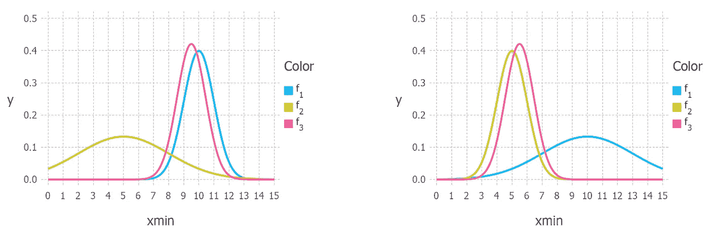*

*因此，如果我们希望增加参数的正则化，我们可以选择缩小与可能性相关的先验分布。*

*[米歇尔·格林](https://medium.com/u/191ed75b4367?source=post_page-----90e8930e5348--------------------------------)写了一篇名为[贝叶斯先验和过度拟合的真相](/the-truth-about-bayesian-priors-and-overfitting-84e24d3a1153)的文章，更详细地讨论了这个问题，并给出了如何设定先验的建议。*

## *什么时候 MAP 估计等于最大似然估计？*

*当先验分布均匀时，MAP 估计等于 MLE。下面是一个均匀分布的例子。*

*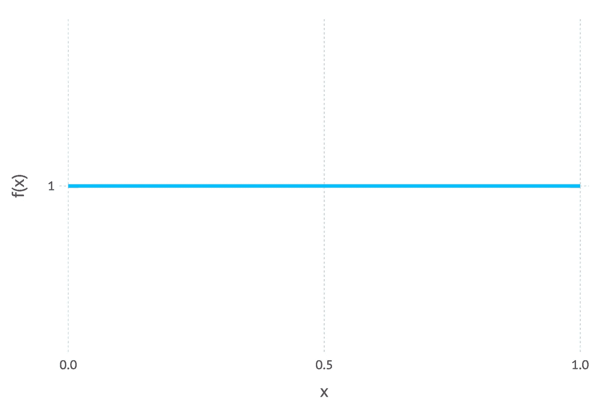*

*Uniform distribution*

*我们可以看到的是，均匀分布对 x 轴(是一条水平线)上的每个值赋予相等的权重。直观上，它表示缺乏关于哪些值最有可能的任何先验知识。在这种情况下，所有的权重都分配给了似然函数，因此当我们将先验乘以似然性时，得到的后验与似然性完全相似。因此，最大似然法可以看作是 MAP 的一个特例。*

*当我开始写这篇文章时，我真的没有想到它会这么长，所以非常感谢你能走这么远。我真的很感激。一如既往，如果有任何不清楚的地方或者我在上面犯了一些错误，请随时留下评论。在本系列的下一篇文章中，我可能会尝试讨论我在这篇文章中忽略的标准化常数 *P(数据)**的边缘化问题。当然，除非有人想让我看别的东西；)**

**感谢您的阅读。**