# 概率概念解释:边缘化

> 原文：<https://towardsdatascience.com/probability-concepts-explained-marginalisation-2296846344fc?source=collection_archive---------0----------------------->

# 介绍

在这篇文章中，我将解释边缘化的概念，并通过一个例子来解决一个相当简单的[最大似然](/probability-concepts-explained-maximum-likelihood-estimation-c7b4342fdbb1)问题。这篇文章需要一些基本概率概念的知识，你可以在我这个系列的[介绍性博客文章](/probability-concepts-explained-introduction-a7c0316de465)中找到解释。

# 什么是边缘化

边缘化是一种需要对一个变量的可能值求和来确定另一个变量的边际贡献的方法。这个定义听起来有点抽象，所以让我们试着用一个例子来说明这一点

假设我们对天气如何影响英国人的快乐感兴趣。我们可以用数学方法把它写成 P(幸福|天气),即在给定天气类型的情况下，某人幸福水平的概率是多少。

假设我们有测量某人快乐程度的设备和定义，还记录了英格兰和苏格兰的天气情况。现在，苏格兰人总体上比英格兰人更幸福是可行的。问题是，人们总是有一个国籍，所以我不能在测量中摆脱它。所以我们实际测量的是 P(幸福，国家|天气)，也就是说，我们同时在看幸福和国家。

边缘化告诉我们，如果我们对所有国家的可能性求和，就可以计算出我们想要的数量(记住，英国由 3 个国家组成:英格兰、苏格兰和威尔士)，即 P(幸福|天气)= P(幸福，国家=英格兰|天气)+ P(幸福，国家=苏格兰|天气)+ P(幸福，国家=威尔士|天气)。

就是这样！边缘化告诉我们，只要把一些概率相加，就能得到想要的概率量。一旦我们计算出我们的答案(它可以是单个值或分布)，我们就可以得到我们想要的任何属性(推论)。

# 相关定义

如果这个概念听起来与你相似，但你以前没有听说过边缘化，这可能是因为你听说过它被称为一个不同的名字。有时这种方法被称为**,即剔除有害变量。**积分本质上是一个变量“相加”的另一种说法，你正在求和的变量被称为“有害变量”。因此，在上面的示例中，“*country”*变量是有害变量。

如果您正在使用[概率图形模型](https://blog.statsbot.co/probabilistic-graphical-models-tutorial-and-solutions-e4f1d72af189)，那么边缘化是一种您可以执行精确推理的方法(即，您可以从您感兴趣的分布中写下精确的数量，例如，可以从分布中精确计算出平均值)。在这个语境中边缘化是一种方法，有时与 [**同义使用，变量消去。**](https://en.wikipedia.org/wiki/Variable_elimination)

# 例子:骰子未知的骰子游戏。

我将仔细阅读世界上最好的数学和计算晶体学家之一艾利·j·麦考伊写的精彩的[喜欢可能性](https://doi.org/10.1107/S0907444904016038)论文中给出的例子。如果你正在寻找关于骰子的各种最大似然概念(如对数似然、中心极限定理等)的很好的介绍。)那么我强烈推荐。

假设我们有四个骰子:4 面骰子，6 面骰子，8 面骰子和 10 面骰子(如下所示)。

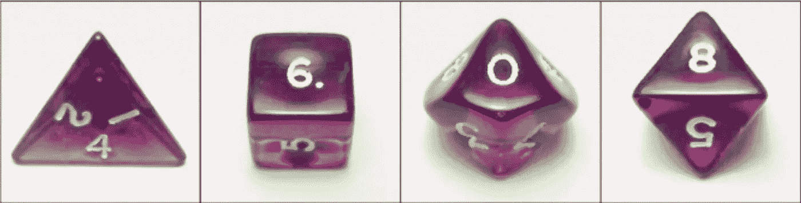

The 4 dice that we have. From left to right: 4-sided die, 6-sided die, 10-sided die and an 8-sided die

## 游戏

*   我把一个六面和一个八面的骰子放在一个红色的盒子里，一个四面和十面的骰子放在一个蓝色的盒子里。
*   我从红色和蓝色的盒子中随机选择一个骰子，并把它们放入黄色的盒子中。
*   我从黄色盒子里随机选择一个骰子，掷骰子，告诉你结果。

玩游戏后，我们被告知结果是 3。我们要回答的问题是:*骰子最初最有可能来自红盒子还是蓝盒子？*

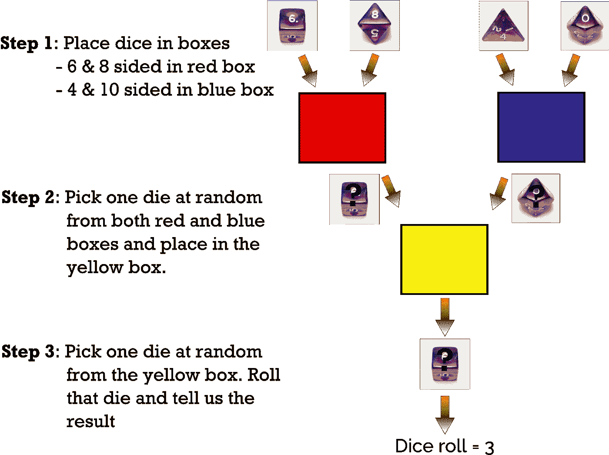

Graphic depiction of the game described above

## 接近解决方案

为了解决这个问题，我们必须计算出当我们掷出 3， *L* (box=red| dice roll=3)时，骰子从红色盒子中取出的可能性，以及当我们掷出 3， *L* (box=blue| dice roll=3)时，骰子从蓝色盒子中取出的可能性。无论哪个概率最高，都是我们给出的答案。

那么我们如何计算*L*(box =红色|掷骰子=3)和*L*(box =蓝色|掷骰子=3)？

首先要知道的是，可能性和概率通过以下等式相关联:

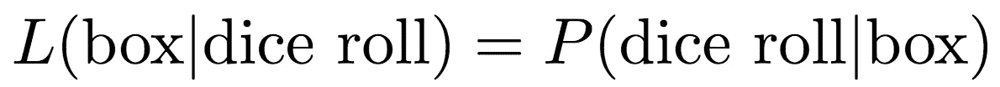

关于这一点的解释，请参见我关于最大似然的帖子的[结尾。](/probability-concepts-explained-maximum-likelihood-estimation-c7b4342fdbb1)

这意味着，可能性， *L* (box=red| dice roll=3)，相当于在骰子来自红色盒子的情况下，找出掷出 3 的概率，即 *P* (dice roll=3 | box=red)。同样*L*(box =蓝色|掷骰子=3) = *P* (掷骰子= 3 | box =蓝色)。

让我们假设我们已经从红盒子中选择了一个骰子。它可以是六面或八面模具。我有 50%的机会选择两个死者中的一个。假设我选择六面骰子。也就是说，我必须从黄色盒子中选择六面骰子，然后掷出 3。因此这种情况下的概率由下式给出:

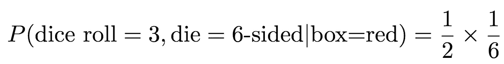

只是为了说明一下。“1/2”来自于我有 50%的机会从红色盒子中随机选择 6 面骰子，因为它也包含 8 面骰子。“1/6”是因为我有一个 6 面骰子，因此有 1/6 的机会掷出 3。

请注意，答案中没有包含任何关于从黄色盒子中挑选 6 面骰子的概率的内容。这是因为在这种情况下，从黄色盒子中挑选六面骰子的概率是 1(您可能认为是 1/2，因为黄色盒子包含 6 面骰子和我从蓝色盒子中挑选的任何骰子)。这是因为我们正在计算从 6 面骰子**掷出 3 的条件概率，假设骰子来自红色盒子。**因此，在另一个场景中，我们在黄色框中选择另一个骰子是不可能的，因为另一个骰子最初来自蓝色框。给定我们从红框中选择的条件，我们只能从黄框中选择 6 面骰子，因此从黄框中选择 6 面骰子的概率是 1。

以类似的方式，我们可以计算结果为 3 的概率，我们实际上已经从红盒子中挑选了 8 面骰子。这一次的概率是

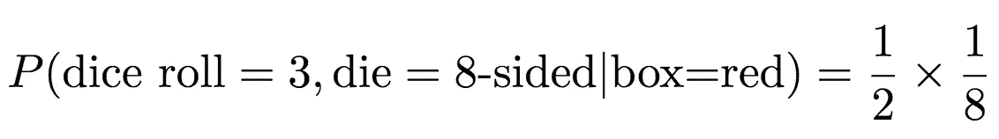

我们现在已经完成了计算骰子来自红盒子的概率所需的几乎所有工作。记住，红盒子只包含 6 面和 8 面骰子，所以我们要做的就是找出骰子是 6 面**还是** 8 面的概率。从[的介绍文章](/probability-concepts-explained-introduction-a7c0316de465)中，我们知道在**或**的情况下，我们需要将概率相加。因此，骰子来自红盒子的概率是

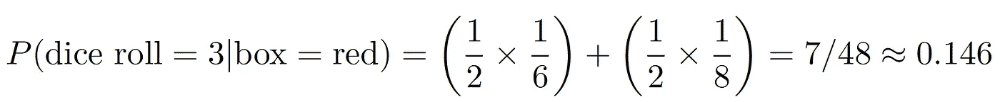

对于那些不熟悉上式中数字之间的“wavey”等号的人来说，它的意思是“大约等于”。真正的答案是 0.1458333333……(3 永远继续下去，我们说这是 3 的循环)，但我变懒了，只给出了小数点后 3 位的答案(即四舍五入到小数点后 3 位)。为了明确我们没有给出准确答案的事实，我们通常使用“wavey”等号。

我们可以对蓝盒子做同样的计算

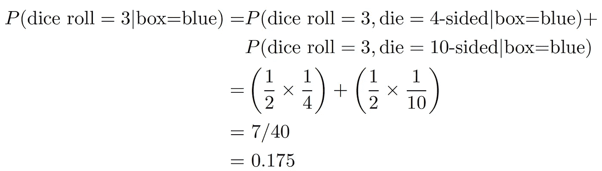

骰子最初来自蓝盒的概率更高，因此使用最大似然法，我们可以得出骰子最有可能来自蓝盒的结论。

## 那个例子中的边缘化在哪里？

对于那些观察力非常敏锐的人来说，你会注意到我在那个例子部分一次都没有使用“边缘化”这个词。这是因为我想让你直观地理解如何计算从盒子中挑选骰子的概率。

如果你看上面蓝框的等式，你会看到我们把所有可能性的概率加在一起，即挑选 4 面骰子和 10 面骰子。这是边缘化！我们对讨厌的变量(骰子)求和。注意，在那个游戏中，我们根本没有观察到我们选择的骰子，我们也不需要观察！我们需要知道的只是结果(掷骰子= 3)和骰子的所有可能值。这就是它如此强大的原因。我们可以计算出我们从未观察到的事情的概率。只要我们知道有害变量的可能值，我们总是可以使用它来执行边缘化，并计算不同变量的分布。

# 注释

这是我让我们写一些更可怕的方程的部分，但是请耐心听我说，我会尽力让它变得容易理解。

让我们想想我们刚刚在示例中做了什么。我们从联合概率开始， *P* (掷骰子，骰子|盒子)(即*掷骰子*是 3，*骰子*是我们选择掷骰子的骰子，*盒子*是我们选择骰子的原始盒子；蓝色或红色)。一旦我们执行边缘化，我们就以条件概率结束， *P* (掷骰子|盒子)。这是边缘化的主要好处之一。我们可以从联合概率到条件概率。

事实上我们也可以从联合概率到边际概率。如果你看到边缘化的数学定义，这就是你会看到的典型形式。如果你还没看好数学定义，…你很幸运。你马上就要看到了。

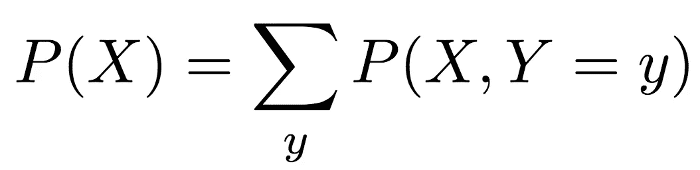

大的 ol' ∑是懒惰的数学家符号，表示“把所有的东西加起来”，它下面的*【y】*告诉我们应该把什么加起来。所以等式是这样说的，*“如果你想要 X 的边际概率(等号的左边)，那么你需要把 Y 的每个可能结果的 X 和 Y 的联合概率加起来”*。

联合概率有时很难处理，所以我们可以使用概率中的[一般乘法规则](https://www.khanacademy.org/math/ap-statistics/probability-ap/probability-multiplication-rule/a/general-multiplication-rule)重写右边的联合概率，我在[介绍性博客帖子中展示过。](/probability-concepts-explained-introduction-a7c0316de465)

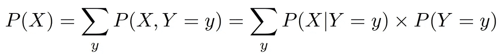

最右边的等式是条件分布和边际分布的乘积，有时边际分布更容易计算。

正如我之前提到的,∑告诉我们“将一切相加”。我没有提到的是，只有当变量为*“离散”时，才会使用特定符号。*我的意思是，变量只能取有限数量的值。在前面的例子中，我们对离散的讨厌变量求和(例如，英国国家只能是英格兰、威尔士或苏格兰，骰子只有有限的结果数，例如 6 面的从 1 到 6)。但是离散值不一定是有限的。例如，它们可以是所有的正整数(即正整数)，如 1、2、3、…。等等。

然而，当我们处理在给定范围内具有无限个可能值的变量时(例如，0 到 10 米之间的距离测量可以具有无限个值，例如 5 米、5.1 米、5.01 米、5.001 米、5.0001 米……等等)，我们将这些变量称为“*连续变量*，并且我们不使用∑符号。相反，我们使用∫。这个符号仍然告诉我们，我们必须把所有的东西加起来，但是我们知道这个讨厌的变量是连续的，所以我们把边际化写成

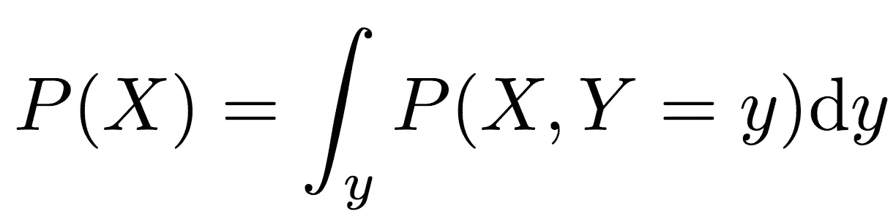

这与上面离散变量情况下的边际化方程意思相同。结尾的“d *y* ”告诉我们要积分什么(“积分”是我们在处理连续变量时对“加法”的称呼)。

“d *y* 是必要的原因是，如果我们不声明它，我们要积分的东西并不总是很明显。考虑干扰变量是围绕圆的角度的情况。我们知道角度在 0 到 360 度之间，或者更专业地说，我们喜欢用弧度来代替我们所说的从 0 到 2π的角度

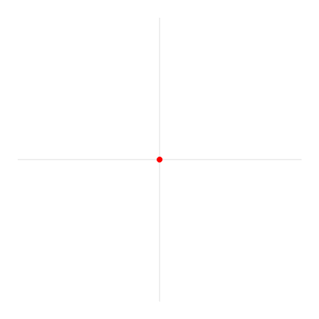

[Source: Wikipedia](https://en.wikipedia.org/wiki/Radian#/media/File:Circle_radians.gif). Radians in a circle

所以我们可能会想写

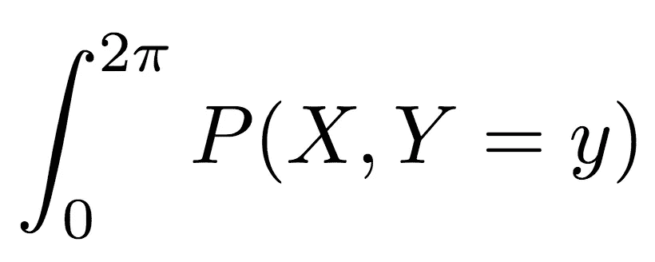

我们知道我们需要对从 0 到 2π的值进行积分，但是我们是对 X 的值进行积分还是对 Y 的值进行积分呢？全世界的数学家都渴望为上述暴行打我一巴掌。

为了解决这个问题，我们将“d *y* 放在最后，以明确我们正在对 0 和 2π之间的 *Y* 值进行积分，这意味着我们也知道答案是 X 上的边际分布(如下)。

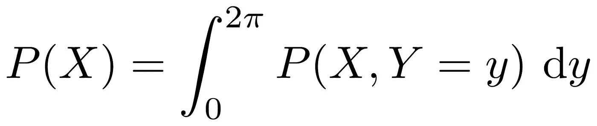

对那些感兴趣的人来说，积分从 0 到 2π的角度是我们在 X 射线晶体学中必须做的事情，这是我博士学位的领域，因为有一个叫做[相位问题](https://en.wikipedia.org/wiki/Phase_problem)。这基本上是一个问题，我们不能在实验中测量“相位”,而相位可以像角度一样被数学处理。因此，为了计算我们观察到的数据的理论分布，我们必须忽略这些阶段。

[亚当·凯莱赫](https://medium.com/u/1cdc1cca2f85?source=post_page-----2296846344fc--------------------------------)在他的[因果包](https://github.com/akelleh/causality)中使用边缘化来消除混杂变量的影响。他还使用一般乘法法则，把边际化写成我们上面讨论过的条件分布和边际分布的乘积。你可以在他的[博客中读到。](https://medium.com/@akelleh/causal-inference-with-pandas-dataframes-fc3e64fce5d)

# 结束语

## 概率的链式法则

在上面的计算中，我们实际上使用了一个相当普通的概率程序，甚至没有意识到这一点。我们使用的结果是概率的*链式法则*(不要与微分的[链式法则](https://en.wikipedia.org/wiki/Chain_rule)混淆)。它指出

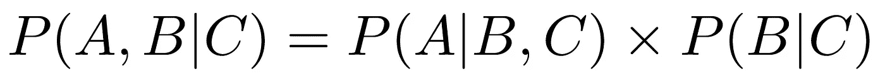

它允许我们将联合概率(左侧)写成条件概率和边际概率(右侧)的乘积

这在计算联合分布时经常用到，因为正如我们已经提到的，确定条件概率和边际概率更容易。

要查看我们在哪里使用了上面的结果，请记住我们使用了等式

比较这些等式，我们可以让 A =骰子滚动，B =骰子，C =盒子。这意味着我们可以把上面等式的左边写成

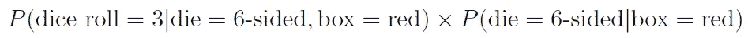

现在让我们来理解这些。

*   *P* (掷骰子= 3|骰子= 6 面，盒子=红色)是我们掷出 3 的概率，假设我们拿起 6 面骰子，它在红色盒子里。这等于 1/6。
*   *P* (骰子= 6 面|盒子=红色)是我们从红色盒子中选择 6 面骰子的概率。这等于 1/2。

因此，我们得到 1/2 ✕ 1/6，这正是我们在这个例子中通过直觉确定的结果。

这里我们用三个变量展示了链式法则。如果你看看维基百科上[链式法则的定义(看起来更可怕),你会看到它对于四个变量和无限多个变量的样子。](https://en.wikipedia.org/wiki/Chain_rule_(probability))

这看起来很可怕，但想法是一样的。我们在左边有一个联合概率分布，我们想把它写成右边的条件概率和边际概率的乘积。

## 用于贝叶斯推理

如果你读了我以前关于[贝叶斯推理](/probability-concepts-explained-bayesian-inference-for-parameter-estimation-90e8930e5348)的文章，你会知道贝叶斯定理的模型形式被写成

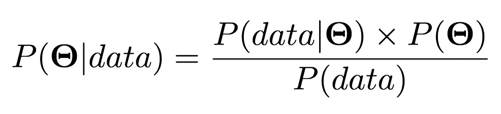

我提到过，我们经常不计算分母 P(数据)，也称为归一化常数，因为在许多情况下它可能太难计算，我们并不总是需要它。

在某些情况下，我们可以精确计算，边缘化会有所帮助。如果我们将边缘化方程写成与上述“*符号*”部分中连续变量情况相同的形式，我们得到

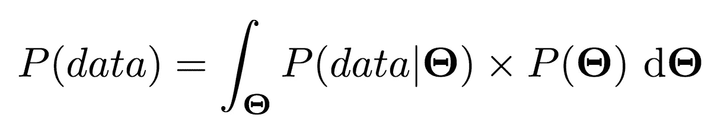

显而易见，我们通过所有可能的参数值对右侧进行积分。在某些情况下，我们可以精确地或近似地计算这个表达式，这样我们就可以得到一个归一化的后验分布。

再次感谢你能走到这一步。我知道这篇文章包含了很多数学知识，但我希望它有意义。如果有什么不清楚的，你想让我写的或者我可以改进的地方，请不要犹豫让我知道。

谢谢大家！