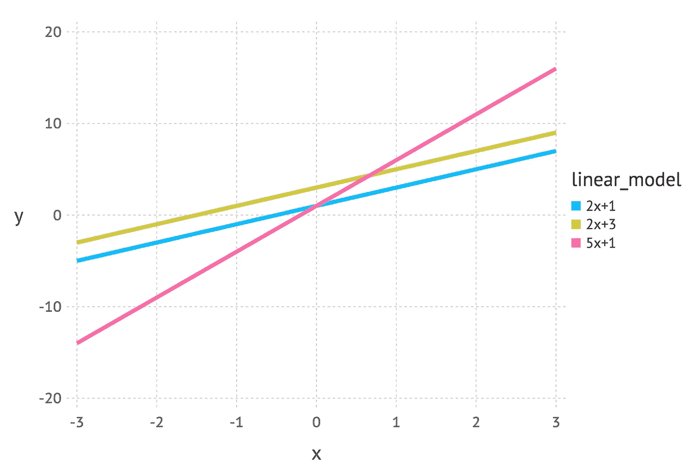
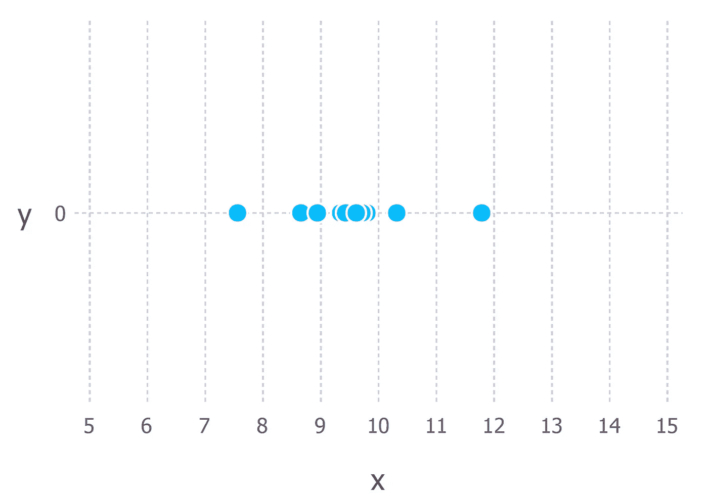
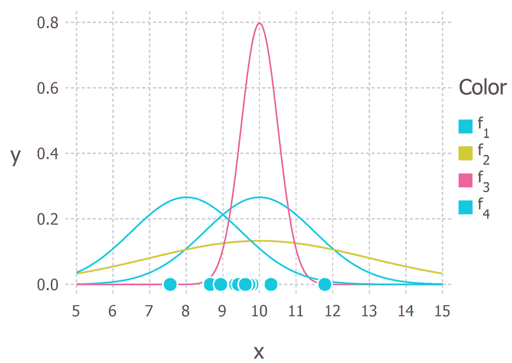
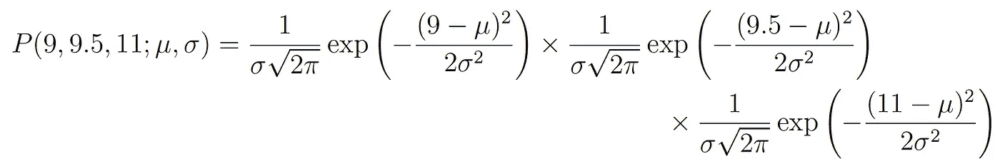
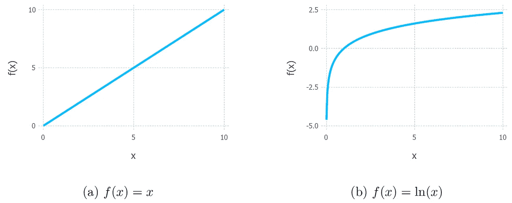
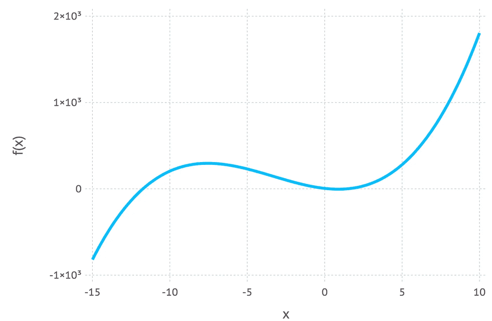
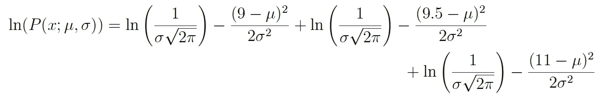
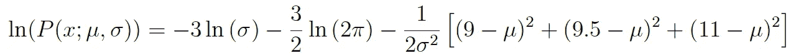
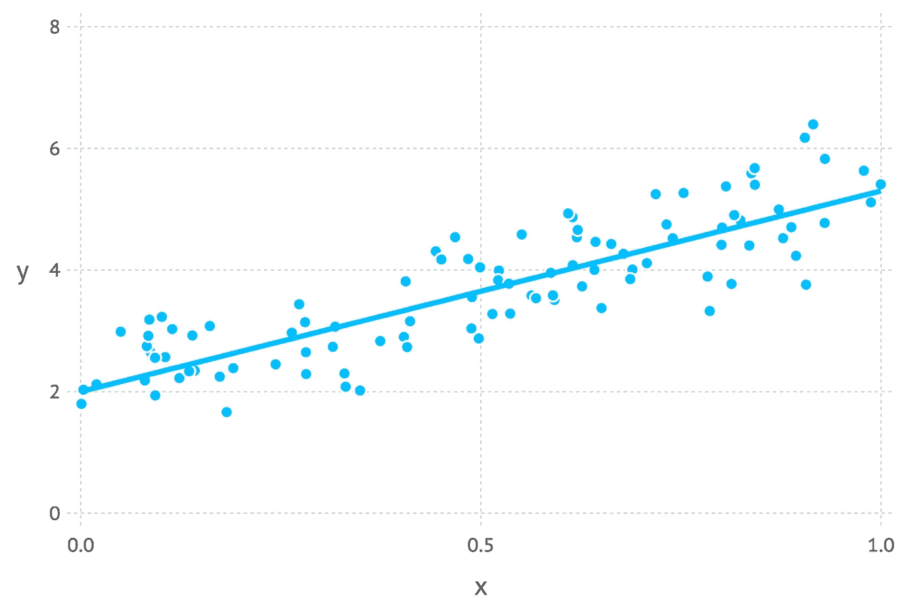

# 概率概念解释:最大似然估计

> 原文：<https://towardsdatascience.com/probability-concepts-explained-maximum-likelihood-estimation-c7b4342fdbb1?source=collection_archive---------0----------------------->

# 介绍

在这篇文章中，我将解释什么是参数估计的最大似然法，并通过一个简单的例子来演示这种方法。有些内容需要基本概率概念的知识，如联合概率的定义和事件的独立性。我已经写了一篇关于这些先决条件的博文，所以如果你认为你需要复习，请随意阅读。

# 什么是参数？

通常在机器学习中，我们使用一个模型来描述产生观察到的数据的过程。例如，我们可以使用随机森林模型来分类客户是否会取消服务订阅(称为[流失建模](/machine-learning-predicting-customer-churn-dd38a42774cf))，或者我们可以使用线性模型来预测公司将产生的收入，具体取决于他们可能在广告上花费多少(这将是[线性回归](/simple-and-multiple-linear-regression-in-python-c928425168f9)的一个例子)。每个模型都包含自己的一组参数，这些参数最终定义了模型的外观。

对于线性模型，我们可以写为 *y = mx + c* 。在本例中, *x* 可以代表广告支出，而 *y* 可能是产生的收入。 *m* 和 *c* 是该型号的参数。这些参数的不同值将产生不同的线条(见下图)。

Three linear models with different parameter values.

所以参数定义了模型的蓝图。只有为参数选择了特定的值，我们才能得到描述给定现象的模型的实例。

# 最大似然估计的直观解释

最大似然估计是一种确定模型参数值的方法。发现参数值使得它们最大化由模型描述的过程产生实际观察到的数据的可能性。

上面的定义听起来可能仍然有点晦涩，所以让我们通过一个例子来帮助理解这一点。

假设我们从某个过程中观察到了 10 个数据点。例如，每个数据点可以代表学生回答一个特定的考试问题所需的时间长度(以秒为单位)。下图显示了这 10 个数据点

The 10 (hypothetical) data points that we have observed

我们首先必须决定我们认为最能描述数据生成过程的模型。这部分很重要。至少，我们应该对使用哪种模型有一个好的想法。这通常来自于一些领域的专业知识，但我们不会在这里讨论。

对于这些数据，我们假设数据生成过程可以用高斯(正态)分布来充分描述。对上图的直观观察表明，高斯分布似乎是合理的，因为这 10 个点中的大部分都集中在中间，只有少数点分散在左右两边。(在只有 10 个数据点的情况下匆忙做出这种决定是不明智的，但考虑到这些数据点是我生成的，我们会照做的)。

回想一下，高斯分布有两个参数。平均值μ和标准差σ。这些参数的不同值会产生不同的曲线(就像上面的直线一样)。我们想知道*哪条曲线最有可能产生我们观察到的数据点？*(见下图)。最大似然估计是一种方法，可以找到μ和σ的值，从而得到最符合数据的曲线。

The 10 data points and possible Gaussian distributions from which the data were drawn. f1 is normally distributed with mean 10 and variance 2.25 (variance is equal to the square of the standard deviation), this is also denoted f1 ∼ N (10, 2.25). f2 ∼ N (10, 9), f3 ∼ N (10, 0.25) and f4 ∼ N (8, 2.25). The goal of maximum likelihood is to find the parameter values that give the distribution that maximise the probability of observing the data.

生成数据的真实分布是 f1 ~ N(10，2.25)，即上图中的蓝色曲线。

# 计算最大似然估计

现在我们对什么是最大似然估计有了直观的理解，我们可以继续学习如何计算参数值。我们找到的值称为最大似然估计(MLE)。

我们将再次用一个例子来证明这一点。假设我们这次有三个数据点，并且我们假设它们是从一个由高斯分布充分描述的过程中产生的。这几点是 9，9.5，11。*我们如何计算高斯分布μ和σ的参数值的最大似然估计？*

我们要计算的是观察所有数据的总概率，即所有观察数据点的联合概率分布。要做到这一点，我们需要计算一些条件概率，这可能会变得非常困难。所以在这里我们要做第一个假设。*假设每个数据点独立于其他数据点生成*。这个假设使数学变得容易多了。如果事件(即生成数据的过程)是独立的，那么观察所有数据的总概率是单独观察每个数据点的乘积(即边际概率的乘积)。

观察由高斯分布产生的单个数据点 *x，*的概率密度由下式给出:

符号*P(x；μ，σ)* 是为了强调它后面出现的符号是概率分布的参数。因此，它不应该与条件概率(通常用垂直线表示，例如 *P(A| B))混淆。*

在我们的例子中，观察三个数据点的总(联合)概率密度由下式给出:

我们只需计算出导致给出上述表达式最大值的 *μ* 和 *σ* 的值。

如果你在数学课上学过微积分，那么你可能会意识到有一种技术可以帮助我们找到函数的最大值(和最小值)。这叫做*分化。*我们要做的就是找到函数的导数，将导函数设置为零，然后重新排列方程，使感兴趣的参数成为方程的主题。瞧，我们就有了参数的最大似然值。我现在将介绍这些步骤，但我将假设读者知道如何对常见函数进行微分。如果你想要更详细的解释，请在评论中告诉我。

## 对数可能性

上面的总概率表达式实际上很难区分，所以几乎总是通过取表达式的自然对数来简化。这绝对没问题，因为自然对数是一个单调递增的函数。这意味着，如果 x 轴上的值增加，y 轴上的值也会增加(见下图)。这很重要，因为它确保了概率对数的最大值出现在与原始概率函数相同的点上。因此，我们可以用更简单的对数似然代替原始似然。

Monotonic behaviour of the original function, y = x on the left and the (natural) logarithm function y = ln(x). These functions are both monotonic because as you go from left to right on the x-axis the y value always increases.

Example of a non-monotonic function because as you go from left to right on the graph the value of f(x) goes up, then goes down and then goes back up again.

对原始表达式进行记录可以得到:

这个表达式可以用对数定律再次简化，得到:

这个表达式可以求导以找到最大值。在这个例子中，我们将找到均值μ的极大似然估计。为此，我们取函数对μ的偏导数，给出

最后，将等式左侧设置为零，然后重新排列μ，得出:

这就是μ的最大似然估计。我们也可以用σ做同样的事情，但我将把它留给有兴趣的读者做练习。

# 结束语

## 最大似然估计总能以精确的方式求解吗？

*不*是简短的回答。更有可能的是，在现实世界中，对数似然函数的导数在分析上仍然是难以处理的(即，手动区分函数太难/不可能)。因此，像[期望最大化算法](https://en.wikipedia.org/wiki/Expectation%E2%80%93maximization_algorithm)这样的迭代方法被用于寻找参数估计的数值解。尽管如此，总体想法还是一样的。

## 那么为什么是最大似然而不是最大概率呢？

这只是统计学家的迂腐(但有充分的理由)。大多数人倾向于交替使用概率和可能性，但统计学家和概率理论家区分两者。通过查看等式，可以更好地找出混淆的原因。

这些表达式是相等的！那么这意味着什么呢？我们先定义一下 *P(数据；μ，σ)* ？表示*“用模型参数μ和σ观察数据的概率密度”*。值得注意的是，我们可以将其推广到任何数量的参数和任何分布。

另一方面 *L(μ，σ；data)* 表示*“给定我们观察到的一堆数据，参数μ和σ取某些值的可能性。”*

上面的等式表明，给定参数的数据的概率密度等于给定数据的参数的似然性。但是，尽管这两个东西是相等的，但可能性和概率密度从根本上提出了不同的问题——一个是关于数据的问题，另一个是关于参数值的问题。这就是为什么这种方法被称为最大似然而不是最大概率。

## 最小二乘最小化何时与最大似然估计相同？

最小平方最小化是机器学习中估计模型参数值的另一种常用方法。事实证明，当模型被假设为高斯型时，MLE 估计相当于最小二乘法。如需更深入的数学推导，请查看这些幻灯片。

通过理解它们的目标，我们可以直观地解释这两种方法之间的联系。对于最小二乘参数估计，我们希望找到使数据点和回归线之间的总平方距离最小的线(见下图)。在最大似然估计中，我们希望最大化数据的总概率。当假设高斯分布时，当数据点越接近平均值时，就找到了最大概率。由于高斯分布是对称的，这相当于最小化数据点和平均值之间的距离。

Regression line showing data points with random Gaussian noise

如果有任何不清楚的地方或者我在上面犯了一些错误，请随时留下评论。在下一篇文章中，我计划介绍[贝叶斯推理以及它如何用于参数估计](/probability-concepts-explained-bayesian-inference-for-parameter-estimation-90e8930e5348)。

感谢您的阅读。