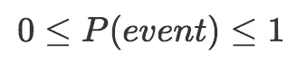
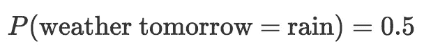
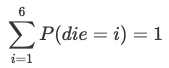
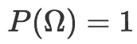
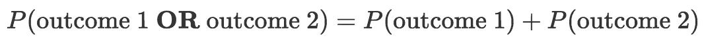

# 概率概念讲解:概率规则(导论第二部分)

> 原文：<https://towardsdatascience.com/probability-concepts-explained-rules-of-probability-introduction-part-2-2a9d5a1a9df4?source=collection_archive---------6----------------------->

当我写本系列的第[篇介绍性文章](/probability-concepts-explained-introduction-a7c0316de465)时，我介绍了一些基本的概率概念(边际概率、条件概率和联合概率、独立性和互斥性，以及组合概率的“与”和“或”规则)。然而，我错过了一些其他的基本规则，我认为这些规则是理所当然的，并假设读者在我写后续文章时已经知道了。

因此，在这篇文章中，我将介绍概率论中的一些核心规则。如果你是这方面的新手，那么我推荐你在这里浏览一下[的第一篇介绍性文章](/probability-concepts-explained-introduction-a7c0316de465)，这样你就可以熟悉符号和一些定义。

# 概率规则(公理)

当数学家探索新的数学领域时，他们通常从一套定义他们能做什么的规则开始。这有点像是第一个发明足球(soccer)的游戏，并制定规则说'*只有 11 名球员在球场上为球队效力，你不能用手触球，越位规则等'。一旦制定了这些规则，球员和经理们就可以自由地探索和创造新的球技和花式团队。*

概率论(以及一般的数学)没有什么不同。我们把这些规则叫做 ***公理*** 。一旦规则被设定，数学家们就会疯狂地探索新的定理和结果。只要坚持公理，那么你就可以做你想做的事情

让我们过一遍概率公理。

## 公理 1

第一条规则规定**事件发生的概率大于或等于零**。其实我们可以更进一步说，事件发生的概率在 0 到 1(含)之间。

让我们用数学方法来写。如果我们说一个事件的概率在 0 和 1 之间(包括 0 和 1 ),那么我们可以这样写

当我说“事件”时，我的意思是“发生了一些事情”。例如，我们可能在谈论明天的天气，而结果可能是明天下雨。所以明天下雨的概率可能是 0.5。数学上，我们把它写成

有可能把结果归入一个事件，说一个事件是明天下雨或下雪的结果。这样，一个 ***事件*实际上就是一个结果**的集合。

## 公理 2

这条规则规定**至少一个可能结果发生的概率是 1。**我冒昧地进一步说，如果你把所有可能结果的概率加起来，你会得到概率 1。核心数学家会纠缠我，因为围绕这个有一些警告，但对于我们将遇到的大多数情况，第二个声明将成立。

让我们以滚动一个公平的 6 面骰子为例。如果我掷骰子，那么六个结果中有一个是可能的。骰子会落在 1，2，3，4，5 或 6 上。因此我至少得到其中一个结果的概率是 1。概率等于 1 意味着我们*确定*。

我的第二个观点仍然成立。有六分之一的可能性，掷出其中任何一个的概率是 1/6。所以如果我们把得到 1，2，3，4，5 或 6 的概率加起来，我们得到 1。见下文

P(骰子= 1) + P(骰子= 2) + P(骰子= 3) + P(骰子= 4) + P(骰子= 5) + P(骰子= 6)= 1/6+1/6+1/6+1/6+1/6+1/6+1/6 = 6/6 = 1。

写出总和中的所有项是非常乏味的，特别是当你有数百个结果时，所以为了简化它，数学家会写

是的，那个看起来像“E”的大符号只是告诉我们把东西加起来，它上面和下面的东西告诉我们从哪里开始和结束。所以这里说“*从 i=1 开始，一直到 I = 6”****。***

因此，我们现在可以将语句*“所有可能结果的个体概率相加将等于 1”*数学上为:

我们用一个特殊的术语来代替“所有可能的结果”——它被称为**样本空间**。因此，6 面骰子的结果 1、2、3、4、5 和 6 实际上是*样本空间*。数学上，样本空间用ω表示。所以我们也可以用数学方法把上面写为

## 公理 3

这条公理可能是最难理解的，但是我在介绍互斥性的文章中提到了它。我先陈述公理，然后举例说明。

公理说**如果两个事件是互斥的(即两个事件不能同时发生)，那么其中一个事件发生的概率等于它们发生的个体(边际)概率之和。我告诉过你这很令人困惑。让我们用第一篇介绍性文章中的例子来澄清这一点。**

假设我们掷出一个 6 面骰子，我们想知道掷出 5 或 6 的概率。*这些事件是* ***互斥*** *因为我不能同时掷出一个 5 和一个 6*。所以掷出 5 或 6 的概率等于掷出 5 的概率加上掷出 6 的概率:1/6 + 1/6 = 2/6 = 1/3。

数学上我们可以把这个公理写成

假设结果 1 和结果 2 是互斥的(它们不可能同时发生)。

我知道这篇文章很可能比我以前的文章更枯燥，考虑到我在这个系列中的其他文章也都是关于数学的，我认为覆盖一些理解更高级的东西经常需要但却被错误假设的基础知识是很重要的。

下一篇文章也将是介绍性的，我的目的是解释什么是概率分布，以及你可以得到的不同类型(离散、连续、单变量和多变量)。

感谢阅读