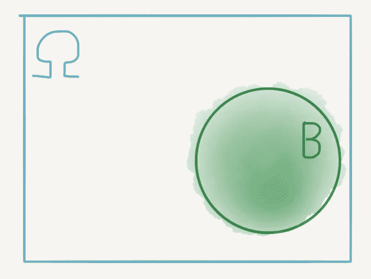
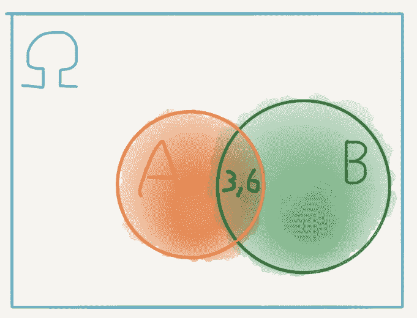
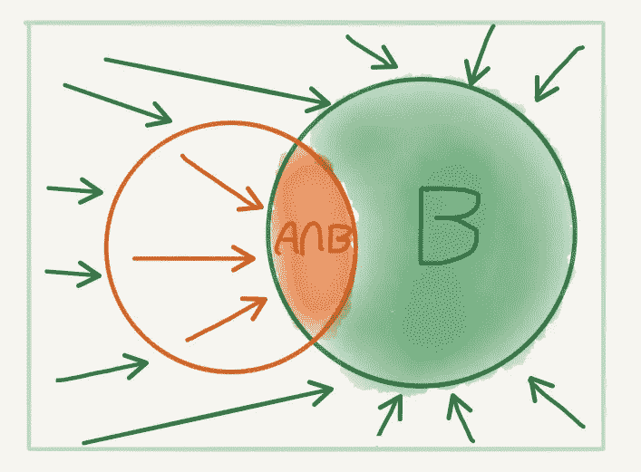

# 概率第 2 部分:条件概率

> 原文：<https://towardsdatascience.com/probability-part-2-conditional-probability-5410826d4f7f?source=collection_archive---------8----------------------->

这是我写的关于概率的系列博客的第二篇。在这篇文章中，我介绍了条件概率的基本概念，它允许我们在概率计算中加入额外的信息。条件概率背后的思想自然会引出概率论中最重要的思想，即贝叶斯定理。与第一篇文章一样，你可以在这里读到**，这种方法是用测度论的数学思想来解释条件概率。同样，和第一篇文章一样，这篇文章是给任何人看的，不管你是否学过数学。**

# *掷骰子的游戏*

*在我的上一篇文章中，我讨论了概率作为一种测量事件不确定性的方法。我们认为概率是给一个事件产生特定结果的机会分配一个权重，我们相对于其他可能的结果来衡量这个权重。我们定义了一个事件空间，我们称之为ω。在这个事件空间中，我们定义了一个随机变量 x，作为一个函数，它将每个事件映射到我们观察到的结果，在ℝ:的实际线上编码为数字*

*x:ω→ℝ.*

*结果的概率是相对于整个事件空间大小的*映射*到该结果的*可能事件数量的大小:**

**ℙ* :ℱ → [0，1]。*

*我们称可能事件的集合为随机变量的*原像*。如果 b 是一个结果，那么 b 的原像是 X⁻ (B)，b 的概率是原像的相对大小，由 *ℙ* (X⁻ (B))给出*

*例如，在上一篇文章的骰子示例中，我们考虑了掷出两个骰子并把数字相加的实验，如果我们观察到一个*结果* 9，那么有四个可能的*事件*加起来可能是 9，即(3，6)、(4，5)、(5，4)和(6，3)。我们称这个集合为 A。由于ω中有 36 种可能的结果，因此我们可以通过 A 相对于ω的相对大小来衡量得到 9 的概率。如果 X 是代表我们实验的随机变量，那么 A 是观察 X = 9 的原像，A 的概率是*

**ℙ* (一)= 4/36 = 1/9。*

# *思考过去*

*然而，如果我们能够整合以前发生过的事件的信息会怎么样呢？例如，假设我们不是一次滚动两个骰子，而是一次滚动一个。在这种情况下，根据第一次掷骰的结果，得到 9 的概率会有所不同。为了说明这一点，我们来看一个例子，我们的第一次掷骰子是 3。在第一个场景中，在掷骰子之前，总共有 36 种可能的配置*。然而，现在我们已经*观察到*一个骰子为 3，配置的总数减少了，即集合:**

*B = {(3，1)，(3，2)，(3，3)，(3，4)，(3，5)，(3，6) }。*

*在这种情况下，只有一种可能的结果是 9:我们在第二次掷骰子时得到 6。我们现在怎么计算 9 的概率？在这篇博文的结尾，我们将会看到计算*总不确定性*需要概率论中一个基本而重要的结果，即*贝叶斯定理*。我们将朝着这一点努力，但现在我们将从最简单的场景开始。*

# *利用我们已经知道的*

*我们已经把问题简化为我们已经掷出了 3 的事件，所以我们所有的不确定性仅仅在于第二次掷出。在这种情况下，我们看到总共只有 6 个可能的事件，其中只有*个*导致 9。使用与上一篇文章相同的逻辑，我们已经掷出 3 个的*概率为 9，* ***概率为*** *:**

**ℙ* (观察一个 9 |滚一个 3) = 1/6。*

*首先要注意的是，这种概率高于完全不确定的情况，其中 *ℙ* (A) = 1/9。这是有道理的，因为掷出 3 极大地增加了我们得到 9 的机会，即使 6 个配置中只有一个是有效的。为了更好地理解这一点，假设我们第一次没有掷出 3，那么我们的可能事件空间，我们称之为𝚯(capital 希腊字母“theta”)有 30 种可能的配置。在这个空间上，有 3 种可能的构形通向 9，即(4，5)，(5，4)和(6，3)。因此，假设我们在第一次掷骰子时没有掷出 3，那么得到 9 的概率是:*

**ℙ* (观察一个 9 |没有滚过一个 3) = 3/30 = 1/10，*

*这比完全不确定的情况要少，甚至比我们第一次掷出 3 的情况还要少。很明显，第一次掷出 3 会增加我们得到 9 的机会。*

> **其实比那个更笼统。任何增加我们到达 A 的机会的掷骰子，毕竟是 X = 9 的前像，将会增加我们的机会。这个基本思想可以用图表来解释。**

# *概率的形状*

*让我们回到之前的陈述，我说过结果 B 的概率是由它的原像的相对大小给出的:*

**ℙ*(b)=size(x⁻(b))/尺寸(ω)。*

*让我们用图形来解释这意味着什么。我们可以将ω中的事件可视化为阴影区域，例如集合 X⁻ (B)，为简单起见，我们简单地将其标记为 b，如下所示:*

**

*虽然这些可视化只是一种启发，对于测量概率来说太不精确，但它们有助于可视化不同事件如何相互作用，以及它们的概率可能如何相互作用。*

*例如，如果 A 是我们的掷骰数加起来为 9 的事件，我们可以把它包括在我们的图中，现在很清楚，这个事件正好在一点上与 B 相交:对(3，6)。*

**

*这是导致 9 的一种配置，第一次掷出 3。但是，既然这是ω中的一个点，为什么我们不把它的概率度量为 *ℙ(* (3，6))= 1/36 呢？那要看我们在找什么了。我们尤其对 9 的*概率感兴趣，因为我们已经掷出了 3* 。如果我们已经掷出了一个 3，那么我们就不在整个空间ω中了。*

> *像(2，4)，(1，5)和(4，1)这样的构型对我们来说已经不存在了，所以显然我们必须重新定义我们感兴趣的空间。*

# *重估尺寸*

*要了解如何做到这一点，让我们回到 A 和 B 的图表。如果我们已经掷出了 3，那么我们可用的可能配置就从整个ω缩小到了集合 B！这个收缩动作也排除了 A 中的一些配置，除了(3，6)，它在 A 和 b 的**交集**中，我们可以形象地把它想成:*

**

*现在，当我们假设概率为 9，*假设*我们掷出了 3，我们必须重新评估我们如何在现在可能的情况下衡量大小。9 的原像现在只是交集。由于假设事件 B 已经发生(通过事件空间收缩到 B 来可视化)，我们测量原像相对于 B 的大小，因此*

**ℙ* (观察 a 9 |滚 a 3)=*ℙ*(a | b)= size(a∩b)/size(b)= 1/6*

# *条件概率*

*我刚才所展示的被称为事件的**条件概率**。它是事件 A 的概率，*条件*取决于事件 B。通过将*条件*视为对事件空间大小的限制，我们可以将给定 B 的*条件概率*度量为*

**ℙ* (A| B) =大小(a∩b)/大小(b)。*

*我们可以通过记住任何事件的概率是由该事件相对于整个集合的大小给出的来使这一点更加直观，即:*

**ℙ* (B) =尺寸(b)/尺寸(ω)。*

*轻微的手动重排给出:*

*尺寸(B) =尺寸(ω)*ℙ*(b)、*

*因为大小(ω)总是正的，所以我们可以这样做。我们可以得到集合 A ∩ B 的类似公式。将这两个公式代入我们的条件概率表达式，得到*

**ℙ* (A| B) =尺寸(ω)*ℙ*(a∩b)/尺寸(ω)*ℙ*(b)、*

*这简化为*

**ℙ*(a | b)=*ℙ*(a∩b)/*ℙ*(b)。*

# *回归直觉*

*直观地说，给定 B，A *的概率等于 A *和* B 的概率除以*恰好为* B 的概率。通过推导示例中的公式，我们将这种划分理解为事件空间的收缩。数学上这种收缩动作被称为事件空间的**到条件空间*的投影。***

> *从初等数学中我们立即知道，为了避免除法错误，B 的概率不能为零。事实上，这加强了我们的直觉，因为我们不能以不可能的事件为条件！*

*最后，我们可以把交集看作是我们感兴趣的事件对条件事件的限制。的确，A 和 B 的交集可以认为是集合 A 到集合 B 的*投影*，也就是条件空间。*

> **总而言之，我们可以把* ***条件概率*** *看成是**投射**到某个(更小)**条件空间** *上的*概率。**

# *贝叶斯定理:概率的基本性质*

*事实证明，交集是对称的:A 到 B 的投影与 B 到 A 的投影是相同的。事实上，前面的图加强了这一点。*

*基于同样的程序，我们可以很容易地推导出条件概率*

**ℙ*(b | a)=*ℙ*(a∩b)/*ℙ*(a)。*

*再一次，因为 *ℙ* (A)是正的并且不可能是零，我们可以使用数学上的手算来推导交集概率的表达式:*

**ℙ*(a∩b)=*ℙ*(b | a)*ℙ*(a)。*

*这就说 A *和* B 的概率是给定 A 的 B 的*条件概率乘以*恰好* A 的概率。**

> *直觉上，如果我们考虑 B 的条件概率，假设 A 已经发生，并且我们考虑 A 的概率，那么我们必须考虑两者的概率。*

*但是我们从前面知道，如果我们有了交集的概率，我们可以投影 B 的条件空间来计算**逆概率**:给定 B 的*条件概率*，由下式给出:*

**ℙ*(a | b)=*ℙ*(a∩b)/*ℙ*(b)} =*ℙ*(b | a)*ℙ*(a)/*ℙ*(b)。*

*这个最终结果被称为**贝叶斯定理**。*

*在这个公式中，如果 A 是我们感兴趣的事件，B 是条件事件，那么数量*

*ℙ*

*被称为给定 b 的**后验概率***

*数量*

*ℙ*

*被称为给定 b 的**可能性***

*最后是数量*

**ℙ* (一)*

*简单地称为 a 的先验概率。*

> **直观上，A 的*先验*是 A 在考虑任何其他事件之前的原始概率。*可能性*虽然被视为 B 的条件概率，但也可以被认为是 A 依赖 B 的可能性的度量。要理解为什么，回想一下我们通过考虑交集的对称性来推导出可能性在公式中的位置。最后*后验*是条件作用于 b 后 A 的最终概率**

# *贝叶斯定理的重要性*

*从根本上说，贝叶斯定理通过考虑我们的*总不确定性*，给了我们一种测量条件概率的方法。这是我在这篇文章前面承诺的观点。在本例中，我们可以通过考虑贝叶斯定理中的所有量来直接测量 *ℙ* (观察 a } 9 |掷出的 a ^ 3)，而不是一次考虑一个，然后列举第一次掷出 a ^ 3 后总事件空间如何变化。*

> *我将把这作为一个练习，但是通过仔细考虑可能性(提示*:回忆一下我们如何利用交集的对称性得出可能性)，你可以计算后验概率，并且看到它产生相同的结果。**

*虽然从我使用*测量理论*直觉推导条件概率的基本例子中并不明显，但在某些情况下，计算可能性比直接测量感兴趣的后验概率要容易得多。这篇文章旨在介绍条件概率，所以我不会在这里详细介绍。然而，对于那些感兴趣的人，我建议阅读已故的大卫·麦凯的书*的第三章《信息论、推理和学习算法*，这里有免费的。*

> *虽然 ITILA(缩写为)已经被更现代的机器学习教科书所取代(考虑到机器学习的研究速度，它们也不会过时太久)，但它仍然是学习算法的基本参考，特别是从概率的角度来看。*

# *偶然性呢？*

*人们有一种自然的倾向，认为条件概率是一种因果关系。如果我们以 B 为 A 的条件，这是否意味着 B 导致 A。一般来说，情况并非如此，陷入这个陷阱是危险的。事实上，在推导过程中，我认为条件作用在某种意义上是对称的，如果我们能以 B 为条件，那么我们也能以 a 为条件。事实上，贝叶斯定理要求我们认为条件概率(后验概率)取决于它们的*条件逆*(可能性)。*

*因果关系是统计学中最难理解的概念之一。这要求我们重新思考统计关系的建模方式。将来，根据我对基本思想的理解程度，我希望能写一系列关于因果推理的类似博客。*

**卢卡斯·布拉塞克在 Unsplash 上拍摄的照片**

**原载于 2018 年 12 月 23 日*[*jontysinai . github . io*](https://jontysinai.github.io/jekyll/update/2018/12/23/probability-part-two-conditional-probability.html)*。**