# 学习机器学习—概率论基础

> 原文：<https://towardsdatascience.com/probabiliy-theory-basics-4ef523ae0820?source=collection_archive---------0----------------------->

# 介绍

在这个系列中，我想探索一些来自统计学的介绍性概念，这些概念可能对那些学习机器或刷新知识的人有所帮助。这些主题是数据科学的核心，并且经常出现在丰富多样的主题中。从头再来一遍总是好的——这样我们可能会发现以前隐藏的新知识，所以让我们继续。

第一部分将介绍概率论的基础知识。

# 可能性

既然我们已经有了这么好的数学工具，为什么我们还需要概率呢？我们用微积分来处理无穷小尺度上的函数，并测量它们如何变化。我们发展了代数来解方程，我们还有几十个其他的数学领域来帮助我们解决我们能想到的几乎任何类型的难题。

困难的是，我们都生活在一个混乱的宇宙中，在这个宇宙中，很多时候事情都无法精确测量。当我们研究真实世界的过程时，我们想要了解扭曲我们实验的无数随机事件。不确定性无处不在，我们必须驯服它来满足我们的需求。这就是概率论和统计学发挥作用的时候。

如今，这些学科处于人工智能、粒子物理、社会科学、生物信息学以及我们日常生活的中心。

如果我们要讨论统计学，最好先确定什么是概率。其实这个问题没有单一的最佳答案。我们将在下面讨论概率论的各种观点。

## 常客概率

想象一下，给了我们一枚硬币，我们想检查它是否公平。我们如何解决这个问题？让我们试着做一些实验，如果正面朝上，记下 1，如果看到反面，记下 0。重复这 1000 次投掷，并计算每个 0 和 1。在我们进行了一些冗长的实验后，我们得到了这些结果:600 个正面(1)和 400 个反面(0)。如果我们接着计算过去出现正面或反面的频率，我们将分别得到 60%和 40%。这些频率可以解释为硬币正面朝上或反面朝上的概率。这被称为一种[频率主义者](https://en.wikipedia.org/wiki/Frequentist_probability)对概率的观点。

## 条件概率

我们经常想知道一个事件发生的概率，如果其他事件已经发生的话。我们把一个事件的条件概率 *A* 给定事件 *B* 写成 *P(A | B)* 。以下雨为例:

*   如果我们看到打雷，下雨的可能性有多大
*   假设天气晴朗，下雨的可能性有多大？

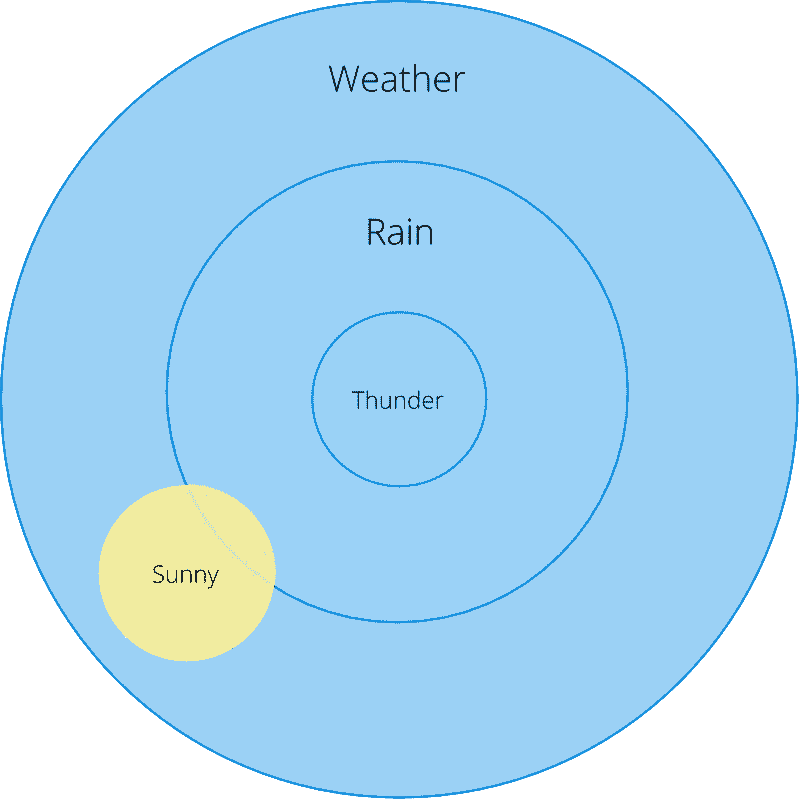

从这张[欧拉图](https://en.wikipedia.org/wiki/Euler_diagram)我们可以看出 *P(Rain | Thunder) = 1* :看到打雷的时候总是在下雨(是的，不完全是这样，但我们在例子中会把这当成是真的)。

那 *P(雨|晴)*呢？从视觉上看，这个概率很小，但是我们如何用数学公式来表达它，并进行精确的计算呢？条件概率定义为:

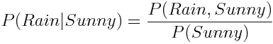

换句话说，我们将下雨和晴天的概率除以晴天的概率。

## 从属和独立事件

如果一个事件的概率不以任何方式影响另一个事件，则称该事件是独立的。以掷骰子第一次和第二次得到 2 的概率为例。这些事件是独立的。我们可以这样表述

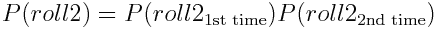

但是为什么这个公式有效呢？首先，让我们将第一次和第二次投掷的事件重命名为 *A* 和 *B* 以消除符号混乱，然后将掷骰子的概率明确重写为我们目前看到的两次掷骰子的联合概率:

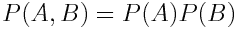

而现在把 *P(A)* 乘以 *P(B)* (没什么变化，可以抵消掉)回想一下条件概率的定义:

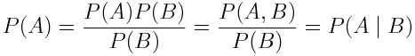

如果我们从右向左阅读上面的表达式，我们会发现 *P(A | B) = P(A)* 。基本上，这意味着 A 独立于 B！同样的道理也适用于 P(B) 并且我们完成了。

## 贝叶斯概率观

有一种看待概率的替代方法叫做贝叶斯方法。统计学的频率主义方法假设存在一个我们正在寻找的模型参数的最佳具体组合。另一方面，贝叶斯方法以概率方式处理参数，并将它们视为随机变量。在贝叶斯统计中，每个参数都有自己的概率分布，它告诉我们参数给定数据的可能性有多大。从数学上讲，这可以写成

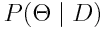

这一切都始于一个简单的定理，它允许我们基于先验知识计算条件概率:

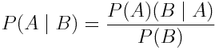

尽管简单，贝叶斯定理有着巨大的价值，广泛的应用领域，甚至是统计学的一个特殊分支——贝叶斯统计。如果你对贝叶斯定理是如何推导出来的感兴趣，有一篇关于贝叶斯定理的非常好的博文——一点也不难。

# 分布

什么是概率分布？这是一个告诉我们在一些实验中不同可能结果的概率的定律，以数学函数的形式表达。正如每个函数一样，分布可能有一些参数来调整其行为。

当我们测量抛硬币事件的相对频率时，我们实际上已经计算了所谓的[经验概率分布](https://en.wikipedia.org/wiki/Empirical_probability)。事实证明，我们世界中的许多不确定过程都可以用概率分布来描述。例如，我们的硬币结果有一个[伯努利分布](https://en.wikipedia.org/wiki/Bernoulli_distribution)，如果我们想在 *n 次*试验后计算正面概率，我们可以使用[二项式分布](https://en.wikipedia.org/wiki/Bernoulli_distribution)。

引入一个类似于可能在概率环境中使用的变量的概念是很方便的——随机变量。每个随机变量都有一个分配给它的分布。随机变量按照惯例用大写字母书写，我们可以用 *~* 符号来指定分配给变量的分布。

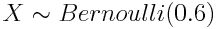

这意味着随机变量 *X* 根据伯努利分布分布，成功概率(头数)等于 *0.6* 。

## 连续和离散概率分布

概率分布有两种形式:离散分布处理的是具有有限可数数值的随机变量，就像硬币和伯努利分布一样。离散分布由称为概率质量函数(PMF)的函数定义，连续分布处理连续随机变量，这些变量(理论上)可以有无穷多个值。想想用噪声传感器测量的速度和加速度。连续分布由称为概率密度函数(PDF)的函数定义

这些类型的分布在数学处理上有所不同:你通常会对离散分布使用求和 *∑* ，对连续概率分布使用积分 *∫* 。以期望值为例:

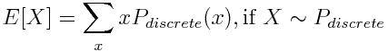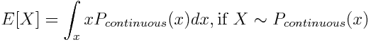

# 样本和统计数据

假设我们正在做人类身高的研究，渴望发表一篇令人瞠目结舌的科学论文。我们测量了街上一些陌生人的身高，因此我们的测量是独立的。我们从真实总体中随机选择数据子集的过程称为抽样。统计是用于使用样本中的值来汇总数据的函数。您之前可能遇到的统计数据是样本均值:

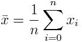

另一个例子是样本方差:

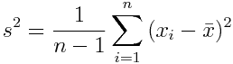

[这个公式](https://en.wikipedia.org/wiki/Variance#Sample_variance)从整体上捕捉了所有数据点与其平均值的差异。

# 如果我想要更多呢？

你想深入学习概率论和统计学？太好了！无论你是想对机器学习背后的理论有一个坚实的理解，还是仅仅出于好奇，你肯定会从这些知识中受益。

*   *入门级* : [可汗学院](https://www.khanacademy.org/math/statistics-probability)是一个很棒的免费资源。这门课程将以非常直观和简单的形式让你了解基础知识
*   拉里·乏色曼的《统计学》是一个伟大而简洁的资源，它将向你展示统计学中几乎所有的重要主题。注意，这本书假设你熟悉线性代数和微积分
*   高级水平:我敢打赌，到这个时候，你会量身定制你的个人阅读清单🙃

如果你喜欢这篇文章，请留下💚。它让我知道我在帮忙。