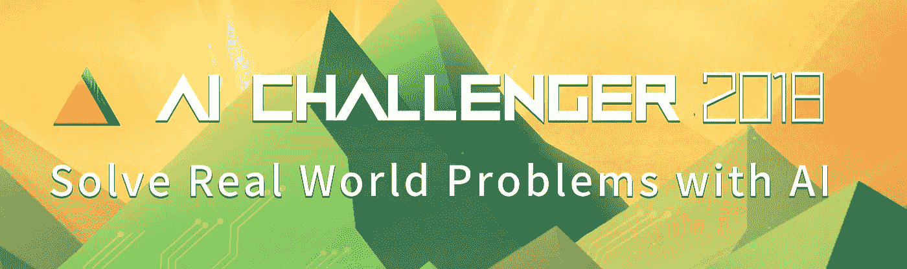
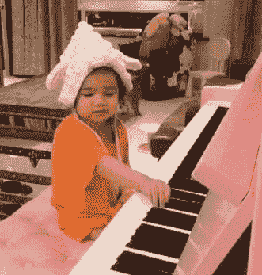
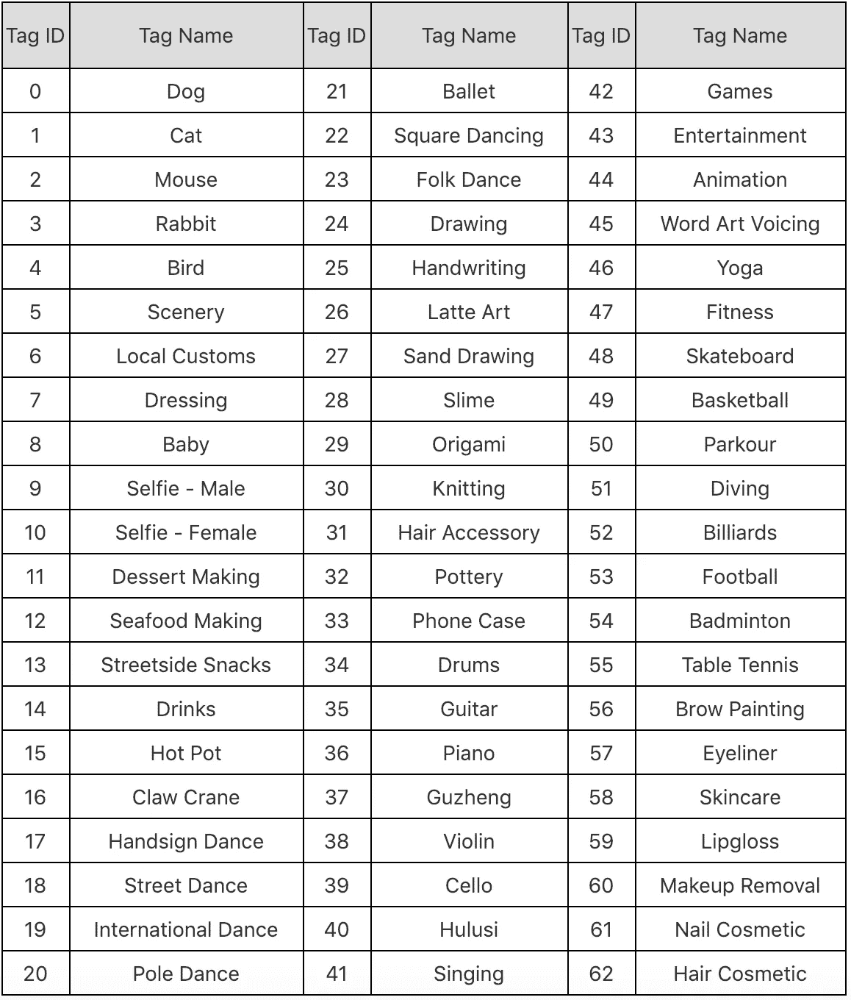
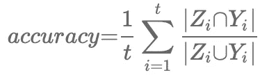
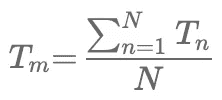
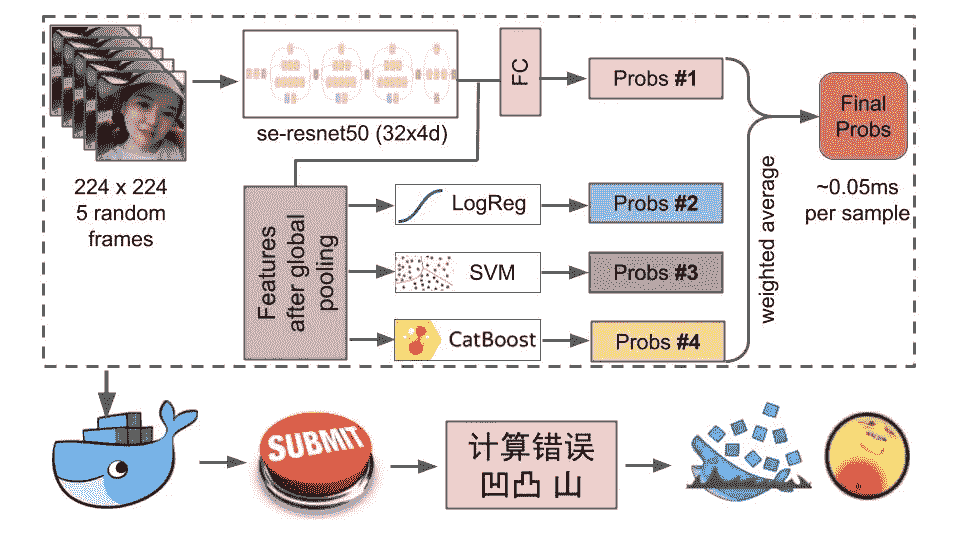

# 用“人工智能挑战者全球人工智能大赛”解决问题

> 原文：<https://towardsdatascience.com/problem-solving-with-ai-challenger-global-ai-contest-e788e03dd5a2?source=collection_archive---------29----------------------->

## 参加中国数据科学平台 AI Challenger 主办的计算机视觉大赛的体会

在这篇文章中，我将分享我在中国机器学习竞赛中解决视频分类问题的经验。

竞争对手有很多数据科学平台。我们过去常常想到 ka ggle——最受欢迎的一个。无论如何，有许多其他平台为数据科学家提供了具有挑战性的任务，现在是探索它们的好时机。这就是为什么我和我的队友 [Alexey Grigorev](https://www.linkedin.com/in/aleksei-grigorev/) 参加了中国平台 AI Challenger 的[短视频实时分类比赛](https://challenger.ai/competition/mlsv2018)。非常感谢卡格尔大师[阿图尔·库津](https://www.kaggle.com/drn01z3)成为我们这次比赛的导师。他帮助我们提出创造性的想法，并为我们提供了一台 GPU 服务器。

## 竞争描述

视频数据集大约 2 TB 大，并被分成训练集和验证集。有 2 个测试集:测试 A 和测试 b。每个视频可能有 1 到 3 个标签，因此这是一个多标签分类。例如，下面是一个视频帧，有两个类:钢琴和婴儿

以下是可能的标签的完整列表:

这场比赛有一个复杂的评估标准。除了准确性之外，时间限制也被作为一个评估指标。您可能会认为它是从输入一个视频到输出一个预测所用的总时间。

最后，将这两个公式考虑在内，以提交的结果和参考点之间的加权距离来计算综合指标。你可以在这里阅读更多关于指标[的信息。](https://challenger.ai/competition/mlsv2018)

关键的想法是，组织者希望从数据科学社区获得一种可用于工业的高速应用。对于提交材料，参赛者必须加载图像 docker 包。

## 训练神经网络

我们混合使用了神经网络和更简单的模型来为最终预测做一个集成。我们尝试了不同的网络架构。最好的结果是使用 se_resnet50。“挤压和激励”模块以最小的计算成本提高了 resnet 模型的质量。您可以在本出版物中了解更多关于该架构的信息[。作为训练模型的基线，我们从提取第一帧开始。学习率为 0.001，每 30 个时期衰减 10。时代的总数是 150。作为一个优化器，具有重量衰减和动量的随机梯度下降被用于更快的收敛。有趣的是，尽管事实上我们有多标签和多类问题，但我们用 BCEwithlogitsloss 得到了不好的结果。相反，我们使用交叉熵损失，这大大提高了准确性。质量差距的原因可能是数据中缺乏多标签的例子。我们花一些时间思考如何预测多个标签。例如，我们训练了一个二元分类器来预测一个例子是否有一个或多个标签。另一个问题是课程的门槛。我们分析了类别分布并计算了类别的权重。这个想法是，如果二进制分类器预测一个例子有一个以上的标签，则添加一些系数来加权。在这种情况下，我们可以达到一些我们以前没有考虑到的类的阈值。](https://arxiv.org/abs/1709.01507)

无论如何，我们没有对类使用阈值，因为根据度量标准，我们知道给定一个具有多个标签的示例，最好只预测其中一个标签，而不是预测一个多余的标签。用这样的方法做实验，让多类预测模型更加稳定，还有很大的空间。

## 尝试经典的 ML 算法进行组合

解决方案的另一部分是，我们在全局汇集后从神经网络中提取特征，并将这些特征用作更简单的分类器的输入，如梯度增强、逻辑回归和支持向量机。最终集成由四个最好的单一模型(神经网络、对数注册、SVM、catboost)与多数投票分类器组合而成。这个模型在测试 A 中给了我们 0.76 分，但不幸的是这不足以让我们进步。

## 聚合视频帧并面临新问题

下一步是将聚合添加到神经网络训练中。现在，我们从每个视频中提取五个随机帧，并使用最频繁的标签作为单个预测。我们做了同样的事情来提取经典模型的新特征，效果非常好，我们在验证上得到了 0.91。我们对这些结果感到高兴。截止日期前一周，我们决定提交，但现在我们面临着时间问题。模型是快速的，但是根据规则，还需要考虑视频预处理的时间。我们注意到提取一帧大约需要 0.03-0.05 毫秒。不幸的是，这不允许我们匹配提交限制。

然后，我们决定使用聚合来训练模型，但在一个随机帧上进行预测。这比我们之前没有任何聚合的模型要好一些。验证的得分为 0.81，测试 A 的得分为 0.79，单次预测的时间约为 0.11 毫秒。我们有一个在 GPU 上解码视频以加快进程的想法，但我们没有足够的时间来管理如何使用 docker。这是我们的销售渠道:

## 竞争氛围

let me add some words about competition organization. AIChallenger pretends to be a global data science platform, but it has a lot of work before it gets there. We faced technical problems while participating, mostly with the docker submission. This Challenge was organized by MeiTu company (美图). For example competition started on 3rd of september but information about the docker instructions appeared on website only up to 12th of october. All instructions were in Chinese language. We accidentally got to know that organizers were assisting participants in Chinese messenger WeChat, but it was also in Chinese and didn’t help foreign competitors. The funny thing was that even the submit button was in Chinese. We once even wrote a comment on the forum to encourage organizers to solve technical problems, but it only partly helped. In the future i hope we will see a better level of organization and technical support.

## 结束语

我们的比赛就这样结束了。尽管我们没能提交最好的模型，但还是值得一试。我们了解了如何解决这类机器学习问题。此外，在这个项目上工作了近 3 个月后，我们现在有了一个很好的管道，你可以在 github [这里](https://github.com/n01z3/challengerai-mlsv2018/tree/master)找到。

然而，一个好的趋势是，挑战规则迫使竞争对手考虑设计一种用于生产的算法。因此，除了建模之外，它还有助于提高代码优化和创建可重用管道的技能。最后，我想鼓励大家探索新的数据科学平台，并继续参加比赛，以更好地应对这些挑战。