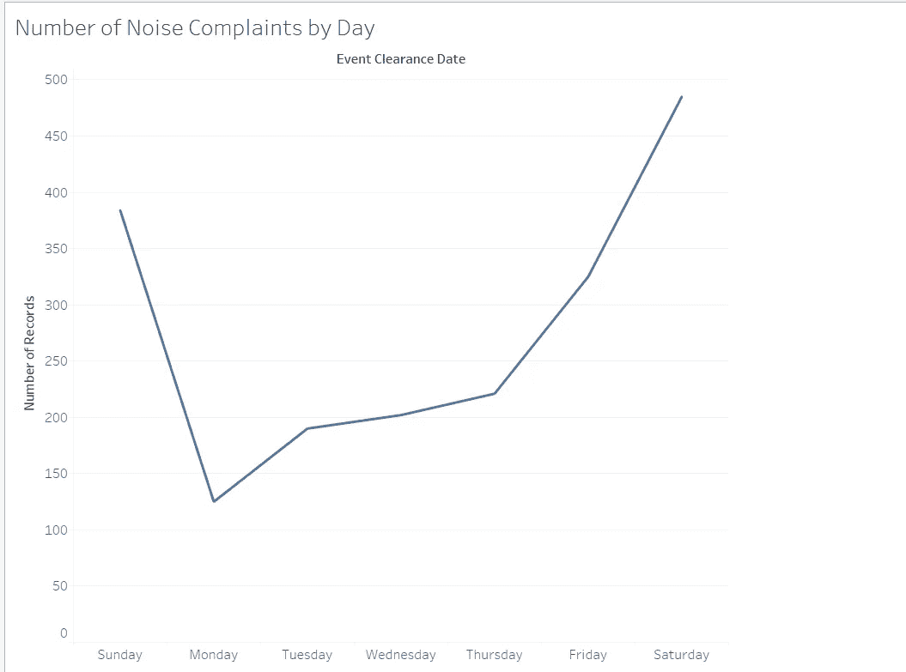
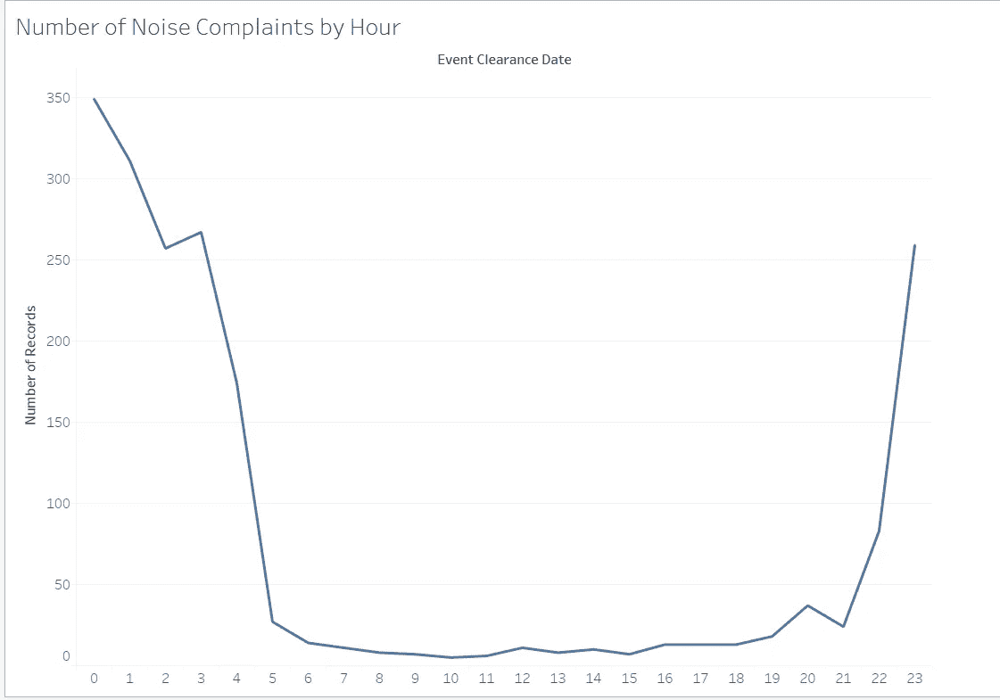
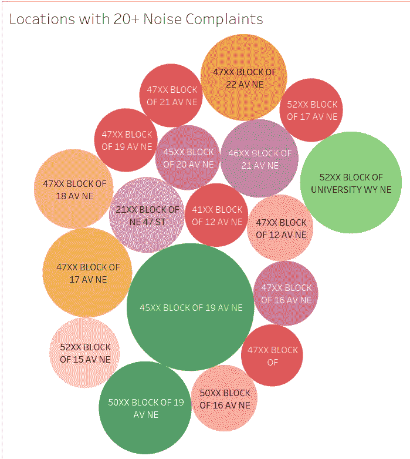

# 流程博客#6 —可视化

> 原文：<https://towardsdatascience.com/process-blog-6-visualization-10732336e01a?source=collection_archive---------0----------------------->

# 该过程

本周，我们的 sprint 专注于使用专业软件 Tableau 和 2015 年西雅图 911 电话的数据集来创建数据的可视化。因为当我们被分配任务时，我刚刚参加了最后一次期中考试，我想没有比减压更好的事情了——推而广之，就是聚会。最后，我把自己的想象提供给了一个 UW 的学生，他在希腊生活之外寻找一个可以参加的派对，但却不知道何时何地可以找到一个。为了回答我的用户组关于何时何地可以找到最好的聚会的问题，我创建了三个可视化工具:

Visualization 1: Number of Noise Complaints by Weekday

Visualization 2: Number of Noise Complaints by Hour of the Day

Visualization 3: Areas in the U-District with 20+ Noise Complaints

(所有的可视化可以在:[https://public.tableau.com/profile/alex.katson#!找到/viz home/whandwhere to find the best parties/whandwhere to find the best parties](https://public.tableau.com/profile/alex.katson#!/vizhome/WhenandWheretoFindtheBestParties/WhenandWheretoFindtheBestParties)

我将搜索范围限制在 U 区附近，因为它离大学很近，并且只使用了噪音投诉或酒精/大麻违规的记录，因为大多数好的聚会往往会将喧闹的气氛与某种形式的物质结合起来。(顺便说一句，如果你想知道，数据显示你应该在周五、周六或周日晚上 10 点左右去东北第 19 大道的 45xx 街区，这样你就可以在警察打电话之前享受一下了)。

# 那又怎样？

我在创建可视化时遇到的一个主要问题是，我的标准似乎太宽泛了。例如，噪音投诉电话不仅是由喧闹的聚会产生的，而且未成年人被发现饮酒并不总是在聚会上。然而，我认为我的可视化是基于相关性的，而不是基于因果关系的，这意味着电话录音数量较多的一天或地区比电话较少的地区更有可能举行聚会。这就是为什么“where”可视化只包括具有 20 个或更多记录的块，因为我觉得这是一个合适的样本大小，可以作为一个可能由于不仅仅是巧合而有呼叫进入的区域来包括。在未来，我认为，如果有机会，我可以找到一个与数据更直接相关的研究问题，或者寻找一个与我正在研究的问题更密切相关的数据集。

# 未来

在不久的将来，我可以看到可视化技术在为我和我的朋友们寻找一个住在校外的公寓或房子方面是有用的。利用网上的房源，我可以根据卧室数量或其他限制因素对可能的地方进行排序。我还可以使用我们在本周 sprint 中获得的数据集，使用 Tableau 中可用的地图可视化，检查最安全的区域在哪里，同时仍然靠近校园。鉴于我和我的朋友们在寻找一个离校园合理距离内的合适地点时遇到了一些困难，我觉得可视化可能会在我们继续寻找的过程中证明是非常有用的。