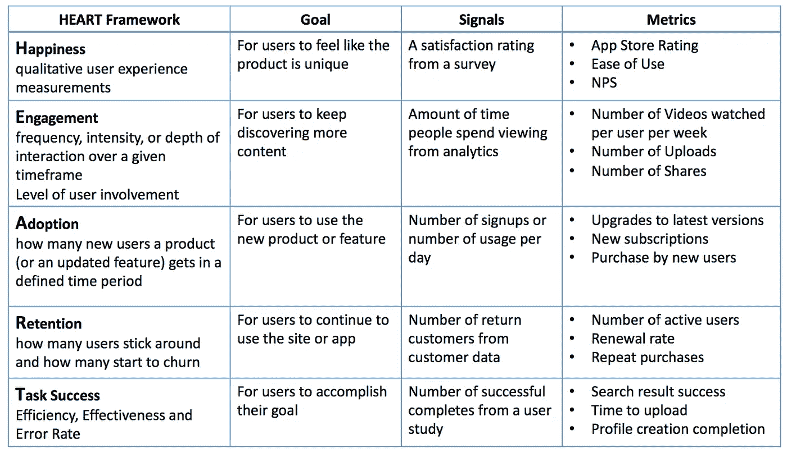
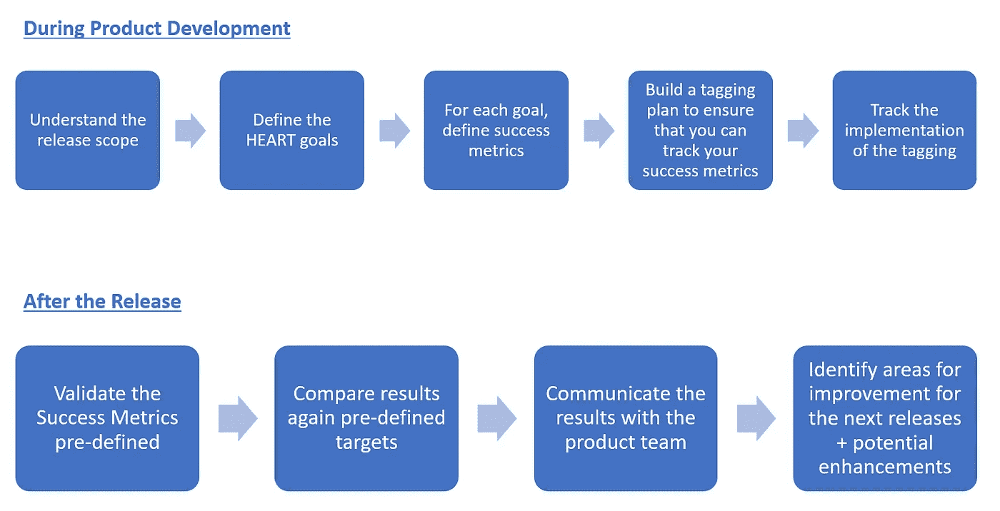

# 产品分析——如何衡量软件开发的成功

> 原文：<https://towardsdatascience.com/product-analytics-how-to-measure-your-software-development-success-7a6bc765dbab?source=collection_archive---------7----------------------->

能衡量的就能完成。如今，随着低成本数据的出现和新技术浪潮的到来，这一点尤其正确，新技术使我们能够更深入地分析数据。

> 我们如何判断我的产品开发是否高效？
> 
> 我的新软件发布成功了吗？
> 
> 我们需要跟踪什么遥测数据？

这些问题出现得太频繁了，一劳永逸地解决这些问题很重要。让我给你看一个回答所有这些问题的框架！

**一些方法**

人们经常用来评估产品质量的一个经典方法是基于业务绩效指标；获取、销售、保留。从理论上看，这似乎是个好主意，但是这个要求太高了。如果你发布了一个有新特性的更新，如何快速评估设计是否成功？通过分析记忆是否会随着时间的推移而减少？这将花费太多的时间来看到一个效果，这是不好的，因为它阻止你快速失败和重复，直到软件产生期望的结果。

另一种方法是评估给定群组的使用情况。这是有道理的。您可以将一个群组与新设计进行比较，也可以将一个群组与旧设计进行比较(通过 A / B 测试或谨慎选择相似的时间段)。然而，这种方法虽然比第一种好，但并不仅仅针对产品开发。换句话说，这个方法对于产品团队来说不够具体。如果销售部门改变了流程，或者营销部门在公司网站上遇到了技术问题，该怎么办？不够好。

## 心脏框架

这个框架是由谷歌风险团队开发的。我喜欢这样的事实:它实现起来非常简单，并且直接与产品和设计团队交流！

HEART 框架是一个框架，它使你能够根据设计目标(你通过设计一个特性想要达到什么)将一个版本分解成更小的成功度量。

主要的设计目标是:
- **快乐**:让用户更快乐地使用你的新功能或界面。
- **参与度**:方便用户发现你的特色并与之互动。
- **采用**:让用户在一段时间内对你的软件更加上瘾。
- **留存**:让用户随着时间的推移对你的软件越来越上瘾。
- **任务成功**:确保用户可以轻松完成操作。

HEART Framework

在这里，重要的是要理解度量本身是没有用的。您需要确保:

1.  您的软件已正确标记(标记是使用遥测技术创建数据的操作，遥测技术可用于测量用户的操作)。MixPanel、Google Analytics 和 Kissmetrics 等好工具都是低成本的。
2.  您在发布之后跟踪度量标准。
3.  您要确保根据您将向团队提供的极具可操作性的见解进行纠正和改进！

**流程**

HEART Framework measurement process

## 要记住的事情

**这个练习是由特征**完成的。即使您的软件版本包含 3 个不同的特性，您也希望单独验证它们。

**功能将有多个目标**。通常，需要 2-3 个目标的组合。例如，如果你想优化保留，你也要确保你的功能被用户采用。尽管如此，如果你有一个专门的产品分析师，你可能想更细化。否则，保留一些您能够保持的指标(2-3)。

**确保您可以测量每个指标**。提醒您确保将这些指标用作标记文档。从长远来看，这会节省你很多时间。

**与您的团队一起审核指标结果**。验证每个指标后，作为一个团队对其进行评审。与其他更高层次的指标相比，这将使团队真正了解哪些方面可以改进。

## 结论

自从我在我的公司实施了这个框架，讨论和焦点已经明显转移到真正重要的事情上:*产品是否符合我们的期望，用户对我们的产品是否满意*。这也使我对软件标记有了一个系统的方法，从经验来看，这通常是不完美的。

我强烈建议实现这个框架和方法，因为在与产品团队、以产品为中心的组织中的设计师进行交互时，这个方法确实不言自明。