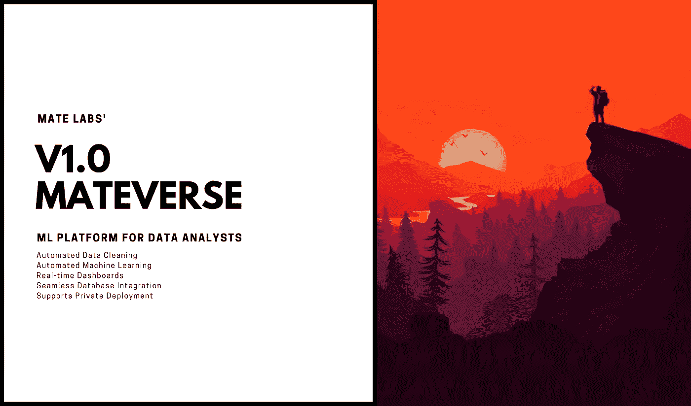
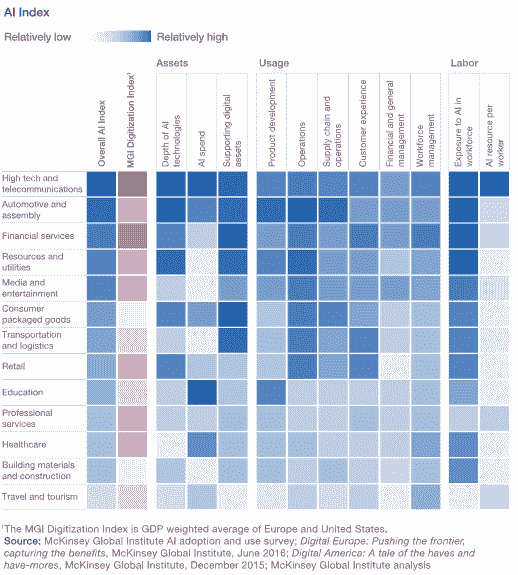
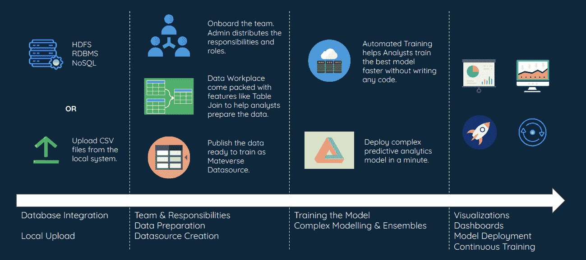
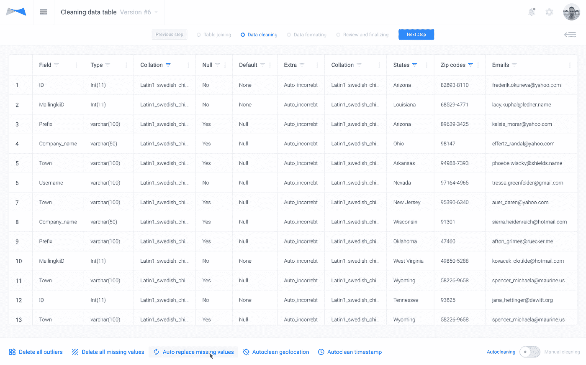
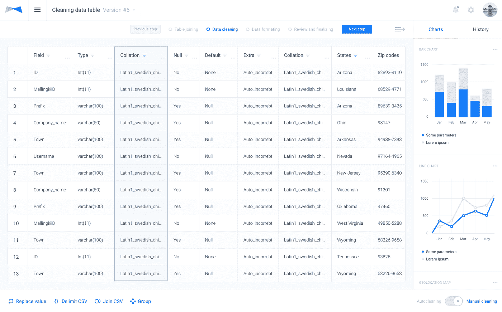
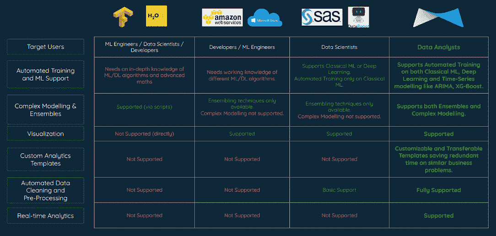
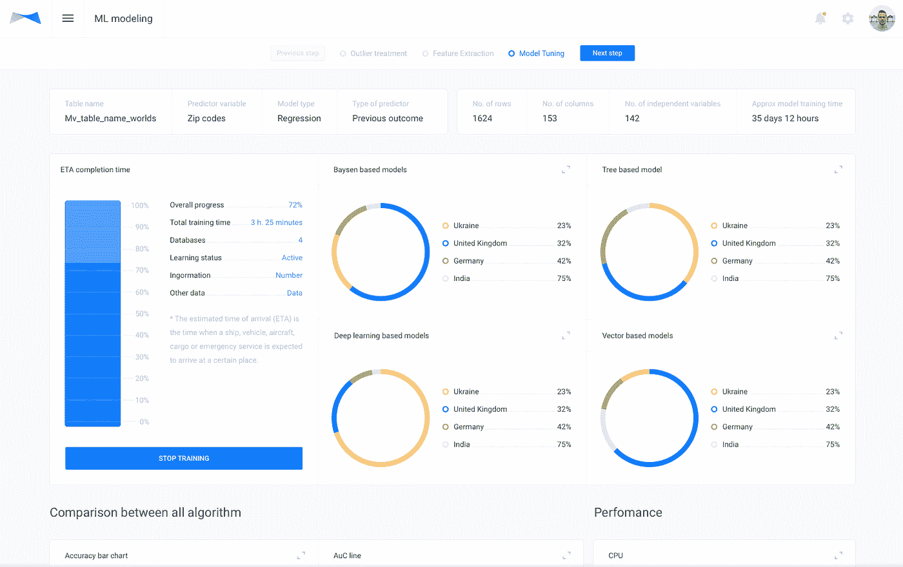
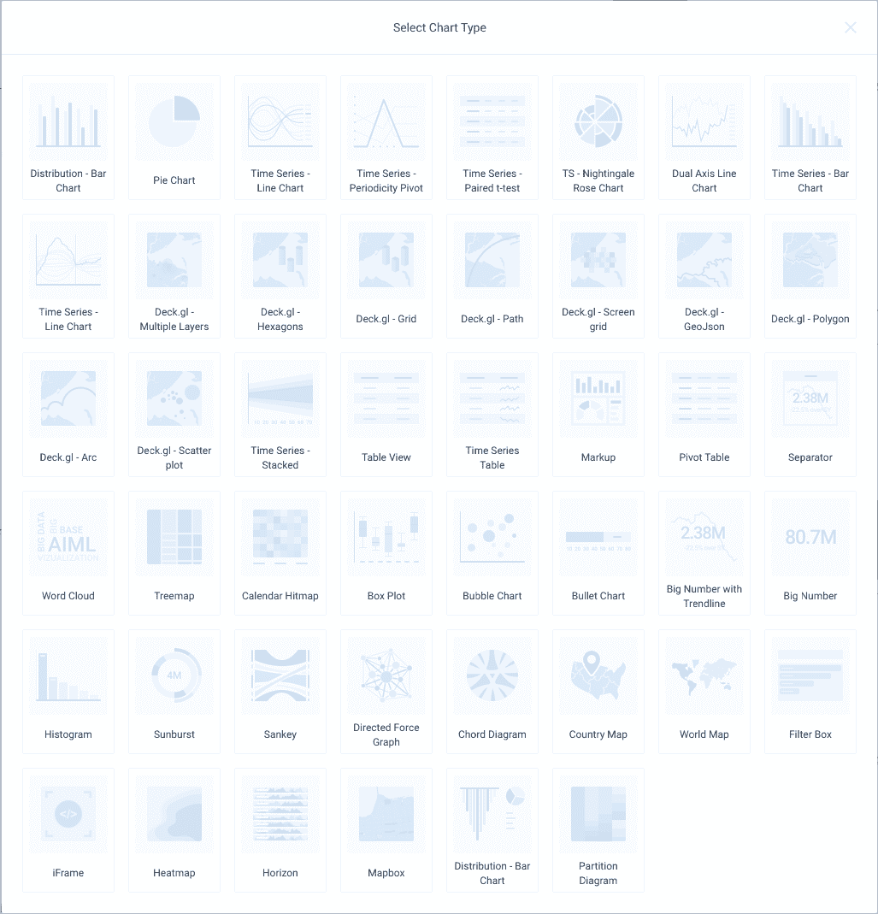

# 产品发布公告:Mateverse 高级— V 1.0

> 原文：<https://towardsdatascience.com/product-launch-announcement-mateverse-high-level-v-1-0-e51577dab05f?source=collection_archive---------9----------------------->

## 让你在 5 分钟内训练 ML 模型，并将[机器学习引入 IFTTT](https://techcrunch.com/2017/07/12/matelabs-mixes-machine-learning-with-ifttt/) 的产品变得更加先进。

S 我们中的一些人已经在我们的业务中实现了机器学习，还有一些人仍在考虑使用它。统计数据预测，到 2021 年，人工智能的使用将大幅增加。许多人反复写了人工智能技术将如何变革的主题，并将人工智能称为第三次工业革命。我们不打算深入探讨这个问题，但让我们来看看 Mateverse 是如何出现的。

TL；博士对人工智能在社会中的巨大影响的故事是:机器学习正在渗透到每一个其他商业组织。因此，这使得他们的流程(内部和外部)变得非常简单。

从大公司开始，以满足独特客户需求的多种销售转换达到顶峰，开始进入较小的组织。诸如分析、销售台、用户界面等领域在小公司中经历了巨大的转变。现在，消息比以往传播得更快。

Source: McKinsey Global Institute

坦率地说，除了成本之外，没有什么能阻止较小的组织实现较大的组织所能实现的。**这种昂贵的事情对较小的组织来说是一种折磨。**很快，通过开源算法和预训练的人工智能模型的可用性，人工智能及其重要的对等物机器学习变得可以访问。

另一个没有被很多人注意到的事实是*当*如此猖獗的适应在世界各地的公司中发生的时候，*猜猜谁是 ML 项目出问题的首当其冲者？*他们是*分析师和数据科学家，他们独自承担推动分析*的任务，几乎没有其他部门的帮助。有很多数据科学家跳槽或从事非常不满意的工作的案例，要么是因为他们没有机会做他们力所能及的事情，要么是因为他们被迫在基础设施不足的情况下完成喜马拉雅山的任务。

我们真的不能责怪任何人，考虑到人工智能和人工智能是非常新的技术，试图摆脱他们周围的炒作和恐惧。

我们在 *Mate Labs* 开始构建我们的产品——**Mate verse，**在确定和了解所有*的基础上*好吧，行业的斗争已经在我们之前尝试过的各种项目中进行。当我们一段时间以来试图为机器学习中涉及的巨大而平凡的过程找到一个可靠的解决方案时， *Mateverse V1.0 终于问世了*。*点燃..时代..与世界上的科技公司斗争，并在一个致力于帮助我们将人工智能带给大众的社区中寻找意愿。*

> 斗争(勇气)是真实的。

在用 Mateverse *beta* 版本测试了这个想法之后，我们从大型跨国公司背后的小型企业和分析师那里得到了压倒性的回应，这些小型企业和分析师以前不知道 ML 如何帮助他们的业务，或者没有太多的发挥空间。**mate verse 无需为建模编写一行代码，使公司部署预测模型变得简单了数倍，并为他们的业务带来了加速的影响。**

回到阻碍企业实施 ML 的因素，我们将把这些点联系起来，并与您讨论*如何*和*，其中* Mateverse 是一个成本削减者，也是一个“努力削减者”。

也许，带你了解 Mateverse 如何削减成本和精力的最佳方式是通过机器学习的步骤。让我们举一个构建预测分析模型的最佳例子

> 虽然自动化机器学习中的当前解决方案看起来如下:
> 
> 获取数据— ->完美的预测
> 
> 绝对不是那样的。

惹恼数据科学家的最好方法是假设手头有一些数据就太容易了。更糟糕的是，不完整和不一致的数据永远无法完成一个项目。

尽管如此，我们还是有办法让数据科学家更容易更快地部署模型，我的意思是，快得多。

为了部署预测模型(举个最好的例子)，所涉及的步骤可以总结如下:

1.  **数据收集**

在数据收集阶段，Mateverse 支持所有常见类型的数据库 HDFS/RDBMS/NoSQL，或者你可以只上传一个 CSV 文件，数据库就创建好了。就这么简单。

*Image 1 — Mateverse Workflow chart*

**2。数据准备**

数据准备从连接数据库中的多个表开始。这需要使用 SQL 脚本的技能，这是一项有点乏味的任务。现在， *Mateverse 为用户提供了一个图形界面来做这件事。*表连接功能允许最终用户以 7 种不同的方式创建混合数据集*。*

此外，在大多数情况下，一个数据分析师/科学家团队处理一个数据集，由于数据集的数量和大小，他们会将其划分为子集。然而，*多人同步处理同一个数据集以前从未得到过支持*。现在，通过 Mateverse 的 **pro-collaboration** 平台，团队管理员可以分配/委派职责，每个成员可以同时处理同一个数据集，同时保持对团队其他成员所做编辑的更新。

**3。数据清理**

数据清理的经典方法包括分析师和数据科学家在多个步骤之间周旋，同时专注于几个点。收集的数据并不总是完美的形式。事实上，从来都不是。假设从零售商店收集数据，可能会有一些丢失的值未能在系统中注册，或者以难以检索的格式存储。如果没有丢失数据，也可能有不适合、不相关或不可用的数据。数据也可能被混淆、歪曲和归类到错误的部分。如果听这个很难，处理这些错误是数据人员一直在努力的事情。因此，当数据科学家被期望在一夜之间转变数据时，难怪他们会感到沮丧。

Mateverse V1.0 — Automated Data Cleaning

从技术角度来说，一些数据清理方法是—缺失值处理、数据标记化和异常值检测。

Mateverse 已经把这个变成了*一键式流程*。你怎么问？我们已经建立了一个智能系统，它已经在成千上万的数据集上进行了准确的训练。

Mateverse V1.0 — Manual Data Cleaning

**4。数据格式化**

数据处理的这一部分是数据科学家仔细研究的又一套乏味的方法。这是数据科学家确保被清理的数据中没有错误，然后对其应用*转换*的地方。理解收集的数据是机器学习的主要工作***人工**。除非这部分数据准备能够得出准确的预测，否则机器的学习可能会犯下严重的错误。*

*一组规则指导这一阶段的数据准备。这些规则/方法包括:分类、聚类、回归和排序。再次以零售业为例，这些规则集可以帮助机器学习给定数据之间的关系。明显的**分类**，像*性别*或者*年龄*，或者不那么明显的**聚类**，像*消费习惯*，财务*能力*等等。只有过了这个阶段，数据科学家才能松一口气，因为她/他的大部分工作已经完成。*

***Mateverse 将消除流程中涉及的过多人工工作，并让专家们花费大量时间来试验不同类型的模型。***

**

**Image 2 — Comparison- Mateverse vs other automated ML platforms**

*既然我们已经建立了近乎完美的数据集，下一步就是训练一个预测模型。*这涉及到两个步骤*:*

***5。算法选择***

*机器学习的核心在于选择合适的算法。算法的作用是从准备好的数据中做出解释。特定算法的选择取决于最终模型的预期功能。这些算法从统计算法到基于树的算法，再到贝叶斯算法。事实上，有无数种可能的算法。*

*数据科学家对数百种算法进行实验，以最终选择能够获得最佳结果的算法。*

***6。超参数优化/模型训练***

*根据模型试图解决的特定问题，在模型上使用超参数调整。超参数调整可创建最佳预测模型。这是一个复杂的过程，优化机器学习的这一部分是一项艰巨的任务。*

**

*Mateverse V1.0 — Automated Machine Learning*

*Mateverse 通过模仿数据科学家处理问题的方式，使前面提到的步骤成为一键操作的过程，反过来优化数据科学家的工作，就像她的助理 T21 一样。*

*7。可视化效果*

*你会发现数据分析师对他们的可视化很挑剔，这并不罕见，因为正确和适当的可视化会给数据带来价值和清晰度。我们在 Mateverse 中支持超过四打可视化图表。*

**

**Mateverse has in-built support for an array of visualization charts, some of which are shown here.**

*8。部署*

*Mateverse 允许在数据流上部署模型，预测是实时的，并且*在现场*。你可以部署在 Mateverse 的仪表盘上进行实时更新，也可以使用 API 将其集成到自己的产品中。*

> *如果你认为这个平台对你有帮助，请在这里告诉我们。*

# *关于*

> *在 [*Mate Labs*](http://matelabs.in/) *我们*已经构建了 [Mateverse](https://www.mateverse.com/) ，一个机器学习平台，在这里你可以在几分钟 s **内构建**定制的 ML 模型，而无需编写一行代码**。[我们的平台](http://matelabs.in/mateverse)让每个人都能轻松构建和训练机器学习模型，无需编写一行代码。欢迎致电[**mate @ mate labs . in**](mailto:mate@matelabs.in)联系我们***

# *让我们携起手来。*

> *在 [**Twitter**](https://twitter.com/matelabs_ai) 上与我们分享你的想法。*
> 
> *如果你有新的建议，请告诉我们。我们的耳朵和眼睛总是为真正令人兴奋的事情而张开。*