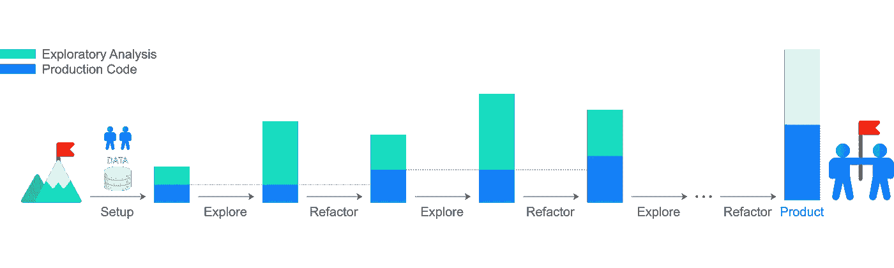

# 生产数据科学

> 原文：<https://towardsdatascience.com/production-data-science-3a42dee5208?source=collection_archive---------8----------------------->

## 面向生产的协作数据科学工作流

去年，在[萨塔利亚](https://www.satalia.com)，我正在进行一个合作数据科学项目。项目进展顺利，但是我和我的合作者忽略了好的实践，当探索和建模数据时，我们没有记住我们最终是在构建一个产品。当我们自动化生产我们的最佳模型时，这些疏忽在工作接近尾声时浮出水面。

在我们完成这个项目后，我寻找现有的方法来开展协作数据科学，并在脑海中留下一个最终产品。我只能找到一些关于这个主题的资源，而且我找到的资源只集中在特定的领域，比如数据科学的测试。此外，在与数据科学学生交谈时，我了解到他们也没有学习良好的编码实践或与其他人合作的有效方法。

我从查看可以轻松应用于数据科学的软件开发实践开始。最直接的选择是使用 [Python 虚拟环境](https://docs.python.org/3/tutorial/venv.html)来确保工作的可重复性，使用 [Git](https://git-scm.com) 和 [Python 打包工具](https://packaging.python.org)来简化软件的安装和贡献过程。尽管我知道这些实践和工具，但通过遵循在线数据科学教程，我养成了只分享 [Jupyter 笔记本](https://jupyter.org)的习惯。 [Jupyter 笔记本](https://jupyter.org)适用于独立的探索性分析，但仅靠笔记本不足以创造产品。然而，我不想放弃笔记本，因为它们是一个很好的工具，提供了一个交互式的非线性平台，适合探索性分析。那时，我一方面有探索性分析，另一方面有生产化，我想把它们结合在一个简单的工作流程中。

敏捷软件开发中的一个通用工作流交替进行新特性的开发和重构。这个循环允许包含满足当前用户需求的新特性，同时保持代码库的精简和稳定。在数据科学中，为用户开发新功能被通过数据探索寻找洞察力所取代。这一观察引出了[生产数据科学](https://github.com/FilippoBovo/production-data-science)工作流的中心主题:*探索-重构循环*。

如上图所示，探索-重构循环交替进行探索和重构。探索通过分析增加了新的洞察力，从而增加了项目的复杂性。重构通过将部分分析整理到产品代码库中来降低复杂性。换句话说，生产代码库是用于获得洞察力的代码的一个提炼版本。最重要的是，洞察力部分来自代码，主要来自演绎推理。数据科学家使用代码，就像夏洛克·福尔摩斯使用化学来为他的推理路线获取证据一样。

Jupyter notebooks 允许我们使用格式化文本叙述我们的推论，并在同一文档中编写支持代码。然而，文本解释通常不被重视，并且被冗长的代码所掩盖。因此，在数据科学中，重构应该包括代码和基于文本的推理。将来自 [Jupyter 笔记本](https://jupyter.org)的代码重构为 [Python 包](https://packaging.python.org)将演绎推理变成了笔记本的主角。在代码的支持下，笔记本变成了一块画布，通过使用文本来证明关于数据的一个观点。这类似于文化编程，其中文本被用来解释和证明代码本身。在这种观点下，所有的细节都被剥离，笔记本是文本和代码的结合。

同样，在[中，定量信息的视觉显示](https://www.edwardtufte.com/tufte/books_vdqi)， [Tufte](https://en.wikipedia.org/wiki/Edward_Tufte) 将信息图形定义为数据墨水和非数据墨水的组合。数据墨水是代表数据的墨水量，非数据墨水代表其余部分。因为承载信息的是数据墨水，所以数据墨水应该是信息图形的主角。当非数据墨水抢镜时，信息稀释了无信息内容。Tufte 建议通过合理地最大化数据墨水和最小化非数据墨水来改善信息图形。同样，当把笔记本看作推理的手段时，文字应该是主角；文本不应被代码遮蔽。这导致了重构笔记本的一个简单规则:文本重于代码。

我在软件开发中遇到过类似的想法:[功能是资产，代码是负债](https://twitter.com/kcpeppe/status/15473004648)。换句话说，功能是软件应该提供的，同时保持一个小的代码库，因为代码库越大，维护成本越高，出现错误的几率也就越大。数据墨水优于非数据墨水、文本优于代码、功能优于代码的共同点是，在工作中要考虑到与他人的合作，也就是说，要关心人们在工作中的体验。

类似地， [Python](https://www.python.org) 、[吉多·范·罗苏姆](https://en.wikipedia.org/wiki/Guido_van_Rossum)的创造者指出[代码被读取的次数比它被编写的次数多得多](https://www.python.org/dev/peps/pep-0008/)。的确， [Python](https://www.python.org) 的设计强调可读性。忽略可读性，我们可以通过不清理代码来节省一个小时，而每个合作者可能会损失两个小时来理解它。如果我们与三个人合作，节省了一个小时，六个小时可能会浪费在挫折中。所以，如果每个人都这样做，每个人都输了。相反，如果每个人都与他人一起工作，那么每个人都是赢家。此外，当谈到其他人时，我不仅指我们的合作者，也指我们未来的自己。原因是，几个月后我们很可能会忘记我们现在正在做的事情的细节，我们将处于与我们的合作者相似的地位。出于这些原因，以下原则在整个[生产数据科学](https://github.com/FilippoBovo/production-data-science)工作流程中设定了主题:*让其他人和你未来自己的生活更轻松*。

放松他人的生活和探索-重构循环是[生产数据科学](https://github.com/FilippoBovo/production-data-science)工作流的本质。在这个工作流程中，我们从[建立一个项目](https://github.com/FilippoBovo/production-data-science/tree/master/tutorial/a-setup)开始，这个项目的结构强调协作，协调勘探和生产。有了这个结构，我们进入探索-重构循环的第一阶段:[探索](https://github.com/FilippoBovo/production-data-science/tree/master/tutorial/c-explore)。在这里，我们使用 [Jupyter 笔记本](https://jupyter.org)来分析数据，形成假设，测试它们，并使用获得的知识来建立预测模型。一旦我们完成了一个分析，我们[在文本代码规则的指导下重构](https://github.com/FilippoBovo/production-data-science/tree/master/tutorial/d-refactor)笔记本的主要部分。代码从笔记本流向生产代码库，推理线成为笔记本的主角。[探索和重构然后迭代](https://github.com/FilippoBovo/production-data-science/tree/master/tutorial/e-iterate_to_product)直到我们到达最终产品。

点击了解生产数据科学工作流程[。](https://github.com/FilippoBovo/production-data-science)

[***查看我个人网站上的文章！***](https://filippobovo.github.io/posts/production-data-science)