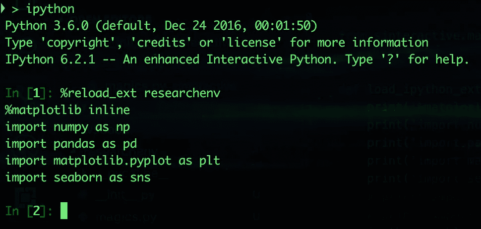

# 使用自定义 IPython 扩展进行富有成效的研究

> 原文：<https://towardsdatascience.com/productive-research-with-custom-ipython-extensions-fc7627756370?source=collection_archive---------9----------------------->

在过去的一年里，我对数据科学和机器学习越来越感兴趣。在这样做的时候，我注意到每次我想进行一些研究时，我都必须在 IPython 和 Jupyter notebook 中执行相同的重复任务，这使我脱离了心流。为了解决这个问题，我构建了一些定制的 IPython 扩展，极大地提高了我的工作效率。我想和你们分享这些扩展，我是如何构建它们的，以及我如何在日常研究中使用它们。扩展的示例代码可以在下面找到。此外，在这篇文章的第二部分中，我还谈到了我是如何将 BigQuery 支持直接构建到 IPython 中的。

作为深入研究数据科学和机器学习的必然副作用，我一直在写大量的 Python，我真的很喜欢。Python 实际上是数据科学的*通用语*。这产生了一个[令人难以置信的工具和技术生态系统](https://www.scipy.org/)。我特别喜欢用 [Jupyter](https://jupyter.org/) 笔记本在 [IPython](https://ipython.org/) 、*尤其是*内部做研究分析。说到快速原型和探索，Jupyter 是一个梦想。它允许我以一种简单、直观的方式快速尝试想法。这也迫使我记录下我是如何找到一个问题的最终解决方案的，这在重新整理一些我很久没看的旧工作时非常有用。

当我第一次启动 iPython/Jupyter 时，我几乎总是预先导入相同的模块:

如果您从事大量的数据科学工作，这应该是您非常熟悉的前奏。如果没有，这些是使用 python 进行研究和分析时使用的一些核心数据处理和可视化库。

在将完全相同的样板文件输入 20 个笔记本后，我开始寻找将这些导入文件自动放入我的环境的方法。

输入[自定义 IPython 扩展](http://ipython.readthedocs.io/en/stable/config/extensions/)。扩展允许您连接到您的 IPython 环境，并根据您的需要修改它。这正是我要找的🙏🏻。我首先制作了自己的自定义扩展，将所有这些库导入到研究环境中，并配置了 matplotlib。

首先，如果你想知道`: InteractiveShell`业务是关于什么的，那是 Python 的[类型提示](https://www.python.org/dev/peps/pep-0484/)语法的一部分。我已经习惯了使用这种语法，因为当它与 [VSCode 的 Python 扩展](https://github.com/Microsoft/vscode-python)一起使用时，它提供了很好的开发人员工效学，这是我的首选 Python 开发环境。`load_ipython_extension`基本上是 ipython 扩展的`main()`函数；当一个扩展最初通过`%[re]load_ext`被加载时，它被调用，并用于引导扩展，以及“注册魔法”(稍后将详细介绍！).上面，我使用 [enable_matplotlib()](http://ipython.readthedocs.io/en/stable/api/generated/IPython.core.interactiveshell.html#IPython.core.interactiveshell.InteractiveShell.enable_matplotlib) 以及 [push()](http://ipython.readthedocs.io/en/stable/api/generated/IPython.core.interactiveshell.html#IPython.core.interactiveshell.InteractiveShell.push) 方法来代替必须手写这个前奏。

一旦我有了扩展的框架，我就写了一个简单的`setup.py`脚本，用来符号化扩展，这样我就可以从任何笔记本上加载它。在运行设置脚本之前，我添加了`install_requires`作为对我是否处于正确环境的健康检查。

这几乎是我开始工作所需要的全部。一旦我运行了`python setup.py develop`，我就可以在任何笔记本或 IPython shell 上使用我的扩展了！

*注意，我在那里使用了* `*reload_ext*` *，这样，如果我重新运行该命令，它仍然会工作(因为* `*reload_ext*` *是幂等的)*。

我只需要这一行就可以加载我想使用的所有库。随着时间的推移，这种按键的节省真的对我很有帮助。此外，通常当我在命令行上打开 IPython 时，这是因为我有一个想快速尝试的想法。在加载时拥有我需要的所有库使我保持流畅，而不必记住(或复制/粘贴)样板文件。

继续阅读这篇博文的第 2 部分，看看如何使用✨cell magic✨直接从 IPython 查询 [BigQuery](https://cloud.google.com/bigquery/) 。