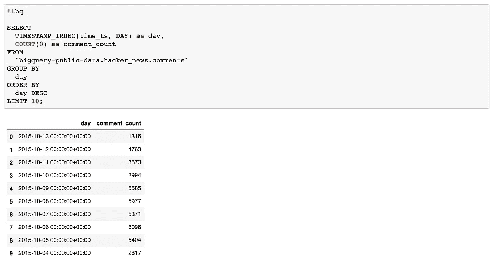
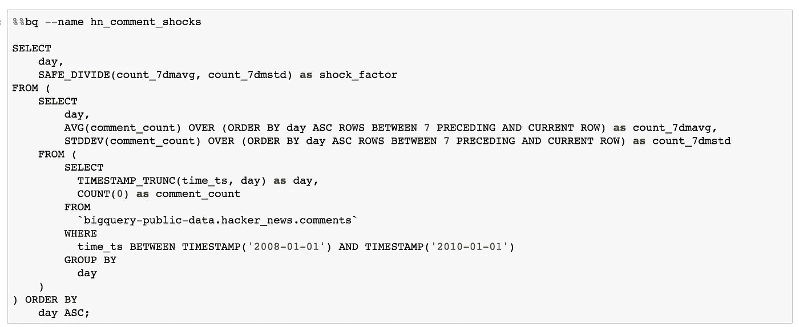
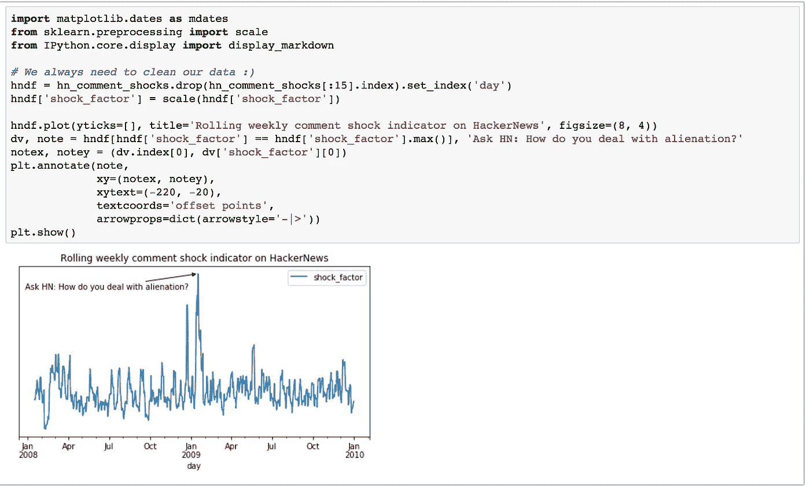

# 使用定制 IPython 扩展进行富有成效的研究，第 2 部分:BigQuery 魔术

> 原文：<https://towardsdatascience.com/productive-research-with-custom-ipython-extensions-part-2-bigquery-magic-edc3e311fdc5?source=collection_archive---------9----------------------->

在完成了用于导入数据科学库的自定义 IPython 自动加载器扩展之后，我试图为自己节省更多的时间。我想通过从 IPython 查询 BigQuery 直接访问我的数据仓库中的数据。这篇博文描述了我解决这个问题的方法。我在底部添加了一个“附录”，展示了使用我的扩展对 [BigQuery HackerNews 数据集](https://cloud.google.com/bigquery/public-data/hacker-news)进行的一些示例分析。

然而，我应该指出，BigQuery Python 客户端实际上内置了 [IPython 支持](https://googlecloudplatform.github.io/google-cloud-python/latest/_modules/google/cloud/bigquery/magics.html)。我在不知道这一点的情况下构建了我的扩展，但我仍然发现这个练习很有用，因为它揭开了 IPython 扩展的神秘面纱。

我使用 [Google 的 BigQuery](https://cloud.google.com/bigquery/) 作为我的首选数据仓库；它非常健壮，速度非常快，易于使用，而且*性价比超高。大多数时候，我发现自己在查询 BigQuery，并使用 [BigQuery 的 python 客户端库](https://google-cloud-python.readthedocs.io/en/latest/bigquery/usage.html)将结果加载到 dataframe 中。如果我可以在 IPython 单元格中键入一个 SQL 查询，并让单元格在 BigQuery 上执行该 SQL 并将结果存储在 DataFrame 中，这不是很棒吗？我希望能够做这样的事情:*

事实证明，通过使用**单元格魔术**，在 IPython 中将 BigQuery 的 SQL 直接嵌入笔记本单元格是可能的。单元格魔术是那些看起来像`%%this`的命令，它读取整个单元格的内容并调用注册的**魔术函数**，这两个位置参数`line`和`cell.``line`包含用于调用单元格魔术的行的字符串，例如`%%bq`行。`cell`参数也是一个包含单元格其余内容的字符串，*不包括*行。
如果我们以上面的例子为例，魔术函数`bq`将被调用，其中`"--name hn_daily_comment_counts"`作为`line`参数，而`"SELECT\n...\nday ASC;"`——或者初始行之后的剩余单元格的内容——作为`cell`参数。

我们可以将 BigQuery python 客户端与 cell magic API 一起使用，让 magic 函数查询 BigQuery 并返回结果。

正如你在上面看到的，我在一个`ResearchEnvMagics`类中包含了我所有的魔法(在这个例子中只有一个)。重要的是，这个类继承自 IPython 的 Magics 类，并且附加了`@magics_class`装饰器。

我还使用了 IPython 的 [magic_arguments 包](http://ipython.readthedocs.io/en/stable/api/generated/IPython.core.magic_arguments.html)，以便允许向我的 cell magic 传递额外的配置参数，类似于您在命令行上使用的。这是 IPython magics 的一个常见模式，因此他们为它提供了一个内置的包，这太棒了！

这里的最后一步是通过扩展加载钩子向 IPython 注册这些 magics:

这就是全部了！现在，magic 功能已注册，可以在 Jupyter 笔记本中使用，轻松进行研究并获得见解。

当然，在构建了这个 BigQuery magic 之后，有一天晚上我通过挖掘客户端库 API 文档发现它已经[随 IPython magics 一起发布了](https://google-cloud-python.readthedocs.io/en/latest/bigquery/generated/google.cloud.bigquery.magics.html)😑。我希望在某个地方已经记录了这一点*，但是我仍然喜欢构建它，并且在 IPython 中学到了很多关于细胞魔法的知识。下一步，我想弄清楚如何为 BigQuery 单元格魔术添加 SQL 语法突出显示。*

我希望您觉得这很有用，如果您在研究环境中使用特殊的定制 IPython magics，请在评论中告诉我！愿意分享信息和建议。请查看下面的内容，了解 BigQuery 的 HackerNews 数据集中一些示例查询的扩展。

Simple example using BigQuery to display daily comment counts.

A more advanced example looking at comment “shocks” by taking the weekly moving average and dividing it by the weekly moving standard deviation.

Cleaning, annotating, and charting the data from the previous query. Note that I used scale() above while I was examining the data in order to de-mean it. Apparently, a [post on dealing with alienation](https://news.ycombinator.com/item?id=436331) was a huge driver of comments on HackerNews around the 2008–2010 time. Very poignant, and probably deserves an article unto itself.