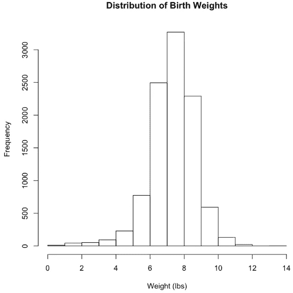
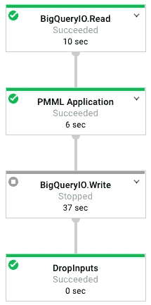
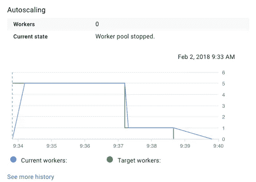

# 用数据流生产 ML 模型

> 原文：<https://towardsdatascience.com/productizing-ml-models-with-dataflow-99a224ce9f19?source=collection_archive---------2----------------------->


Source (PublicDomainPicture): [https://pixabay.com/en/baby-boy-child-childhood-computer-84627/](https://pixabay.com/en/baby-boy-child-childhood-computer-84627/)

在我的数据科学职业生涯中，我面临的一个关键挑战是将探索性分析的发现转化为可扩展的模型，为产品提供动力。在游戏行业，我建立了几个预测模型来识别玩家流失，但将这些模型投入生产总是很困难。我曾经写过 Twitch 上用于生产[模型的一些流程，但是每个产品团队都需要独特的方法和不同的基础设施。](https://blog.twitch.tv/productizing-data-science-at-twitch-67a643fd8c44)

在[意外收获](https://angel.co/windfall-data)，我们授权我们的数据科学团队拥有产品化模型的过程。我们没有依赖工程团队将模型规范转化为生产系统，而是为我们的数据科学家提供缩放模型所需的[工具](https://medium.com/windfalldata/the-data-science-stack-at-windfall-data-e1e6bc3c4c8f)。为了实现这一点，我们使用预测模型标记语言( [PMML](https://en.wikipedia.org/wiki/Predictive_Model_Markup_Language) )和谷歌的[云数据流](https://github.com/GoogleCloudPlatform/DataflowJavaSDK)。以下是我们在意外收获构建和部署模型的工作流程:

1.  模型是用 R 或 Python 离线训练的
2.  训练有素的模型被翻译到 PMML
3.  数据流作业接收用于生产的 PMML 模型

这种方法使数据科学家能够在本地使用采样数据集来训练模型，然后在我们的整个数据集上使用结果模型规范。步骤 3 可能需要工程团队的一些初始支持，但只需要设置一次。使用这种方法意味着我们的数据科学团队可以使用 PMML 支持的任何预测模型，利用托管数据流服务意味着团队无需担心维护基础架构。

本教程介绍了使用 Java SDK for Cloud Dataflow 从 R 中训练的离线模型转换为产品化模型的步骤。本教程中的所有代码都可以在我的 [github 档案](https://github.com/bgweber/StartupDataScience/tree/master/misc)中找到。我们使用可用于 BigQuery 的出生率[公共数据集](https://cloud.google.com/bigquery/sample-tables)，并训练一个线性回归模型来基于许多因素预测婴儿出生体重。数据流作业从公共数据集中读取记录，将训练好的回归模型应用于每条记录，并将结果写入我们的 BigQuery 项目中的一个表。这是我们的数据科学团队在为客户构建定制模型时采用的工作流，例如使用随机森林模型进行线索评分。

我们需要做的第一件事是熟悉出生率数据集，它记录了 1969 年至 2008 年间美国的出生人数。本[中的帖子](https://medium.com/@ImJasonH/exploring-natality-data-with-bigquery-ed9b7fc6478a)提供了关于该数据集的更多详细信息。我们使用 BigQuery web 接口编写一个查询来对数据集进行采样。该查询为每次出生提取以下属性:

*   **年份:**出生的年份
*   **复数:**分娩的孩子数
*   **apgar_5min:** 新生儿出生 5 分钟后的健康评分
*   **母亲 _ 年龄:**母亲的年龄
*   **父亲 _ 年龄:**父亲的年龄
*   **妊娠周数:**进入妊娠的周数
*   这位母亲生了几个孩子
*   母亲已婚:孩子出生时，母亲已婚吗？
*   体重 _ 磅:婴儿的体重(我们预测的)

为了在 R 中处理这个数据集，我们使用了优秀的 [bigrquery](https://github.com/r-dbi/bigrquery) 库，这使得将 BigQuery 结果读入数据帧变得很容易。我们提取一个样本数据集如下:

```
**library**(bigrquery)
project <- "gcp_project_id"sql <- "
 SELECT year, plurality, apgar_5min, mother_age, father_age,    
       gestation_weeks, ever_born, mother_married, weight_pounds
 FROM `bigquery-public-data.samples.natality`
 order by rand() 
 LIMIT 10000 
"df <- query_exec(sql, project = project, use_legacy_sql = **FALSE**)
```

然后，我们可以对数据集进行各种操作，如`summary(df)`和`hist(df$df$weight_pounds)`，这将生成下面的图表，显示婴儿体重在采样数据集中的分布。



Distribution of birth weights in the sampled data set.

接下来，我们训练一个线性回归模型来预测出生体重，并计算误差指标:

```
lm <- lm(weight_pounds ~ ., data = df)
summary(lm)cor(df$weight_pounds, predict(lm, df))
mean(abs(df$weight_pounds - predict(lm, df))) sqrt(mean(abs(df$weight_pounds - predict(lm, df)^2)))
```

这会产生以下结果:

*   相关系数:0.335
*   平均误差:0.928
*   RMSE: 6.825

模型性能相当弱，可以探索其他算法和功能来改进它。由于这篇文章的目标是专注于将模型产品化，因此经过训练的模型就足够了。用于训练模型的完整笔记本可在[这里](https://github.com/bgweber/StartupDataScience/blob/master/misc/TrainNatality.ipynb)获得。

**翻译成 PMML** 下一步就是把训练好的模型翻译成 PMML。 [r2pmml](https://github.com/jpmml/r2pmml) R 包和 [jpmml-r](https://github.com/jpmml/jpmml-r) 工具使这一过程变得简单，并支持各种不同的算法。第一个库将 R 模型对象直接转换成 PMML 文件，而第二个库需要将模型对象保存到 RDS 文件，然后运行命令行工具。我们使用第一个库直接进行翻译:

```
**library**(r2pmml)
r2pmml(lm, "natality.pmml")
```

这段代码生成下面的 [pmml 文件](https://github.com/bgweber/StartupDataScience/blob/master/misc/natality.pmml)。PMML 文件格式指定用于模型的数据字段、要执行的计算类型(回归)以及模型的结构。在这种情况下，模型的结构是一组系数，定义如下:

```
<RegressionTable intercept="7.5619">   
  <NumericPredictor name="year" coefficient="3.6683E-4"/>   
  <NumericPredictor name="plurality" coefficient="-2.0459"/>   
  <NumericPredictor name="apgar_5min" coefficient="9.4773E-5"/>   
  ...
  <NumericPredictor name="mother_married" coefficient="0.2784"/>  
</RegressionTable>
```

我们现在有了一个模型规范，可以将其产品化并应用于我们的整个数据集。

**使用云数据流进行产品化** 使用 Dataflow Java SDK 时，您可以定义一个要在一组对象上执行的操作图，服务将根据需要自动配置硬件进行扩展。在这种情况下，我们的图是一组三个操作:从 BigQuery 读取数据，计算每条记录的模型预测，并将结果写回 BigQuery。本教程生成以下数据流 DAG:



The Dataflow graph of operations used in this tutorial.

我们使用 IntelliJ IDEA 来创作和部署数据流作业。虽然设置 Java 环境超出了本教程的范围，但是用于构建项目的 pom 文件可以在这里[获得](https://github.com/bgweber/StartupDataScience/blob/master/misc/pom.xml)。它包括对[数据流 sdk](https://github.com/GoogleCloudPlatform/DataflowJavaSDK) 和 [JPMML](https://github.com/jpmml) 库的以下依赖关系:

```
<dependency>            
  <groupId>com.google.cloud.dataflow</groupId>              
  <artifactId>google-cloud-dataflow-java-sdk-all</artifactId>   
  <version>2.2.0</version>        
</dependency><dependency>            
  <groupId>org.jpmml</groupId>            
  <artifactId>pmml-evaluator</artifactId>            
  <version>1.3.9</version>  
</dependency>
```

如上图所示，我们的数据流工作由三个步骤组成，我们将详细介绍这三个步骤。在讨论这些步骤之前，我们需要创建管道对象:

```
PmmlPipeline.Options options = PipelineOptionsFactory
  .fromArgs(args).withValidation().as(PmmlPipeline.Options.class); 
Pipeline pipeline = Pipeline.create(options);
```

我们创建一个管道对象，它定义了应用于对象集合的一组操作。在我们的例子中，管道正在对一组 [TableRow](https://developers.google.com/resources/api-libraries/documentation/bigquery/v2/java/latest/com/google/api/services/bigquery/model/TableRow.html) 对象进行操作。我们将一个选项类作为输入传递给 pipeline 类，该类为数据流作业定义了一组运行时参数，例如用于运行作业的 GCP 临时位置。

管道中的第一步是从公共 BigQuery 数据集中读取数据。从这一步返回的对象是 TableRow 对象的一个[p 集合](https://beam.apache.org/documentation/sdks/javadoc/0.5.0/org/apache/beam/sdk/values/PCollection.html)。特征查询字符串定义要运行的查询，并且我们指定在运行查询时要使用标准 SQL。

```
private static final String featureQuery =     
  "SELECT year, plurality, apgar_5min ... weight_pounds\n" +
  "FROM `bigquery-public-data.samples.natality`";pipeline.apply(BigQueryIO.read().fromQuery(featureQuery)           
       .usingStandardSql().withoutResultFlattening())
```

下一步是将模型预测应用于数据集中的每条记录。我们定义了一个 PTransform 来加载模型规范，然后应用一个 DoFn 在每个 TableRow 上执行模型计算。

```
.apply("PMML Application", new PTransform<PCollection<TableRow>,
  PCollection<TableRow>>() {model = new RegressionModelEvaluator(PMMLUtil.unmarshal(
  Resources.getResource("natality.pmml").openStream()));return input.apply("To Predictions", ParDo.of(
    new DoFn<TableRow, TableRow>() {           
     @ProcessElement          
     public void processElement(ProcessContext c) throws Exception {

     /* Apply Model */
}})))
```

应用模型代码段如下所示。它检索 TableRow 以创建估计值，为 pmml 对象创建输入字段的映射，使用模型估计出生体重，创建新的 TableRow 以存储出生的实际和预测体重，然后将此对象添加到此 DoFn 的输出中。总而言之，这个应用步骤加载模型，定义一个函数来转换输入集合中的每个记录，并创建预测对象的输出集合。

```
TableRow row = c.element();HashMap<FieldName, Double> inputs = new HashMap<>();            
for (String key : row.keySet()) {              
  if (!key.equals("weight_pounds")) {                   
    inputs.put(FieldName.create(key), Double
        .parseDouble(row.get(key).toString()));              
  }
}Double estimate =(Double)model.evaluate(inputs)
  .get(FieldName.create("weight_pounds"));TableRow prediction = new TableRow();            prediction.set("actual_weight", Double.parseDouble(
    row.get("weight_pounds").toString()));            prediction.set("predicted_weight", estimate);c.output(prediction);
```

最后一步是将结果写回 BigQuery。在本课的前面，我们定义了将记录写回 BigQuery 时要使用的模式。

```
List<TableFieldSchema> fields = new ArrayList<>();    
fields.add(new TableFieldSchema()
   .setName("actual_weight").setType("FLOAT64"));    
fields.add(new TableFieldSchema()
   .setName("predicted_weight").setType("FLOAT64"));    
TableSchema schema = new TableSchema().setFields(fields);.apply(BigQueryIO.writeTableRows()
  .to(String.format("%s:%s.%s",  PROJECT_ID, dataset, table))   
  .withCreateDisposition(BigQueryIO.Write.CreateDisposition     
  .CREATE_IF_NEEDED).withSchema(schema));pipeline.run();
```

我们现在已经定义了一个管道，可以运行它来为整个数据集创建预测。这个类的完整代码清单可以在[这里](https://github.com/bgweber/WindfallData/blob/master/natality/PmmlPipeline.java)找到。运行这个类将启动一个数据流作业，该作业将生成上面显示的 DAG，并将提供许多 GCE 实例来完成该作业。下面是一个用于运行此管道的自动缩放示例:



Autoscaling the Model Predicting Task

当作业完成时，输出是 BigQuery 项目中的一个新表，它存储了出生率数据集中所有记录的预测和实际权重。如果我们想要运行一个新的模型，我们只需要在数据流作业中指向一个新的 PMML 文件。运行离线分析和数据流项目所需的所有文件都可以在 [Github](https://github.com/bgweber/WindfallData/tree/master/natality) 上获得。

数据流是一个伟大的工具，使数据科学家能够将他们的模型产品化。它提供了一个可扩展到大型数据集的托管环境，并使数据科学团队能够拥有更多生产流程。

[本·韦伯](https://www.linkedin.com/in/ben-weber-3b87482/)是[意外收获数据](https://angel.co/windfall-data)的首席数据科学家，我们的任务是确定世界上每个家庭的净资产。