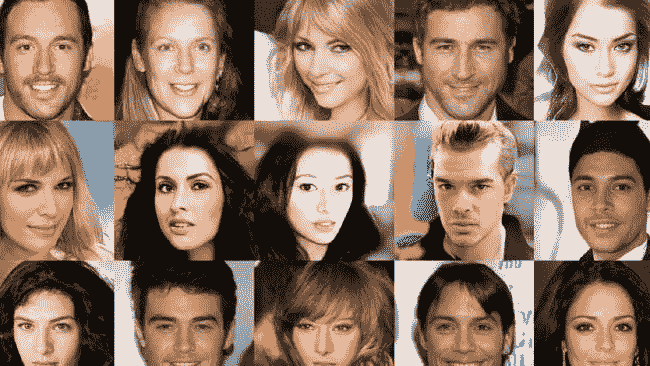

# PGGAN 创建逼真的面孔

> 原文：<https://towardsdatascience.com/progressive-gans-new-training-trend-for-2018-c18cb0190239?source=collection_archive---------3----------------------->

## 2018 年深度学习的新趋势

Ian Goodfellow 早在 2014 年就在蒙特利尔大学发明了世代对抗网络。他们已经有了一个很好的开始，显示出图像生成质量的潜在增长，打破了以前由受限玻尔兹曼机器、可变自动编码器等设定的所有基准。这个框架仍然是生成高质量图像的最成功的方法之一。此外，该框架产生易于处理的网络(与通过近似推理计算的 RBM 相反),且很容易仅使用误差反向传播来训练。

多年来，GANs 的许多变体被发明出来，但第一个最成功的进展是 DCGAN，它生成了质量更好的图像，还发现了各种稳定训练过程的技术，因为众所周知，随着一个网络变得比另一个更强，学习无法完成，GANs 在训练时非常不稳定。另一个问题是模式崩溃，生成器无法生成新的图像。除了训练问题，GANs 很快转向不同的方向，如生成高分辨率图像，图像修复，制作音乐等。

# 进步甘斯

最近，在撰写本文时，NVIDIA 的一项研究揭示了一种训练 GANs 的新技术，他们称之为***GANs***的渐进生长。他们采取了一种完全不同且出乎意料的训练方法。并且这种技术产生新颖的并且不容易与原作或赝品相区分的真实图像。

只是看一看👀观看下面的视频，了解这种新训练方法的潜力！

Celebrity Face Generation (Novel Faces)

## 扩大网络

他们用于训练网络的方法是，首先从生成器 ***G*** 生成 4x4 分辨率的图像，并将它们与缩放到相同分辨率的真实图像一起送入鉴别器*进行训练。请注意，他们使用的图像来自 CelebA 数据集，尺寸为 1024x1024。现在，在网络学习对于宽空间特征饱和之后，两个网络都随着更高分辨率的层慢慢淡入到 ***G*** 和 ***D*** 中。*

*研究人员使用残差网络，通过增加残差网络存在的权重，将这些更高分辨率的卷积层淡化到两个网络中。卷积分辨率(新层)增加了 2 倍，在这种情况下是从 4×4 增加到 8×8。这意味着现在 ***G*** 生成 8×8 图像(而不是以前的 4×4 图像)并作为 8×8 图像输入到 ***D*** 中。原始实像也被缩放到 8×8，用于将它们馈送到 ***D*** 。 ***G*** 和 ***D*** 的先前 4×4 卷积层仍然保持可训练。*

> *网络的渐隐进入 ***G*** 和 ***D*** 借助残差网络让较高分辨率层渐隐进入网络而不影响训练有素的较低分辨率层。*

*图层被对称地淡入 ***G*** 和 ***D*** 中。通过将分辨率增加 2 倍，分辨率逐步增加到 1024x1024。这种方式网络学习图像的宽空间特征和更高分辨率层中的局部空间特征，因为*GANs 增长，因此称为 GANs 的渐进增长*。*

*虽然有些图像是不正确的，例如有时头发和前额混在一起，有些照片中的眼睛彼此不相似，等等。但总的来说，网络生成的图像非常好，而且还是高清的！*

# *接下来呢？*

*为了更深入的理解，请看一下研究论文:[为了提高质量、稳定性和变化而进行的 GANs 渐进生长](http://research.nvidia.com/sites/default/files/pubs/2017-10_Progressive-Growing-of//karras2017gan-paper.pdf)。还可以在 GitHub 上查看我的推理(生成器)网络对[的实现。代码是用 PyTorch 编写的，可以让你从潜在空间生成图像。](https://github.com/rahulbhalley/Progressive-Growing-of-GANs)*

*在 [GitHub](https://github.com/rahulbhalley) 、 [Instagram](https://www.instagram.com/rahulbhalley) 、 [Twitter](https://twitter.com/Rahul_Bhalley) 上追踪我。*