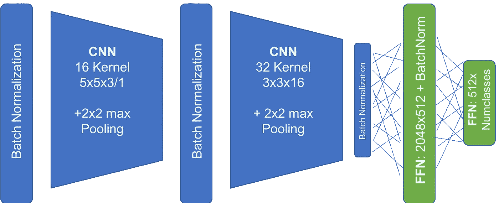
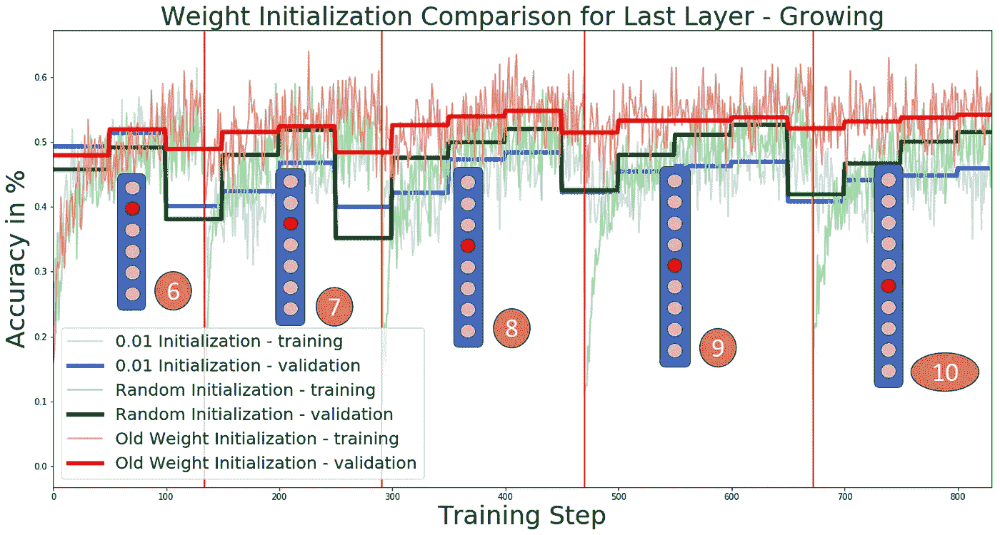
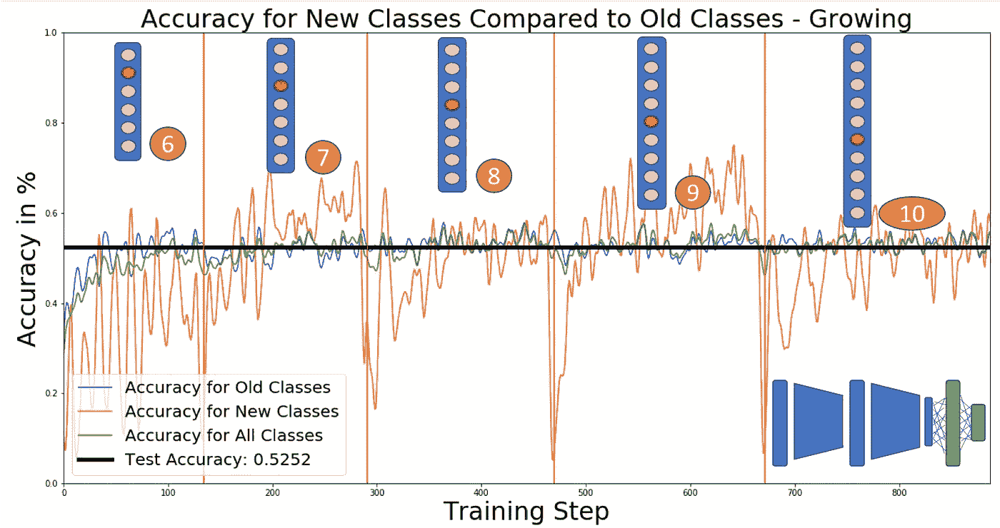
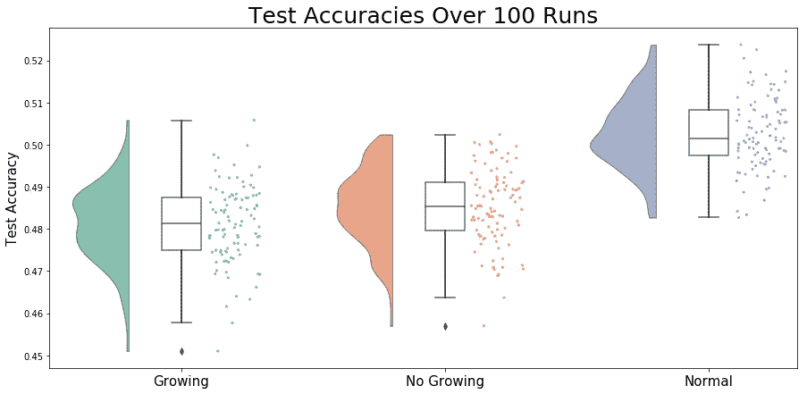
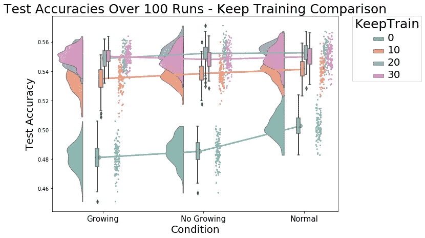

# TensorFlow 中的渐进式学习和网络增长

> 原文：<https://towardsdatascience.com/progressive-learning-and-network-growing-in-tensorflow-e41414f304d2?source=collection_archive---------9----------------------->


在许多真实世界的应用中，在网络已经被训练之后，新的训练数据变得可用。特别是对于大型神经网络，每当新信息可用时，重新训练完整的模型将是非常乏味的。对于引入的每个新类别或其他信息，简单地向网络添加新节点，并保持所有其他先前训练的权重，会容易得多。在这篇文章中，我将简要介绍如何在 TensorFlow 中实现这一点，以及它对网络性能的影响。

我将在 CIFAR-10 数据集上演示该过程和结果，但本文结尾链接的 Git 存储库也提供了 MNIST 和 CIFAR-100 的代码和结果，可以很容易地适用于任何其他这类数据集。我使用的网络结构非常简单，由两个卷积层组成，后面是一个具有 512 个神经元的全连接层和一个具有与数据集中的类一样多的神经元的读出层。



Network structure used for the following experiments. On CIFAR-10 it reaches an accuracy of ~55%.

在这个渐进学习网络的例子中，训练从 CIFAR-10 的十个课程中的六个开始。在每个时期之后，引入一个新的类，直到五个时期之后，所有十个类都在数据集中。为了让网络在新添加的类上进行训练，它需要为该类提供一个新的输出节点。这意味着网络的最后一层以及与之相连的权重随着每一个新类别的增加而增加。为了在 TensorFlow 中实现这一点，我用新大小的新图层重新初始化完整的最后一层。

```
# Define initializer (old weights + random samples from them for the new node(s) )
initializer = tf.constant_initializer(np.append(weights,np.random.choice(weights.flatten(),(512,1)),axis=1)) # Initialize new last layer of size (512 x numClasses)            tf.variable_scope(tf.get_variable_scope(),reuse=tf.AUTO_REUSE):
                outLog,Wname =      newLastInit(hidden_layer,numOutP,initializer)
                acc,CE = evaluate(outLog,desired)
                accuracy = tf.reduce_mean(tf.cast(acc, tf.float32))
                cross_entropy = tf.reduce_mean(CE)                   
                learning_rate = 1e-4
                optimizer = tf.train.AdamOptimizer(learning_rate,name='op_0')# get name of new layer
weightName = Wname# define gradients
gradient = tf.gradients(cross_entropy, weightName)[0]# define training goal
training_step = optimizer.minimize(cross_entropy)# get all uninitialized variables
uninitialized_vars = getUnititialized(tf.all_variables())# initialize all uninitialized variables
init_new_vars_op = tf.initialize_variables(uninitialized_vars)# Start training for the next epoch
session.run(init_new_vars_op)
```

连接到新的最后一层的权重最好用来自前一时期的已训练的`weights`来初始化。连接到新添加的节点的权重可以从旧的`weights`或随机分布中随机采样。这种权重初始化导致比用随机数或小常数初始化所有权重明显更好的结果，因为它保留了在先前时期中学习的所有信息。



Comparison of three weight initializations with network growing. The blue boxes represent the size of the last layer. The number in the orange circle states how many classes are in the training and validation set. The red lines mark the start of a new epoch and the initialization of a new class and a new node in the last layer.

对于所有三种权重初始化，每当引入一个新类时，您都可以看到性能下降。然而，前两次初始化(恒定和随机初始化)的下降比用旧的权重初始化时大得多，因为旧的权重初始化保留了已经学习的信息，并且只有新的类需要从头开始训练。当比较旧类的网络性能和新类的性能时，可以看出性能下降主要是由后者引起的。相对而言，新班级的引入并没有影响旧班级的表现。



Network performance on the old classes compared to the performance on the new class. Red lines mark the start of a new epoch and a new class introduction.

看着这些图，当保留旧的权重时，似乎添加新的类和增长网络对关于旧的类的已经学习的信息几乎没有影响。但是它是如何影响整体测试精度的呢(黑线)？

为了将网络增长与数据集中所有类的传统训练进行比较，我在每种条件下训练网络 100 次，然后比较每种条件下产生的 100 个测试准确度的分布。此外，我添加了一个名为 *No Growing* 的条件，其中最后一层保持静态(总是包含 10 个节点),只有数据集随着时间的推移而增长。这相当于从开始就初始化一个更大的输出层，以便为新的类留出一些空间，而不必在训练期间改变网络结构，但是限制了可以添加的类的最大数量。



Distribution of 100 test accuracies for each of the three conditions after training for five epochs on CIFAR-10.

正常的网络训练(M=0.50，SD=0.01)明显优于连续学习条件(增长(M=0.48，SD=0.01)和不增长(M=0.49，SD=0.01))，p <0.001\. However, the normal training had a strong advantage since it could train on each example for each class five times. The two continuously learning networks had much less time to train on the classes that were introduced later on. In the most extreme case, the images of the class introduced last were only seen once by the networks as opposed to five times by the normally trained network.

When training for longer after the last class has been introduced one can see how the two continuously learning networks catch up to the normal network after 30 epochs of post training, from then on no significant difference can be found anymore, F(2,297), p=0.06.



Distribution of 100 test accuracies for each of the three condition comparing the number of epochs that were used for post training. KeepTrain=0 therefor means that no post training was performed and reprsents the same results as shown in the previous figure. KeepTrain=30 means that after the last class introduction the network was trained for 30 more epochs.

These results show that a network can be trained with iterative class introduction and can still reach a comparable performance to a network trained with all classes from the beginning on. The continuously learning networks take a bit more time to reach a performance comparable to the performance of a normally trained network but this effect can be explained by the lower exposure of the network to the classes which were added later on. In a real world application this can be a simple solution for adding new information to an already trained network without having to start training from scratch again.

**代码**:[https://github . com/vkakerbeck/progressive-Growing-Networks](https://github.com/vkakerbeck/Progressively-Growing-Networks)