# 潘德雷肯计划:命运大订单的人工智能机器人

> 原文：<https://towardsdatascience.com/project-pendragon-an-ai-bot-for-fate-grand-order-23f51b6e3268?source=collection_archive---------6----------------------->

作为一名数据科学家，我经常不会真的对我的模型做任何事情。我投入了大量的时间来建立数据集，准备数据，训练模型，调整它们的超参数，然后我将它们存储起来，再也不会被看到。所以我想这一次我会试着把它们整合到一起。

潘德雷肯计划使用三个 Pytorch 神经网络的主干来决定在手机游戏《命运大令》( FGO)中什么时候出什么牌。对于一些人来说，这可能是我过度工程的解决方案，但对我来说，这是一个有趣的项目，实际上节省了我每天在游戏中的项目农业的时间。尤其是在早上，当我让机器人运行一些任务时，有额外的 10-15 分钟是很有用的。

> [这里的](https://github.com/sugi-chan/project_pendragon)是 github 回购的链接

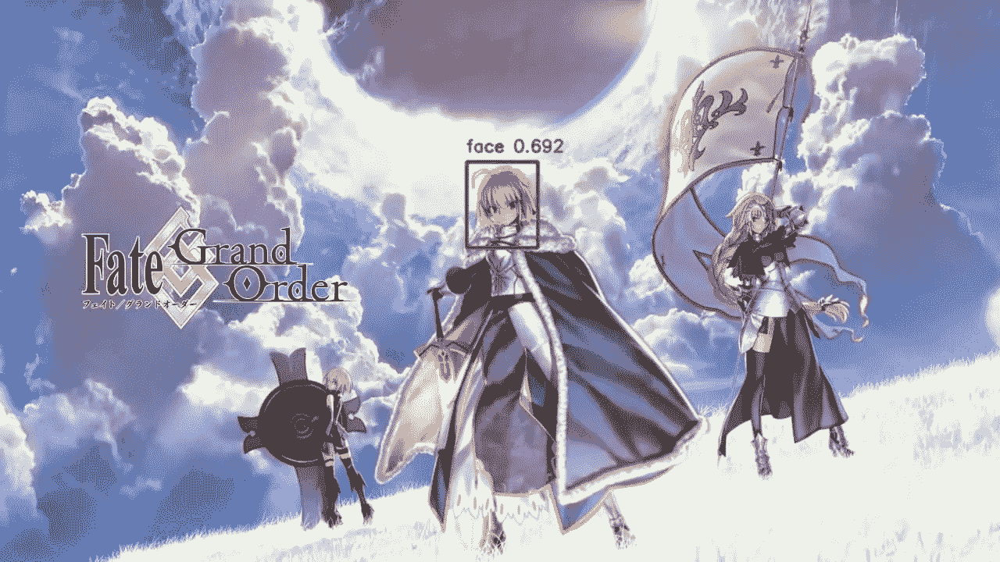

A previously trained face detection model only detects the center character, Altria Pendragon, FGO’s version of King Arthur Pendragon, but not either of the other two characters. The the other two characters are more in the background and faces are partly obstructed. Also the object detection model was trained on season 4 of The Flash… so it doesn’t actually have exposure to cartoon characters, I could build a specific network for that though. I’m using that model (calling it Flashpoint for now) as part of a raspberry pi remote greeter which could also be a good blog post…

FGO 的一些背景。这是一款移动设备的日本角色扮演游戏，你可以通过从一副牌中选择动作牌来控制角色。在任何给定的时间，你将有 3 个角色在场上，每个角色有 5 张自己的行动卡。动作牌有三种，艺术牌、巴斯特牌和快速牌，每种牌的数量取决于角色。每回合从 15 张牌中给你发 5 张牌(每个角色 5 张)，没有替换，并且允许你选择 3 张牌作为该回合的行动。一个额外的机制是建造卡链有奖励。选择三张相同类型的卡片。链的例子见下面的两个图像。

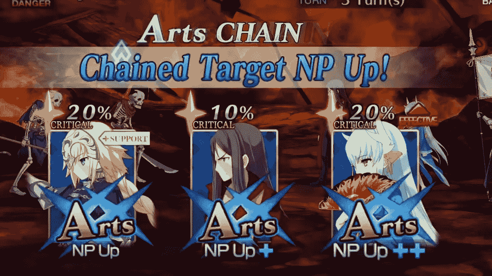

Arts Chain: Pick 3 arts cards, can be from the same or different characters. Can do the same thing for any of the 3 card types

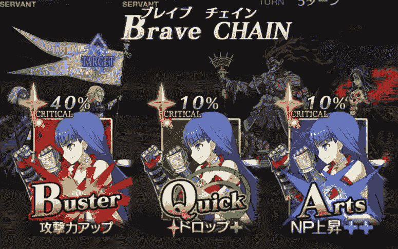

brave chain: pick 3 cards from the same character

当我坐下来思考我可以做的事情时，我意识到我可以使用一系列神经网络，通过 python 向游戏发送输入来选择卡片，来创建一个玩 FGO 的机器人。对机器人来说，一个基本但有效的游戏策略是，只要有可能，它就玩牌链。卡链在使用时会带来伤害或其他奖励，使用它们会使回合更有效率，因为伤害更高，因此战斗时间更短。

在开始编码之前，我必须弄清楚我希望机器人遵循的一般流程，以下是我想到的逻辑结构。

*   开始时，它会查看是否能看到“攻击”按钮，如果找到，它会按下按钮并进入该回合的阶段，在该阶段中，它会从 5 张命令卡中挑选 3 张
*   机器人会检查这 5 张牌中是否有 3 张是同一角色的。如果是这样，那么它就创造了“勇敢链”
*   如果没有找到勇敢链，那么它将查看所有的卡，检查它们的类型，并寻找 3 张相同类型的卡来创建卡链。
*   如果没有找到卡链。那么它将按以下优先级顺序播放。艺术卡，巴斯特卡和快速卡。(我倾向于在我的游戏中优先考虑艺术卡，因为它们为 FGO 中被称为“高贵幻影”的角色收取终极能力，所以我让机器人这样做)出于同样的原因，这也是机器人在不同链中尝试玩牌的顺序。
*   一旦完成，它将开始检查攻击按钮的重新出现，机器人的回合将再次开始。

因此，在这个过程中，识别攻击按钮和卡类型的能力是传统的 CNN，而寻找同一人物的 3 张卡是连体 CNN。

我使用 Pytorch 构建了所有的网络，并在 1060 或 1080 Nvidia GPU 上对它们进行了训练。

然而，在这之前，第一步是让 FGO 在我的电脑上运行，这比我想象的要难。

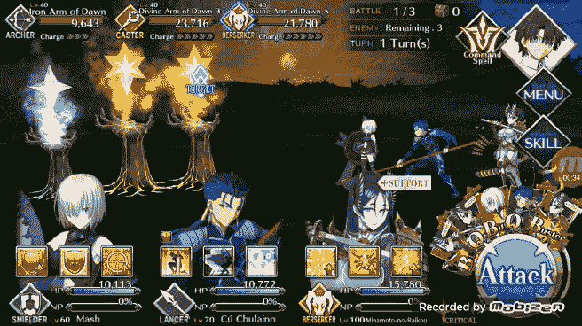

Bot identifies that the first, second, and fifth card are all of the same character and so it constructs a chain using those three cards.

# 在个人电脑上运行 FGO

虽然这应该是很好很简单的，但是一些谷歌搜索很快让我知道，目前没有任何模拟器可以轻松支持 FGO，并且像在 Android 上使用开发者功能这样的选项与 FGO 不兼容。

所以在短暂的绝望之后，我偶然想到了用微软的 TeamViewer 来控制我的 android 设备。由于我通常使用 TeamViewer 来远程访问我的计算机，这看起来是一个优雅的想法，而且它证明工作得很好。使用 android TeamViewer 主机应用程序，我可以将我的手机添加到我现有的帐户中。对我来说，唯一的缺点是我的手机在长时间使用后会过热

设置好之后，我必须确认我能够启动 FGO，并测试通过 python 的 pyautogui 向它发送鼠标点击。令人欣慰的是，这是成功的，所以下一步是捕捉游戏屏幕的屏幕截图，并隔离神经网络将查看的部分，获得适当的 xy 坐标，以裁剪出图像的这些部分。

第一部分是玩家回合开始时出现在屏幕上的“攻击”按钮。一旦它出现，玩家按下它，并被允许选择他们的行动“命令卡”。到目前为止，我的策略是让机器人每秒检查一次攻击按钮，如果它检测到这个按钮，它将执行其余的代码。

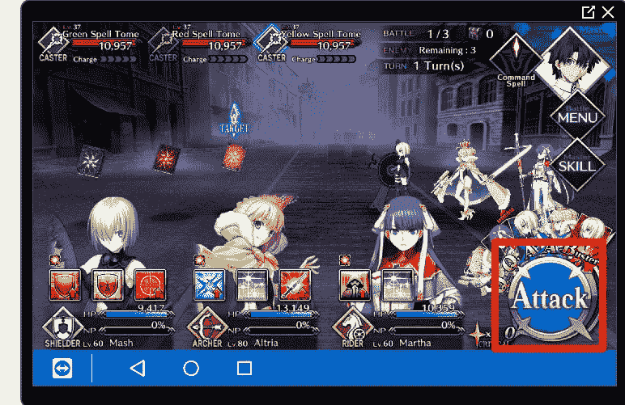

clipping of the TeamViewer screen that gets fed into my bot for analysis

点击攻击按钮后的下一步是确定“命令卡”在下一个屏幕上的位置。我还注意到，五个命令卡总是位于屏幕上的相同位置，这意味着我也可以从屏幕上裁剪出命令卡，并作为输入输入到网络中。

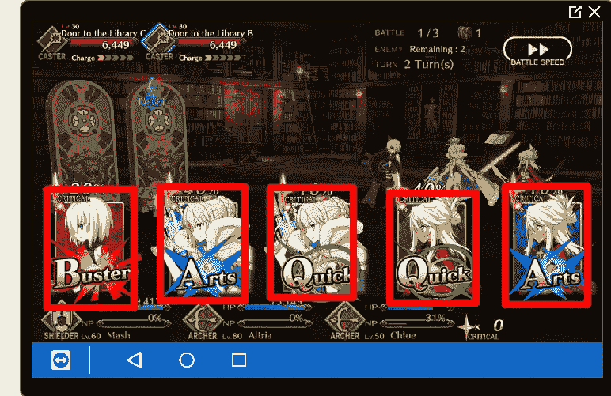

Showing placement of command cards on the screen

现在我有了提取输入的方法，我需要运行它们。我已经准备好训练我需要的神经网络。

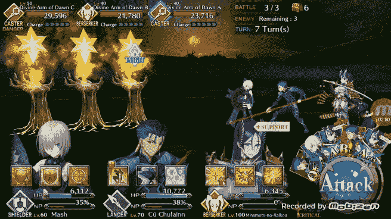

Bot identifies that there are 3 cards of the same color (card 2,3 and 5) and selects them to make a card chain

# 利用预训练 Pytorch CNNs

对于这两个网络，第一步是为我关心的班级获取图像数据。

第一个是二进制分类问题，以检测“攻击按钮”,我浏览了游戏镜头，剪出了几十个攻击按钮和按钮不存在的例子，这是大多数时间。

对于第二个分类器，我浏览了游戏片段，剪下了大约 60 张三种不同颜色的动作卡片。对于这一张，我预计虽然每张卡片上的面孔不同，但颜色是相同的，所以它会学会优先考虑卡片的颜色。

现在我已经有了两个小数据集，我准备好开始构建模型了。尝试从零开始训练网络是愚蠢的，所以我决定利用 Pytorch 中包含的预训练网络。像大多数图像分类问题一样，我采取的第一个方法是利用 Pytorch 的预训练网络，在这种情况下，我针对我的分类问题对现有网络进行了微调。Pytorch 的[文档](https://pytorch.org/tutorials/beginner/transfer_learning_tutorial.html)中列出了基本流程。像微调或使用预训练网络作为特征提取器这样的事情使我们能够利用网络，这些网络已经学习了图像分类的有用权重，我们希望这些权重将推广到我们的特定用例。

对于这两个模型，我使用了 Resnet 的变体(Resnet 18 和 50)，我可能会使用两个 Resnet 18 实例，但决定尝试一下，看看在我的显卡上使用更大的 Resnet 50 模型需要多长时间。我对每个网络进行了大约 5 个时期的训练，对于这两个分类任务，它们都达到了大约 95%的准确率

确定卡类型的网络是 Resnet 50，它构成了我的机器人的主干。因为一旦我决定了卡的类型，我就可以形成卡链，这可能是最常见的卡链类型。见下面的例子，机器人识别，然后创建“艺术”链。

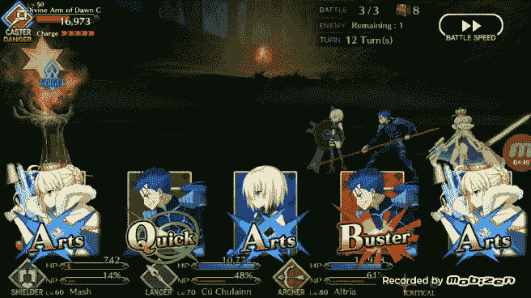

Bot identifies cards 1,3, and 5 as a chain.

# 用连体神经网络寻找勇敢的锁链

第二种类型的卡链是通过选择 3 张相同角色的卡创建的。所以从概念上来说，这比第一种卡链要难一点。目标必须是识别在已经分发的 5 张牌中，何时至少有 3 张牌是由同一人物发出的。

有几种方法可以解决这个问题。首先是建立一个经典的 CNN，学会识别游戏中的所有角色。这是可行的，但收集数据会很麻烦，因为至少有 100 个字符，并且很难获得足够大规模的数据以使网络收敛，甚至很难进行适当的微调。因此，在这种情况下，我想我可以应用我在以前的帖子中谈到的东西，[暹罗神经网络](https://medium.com/@michaelsugimura/stylistic-fingerprints-of-artists-with-siamese-convolutional-neural-networks-2c0ab2188770)。

有了暹罗网络，我可以使用一个相当小的数据集来训练一个网络，使其善于识别不同颜色卡片上的人脸的相似性。这也意味着我将能够极大地增加数据集，因为我现在将进行成对比较。

为了做到这一点，我利用了这个[存储库](https://github.com/harveyslash/Facial-Similarity-with-Siamese-Networks-in-Pytorch)中的数据集函数进行面部相似性分析，并修改了网络结构以包括最大池，部分是因为我的计算机将耗尽内存，但也因为我发现了一些改进，因为初始网络即使在变得更深时也保持了原始图像的大小，最大池被应用于让网络通过附加层来学习更复杂的图像特征。

这里的暹罗网络被训练为最大化或最小化两个输入图像的特征向量之间的欧几里德距离，这取决于它们是否相同。因此，对于我部署模型，我可以用它来测试一个命令卡与其他 4 个命令卡，并寻找相似性匹配。从计算的角度来看，这样做的一个缺点是，我将每张卡与所有其他卡进行比较，因此最坏情况下的运行时间是 N。

请参见下文，了解如何做到这一点。图像对可以通过网络输入，然后通过获取两个输出向量之间的欧几里德距离，可以得到网络看到的两个图像的不同之处(分数越低意味着越相似)。在这个例子中，网络运行良好，但仍有改进的空间。我发现很多人物最终看起来与侧面肖像相当相似，所以我可能需要包括更多这些更难比较的例子来帮助加强网络。

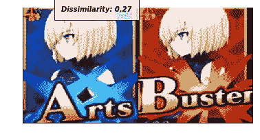

These are two cards by the same character and is really the comparison that this network was designed to make. By finding 3 of these matches the bot can create a brave chain and get an extra attack as a result (how the game rewards 3 cards by the same character)

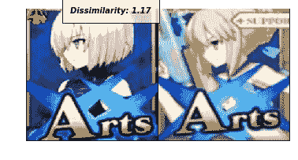

Example of dissimilar pair, score of 1.17 is quire high

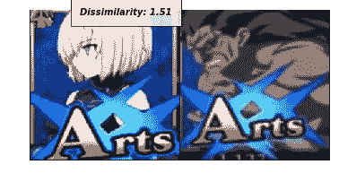

another more dissimilar pair

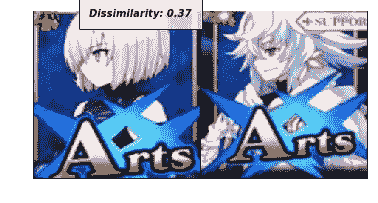

one where the network marks two characters as being similar while they are different. As discussed above this is probably the main area of improvement. The network was only trained on around 40 characters with 3 or so cards from each.

虽然还有待改进，但暹罗网络在实地确实表现良好。见下面的一些例子，它循环通过 5 张卡片，并将每张卡片与所有其他卡片进行比较。当它找到一个三元组时，该三元组被提供给机器人，机器人选择适当的卡来创建链。

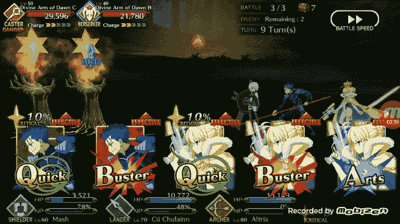

bot uses siamese network to identify cards 3,4, and 5 as all being the same character so it constructs a brave chain

# 结束语

这个机器人是一个好的开始，它可以相当胜任地玩 FGO，在某种意义上它可以清除我让它通过的高等级任务。然而，它没有利用许多额外的游戏机制，这些机制可以提高它的效率。

*   聪明地使用角色的终极能力，在 FGO 被称为“高贵的幻影”(NPs)。到目前为止，我让机器人在一定数量的回合后尝试使用角色的 NPs，他们可能会在那场战斗中用它来对付老板或更强的敌人，而不是浪费在早期较弱的敌人身上。
*   利用 FGO 的阶级亲和系统。本质上是一个石头剪子布类型的设置，每个角色都有一个给定的职业，相对于其他职业有优势和劣势。有利的使用它会给你一个伤害加成，而不利的配对是一个伤害。
*   让 bot 使用角色“技能”。在 FGO，角色技能在正确的时候非常有用，可以增加伤害，治疗盟友，减少敌人的负担等等。机器人目前没有利用这些，因此错过了很多。

机器人的下一个阶段可能是强化学习的应用，但这很难，因为 FGO 有一个行动点系统，在那里每场战斗都需要 X 个行动点，当你用完它们时，你必须让它们充电……这意味着我很难让它探索数千次迭代。另一个选择是建立一个模拟的 FGO 环境供它探索。这是可能的，但是会非常耗时。

**编辑**:作为一个后续帖子，我为上面提到的 FGO 制作了强化学习机器人，你可以在这里查看[。我建立了一个自定义的游戏环境，让机器人通过玩数千种游戏来学习，发现它学会了一些很酷的行为！](/project-pendragon-part-2-a-reinforcement-learning-bot-for-fate-grand-order-7bc75c87c4f3)

> [这里的](https://github.com/sugi-chan/project_pendragon)是 github 回购的链接