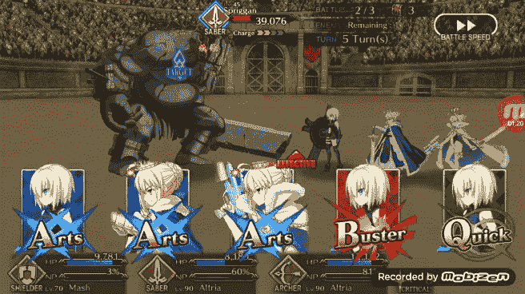
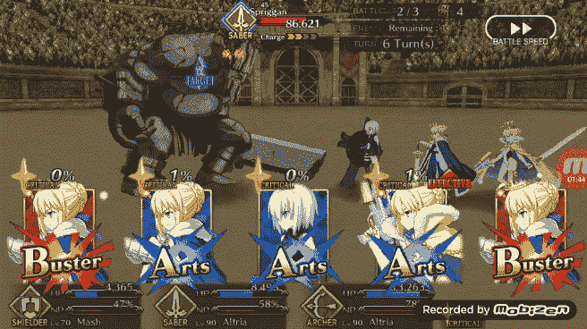
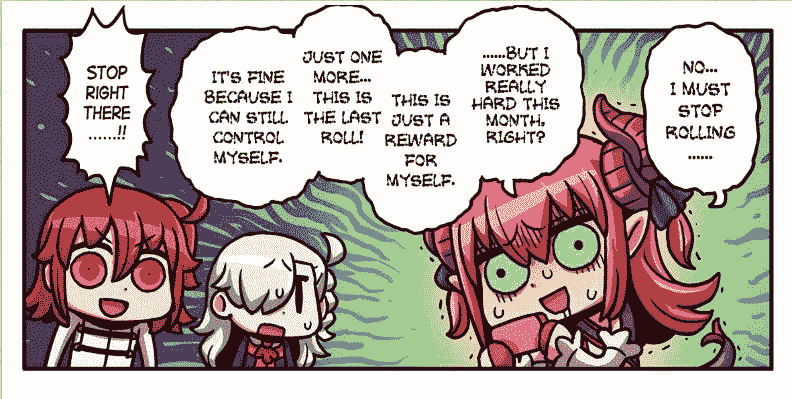
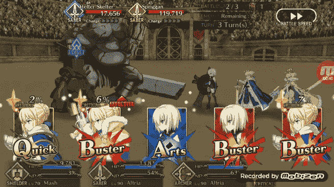
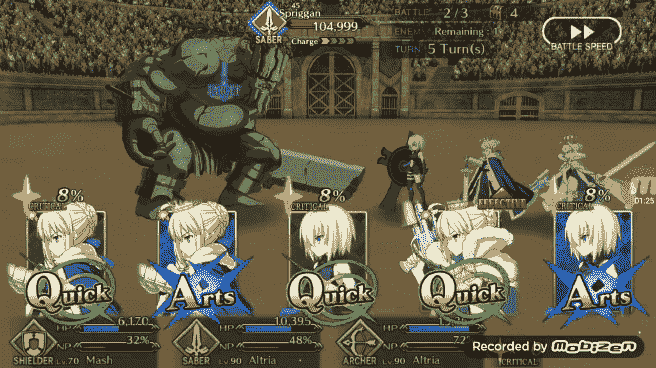
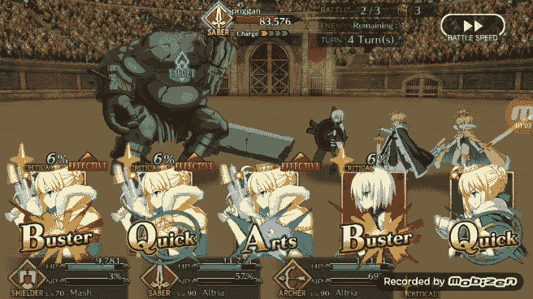

# 项目潘德雷肯第 2 部分:命运大订单的强化学习机器人

> 原文：<https://towardsdatascience.com/project-pendragon-part-2-a-reinforcement-learning-bot-for-fate-grand-order-7bc75c87c4f3?source=collection_archive---------12----------------------->


Fate Grand Order wallpaper that I passed through a YOLOv2 object detector I fine tuned to detect human faces, it is somewhat surprising that it detects any cartoon faces…

在我之前的帖子中，我概述了一个我为玩手机游戏《命运大令》(FGO)而制作的机器人，昵称为[潘德雷肯](https://medium.com/datadriveninvestor/project-pendragon-an-ai-bot-for-fate-grand-order-23f51b6e3268)。潘德雷肯机器人的核心是三个神经网络，两个经典 CNN 和一个暹罗 CNN。网络的输出被机器人用来决定它被分发的五张卡中的哪张卡该轮到它玩。

在上一篇文章的最后，我讨论了一些可能的后续步骤，我提到的其中一个步骤是使用强化学习来训练一个模型，让它自己选择卡片，而无需我为它制定规则。我认为这将是非常困难的，因为我必须从头开始为机器人建立一个实验环境…但我继续这样做，因为我觉得这将是一个有趣的项目，值得付出额外的努力。这篇文章将介绍我如何为机器人建立一个简化的 FGO 环境，构建一个神经网络来决定选择哪张牌，使用强化学习来训练它，以及我对它所学游戏的印象。

在训练并将新的强化学习网络整合到我为扮演 FGO 而构建的框架中后，我决定给它取个昵称。现在我用的是 [**潘德雷肯**。FGO 制作角色，然后是邪恶的“改变”版本，让他们不用做太多额外的开发就能制作更多的角色(并增加他们的收入)。所以我想我最初的潘德雷肯机器人可以使用一个，可能是邪恶的，强化学习的对等物。](https://github.com/sugi-chan/Pendragon_Alter)

作为一些背景，FGO 是一种游戏，玩家每回合发五张牌，他们从这五张牌中挑选三张作为该回合的行动。每种类型的卡都有自己的属性，以不同的组合使用它们有不同的好处。例如，玩三张相同颜色的牌会在牌的基础统计上增加额外的奖励。奖金的性质取决于卡的类型。艺术卡(蓝色)充能强大的终极能力，巴斯特卡(红色)造成额外伤害，快速卡(绿色)创造致命一击的可能性，双倍伤害。我试着在这篇文章中解释重要的游戏机制，但是请随意查看[上一篇文章](https://medium.com/datadriveninvestor/project-pendragon-an-ai-bot-for-fate-grand-order-23f51b6e3268)以获得组成 FGO 的其他通用机制的更详细的概述。



Pendragon Alter building an “Arts chain” picking 3 Arts cards

# **构建命运大秩序环境**

像许多其他人一样，我使用 OpenAI 的健身房库，使用其他人的代码来训练一些简单的强化学习模型，但这是我这个项目的一部分动机，因为我想看看它是如何从头构建一个定制环境的。这方面的很多灵感来自于 2016 年斯科特·罗马(Scott Rome)的一篇帖子，他在帖子中创建了一个环境来训练网络玩 21 点([此处](http://srome.github.io/Train-A-Neural_Net-To-Play-Black-Jack-With-Q-Learning/))。

在 FGO，玩家通常在任何给定的时间有 3 个角色在场上，大约有 9 个对手在三个以上的波中产卵。为了简化这一点，我将我的环境构建成一对一的战斗，两个实体的目标是通过每回合造成伤害来将对手的生命值减少到 0。

目前，这些战斗的基本结构是一个循环，每一次迭代都由两个团队组成，当一个团队的生命值降至 0 时，两个团队都会造成伤害。

敌人团队每回合在一个范围内随机选择一个数字来造成伤害，我认为这个简单的解决方案暂时可行，合理地调整敌人的伤害比重建他们如何处理伤害更重要。另一方面，玩家团队根据他们从五张牌中选出的三张牌组合造成伤害，这五张牌是根据他们的初始牌组发出的。我这样做是为了更好地反映玩家在 FGO 的战斗方式。

> 实现见 github 回购行 275–432 中的**[**Colosseum . py**](https://github.com/sugi-chan/Pendragon_Alter/blob/master/colosseum.py)。**

**一旦这个循环建立起来，我就开始添加 FGO 用来放大伤害的后端计算和机制。我找到了这些计算和机制的值([这里](https://grandorder.gamepress.gg/combat-mechanics))。**

**这些后端机制的一些示例:**

1.  **崇高幻象(NPs):是 FGO 中人物拥有的强大终极能力，通常会造成大量伤害。NP 在使用前必须充电到 100%,这在“NP 量表”中进行跟踪。当前费用通过使用某些卡来增加。在我的实现中，当玩家的 NP 标准达到 100%时，该 NP 在下一回合被用来造成额外的伤害。玩家充能其角色的 NPs 的能力对于他们成功清除 FGO 战役至关重要。**
2.  **致命一击:致命一击的百分比几率基于“致命之星”的生成。临界星生成的速率根据你使用的牌而变化。恒星在第 N 回合生成，在第 N+1 回合消耗。星星的数量增加了造成致命伤害的可能性。虽然成功获得致命一击有一些随机性，但如果你成功击中，你会造成双倍伤害，这是非常有价值的。**
3.  **将一张牌放在三张牌链的不同位置会有奖励。例如，链中的第一张卡对链中的所有卡都有奖励，而第三张卡的属性显著增加。这使得使用链中的第一和第三张牌变得非常重要。我的潘德雷肯机器人，实际上没有很好地利用这个机制，新的强化学习机器人在这方面做得更好，详情见最后一节。**
4.  **卡链:正如我之前提到的，将三张相同类型(颜色)的卡放在一起会有奖励，因为卡的统计数据被放大了。这种奖励加上从放卡中得到的奖励有助于使卡链在游戏中变得非常强大，因此是加入游戏环境的必要条件。**

> **这些额外的机制可以在[**coloseum . py**](https://github.com/sugi-chan/Pendragon_Alter/blob/master/colosseum.py)的第 104–235 行找到**

# **构建神经网络**

**为了开始构建将网络整合到我的新游戏环境中的机制，我必须决定如何表示模型的动作空间。我的第一轮头脑风暴让我希望模型根据三种不同的牌类型(艺术牌、巴斯特牌、快速牌)来对不同的牌进行分类。但是我很快就碰壁了，见下文。**

```
Hand: “Arts”, “Quick”, ”Quick”, “Buster”, “Arts”
output: “Arts”, “Arts”, “Arts”
```

**我如何压缩输出，这样当只有两张可用时，它就不会尝试使用三张艺术卡？**

**我想不出一种优雅的方式来做到这一点，所以我不得不回到绘图板，想出一种方法来表示动作空间，这样每个输出节点总是有效的，它只需选择最好的一个。**

**我最终采用的方法是让行动空间成为从五个可能的卡槽中选择三个卡槽的所有可能的排列。我在这里的思考过程是，不要考虑牌的类型会不断变化，总会有五个有效的牌槽。因此，60 种可能的排列，即从 5 个顺序重要的位置中挑选 3 个，可能是表示动作空间的好方法。参见下面的前一手牌示例，对于前一手牌示例的输入，所有输出 1-60 均有效。**

```
Hand: “Arts”, “Quick”, ”Quick”, “Buster”, “Arts”
output_1: “Card 1”, “Card 2”, “Card 3”
output_2: “Card 1”, “Card 2”, “Card 4”
...
output_60: “Card 5”, “Card 4”, “Card 3”
```

**这意味着我构建的任何网络都将有 5 个输入节点代表 5 个卡插槽，60 个输出节点代表从 5 张卡中选出 3 张卡进行替换的所有方法。**

> **[**netlearner.py**](https://github.com/sugi-chan/Pendragon_Alter/blob/master/netlearner.py) 包含完整的网络代码，以及网络如何根据当前游戏状态采取行动，并根据观察到的结果更新自身。**

**起初，我担心网络是否能够在不同的类别之间归纳出“玩三张相同类型的牌是好的”这样的概念。给定两个输入向量:**

```
Hand_1: “Arts”, “Arts”, ”Quick”, “Buster”, “Arts”
Hand_2: “Buster”, “Quick”, ”Arts”, “Arts”, “Arts”
```

**我对这种方法的一个担心是，网络是否会认识到从任意一手牌中挑选三张艺术牌是一个好策略，因为选择“牌 1”、“牌 2”、“牌 5”和“牌 3”、“牌 4”、“牌 5”可以通过使用多个节点来完成？然而，网络确实学会了这种行为，我感到惊喜。**

****

**Pendragon Alter constructing another Arts Chain by picking the node corresponding to cards 3,2, and 4**

# **深度 Q 学习**

**在强化学习中，没有初始数据集，我们允许网络探索环境的行动空间，在该空间中，它因不同的决策而受到奖励和惩罚，以便它可以尝试发现如何最佳地导航环境。**

**基本流程如下:**

1.  **代理(在这种情况下是网络)被告知游戏的当前状态。这可能是一款[雅达利乒乓游戏](http://karpathy.github.io/2016/05/31/rl/)的像素，也可能是你选择的任何代表。在我的情况下，这是一个长度为 5 的牌列表。**
2.  **代理从动作空间中选择一个动作。在 Pong 的例子中，Andrej Karpathy 把它作为上升的概率。我的 FGO 游戏是 60 种可能的卡槽组合中哪一种最好。然而，应该注意的是，在强化学习中，存在探索与利用的概念。本质上是说，有时应该随机选择一个动作，而不是简单地做代理认为最好的事情。这有助于代理探索和发现额外的奖励，否则如果它只是利用它知道的奖励，它将不会发现。**
3.  **行动被归入环境，任何奖励被收集，环境进入下一个状态、框架或回合。机械地，我这样做是通过将奖励添加到网络输出的卡槽组合中。对于正的奖励，该类别在输出数组中的值增加，并且网络将再次看到给定该输入，该特定类别是有益的。**
4.  **代理根据其收到的奖励进行更新。在奖励被用于修改输出阵列之后，网络以修改后的输出阵列为目标在初始输入状态上被训练。这有助于巩固好的选择，同时也考虑到坏的选择。**
5.  **冲洗并重复。**

> **这个过程循环可以在 [**斗兽场. py**](https://github.com/sugi-chan/Pendragon_Alter/blob/master/colosseum.py) 中看到，其中战斗类调用[网络](https://github.com/sugi-chan/Pendragon_Alter/blob/master/netlearner.py)来获得动作，并在每次迭代和游戏结束时用奖励更新自己。**

# **如何奖励行为良好的机器人？**

****

**excerpt from FGO official comics making a joke about how players are addicted to rolling for new characters, but talks about rewards so figured I would include it**

**这一部分花了很多实验，但最终我发现了一套奖励，这个机器人工作得很好。最初我只对战斗的最终结果进行奖励，基本上是赢+1，输-1。在这一点上，机器人会展示一些有益的卡放置的知识，但没有更高级的行为，如持续建立卡链。在最初的几轮训练中，在我构建的定制环境中，网络的成功率很少超过 30%。最好的运行可能有 50%的胜率，但仍有很大的改进空间。因此，为了调整这一点，我在游戏中增加了额外的奖励，因为成功地使用了游戏中更复杂的机制。**

**为了尝试让机器人学习这些更高级的机制，我在环境中添加了额外的奖励。我添加的第一个奖励是打三张同类型的牌(艺术、巴斯特或快速)，这对模型有帮助。经过一些测试后，我还为机器人增加了一个奖励，使其 NP 标准达到 100%。如前所述，卡牌链极大地放大了单个卡牌的效果，NPs 经常被玩家用来一次性完成战斗，所以我觉得这两者对机器人的成功都很重要。**

**我认为这样做的一个缺点是，机器人会强调做这些动作，这可能是我过度限制机器人来满足我对游戏的看法。在未来，我可能会通过为机器人添加一个记忆机制来解决这个问题，以跟踪一场完整的战斗中的所有行动和奖励，然后进行评估，而不仅仅是在每回合结束后进行评估。然而，在我目前的设置中，我每回合都进行评估，我发现这种奖励结构是有效的。**

**有了这些额外的奖励，我能够让机器人在训练时有大约 60-70%的胜率，经过更多的调整，最终网络在训练 50，000 场战斗后有大约 80%的胜率。我通过跟踪机器人在 10，000 场游戏中的表现来衡量这些胜率，所以当我说 60%时，这意味着它在过去的 10，000 场游戏中赢了大约 6，000 场，等等。**

**这些成功率可能会进一步增加，但我发现网络已经学会了一些好的和非常有趣的行为，我将在下面讨论。**

# **潘德雷肯·奥尔特的结果以及与原始潘德雷肯机器人的比较**

**所以能够赢得我所经历的 80%的模拟战斗是很好的，但是现在我们来看看它在实际游戏中的表现。**

**为此，我将强化学习机器人集成到我在上一篇文章中构建的框架中，以与 FGO 手机游戏进行交互，并让它玩了一些比赛。**

**我之前概述过，我觉得接近 FGO 的一个好策略是让机器人在任何可能的时候玩卡牌链，然后我让它按照艺术、巴斯特和快速的顺序玩牌。我发现潘德雷肯·奥尔特玩艺术和巴斯特牌和链条相当一致。**

****

**Pendragon Alter picking a Buster chain based on card input**

**然而，虽然它玩快速链，但它并不总是这样做。相反，如果有两张相同类型的牌，其中有三张快速牌。它将在卡槽 2 中播放一张快速卡，在卡槽 1 和 3 中播放另外两张卡。(见下文)。这最大化了放在插槽 1 和 3 中的两张卡的效果。**

****

**Alter ignoring a Quick Chain to charge its NP using Arts cards in the first and third slot**

**如果有三张快速卡，一张艺术卡和一张巴斯特卡，它所做的是将巴斯特卡或艺术卡混合到第二个卡槽中，而不是打出三张快速卡来形成快速链。这意味着机器人放弃获得玩快速链的奖励(增加致命几率),要么现在造成更多伤害，要么进一步充能。**

****

**Alter ignoring a Quick Chain to charge its NP using Arts cards in the second slot**

**这让我很感兴趣，因为，首先，如果没有必要，它似乎没有发展出玩快速卡的爱好。这可能是因为我初始化的 15 副牌中只有三张快速牌，而有六张艺术牌和六张毁灭牌。所以它会更习惯玩艺术和巴斯特牌。第二个有趣的细节是，正如我上面讨论的，潘德雷肯·奥尔特似乎对第一和第三张牌槽中的扑克牌的额外奖励有一些直觉。**

**潘德雷肯·奥尔特建筑对第一张和第三张牌有额外奖励的一些理解也在没有锁链可用的情况下展示。在下面的例子中，它没有选择任何一张快速卡，而是用两张巴斯特卡和一张艺术卡建立了一个链。通过在链的开始和结束放置巴斯特牌，链将在该手牌的任何牌组合中造成最大的伤害，而中艺牌将帮助它提高 NP 标准。所以基本上潘德雷肯圣坛在充能的同时试图最大化自己的伤害。**

****

**Pendragon Alter maximizing damage by playing Buster cards in slots 1 and 3 while filling the 2nd card slot with an Arts card**

**当没有卡链可用时，我会认为潘德雷肯 Alter 优于我以前的潘德雷肯机器人，因为它更好地利用了卡链中的位置。下面是这两个机器人如何玩之前 GIF 中看到的那手牌。**

```
Hand: "Buster","Quick","Arts","Buster","QuickProject Pendragon Bot: “Arts”, “Buster”, “Buster”
Alter Pendragon Bot: “Buster”, “Arts”, “Buster"
```

**非常相似，但交换前两个卡槽的区别很重要。**

**我建立了潘德雷肯计划来玩所有可用的艺术牌，然后是巴斯特，然后是奎克。这意味着它将总是使用所有可用的艺术牌，但它不会最大化艺术牌的效果或巴斯特牌的伤害。最大化这两样东西的方法是玩潘德雷肯·奥尔特玩的那手牌。第一张巴斯特卡增加包括最后一张巴斯特卡在内的整个链的伤害，中间的艺术卡比第一个槽中的艺术卡造成更多的 NP 增益，最后一张巴斯特卡的伤害将增加第一张和第三张卡槽奖励。**

**因此，虽然我可以在潘德雷肯项目中添加逻辑来解决这一问题，但它暴露了我最初算法中的一个弱点，以及强化学习训练的潘德雷肯·奥尔特击败我最初机器人的一个领域。**

# **最终注释**

**到目前为止，这些帖子受到了许多其他数据科学家及其工作的启发。Sentdex 的[侠盗猎车手教程系列](https://www.youtube.com/watch?v=ks4MPfMq8aQ&vl=en) , [Chintan Trivedi](https://medium.com/u/cba121ffc3f5?source=post_page-----7bc75c87c4f3--------------------------------) 的关于他如何训练一个网络玩 [FiFA](/using-deep-q-learning-in-fifa-18-to-perfect-the-art-of-free-kicks-f2e4e979ee66) 的帖子，以及之前提到的 Scott Rome 关于[训练一个网络玩 21 点](http://srome.github.io/Train-A-Neural_Net-To-Play-Black-Jack-With-Q-Learning/)的帖子等等。因此，感谢所有为数据科学社区做出贡献的人，让它拥有如此丰富的信息！**

**虽然潘德雷肯·奥尔特展示了一些基本的强化学习如何产生一些有趣的结果，但仍有改进的空间。正如我提到的，能够考虑整个游戏而不是一轮一轮地玩将是机器人的另一个有趣的扩展。**

**在本系列的第 1 部分中，我构建了一个由三个神经网络驱动的基于规则的机器人来玩命运大令。第 2 部分展示了我如何构建一个可能是邪恶的“Alter”，强化学习的对等物。因此，我写第 3 部分来展示这两个机器人面对面放置时的情况似乎很合适。**