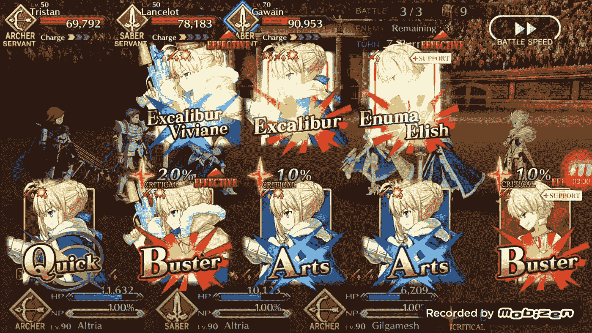
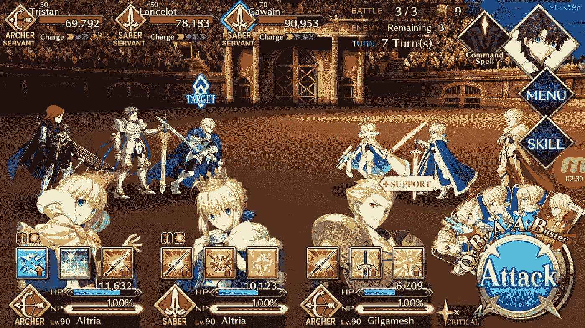
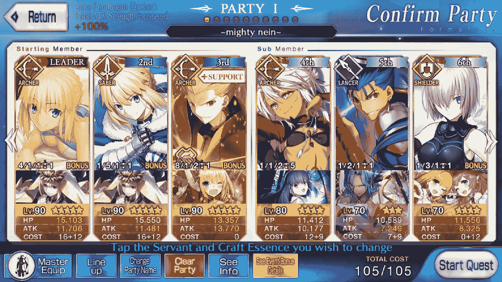
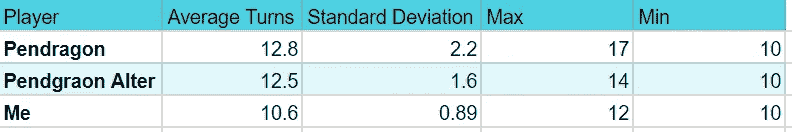
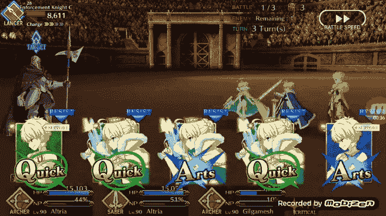
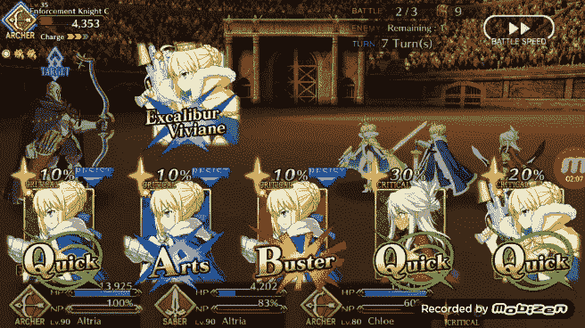

# 项目潘德雷肯第 3 部分:斗兽场摊牌

> 原文：<https://towardsdatascience.com/project-pendragon-part-3-the-colosseum-showdown-b7a855dd141?source=collection_archive---------19----------------------->

Screenshot from one of my speed runs for this blog post.

在我之前的两篇文章中，我讲述了我如何构建两个机器人来玩游戏《命运大令》(FGO)。第一个机器人([潘德雷肯](/project-pendragon-an-ai-bot-for-fate-grand-order-23f51b6e3268))利用三个 Pytorch CNNs，两个经典的和一个暹罗的，根据我建立的算法识别卡片并播放它们。第二个机器人([潘德雷肯·奥尔特](/project-pendragon-part-2-a-reinforcement-learning-bot-for-fate-grand-order-7bc75c87c4f3))在定制的游戏环境中接受训练，使用基于 Keras+Tensorflow 的强化学习，自行学习挑选卡片来玩 FGO。

我发现这两个机器人都能够完成大部分任务，包括一些 80-90 级以上的任务，这表明他们能够很好地扮演 FGO。然而，我还没有明确测试的是机器人在相互比较中表现如何，以及它们与人类玩家相比如何，在这种情况下就是我。

第三篇文章将介绍我对这两个机器人的性能进行对比测试的过程，以及我对如何改进它们的想法。就其本质而言，它不像前两篇文章那样具有技术性，而是对这两个机器人的性能进行定量和定性的比较。

由于 FGO 并不跟踪效率或分数之类的东西，我认为对这两个机器人进行基准测试的最佳方式是让它们使用相同的团队重复运行特定的任务。谁跑得更快，谁就是赢家。

# 指定时间和地点:

根据标题，你大概能猜到摊牌地点。我选择了 FGO 一年一度的尼禄节的最后一场比赛，选手们在罗马斗兽场与无数不同的敌人战斗。这个特殊任务的名字叫“回合”。回合是一个结束游戏水平 80+。除了推荐的高等级之外，这个任务的另一个困难之处是敌人类型的混合。

这种混合的敌人意味着你很难通过使用有利的职业配对来完成任务。所以这是我能为机器人选择的最难的任务之一，因为它们天生就必须靠暴力来完成。这个增加的难度意味着如果他们选择了糟糕的卡组合，他们将会受到游戏更严厉的惩罚。如果他们选择了不好的卡片组合，最好的情况是多花几个回合才能赢，或者在最坏的情况下会彻底输了，被消灭。

screenshot from the final battle of “The Rounds” quest. It is basically a battle against different knights of the round table. On several occasions the bots got stuck trying to defeat Tristan the red haired character on the left. He would fire his own ultimate several times and defeat multiple members of the bot teams and even managed to wipe out the Pendragon Bot on one occasion

# 选择团队

设计团队组成需要一点思考，这样他们才能发挥机器人的优势。一个人类玩家可能会尝试使用一个主要伤害制造者和两个辅助角色的组合。由于我的机器人不能使用辅助角色，在阵容中使用它们是相当无用的。因此，我决定在团队组成中尽可能多的增加力量，通过将三个最大等级的伤害处理者作为团队的主要部分，使之成为一场蛮力战斗。团队中的其他人是较弱的角色，我可以根据可用点数将他们放入团队中(见下图中的总成本 105/105)。

If anyone watches Critical Role, yes that is a Critical Role team name reference

# 规则和约束

因为我也是作为人类基准在这里竞争，所以解释机器人目前的限制很重要，这样我就可以匹配它们。

机器人有三个主要的限制，对我来说也很重要。

首先，我没有为机器人创造一种使用角色技能的方法。技能通常是强大的加成，可以叠加在一起放大攻击。我还没有为机器人建立一个使用技能的方法，因为让他们聪明地使用技能比仅仅编写脚本让他们在 x 回合使用技能要难一些。

第二，机器人从前到后依次清除敌人 1、2 和 3。玩家可以从技术上选择攻击哪个敌人，如果他们的手对某个特定的敌人没有优势，或者他们可能想攻击某个特定的角色，因为他们很危险。

最后，我给机器人添加了一个协议，他们在第十回合之前不会使用他们的终极能力，高贵幻影。我发现这大约是机器人进入最后一轮战斗所花的时间。如果我不包括这一点，机器人可能会在非常不合适的时候使用它们的 NPs，它们很大程度上被浪费了。这模拟了普通玩家的策略，在前两波攻击 NPs，在第三波(包含最后的 bosses)释放他们，以在一个回合中结束最后一波。

所以作为这场比赛中的人类选手，我也把自己限制在这些规则之内。快速重新总结如下

1.  不能使用角色技能
2.  不能选择敌人，必须从前到后攻击他们
3.  在第十回合前不能使用终极能力，高贵幻象。

将这些功能添加到机器人上会是潘德雷肯或潘德雷肯变更代码库项目的一个很酷的补充！

由于这个任务中的敌人和这些限制，我相信理论上一个团队完成这个任务的最低回合数是 10。如果所有的 3 个 NPs 没有被使用，那么这个任务可以很容易地再拖 4-5 个回合。

# 谁生，谁死，谁讲述你的故事？

为了比赛，我让两个机器人中的每一个和我自己使用上面的团队组成和指定的规则运行“回合”任务 10 次。

我花了几个小时运行这个任务 30 次，部分原因是因为我在这个博客系列的第 1 部分提到过，在长时间使用 Teamviewer 后，我的手机会发热。然而结果很有趣…

最初的潘德雷肯机器人和强化学习训练的潘德雷肯·奥尔特乍一看表现非常相似，平均分别为 12.8 圈和 12.5 圈。此外，每个机器人都能够在 10 次转向时达到该测试的理论最佳分数。有趣的是差异，你会注意到潘德雷肯机器人的标准差更大，因为分数范围从 10-17，而潘德雷肯奥尔特的分数范围在 10-14 之间。

我在运行这些测试时注意到，当它们能够满足最佳情况时，两个机器人都做得很好。开始的三个角色在前两波战斗中幸存下来，给他们的 NPs 充能，然后在第三波包含老板的战斗中立刻释放他们。这两个机器人有时能够做到这一点，因为它们都优先使用艺术卡来给它们的 NPs 充电。最初的潘德雷肯是因为我硬编码了那个行为，而潘德雷肯改动是因为它自己学习了那个行为，以便在我为它构建的定制环境中获得 80%的成功率。

这两个机器人之间的差异可以在他们无法在第 10 回合获胜时看到，这通常发生在一个或多个开始的三个角色在第 10 回合之前被选中并击败时。原始的潘德雷肯几次被逼得走投无路，所以在测试中，它的得分是 15 分和 17 分。特别是到了 17 强的那一轮，整个团队都被电脑 AI 消灭了。这可能被认为是最坏的结果。潘德雷肯·奥尔特拥有更紧密的分布，最高得分为 14 分，并且从未像最初的机器人那样被推回到墙上。

这种紧密的分布很可能是由于潘德雷肯·奥尔特从第二部的自定义环境中的强化训练中学到了更好的游戏性。特别是潘德雷肯·奥尔特学到的游戏玩法是通过优先使用艺术卡和巴斯特卡来最大化伤害和 NP 收益，同时降低第三种卡类型的优先级，快速卡。

类似于我在[第二部分](/project-pendragon-part-2-a-reinforcement-learning-bot-for-fate-grand-order-7bc75c87c4f3)中强调的，结合潘德雷肯·奥尔特对第一和第三张牌奖励的了解，下面可以看到一些艺术和巴斯特牌的优先排序的例子。

In this case Pendragon Alter chooses Arts cards in slots 1 and 3 and a buster card in slot 2\. This is a choice the maximizes NP gain and helps Pendragon Alter get to that final wave with all of its NPs charged

这并不是说快速卡不好，但它们的伤害更低，并且不会对 NPs 收取那么多费用。由于致命一击，它们创造了更高伤害的随机机会，并且需要团队定制使用它们。然而，我所效力的球队并不像某些组合那样受益于致命一击。所以潘德雷肯改变学习去优先化快速卡让它在使用我扮演的角色时比原来的潘德雷肯平均造成更多的伤害。

这种快速卡的去优先化在潘德雷肯圣坛中表现为能够在早期回合中击败一个额外的敌人，或者能够在战斗后期输出更多的伤害。相比之下，最初的潘德雷肯机器人会浪费一个关键的游戏后期回合，通过玩更多的快速卡来造成更少的伤害，从而使游戏拖得更长。这种差异使潘德雷肯·奥尔特的团队在整个战斗中免受额外的伤害，并帮助它在最初的机器人努力消灭对手并因此受到额外伤害时持续清除任务。

下面是一个早期的游戏例子，潘德雷肯·奥尔特在牌槽 1 和 3 中挑选两张艺术牌，然后用一张快速牌来填充槽 2。最初潘德雷肯会打出三张快速卡，由于快速卡的低伤害输出，我不确定它是否能够击败最后一个敌人。如果敌人没有被击败，那么机器人的团队将受到另一轮的伤害。

潘德雷肯·阿尔特能够造成更多伤害的另一个地方是有三张快速卡的情况。最初的潘德雷肯机器人会玩快速链，因为这是它被编码要做的。然而，潘德雷肯·阿尔特并不总是玩这种牌，而是玩高伤害牌或能帮助他更快建立 NP 标准的牌。

This is an example Pendgraon Alter playing a higher damage hand that still generates critical stars, rather than simply generating critical stars, but dealing relatively little damage.

# **结束语**

所以在这种情况下，经过强化学习训练的潘德雷肯·奥尔特击败了我亲手制作的潘德雷肯机器人。我认为这是一个非常酷的结果，因为在我建立强化学习环境之前，作为一个相当有经验的玩家，潘德雷肯·奥尔特比我更好地学会了如何玩 FGO。在那种环境下，我不得不研究 FGO 是如何计算伤害的，潘德雷肯·奥尔特可以从中学习。

虽然潘德雷肯·奥尔特击败了我最初的潘德雷肯机器人，但他们仍然没有超过人类玩家。即使有和他们一样的限制，我也能在十个回合中持续获胜。主要的区别是我能够应用更多的知识，比如利用职业亲和力系统，FGO 使用的石头剪刀布风格的职业系统，并确保我对所有角色的 NPs 充电，使他们都达到 100%，而不是像机器人一样不知道他们在充电谁的 NPs 就试图充电。

这些差异是机器人可以改进的地方，或者是游戏当前状态的更大背景。输入关于哪些卡对当前目标敌人有效的信息将有助于机器人优先使用哪些卡。让机器人可以检查他们团队中每个角色的当前状态，这可能有助于他们选择出牌来帮助收取特定角色的 NP，即使这是仅基于卡选择的次优移动。

如果我能在机器人中建立一些这样的功能，也许能在 FGO 达到接近人类的表现。这将是一个更崇高但也很有趣的更新，在未来我将不得不为此而努力。

感谢您阅读本系列，希望您也觉得有趣！