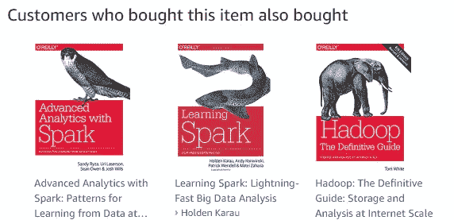

# 推荐系统原型

> 原文：<https://towardsdatascience.com/prototyping-a-recommendation-system-8e4dd4a50675?source=collection_archive---------2----------------------->

R、Java、Scala 和 SQL 的 Hello World



Amazon.com recommendations for “Mahout in Action”

Twitch 有许多由推荐系统驱动的产品，包括 VOD 推荐、剪辑推荐和类似的频道。在[将 Twitch 的一个推荐系统产品化](https://blog.twitch.tv/productizing-data-science-at-twitch-67a643fd8c44)之前，科学团队首先制作了一个推荐系统的原型，看看输出结果对我们的一个产品是否有用。建立推荐原型的成本可能很低，这篇文章提供了用四种不同的编程语言构建推荐系统的例子。

每个例子都使用不同的库来构建一个使用[协同过滤](https://en.wikipedia.org/wiki/Collaborative_filtering)的推荐系统原型。本文介绍了 Amazon.com 使用的协作过滤方法，而 [Mahout in Action](https://www.amazon.com/Mahout-Action-Sean-Owen/dp/1935182684) 则很好地概述了推荐系统中使用的不同算法和相似性度量。我还在 EverQuest Landmark 的市场上的 GDC 演讲中提供了推荐系统的概述。除了使用交替最小二乘法(ALS)的 Scala 示例之外，以下所有示例都使用了基于用户的协同过滤。

这些示例加载一个数据集，然后为 ID 为 101 的用户推荐五个商品。在这些例子中使用的合成数据集是用户购买游戏的集合，其中每一行包括用户 ID 和游戏 ID。所有示例的示例数据集和源代码可在 [GitHub](https://github.com/bgweber/Twitch/tree/master/Recommendations) 上获得。

如果 R 是你选择的编程语言，那么 [recommenderlab](https://cran.r-project.org/web/packages/recommenderlab/vignettes/recommenderlab.pdf) 软件包可以让你很容易地构建不同的推荐系统。该软件包在 CRAN 存储库中可用，可以使用标准的 *install.packages* 函数进行安装。加载后，该包提供了一个*推荐器*函数，它将数据矩阵和推荐方法作为输入。在这个脚本中，数据矩阵是从一个 CSV 文件中加载的，使用的方法是基于用户的协同过滤。然后使用*预测*函数为用户 101 检索五个项目。

```
install.packages("recommenderlab")
library(recommenderlab)matrix <- as(read.csv("Games.csv"),"realRatingMatrix")
model <-Recommender(matrix, method = "UBCF")
games <- predict(model, matrix["101",], n=5)
as(games, "list")
```

**Java:Apache Mahout** Mahout 是一个用 Java 实现的机器学习库，提供了多种协同过滤算法。Mahout 用一个 *UserNeighborhood* 类实现了基于用户的协作过滤，这个类指定了用户需要有多相似才能提供商品推荐的反馈。此示例使用 Tanimoto 相似性度量来查找用户之间的相似性，该度量计算共享游戏的数量(交集)与玩家拥有的游戏总数(联合)的比率。这个 CSV 文件被用作数据模型的输入，该数据模型然后被传递给推荐器对象。一旦推荐对象被实例化，就可以使用*推荐*方法为特定用户创建游戏推荐列表。

```
import org.apache.mahout.cf.taste.*;DataModel model = new FileDataModel(new File("Games.csv"));UserSimilarity similarity = new
  TanimotoCoefficientSimilarity(model);
UserNeighborhood neighborhood = 
  new ThresholdUserNeighborhood(0.1, similarity, model);
UserBasedRecommender recommender = 
  new GenericUserBasedRecommender(model, neighborhood, similarity);List recommendations = recommender.recommend(101, 5);
System.out.println(recommendations);
```

Apache Spark 是构建推荐系统越来越流行的工具之一，它提供了一个名为 MLlib 的内置库，其中包括一组机器学习算法。该示例首先运行一个查询来检索 UserID、GameID 元组格式的游戏购买，然后将数据框转换为 ALS 模型可以使用的评级集合。本例中使用了隐式数据反馈，这就是为什么使用了 *trainImplicit* 方法而不是 *train* 方法。训练方法的输入参数是游戏评级、要使用的潜在特征的数量、为矩阵分解执行的迭代次数、用于正则化的λ参数以及指定如何测量隐式评级的 alpha 参数。一旦模型被训练好，就可以使用*推荐产品*方法为用户检索推荐的游戏列表。

```
import org.apache.spark.mllib.recommendation._val games = sqlContext.read
    .format("com.databricks.spark.csv")
    .option("header", "false")  
    .option("inferSchema", "true")  
    .load("/Users/bgweber/spark/Games.csv")val ratings = games.rdd.map(row =>
  Rating(row.getInt(0), row.getInt(1), 1)
)val rank = 10
val model = ALS.trainImplicit(ratings, rank, 5, 0.01, 1)
val recommendations = model.recommendProducts(101, 5)
recommendations.foreach(println)
```

在将数据提取到运行 Spark 或 R 的机器上太慢或太贵的情况下，您可以使用 SQL 来构建一个推荐系统的原型。这种方法使用起来可能计算量很大，但是对于抽查一些结果是有用的。下面的例子使用 Spark SQL，因为我想让这个例子对于所提供的数据集是可重复的。代码的第一部分从 CSV 文件加载表，并将加载的数据框注册为临时表。示例的第二部分包括 SQL CTAs，它准备数据，然后为单个用户的游戏评分。内部查询通过查找重叠游戏的比率除以购买的游戏总数来计算用户之间的 Tanimoto 系数，外部查询返回每个检索到的游戏的总分数。

```
val games = sqlContext.read
    .format("com.databricks.spark.csv")
    .option("header", "false")  
    .option("inferSchema", "true")  
    .load("/Users/bgweber/spark/Games.csv")

games.registerTempTable("games")val result = sqlContext.sql("""
with users as (
    select _c0 as User_ID, sum(1) as NumGames 
    from games 
    group by 1 
)
, purchases as (
    select _c0 as User_ID, _c1 as Game_ID, NumGames 
    from games g
    join users u
      on g._c0 = u.User_ID
)
select u.User_ID, v.Game_ID, sum(Tanimoto) as GameWeight
from ( 
    select u.User_ID, v.User_ID as Other_User_ID,
        count(u.Game_ID)/(u.NumGames + v.NumGames - count(u.Game_ID)) as Tanimoto
    from purchases u
    Join purchases v
        on u.Game_ID = v.Game_ID 
    where u.User_ID = 101
    group by u.User_ID, v.User_ID, u.NumGames, v.NumGames
) u
Join purchases v
    on Other_User_ID = v.User_ID
group by u.User_ID, v.Game_ID
order by GameWeight desc
""")result.show(5)
```

**评估** 这些脚本提供了如何为特定用户检索游戏建议的示例。评估推荐器质量的一种方法是使用定性方法，其中为一小组用户手动检查推荐器的输出。另一种方法是使用不同库中包含的内置评估指标。例如，recommenderlab 和 MLlib 提供了用于计算 ROC 曲线的函数，这些曲线可用于评估不同的系统配置。在评估推荐者时，将推荐系统的性能与其他手工制作的方法进行比较也是一种很好的做法，例如畅销书排行榜。