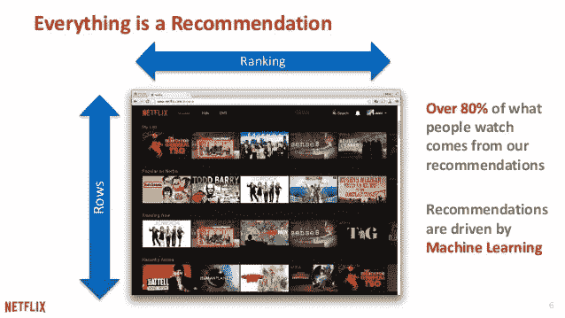
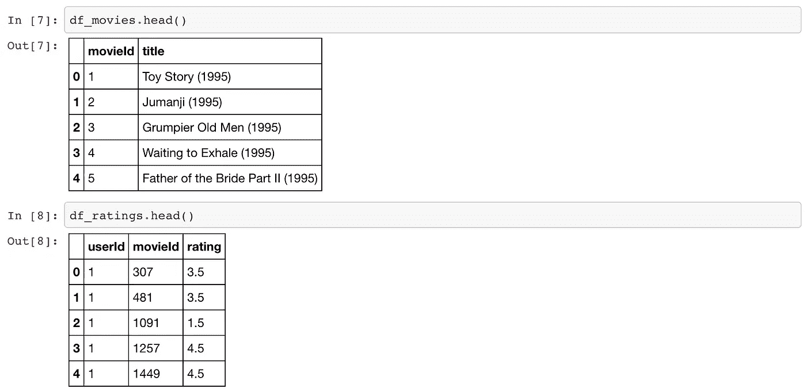
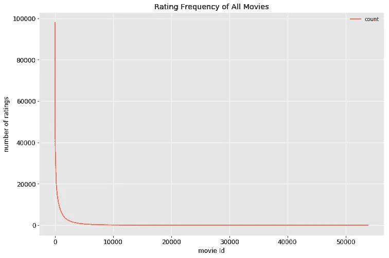
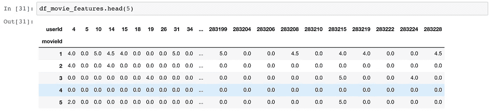
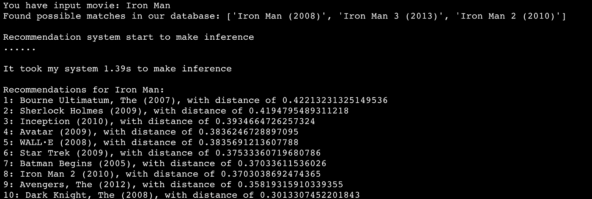
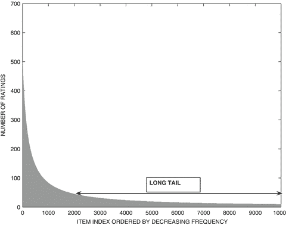

# 一步一步建立推荐系统原型第 1 部分:基于 KNN 项目的协同过滤

> 原文：<https://towardsdatascience.com/prototyping-a-recommender-system-step-by-step-part-1-knn-item-based-collaborative-filtering-637969614ea?source=collection_archive---------1----------------------->



Movie Recommender Systems

第二部分*推荐系统*可以在这里找到[](/prototyping-a-recommender-system-step-by-step-part-2-alternating-least-square-als-matrix-4a76c58714a1)

# *推荐系统*

*我们今天使用的大多数互联网产品都是由推荐系统驱动的。Youtube、网飞、亚马逊、Pinterest 和许多其他互联网产品都依靠推荐系统来过滤数百万内容，并向用户提供个性化推荐。推荐系统得到了充分的研究，并被证明为互联网企业及其消费者提供了巨大的价值。事实上，当我听到网飞在 2009 年向一个开发团队颁发 100 万美元奖金的消息时，我感到非常震惊，因为一种算法将公司推荐系统的准确率提高了 10%。*

**

*Netflix Prize Leader Board*

*尽管推荐系统是那些价值数十亿美元的生意的秘密来源，但推荐系统的原型可以是非常低的成本，并且不需要科学家团队。你其实可以为自己开发自己的个性化推荐器。只需要一些基本的机器学习技术和 Python 中的实现。在这篇文章中，我们将从头开始，并通过如何原型最小可行的电影推荐过程。*

# *方法*

*推荐系统可以大致分为三类:**基于内容的系统**、**协同过滤系统**和**混合系统**(使用其他两种系统的组合)。*

**

*[An Overview of Recommendation Systems](http://datameetsmedia.com/an-overview-of-recommendation-systems/)*

***基于内容的方法**利用项目的一系列离散特征来推荐具有相似属性的附加项目。

**协同过滤方法**根据用户过去的行为(先前购买或选择的项目和/或对这些项目给出的数字评级)以及其他用户做出的类似决定来建立模型。该模型然后被用于预测用户可能感兴趣的项目(或项目的评级)。

**混合方法**结合了前两种方法。大多数企业可能在他们的产品推荐系统中使用混合方法。*

*在这篇文章中，我们将从最常见的方法**协同过滤**开始，用一个简单的普通版本。在以后的文章中，我们将开发更先进和复杂的方法来进一步提高推荐器的性能和可伸缩性。*

# *让我们建立一个电影推荐器*

*我喜欢看电影，所以我决定建立一个电影推荐器。看看我的推荐者对我的电影偏好有多了解，这将是一件很酷的事情。我们将回顾我们的电影数据集，ML 模型的选择，如何评估我们的推荐器，最后我将给出一些关于这种方法的优点和缺点。*

# *数据*

*有时候很难找到一个好的数据集来开始。不过，我还是鼓励你去发现有趣的数据集，建立自己的推荐器。我发现在这个 [*页面*](https://gist.github.com/entaroadun/1653794) 上有一些不错的数据集。除了建立一个电影推荐器，建立一个食物或约会推荐器也很有趣。只是一个想法！

为了构建一个电影推荐器，我选择 [MovieLens 数据集](https://grouplens.org/datasets/movielens/latest/)。它包含 58，098 部电影的 27，753，444 个评级和 1，108，997 个标签应用。这些数据是由 283，228 名用户在 1995 年 1 月 9 日至 2018 年 9 月 26 日之间创建的。等级从 1 到 5。

我们将只使用来自 MovieLens 数据集的两个文件:`ratings.csv`和`movies.csv`。分级数据提供了用户对电影的分级。每行有三个字段:`['userId', 'movieId', 'rating']`。每一行都可以看作是用户和电影之间交互的记录。电影数据为收视率数据中的每个`'movieId'`提供电影标题和类型。*

```
*import os
import pandas as pd# configure file path
data_path = os.path.join(os.environ['DATA_PATH'], 'MovieLens')
movies_filename = 'movies.csv'
ratings_filename = 'ratings.csv'# read data
df_movies = pd.read_csv(
    os.path.join(data_path, movies_filename),
    usecols=['movieId', 'title'],
    dtype={'movieId': 'int32', 'title': 'str'})

df_ratings = pd.read_csv(
    os.path.join(data_path, ratings_filename),
    usecols=['userId', 'movieId', 'rating'],
    dtype={'userId': 'int32', 'movieId': 'int32', 'rating': 'float32'})*
```

*让我们快速看一下这两个数据集:电影和收视率*

**

# *数据过滤*

*在现实世界中，从电影评级等显式反馈中收集的数据可能非常稀少，数据点主要从非常受欢迎的项目(电影)和高度参与的用户中收集。大量鲜为人知的项目(电影)根本没有评级。我们来看一下电影收视率分布图。*

**

*Rating Frequency is a “long tail” distribution. Only a small fraction of the items are rated frequently. Such items are referred to as popular items. The vast majority of items are rated rarely.*

*如果我们放大或以对数标度绘制它，我们可以发现 58，098 部电影中只有大约 13，500 部获得了超过 100 个用户的评级，其余大部分都很少为人所知，很少或没有用户互动。这些稀疏的评级对于大多数用户来说不太可预测，并且对于喜欢晦涩电影的个人来说高度敏感，这使得模式非常嘈杂。*

*大多数模型基于用户评级模式进行推荐。为了消除噪声模式并避免由于大数据集导致的“内存错误”,我们将过滤我们的分级数据帧以仅显示流行电影。过滤后，我们在收视率数据中剩下 13，500 部电影，这对推荐模型来说足够了。*

# *建模*

***协同过滤**系统利用用户的动作推荐其他电影。通常，它们可以是基于用户的，也可以是基于项目的。**基于项目的方法**通常优于基于用户的方法**。由于用户的动态特性，基于用户的方法通常更难扩展，而项目通常不会发生太大变化，并且基于项目的方法通常可以离线计算并提供服务，而无需不断地重新训练。***

***为了实现基于**项目的协同过滤，** KNN 是一个完美的模型，也是推荐系统开发的一个非常好的基线。但是什么是 KNN 呢？ **KNN** 是一种**非参数的、懒惰的**学习方法。它使用一个数据库，其中的数据点被分成几个聚类，以便对新样本进行推断。***

***KNN 不对底层数据分布做任何假设，但它依赖于**项** **特征相似度**。当 KNN 对一部电影做出推断时，KNN 将计算目标电影与其数据库中所有其他电影之间的“距离”，然后对其距离进行排名，并返回前 K 部最近邻电影作为最相似的电影推荐。***

******

***Illustration of how KNN makes classification about new sample***

***等等，但是我们如何把收视率的数据框架输入 KNN 模型呢？首先，我们需要将评级的数据框架转换成 KNN 模型可以使用的适当格式。我们希望数据在一个`m x n`数组中，其中`m`是电影数量，`n`是用户数量。为了重塑收视率的数据框架，我们将`pivot`将数据框架转换为宽格式，电影作为行，用户作为列。然后，我们将使用`0` s 来填充缺失的观察值，因为我们将执行线性代数运算(计算向量之间的距离)。让我们称这个新的数据帧为“电影特写数据帧”。***

***我们的电影特征数据帧是一个极其稀疏的矩阵，形状为`13,500 x 113,291`。我们绝对不希望将大部分数据类型为`float32`的`0`数据全部提供给 KNN。为了更有效的计算和更少的内存占用，我们需要将数据帧的值转换成一个 **scipy 稀疏矩阵**。***

```
***from scipy.sparse import csr_matrix# pivot ratings into movie features
df_movie_features = df_ratings.pivot(
    index='movieId',
    columns='userId',
    values='rating'
).fillna(0)*# convert dataframe of movie features to scipy sparse matrix*
mat_movie_features = csr_matrix(df_movie_features.values)***
```

******

***现在我们的训练数据有一个非常高的维度。如果在目标函数中使用“欧氏距离”，KNN 的性能将遭受 [**维数灾难**](https://en.wikipedia.org/wiki/Curse_of_dimensionality) 。**欧几里德距离**在高维空间中是没有帮助的，因为所有向量与搜索查询向量(目标电影的特征)几乎是等距的。相反，我们将使用**余弦相似度**进行最近邻搜索。还有另一种处理高维数据中最近邻搜索的流行方法， [**位置敏感哈希**](https://en.wikipedia.org/wiki/Locality-sensitive_hashing) ，我们不会在本文中讨论。***

# ***来做一些电影推荐吧***

***在我们对数据进行预处理并将收视率的数据帧转换成电影特征的稀疏矩阵之后，我们需要用适当的超参数来配置我们的 KNN 模型:***

```
***from sklearn.neighbors import NearestNeighborsmodel_knn = NearestNeighbors(metric='cosine', algorithm='brute', n_neighbors=20, n_jobs=-1)***
```

***最后可以给自己做一些电影推荐。让我们在 KNN 推荐器中实现一个`make_recommendations`方法。***

***snippet of our final step in KNN recommender’s implementation***

***这个片段演示了我们推荐器实现中的`make_recommendations`方法。请在我的 [**GitHub Repo**](https://github.com/KevinLiao159/MyDataSciencePortfolio/blob/master/movie_recommender/src/knn_recommender.py) 中找到推荐器应用的详细源代码。***

***如果你去我的[源代码页面](https://github.com/KevinLiao159/MyDataSciencePortfolio/blob/master/movie_recommender/src/knn_recommender.py)，你会看到我把一个 KNN 推荐系统放在一个脚本中，作为一个小的 python 应用程序。我将我的推荐器应用程序参数化，并暴露了两个选项，`movie_name`和`top_n`，供用户使用。现在想请我的推荐人推荐 10 部和《钢铁侠》最相似的电影。所以我们可以在 bash 荐里面运行下面的终端(linux/mac):(指令的命令可以在 [*这里找到*](https://github.com/KevinLiao159/MyDataSciencePortfolio/blob/af84b7162e320ee72622265b3b2857a8dc772f55/movie_recommender/src/knn_recommender.py#L224) )***

```
***python src/knn_recommender.py --movie_name "Iron Man" --top_n 10***
```

******

***List of movie recommendations based on my favorite movie: “Iron Man”***

***万岁！！我们的推荐系统确实有效！！现在我们有自己的电影推荐人了。***

# ***一些想法***

***乍一看，我的推荐人似乎给我留下了深刻的印象。我喜欢它推荐的所有电影。但如果我们真的仔细想想，它们都是 2008 年与《钢铁侠》同期非常受欢迎的电影。很有可能当时看《钢铁侠》的人大概也看了一些推荐的电影。这份电影列表不仅在同一时代很受欢迎，而且有着非常相似的类型和主题。***

***作为一个电影爱好者，我大概是在寻找没看过的电影或者不同题材的电影。推荐不同主题的电影允许用户探索不同的口味，并保持用户对推荐产品的兴趣。另一方面，缺乏多样性会让用户感到厌烦，对产品的参与度降低。

所以我们才有效地识别出**中存在的两个缺点**:***

1.  ***人气偏向:推荐者倾向于推荐人气商品***
2.  ***项目冷启动问题:推荐器无法推荐新的或不太为人所知的项目，因为项目没有或很少交互***

***回想一下电影评分频率分布图:***

******

***“Long Tail” Property in Rating Frequency Distribution***

***只有很小一部分电影有很多用户互动，而“长尾”电影则没有。在商业环境中，高频商品往往是相对有竞争力的商品，对商家来说利润很少。另一方面，频率较低的项目利润空间较大。***

***我们如何改进我们的电影推荐系统来解决以上两个缺点？我们将在下一篇文章中介绍一种更复杂的方法来改进电影推荐系统: [**一步一步建立推荐系统原型第二部分:协同过滤中的交替最小二乘(ALS)矩阵分解**](https://medium.com/@keliao/prototyping-a-recommender-system-step-by-step-part-2-alternating-least-square-als-matrix-4a76c58714a1)***

# ***摘要***

***在这篇文章中，我们简要介绍了推荐系统中的三种方法:基于内容的、协同过滤的和混合的。我们在 **KNN** 学习了如何通过几个步骤来原型化基于**项目的协同过滤**！这篇博文的 **Jupyter 笔记本版本**可以在 [*这里*](https://github.com/KevinLiao159/MyDataSciencePortfolio/blob/master/movie_recommender/movie_recommendation_using_KNN.ipynb) 找到。如果你想玩我的**源码**，可以在这里 找到[。

在我的下一篇文章中，我们将讨论推荐系统中更高级的主题，并利用 **Spark** 来构建一个可扩展的推荐系统。敬请期待！在那之前，尽情享受机器学习和推荐器吧！](https://github.com/KevinLiao159/MyDataSciencePortfolio/blob/master/movie_recommender/src/knn_recommender.py)***

***喜欢你读的书吗？在我的 Github 查看更多数据科学/机器学习项目: [***凯文的数据科学作品集***](https://github.com/KevinLiao159/MyDataSciencePortfolio)***