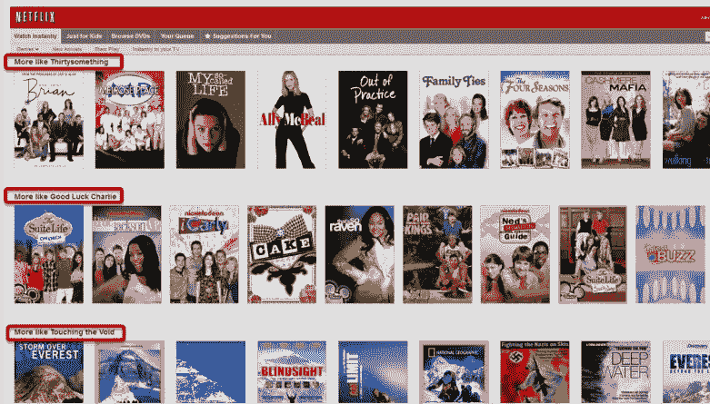
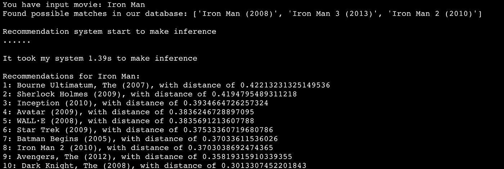
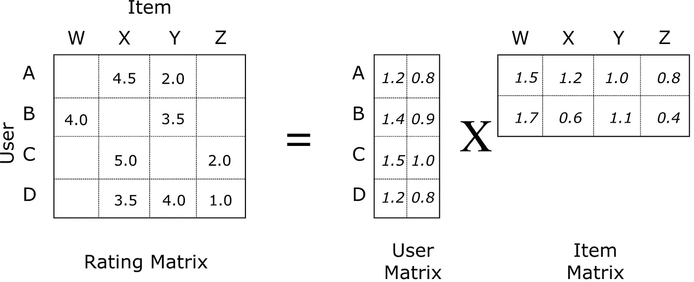
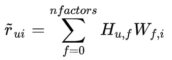
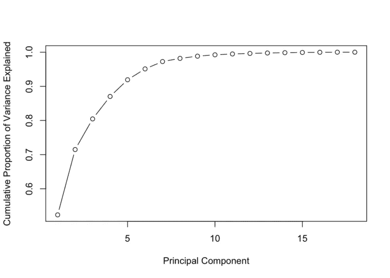
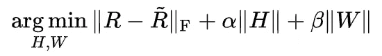
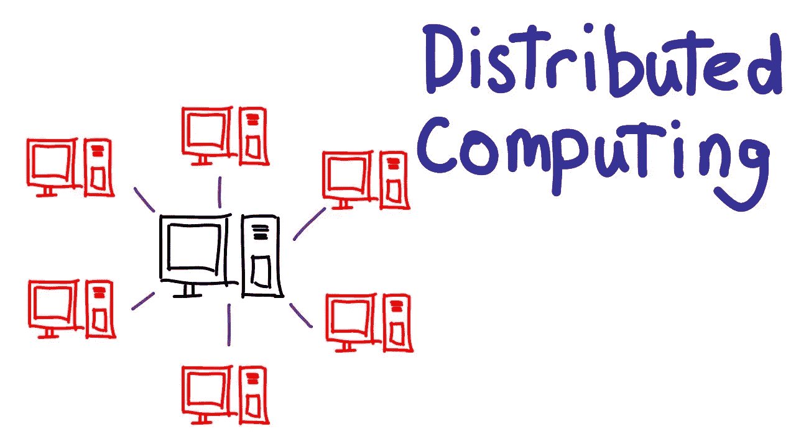
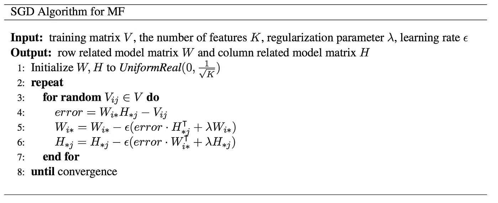

# 一步一步建立推荐系统的原型第二部分:协同过滤中的交替最小二乘矩阵分解

> 原文：<https://towardsdatascience.com/prototyping-a-recommender-system-step-by-step-part-2-alternating-least-square-als-matrix-4a76c58714a1?source=collection_archive---------1----------------------->



Item Based Collaborative Filtering Movie Recommender

第一部分的*推荐系统*可以在这里找到[](/prototyping-a-recommender-system-step-by-step-part-1-knn-item-based-collaborative-filtering-637969614ea)

*在上一篇[](https://medium.com/@keliao/prototyping-a-recommender-system-step-by-step-part-1-knn-item-based-collaborative-filtering-637969614ea)*文章中，我们讨论了很多如何构建我们自己的推荐系统，并且用 **Pandas** 和 **Scikit-learn** 实现了一个 **KNN 基于项目的协同过滤**电影推荐器。KNN 推荐系统的源代码可以在我的 [*Github repo*](https://github.com/KevinLiao159/MyDataSciencePortfolio/blob/master/movie_recommender/src/knn_recommender.py) 中找到。

在本帖中，我们将讨论如何用更复杂的机器学习技术来改进我们的电影推荐系统:**矩阵分解**。在这篇文章的后面，我们将讨论为什么我们要在协同过滤中使用矩阵分解，什么是矩阵分解，它是如何在 **Spark** 中实现的。**

# **基于项目的协同过滤的缺点**

****

**Output of KNN Item Based Collaborative Filtering Recommender From Previous Post**

**在 [*上一篇*](https://medium.com/@keliao/prototyping-a-recommender-system-step-by-step-part-1-knn-item-based-collaborative-filtering-637969614ea) 的最后一节，我们向模特询问了一些电影推荐。在我们评估了推荐的电影列表后，我们很快发现了 KNN 方法的两个明显的局限性。一是“人气偏差”，二是“物品冷启动问题”。如果底层的训练数据太大而不适合一台机器，就会有另一个限制，即“可伸缩性问题”**

*   ****流行偏好:**指系统推荐互动最多的电影，没有任何个性化**
*   ****项目冷启动问题**:指添加到目录中的电影没有互动或者互动很少，而推荐者依靠电影的互动来进行推荐**
*   ****可扩展性问题**:指当越来越多的用户和电影加入我们的数据库时，缺乏扩展到更大数据集的能力**

**以上三点对于协同过滤推荐系统来说都是非常典型的挑战。它们与用户-电影(或电影-用户)交互矩阵一起自然到达，其中每个条目记录用户`i`和电影`j`的交互。在现实世界中，绝大多数电影很少甚至根本没有得到用户的评价。我们看到的是一个极其稀疏的矩阵，99%以上的条目都缺少值。**

****

**Sparse Rating Data**

**有了这样的稀疏矩阵，有哪些 ML 算法可以训练出来，可靠的做出推断？为了找到问题的解决方案，我们正在有效地解决数据稀疏问题。**

# **矩阵分解**

**在协同过滤中，**矩阵分解**是针对稀疏数据问题的最先进的解决方案，尽管它是从 [*Netflix 奖挑战赛*](https://www.netflixprize.com/) 开始广为人知的。**

****

**Matrix Factorization of Movie Ratings Data**

**什么是矩阵分解？矩阵分解只是线性代数中矩阵的一系列数学运算。具体地说，矩阵分解是将矩阵分解成矩阵的乘积。在协同过滤的情况下，**矩阵分解**算法通过**将**用户-项目交互矩阵分解为两个**低维度矩形矩阵**的乘积来工作。一个矩阵可以被视为用户矩阵，其中行代表用户，列是潜在因素。另一个矩阵是项目矩阵，其中行是潜在因素，列代表项目。**

**矩阵分解如何解决我们的问题？**

1.  **模型学习将评级矩阵分解为用户和电影表示，这允许模型为用户预测更好的个性化电影评级**
2.  **通过矩阵分解，不太出名的电影可以像受欢迎的电影一样具有丰富的潜在表示，这提高了推荐器推荐不太出名的电影的能力**

**在稀疏用户-项目交互矩阵中，用户`u`将给予项目`i`的预测评级被计算为:**

****

**where H is user matrix, W is item matrix**

**用户`u`对项目`i`的评分可以表示为用户潜在向量和项目潜在向量的点积。**

**注意，在上面的公式中，**潜在因素**的数量可以通过交叉验证来调整。**潜在因素**是用户-项目交互矩阵投影出的低维潜在空间中的特征。矩阵分解背后的思想是使用潜在因素在低得多的维度空间中表示用户偏好或电影主题。矩阵分解是机器学习中非常有效的**降维**技术之一。**

****

**Variance Explained By Components In PCA**

**很像 **PCA** 中**成分**的概念，潜在因素的数量决定了我们想要在一个低维空间中存储的抽象信息量。具有一个潜在因子的矩阵分解相当于*最受欢迎的*或*最受欢迎的*推荐器(例如，推荐具有最多交互而没有任何个性化的项目)。增加潜在因素的数量将改善个性化，直到因素的数量变得太高，此时模型开始过度拟合。避免过度拟合的常见策略是将**正则化项**添加到目标函数中。**

**矩阵分解的目的是最小化真实评级和预测评级之间的误差:**

****

**where H is user matrix, W is item matrix**

**一旦我们有了目标函数，我们只需要一个训练例程(例如梯度下降)来完成一个矩阵分解算法的实现。这个实现实际上叫做 **Funk SVD** 。它是以西蒙·芬克的名字命名的，他在 2006 年网飞奖挑战中与研究界分享了他的发现。**

****

**Scaling Machine Learning Applications With Distributed Computing**

**尽管 Funk SVD 在那段时间对于单机的矩阵分解非常有效，但是随着今天数据量的增长，它不具有可伸缩性。对于兆兆字节甚至千兆字节的数据，不可能将如此大的数据加载到一台机器上。因此，我们需要一个机器学习模型(或框架)，它可以在机器集群中传播的数据集上进行训练。**

# **带 Spark ML 的交替最小二乘法(ALS)**

**交替最小二乘法(ALS)也是一种矩阵分解算法，它以并行方式运行。ALS 是在 Apache Spark ML 中实现的，是为大规模协同过滤问题而构建的。ALS 在解决收视率数据的可扩展性和稀疏性方面做得很好，它很简单，可以很好地扩展到非常大的数据集。**

**ALS 背后的一些高层次想法是:**

*   **其目标函数与 Funk SVD 略有不同:ALS 使用 **L2 正则化**，而 Funk 使用 **L1 正则化****
*   **其训练套路不同:ALS 最小化**两个损失函数交替**；它首先固定用户矩阵，然后用项目矩阵进行梯度下降；然后，它保持项目矩阵固定，并与用户矩阵运行梯度下降**
*   **它的可伸缩性:ALS 在来自一个机器集群的底层训练数据的多个分区上以**并行**运行它的梯度下降**

****

**Pseudocode For SGD In Matrix Factorization**

**如果你有兴趣了解更多关于 ALS 的知识，可以在本文中找到更多细节:[*Netflix 奖大规模并行协同过滤*](https://endymecy.gitbooks.io/spark-ml-source-analysis/content/%E6%8E%A8%E8%8D%90/papers/Large-scale%20Parallel%20Collaborative%20Filtering%20the%20Netflix%20Prize.pdf)**

**就像其他机器学习算法一样，ALS 也有自己的一套超参数。我们可能想通过**保持验证**或**交叉验证**来调整它的超参数。**

**交替最小二乘法(ALS)中最重要的超参数:**

*   **maxIter:要运行的最大迭代次数(默认为 10)**
*   **等级:模型中潜在因素的数量(默认为 10)**
*   **reg param:ALS 中的正则化参数(默认为 1.0)**

**超参数调整是许多机器学习项目中高度重复的任务。我们可以将它编码到一个函数中，以加速调优迭代。**

**经过调优，我们找到了超参数的最佳选择:`maxIter=10`、`regParam=0.05`、`rank=20`**

# **实施 ALS 推荐系统**

**现在我们知道我们有一个精彩的电影推荐模型，接下来的问题是:我们如何将我们的精彩模型产品化为推荐系统？机器学习模型产品化是另一个大话题，我不会详细谈论它。在这篇文章中，我将展示如何为 ALS 推荐者建立一个 MVP(最小可行产品)版本。**

**要将模型产品化，我们需要围绕模型建立工作流。典型的 ML 工作流程大致从通过一组预定义的 ETL 作业、离线/在线模型训练的数据准备开始，然后将训练好的模型吸收到 web 服务中用于生产。在我们的例子中，我们将构建一个非常简单的电影推荐器来完成这项工作。我们的工作流程如下:**

1.  **新用户输入他/她喜欢的电影，然后系统为该模型创建新的用户-电影交互样本**
2.  **系统根据新输入的数据重新训练 ALS 模型**
3.  **系统创建用于推理的电影数据(在我的例子中，我从数据中抽取所有电影)**
4.  **系统为用户对所有电影进行分级预测**
5.  **系统基于电影分级预测的排名为该用户输出前 N 个电影推荐**

**下面是我们的 MVP 推荐系统的一小段源代码:**

**snippet of our final step in ALS recommender’s implementation**

**这个片段演示了我们推荐器实现中的`make_recommendations`方法。请在我的 [*GitHub Repo*](https://github.com/KevinLiao159/MyDataSciencePortfolio/blob/master/movie_recommender/src/als_recommender.py) 中找到推荐器应用的详细源代码。**

# **我们来做一些推荐吧**

**一旦我们在 python 脚本中将 ALS 推荐系统实现为一个小的 **Pyspark** 程序，我们就可以将我们的 spark 应用程序提交到具有客户端部署模式或集群部署模式的集群，并享受分布式计算的强大功能。**

**最后，我们完成了技术细节和实现。现在让我们向我们的推荐人要一些电影推荐。我将假装一个新用户，将我最喜欢的电影“钢铁侠”再次输入这个新的推荐系统。看看它给我推荐了哪些电影。希望它们不是我之前看过很多遍的热门电影列表。**

**出于演示的目的，我通过在终端中运行以下命令在本地提交我的 spark 应用程序:(命令的指令可以在这里找到)**

```
**spark-submit --master local[4] --driver-memory 4g 
             --executor-memory 8g src/als_recommender.py 
             --movie_name "Iron Man" --top_n 10**
```

****

**List of Movie Recommendations Based On My Favorite Movie: “Iron Man”**

**耶！！用 Spark 成功运行我们的电影推荐器。**

**这份新的电影推荐名单与之前的 KNN 推荐名单完全不同，非常有趣！！我从未看过这份新名单中的任何一部电影。我发现新的推荐者向我推荐不寻常的电影非常令人惊讶。对于其他用户来说，它们可能太不寻常了，这是有问题的。**

**进一步改进我们的电影推荐系统的一个想法是将这个新的电影推荐列表与 KNN 推荐器的先前列表混合。我们基本上实现了一个混合推荐系统，这个混合推荐系统可以向用户提供流行和不太了解的内容。**

# **摘要**

**在这篇文章中，我们介绍了如何用**矩阵分解**来改进协同过滤推荐系统。我们了解到矩阵分解可以解决协同过滤中的“流行偏见”和“项目冷启动”问题。我们还利用 **Spark ML** 实现了使用**交替最小二乘(ALS)** 的分布式推荐系统。这篇博文的 **Jupyter 笔记本版本**可以在这里 找到 [*。如果你想玩我的**源码**，可以在这里*](https://github.com/KevinLiao159/MyDataSciencePortfolio/blob/master/movie_recommender/movie_recommendation_using_ALS.ipynb) 找到[。](https://github.com/KevinLiao159/MyDataSciencePortfolio/blob/master/movie_recommender/src/als_recommender.py)**

**在我的下一篇文章中，我们将深入探讨矩阵分解技术。我们可以用 **Keras 中的**神经网络**实现开发一个更一般化形式的矩阵分解模型。**敬请期待！在那之前，尽情享受机器学习和推荐器吧！**

**喜欢你读的书吗？在我的 Github 查看更多数据科学/机器学习项目: [***凯文的数据科学作品集***](https://github.com/KevinLiao159/MyDataSciencePortfolio)**