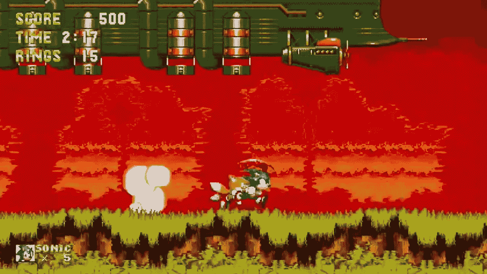
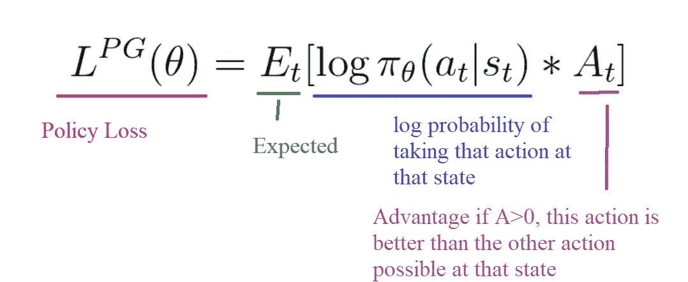
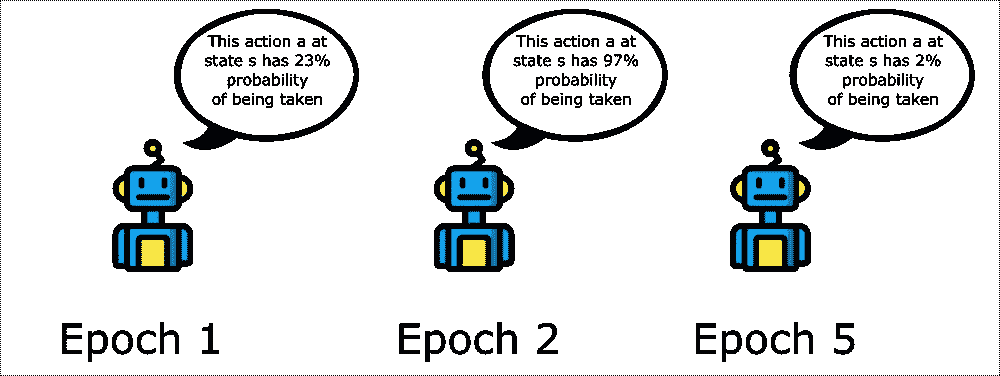
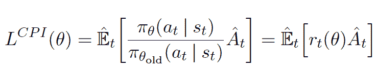
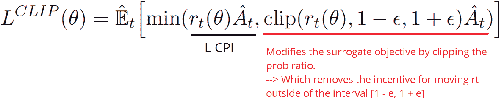
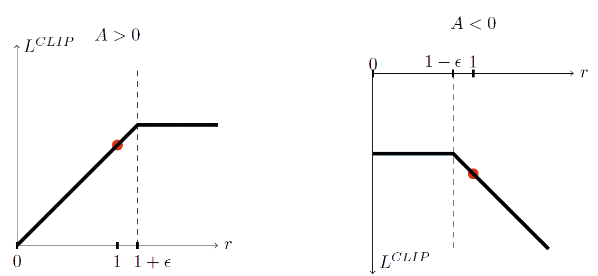
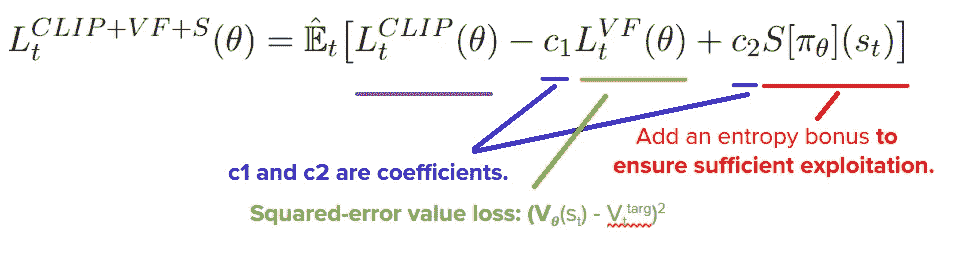

# 刺猬索尼克 2 和 3 的近似策略优化(PPO)

> 原文：<https://towardsdatascience.com/proximal-policy-optimization-ppo-with-sonic-the-hedgehog-2-and-3-c9c21dbed5e?source=collection_archive---------2----------------------->

**我们推出了新的免费、更新、** [**从初学者到专家的深度强化学习课程，用拥抱面对🤗**](https://huggingface.co/deep-rl-course/unit0/introduction?fw=pt)

👉新版教程:[https://huggingface.co/deep-rl-course/unit0/introduction](https://huggingface.co/deep-rl-course/unit0/introduction?fw=pt)

**下面的章节是以前的版本**，新版本在这里👉[https://huggingface.co/deep-rl-course/unit5/introduction?fw=pt](https://huggingface.co/deep-rl-course/unit5/introduction?fw=pt)

**我们推出了新的免费、更新、** [**从初学者到专家的深度强化学习课程，带着拥抱脸🤗**](https://huggingface.co/deep-rl-course/unit0/introduction?fw=pt)

👉新版教程:[https://huggingface.co/deep-rl-course/unit0/introduction](https://huggingface.co/deep-rl-course/unit0/introduction?fw=pt)

**下面的章节是以前的版本**，新版本在这里👉[https://huggingface.co/deep-rl-course/unit5/introduction?fw=pt](https://huggingface.co/deep-rl-course/unit5/introduction?fw=pt)

几周前，OpenAI 在深度强化学习方面取得了突破。他们用 OpenAI five 击败了一些世界上最好的 Dota2 玩家，open ai five 是一个由 5 名代理组成的团队。不幸的是，他们在第二次经历中失败了。

Dota2

这一突破之所以成为可能，得益于强大的硬件架构和使用最先进的算法:PPO 又名近似策略优化。

最近策略优化的中心思想是避免太大的策略更新。为了做到这一点，我们使用一个比率来告诉我们新旧政策之间的差异，并将该比率从 0.8 削减到 1.2。这样做将确保我们的政策更新不会太大。

此外，PPO 引入了另一项创新，即通过在小批量取样中运行 K 个梯度下降周期来训练药剂。如果你读过我关于 A2C 和刺猬索尼克的文章，我们已经实现了。

所以今天，我们将深入了解 PPO 架构，我们将实现一个近似策略优化(PPO)代理，它可以学习玩刺猬索尼克 1、2 和 3！

然而，如果你想能够理解 PPO，你需要首先掌握 A2C，如果不是这样，[在这里阅读 A2C 教程](https://medium.freecodecamp.org/an-intro-to-advantage-actor-critic-methods-lets-play-sonic-the-hedgehog-86d6240171d)。

# 政策梯度目标函数的问题

[还记得我们学习政策梯度](https://medium.freecodecamp.org/an-introduction-to-policy-gradients-with-cartpole-and-doom-495b5ef2207f)的时候，我们学习了政策目标函数或者你更喜欢政策损失。

这个想法是，通过对这个函数采取梯度上升步骤(这相当于对这个函数的负值采取梯度下降),我们将**推动我们的代理人采取导致更高回报的行动，并避免不良行动。**

然而，问题来自于步长:

*   太小，**训练过程太慢**
*   过高，**训练中可变性太大。**

When there is enormous variability in the training (Robot Icons made by Smashicons)

这就是 PPO 有用的地方，其思想是 PPO 通过限制每个训练步骤的策略更新来提高演员训练的稳定性。

为了能够做到这一点，PPO 引入了一个新的目标函数，称为“削波替代目标函数”，该函数将使用一个削波将政策变化限制在一个小范围内。

# 引入截取的替代目标函数

首先，正如本[堆栈溢出答案](https://stackoverflow.com/questions/46422845/what-is-the-way-to-understand-proximal-policy-optimization-algorithm-in-rl)中所解释的，我们可以使用**当前策略下的操作概率除以先前策略下的操作概率，而不是使用 log pi 来跟踪操作的影响。**

Taken from [PPO paper](https://arxiv.org/abs/1707.06347)

我们可以看到 rt(θ)表示新旧策略之间的概率比:

*   如果 rt(θ) >1，则意味着**动作在当前策略中比在旧策略中更有可能发生。**
*   如果 rt(θ)在 0 和 1 之间:这意味着当前政策采取**行动的可能性小于旧政策。**

因此，我们新的目标函数可以是:

Taken from [PPO paper](https://arxiv.org/abs/1707.06347)

然而，在没有约束的情况下，如果所采取的行动在我们当前的政策中比在我们以前的政策中更有可能，**这将导致大的政策梯度步骤**，并导致**过度的政策更新。**

因此，我们需要通过惩罚导致比率偏离 1 的变化来约束这个目标函数(在纸上比率只能从 0.8 变化到 1.2)。**通过这样做，我们将确保不会有太大的政策更新，因为新政策不能与旧政策相差太大。**

为此，我们有两种解决方案:

*   TRPO(信赖域策略优化)使用目标函数之外的 KL 散度约束来约束策略更新。但是这种方法**实现起来非常复杂，并且需要更多的计算时间。**
*   PPO 修剪概率比直接在目标函数与其修剪代理目标函数。

The Clipped Surrogate Objective function

对于截取的替代目标函数，我们有两个概率比，一个是非截取的，一个是在一个范围内截取的(在[1-𝜖，1+𝜖]之间)，ε是一个超参数，它帮助我们定义这个截取范围(在论文中𝜖 = 0.2)。

然后，我们取削波和非削波目标的最小值，**,因此最终目标是未削波目标的下界(悲观界)。**

因此，我们有两种情况要考虑:

Taken from [PPO paper](https://arxiv.org/abs/1707.06347)

*   **情况 1:优势为> 0** 时

如果ȃt > 0**，**则表示**动作优于该状态下所有动作的平均值**。因此，我们应该鼓励我们的新政策，以增加在该州采取行动的可能性。

因此，这意味着增加 r(t)，因为我们增加了新策略的概率(因为 At *新策略)和分母旧策略保持不变。

Taken from [PPO paper](https://arxiv.org/abs/1707.06347)

然而，由于修剪，rt(𝜽)只会增长到和 1+𝜖.一样多这意味着，与旧策略相比，这一行动的可能性不可能增加 100 倍(因为剪辑)。

为什么？，因为我们不想过多地更新我们的政策。原因很简单，记住在那种状态下采取行动只是一次尝试，**这并不意味着它总是会带来超级积极的回报**，所以我们不想太贪心，因为这会导致糟糕的政策。

→综上所述，在积极优势的情况下，我们希望增加在该步骤采取该行动的概率，但不要太多。

*   **情况 2:当优势ȃt 小于 0 时**

如果ȃt< 0, the action should be discouraged because negative effect of the outcome. Consequently, rt will be decreased (**因为当前政策比旧政策采取行动的可能性更小)**而是因为剪辑的**，rt 只会减少到和 1-𝜖.一样小**

同样，我们不希望因为过于贪婪而对政策做出重大改变，完全降低采取行动的可能性，因为这会导致负面优势。

总而言之，由于这个被删减的替代目标，**我们限制了新政策与旧政策的差异范围。**因为我们去除了概率比移出区间的激励。因为，剪辑有渐变的效果。如果比率为> 1+e 或< 1-e，梯度将等于 0(无斜率)。

因此，我们看到，这两个裁剪区域防止我们过于贪婪，试图一次更新太多，并在该样本提供良好近似的区域之外进行更新。

最终剪切替代目标损失:

# 实现一个 A2C 风格的 PPO 代理，播放刺猬索尼克系列(索尼克 2 和 3)

所以现在，我们准备以 A2C 的方式实现一个 PPO 代理。A2C 风格意味着它遵循 A2C 文章中解释的相同过程。

同样，这个实现比本课程的[之前的实现要复杂得多。我们开始实现最先进的算法，所以我们需要越来越高效地使用我们的代码。这就是为什么在这个实现中，我们将代码分离到不同的对象和文件中。](https://simoninithomas.github.io/Deep_reinforcement_learning_Course/)

要实现一个 PPO 代理，你需要阅读下面的笔记本，它包含了一个完整的 PPO 过程的模式和每一部分解释的代码。

> 实现在这里的 GitHub repo [中](https://github.com/simoninithomas/Deep_reinforcement_learning_Course/tree/master/PPO%20with%20Sonic%20the%20Hedgehog)。

仅此而已！您刚刚创建了一个学习播放刺猬索尼克 1、2 和 3 的代理。太棒了。你需要在 1 个 GPU 上进行大约 10 到 15 个小时的训练，才能拥有一个好的代理。

不要忘记自己实现代码的每一部分。尝试修改代码真的很重要。尝试修改超参数，使用另一个环境。尝试是最好的学习方式，所以尽情享受吧！

**花点时间考虑一下你在本课程第一章******:**之后取得的所有成就，我们从简单的文本游戏(OpenAI taxi-v2)发展到复杂的游戏，例如使用越来越强大架构的《毁灭战士》和《刺猬索尼克》。这太棒了！**

**下一次，我们将研究深度强化学习中最令人兴奋的新策略之一:**好奇心驱动的学习。****

**如果你喜欢我的文章，请点击👏下面是你喜欢文章的次数，所以其他人会在媒体上看到它。别忘了跟着我！**

**如果你有任何想法，评论，问题，欢迎在下面评论或者发邮件给我:hello@simoninithomas.com，或者发推特给我 [@ThomasSimonini](https://twitter.com/ThomasSimonini) 。**

************

**不断学习，保持牛逼！**

## **深度强化学习课程:**

> **我们正在用 Tensorflow 制作深度强化学习课程的**视频版本📹这里我们重点关注 tensorflow 的实现部分[这里](https://youtu.be/q2ZOEFAaaI0)。****

**第一部分:[强化学习简介](https://medium.com/p/4339519de419/edit)**

**第 2 部分:[用 Q-Learning 更深入地研究强化学习](https://medium.freecodecamp.org/diving-deeper-into-reinforcement-learning-with-q-learning-c18d0db58efe)**

**第 3 部分:[深度 Q 学习简介:让我们玩毁灭战士](https://medium.freecodecamp.org/an-introduction-to-deep-q-learning-lets-play-doom-54d02d8017d8)**

**第 3 部分+: [深度 Q 学习的改进:决斗双 DQN，优先体验重放，固定 Q 目标](https://medium.freecodecamp.org/improvements-in-deep-q-learning-dueling-double-dqn-prioritized-experience-replay-and-fixed-58b130cc5682)**

**第四部分:[关于厄运和翻转的政策梯度的介绍](https://medium.freecodecamp.org/an-introduction-to-policy-gradients-with-cartpole-and-doom-495b5ef2207f)**

**第五部分:[优势演员介绍评论家方法:我们来玩刺猬索尼克吧！](https://medium.freecodecamp.org/an-intro-to-advantage-actor-critic-methods-lets-play-sonic-the-hedgehog-86d6240171d)**

**第七部分:[好奇心驱动的学习变得简单第一部分](/curiosity-driven-learning-made-easy-part-i-d3e5a2263359)**