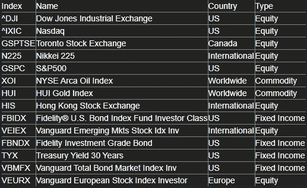
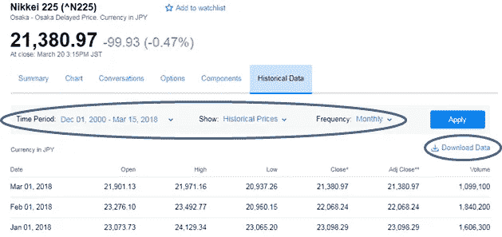
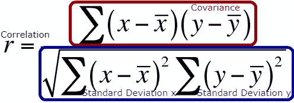
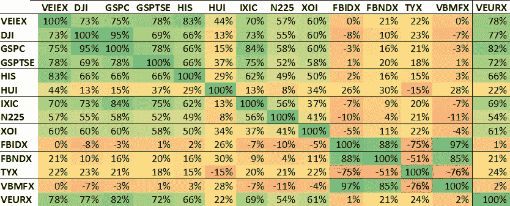
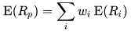
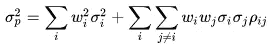
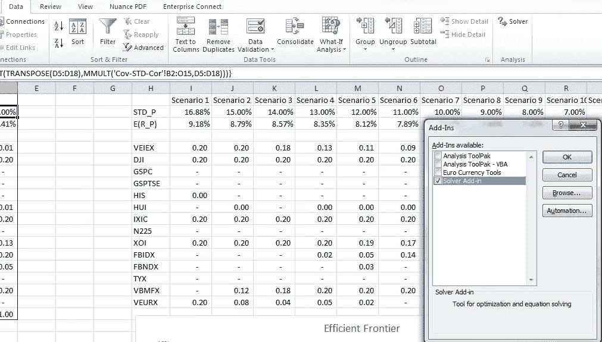
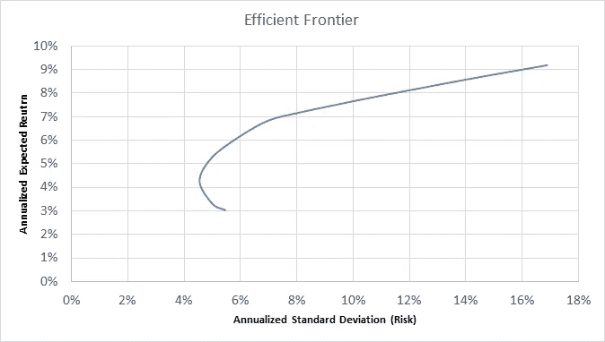
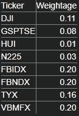

# 在 Excel 中提取股票数据并创建高效的前沿

> 原文：<https://towardsdatascience.com/pulling-stock-data-and-creating-an-efficient-frontier-in-excel-181291aa7f04?source=collection_archive---------7----------------------->

我在之前的一篇文章中提到了如何从 Google Finance 获得(几乎)实时股票数据。然而，如果你开始从不同的市场提取数据，每日历史汇率将没有意义，因为不同的市场在不同的日子休市。这在试图弄清楚股票之间的相关性时会产生问题。解决这个问题的一个办法是拉每月的利率，因为每个月调整后的股票价格将是一个更好的相关性指标。

Python 有一个很棒的库，叫做 [pandas_datareader](http://pandas-datareader.readthedocs.io/en/latest/remote_data.html) ，它允许你将历史信息拉入 pandas 数据帧。唯一的缺点是，如果一个 API 被否决，你的代码会崩溃。因此，我选择使用雅虎财经的历史数据下载功能来创建这个教程。本文的目标是提取大量全球历史数据(超过 20 年的价值)，然后使用现代投资组合理论(均值方差优化)创建一个有效的前沿。有效边界有助于根据给定的风险承受能力和预期回报来决定投资组合中的资产配置。

# 概观

投资组合优化的目标是获取给定风险容忍度下的年化预期回报。回报与权重组合(资产配置)相关联，以帮助决定投资策略。在这种分析中将使用的优化策略是现代投资组合理论(Markowitz，1952)，通常称为均值方差优化(MVO)，由 Harry Markowitz 于 1952 年提出。MVO 模型只考虑历史结果，因此仅限于此。它将无法考虑其他可能影响模型的因素，如“观点”或对未来市场预测的洞察力。一个更强大的模型，可以纳入未来的优化是布莱克-利特曼模型(布莱克&利特曼，1992 年)，通过引入用户输入的具体意见，对市场回报的资产配置过程。

# 数据收集

在这篇文章中，我将通过一个 excel 工作簿来指导你，这样你就可以准确地理解发生了什么。如果你愿意，你可以在这里下载 [excel 工作簿](https://www.shafquatarefeen.com/wp-content/uploads/2018/03/Daily_Returns_Yahoo_Adjusted_months.xlsx)。

为了避免高昂的主动管理成本，我选择使用指数基金作为优化的精选资产。市场指数拥有最长的股票信息历史，不会有单个公司股票的风险。历史上，市场一直在增长，通过使用市场指数，预期回报将处于市场平均水平，这远远好于年复一年地试图跑赢市场。此外，指数有助于在地理位置和资产类型方面提供更大的风险敞口。选择以下指数进行优化(表 1)。

`[Excel Workbook sheet: Names]`

Table 1\. Breakdown of assets chosen for optimization

由于投资者将是加拿大人，我着眼于三个不同地区的地理前景:加拿大、美国和国际。此外，根据资产类型，选择了股票、固定收益和商品的混合。

由于优化将着眼于未来 30 年以上，收集的数据越多越好。数据收集自 1996 年 7 月 1 日至 2018 年 3 月 1 日，涵盖约 22 年的数据。这是一种权衡，要么获取更多年的数据，要么排除固定收益基金，因为这些资产的可用数据有限。为了避免由于世界各地不同的市场关闭而导致数据收集日期不一致，收集了每月数据。这一时间框架涵盖了一些市场崩溃，包括 1997 年的亚洲金融危机(迈克尔和约翰，未注明日期)，2000 年至 2002 年的互联网崩溃(贝蒂，市场崩溃:互联网崩溃(2000 年至 2002 年)，以及 2007 年至 2009 年的房地产泡沫/信贷危机(贝蒂，市场崩溃:房地产泡沫和信贷危机(2007 年至 2009 年)，未注明日期)。

调整后的月度收盘价来自[雅虎财经(历史股票数据)](https://finance.yahoo.com/quote/%5EN225/history?period1=975646800&period2=1521086400&interval=1mo&filter=history&frequency=1mo)，通过应用过滤器从以下参数中提取:

*   时间段:1996 年 7 月 1 日—2018 年 3 月 1 日
*   显示:历史价格
*   频率:每月

每项资产的数据以指数各自的货币形式收集，并输出到 csv 文件中。不需要货币转换，因为百分比回报是为退货计算的。

How to pull historical stock data from Yahoo Finance

# 优化过程

# 月度回报

`[Excel Workbook sheet: Adjusted Closing]`

调整后的收盘价取自每个指数，然后整理成表格。

`[Excel Workbook sheet: Returns]`

在那之后，月度回报以百分比的形式计算，即从当月的收盘价中减去上月的收盘价，然后除以上月的收盘价。

R i =(收盘价 i-收盘价 i-1) /收盘价 i-1

取所有回报的平均值，得到每项资产的平均月回报。然后将这些平均值乘以 12，得到年平均回报率。

# 协方差和标准差

`[Excel Workbook sheet: Cov-STD-Cor]`

通过将每个资产与所有其他相应的资产进行比较来创建协方差矩阵。该矩阵对于理解每项资产的风险及其与其他资产的关系至关重要。

每项资产的标准差是通过查看月度回报得出的。然后用它来计算相关矩阵。

该公式的上半部分是 excel 工作簿中的**协方差**矩阵，下半部分是 **D 矩阵**。将这两者相除，就得到了**相关矩阵**。

# 相互关系

相关性对于理解两个资产有多相似很重要。相关性越高，它们就越有可能向同一方向移动。负相关意味着如果一种资产上升，另一种资产就会下降，反之亦然。

不出所料，资产与自身有 100%的相关性。此外，S&P500 (GSPC)与道琼斯工业股票交易所(DJI)的相关度为 95%。这很直观，因为两个指数之间有很多重叠。另一个有趣的发现是，美国国债与公司债券指数高度负相关。

# 效率限界

`[Excel Workbook sheet: Efficient Frontier]`

为了创建一个有效的边界，期望收益 E(R p)最大化，同时将标准差σ p 限制在特定值。每个资产 I 的权重是 w i。相关系数ρ ij 是资产 I 和 j 之间的相关性。

在我们做任何事情之前，重要的是要记住每年的预期收益和标准差。因为我们采用了月收盘价，所以将它们乘以 12，如工作表中单元格 A2 所示。

Excel 的求解器插件用于计算这些最大值。如果您尚未在中添加规划求解，请转到文件->选项->加载项->管理:Excel 加载项转到->单击规划求解加载项，然后选择确定。如果操作正确，现在应该可以在 excel 的数据窗格中看到规划求解选项。

每项资产的权重被限制为正值，以避免卖空，上限为 20%，以确保多样化。针对投资组合(STD_P)的标准差的多个不同迭代运行求解器，以获得有效边界的不同点。在大约 15 个场景之后，投资组合的预期收益(E(R_P))被绘制成相对于 STD_P 的图，从而得到你的有效边界。为了确保你得到一个好的边界，确保你最大化预期收益，但也最小化它。当然你只会关心最大预期收益，因为你为什么想要更少的钱？

正如预期的那样，回报率较高的投资组合全部是风险较高的股票，风险最小的投资组合在固定收益资产中的权重较大。

风险最小的最佳点是年预期收益率为 4.55%，投资组合由以下资产组成:

Optimal point with minimal risk is an annual Expected Return of 4.55%

# 引用的作品

贝蒂(未注明日期)。*市场崩溃:房地产泡沫和信贷危机(2007-2009)*。从 Investopedia 检索到:【https://www.investopedia.com/features/crashes/crashes9.asp 

贝蒂(未注明日期)。*市场崩盘:互联网崩盘(2000 年至 2002 年)*。从 Investopedia 检索:[https://www.investopedia.com/features/crashes/crashes8.asp](https://www.investopedia.com/features/crashes/crashes8.asp)

布莱克，f .和利特曼，R. (1992 年)。全球投资组合优化。*财务分析期刊*，28–43 页。

*历史库存数据*。(未注明)。检索 2017 年 03 月 16 日，来自雅虎财经:[https://finance.yahoo.com/quote/%5EN225/history?周期 1=975646800 &周期 2=1521086400 &间隔=1mo &过滤器=历史&频率=1mo](https://finance.yahoo.com/quote/%5EN225/history?period1=975646800&period2=1521086400&interval=1mo&filter=history&frequency=1mo)

马尔科维茨(1952 年)。投资组合选择。*金融杂志*，77–91。

***免责声明—*** *本文内容仅供参考。这不是买卖任何证券或实施任何投资策略的建议。*

迈克尔和约翰。亚洲金融危机。检索自美联储历史:[https://www . federalreservehistory . org/essays/Asian _ financial _ crisis](https://www.federalreservehistory.org/essays/asian_financial_crisis)

*原载于 2018 年 3 月 21 日*[*https://www.shafquatarefeen.com*](https://www.shafquatarefeen.com/efficient-frontier/)*。*