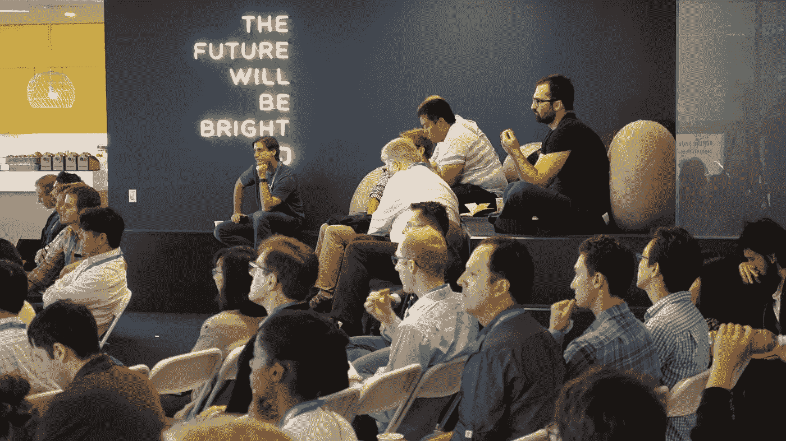

# 展现你最好的一面:沟通的新领域

> 原文：<https://towardsdatascience.com/put-your-best-face-forward-the-new-frontier-of-communication-218abb8f538d?source=collection_archive---------1----------------------->

[Data Science Popup LA](https://www.dominodatalab.com/datapopups/los_angeles) @ FullScreen HQ

2013 年，当我开始在多米诺数据实验室担任营销主管时，我不太确定如何制定我们的增长战略。我尝试、测试和重复了许多不同的策略，直到有一个被卡住。[多米诺数据科学弹出窗口](https://l.facebook.com/l.php?u=http%3A%2F%2Fwww.dominodatalab.com%2Fdatapopup&h=ATN4dQqARAOHYEOtGU1voB9seHOHntJWrZYhtrY8Tx2sTOScwLk1pLb8e1Dwz0vl-vYlbzPk89dVMM6KU0_nnS3CAn7qgD8J960kLLBJ9qlxgce0XWViwtqd_i9RxmGVjP50alVx)起飞了，行业趋势过去和现在都很清楚:更小、更专注的会议带来更大的想法、更好的网络和更光明的前景。我离开了达美乐，让其发展壮大 [Formulated.by](https://l.facebook.com/l.php?u=http%3A%2F%2Fformulated.by%2F&h=ATN4dQqARAOHYEOtGU1voB9seHOHntJWrZYhtrY8Tx2sTOScwLk1pLb8e1Dwz0vl-vYlbzPk89dVMM6KU0_nnS3CAn7qgD8J960kLLBJ9qlxgce0XWViwtqd_i9RxmGVjP50alVx) ，该公司最初是一家数字营销机构，后来发展成为一家提供数字和面对面体验的机构。在面对面方面，我们制定了关注价值和内容的亲密会议，将思想和行业领袖面对面地聚集在一起，以建立新的关系，并获得人才、前景和客户。我很高兴接到杰克·帕尔默的电话，他是 [Plotly](https://l.facebook.com/l.php?u=http%3A%2F%2Fplot.ly%2F&h=ATN4dQqARAOHYEOtGU1voB9seHOHntJWrZYhtrY8Tx2sTOScwLk1pLb8e1Dwz0vl-vYlbzPk89dVMM6KU0_nnS3CAn7qgD8J960kLLBJ9qlxgce0XWViwtqd_i9RxmGVjP50alVx) 的首席执行官，他也看到并理解了行业趋势——私人会议——我们一起创建了 [PLOTCON](https://l.facebook.com/l.php?u=http%3A%2F%2Fplotcon.plot.ly%2F&h=ATN4dQqARAOHYEOtGU1voB9seHOHntJWrZYhtrY8Tx2sTOScwLk1pLb8e1Dwz0vl-vYlbzPk89dVMM6KU0_nnS3CAn7qgD8J960kLLBJ9qlxgce0XWViwtqd_i9RxmGVjP50alVx) 。在超额销售了第一个 PLOTCON(我们在纽约杀死了它！)我们的一个赞助商找到了我；营销副总裁 Stephanie Mcreynold 聘请我们为 Alation 开发一个名为“策划”的新活动系列。酷的是，我们的模型在许多领域都是可适应和可访问的。

我们已经与顶级品牌合作并得到它们的支持，如:思科、Salesforce、Capital One、戴尔、维亚康姆、奥瑞利媒体、美国银行、全屏、红牛媒体、亚马逊、IBM、AWS、英特尔软件、微软、Groupon、Ebay 和许多其他品牌。

我们的客户名单也在稳步增长:AWS、O'Rielly Media、IBM、Domino Data Lab、Plotly、Data。World、Reltio、Pariveda、Alation、Dataversity +其他。

我也组建了一个很棒的顾问团队。O'Reilly Media 的业务战略和分析副总裁 Roger Magoulas 让我们的业务战略保持专注，并始终领先一步。脸书活动的顾问 Mike Sly 为我们的销售战略注入了活力，并帮助我们找到了优秀的人才。Domino 的首席数据科学家 Eduardo Arino de la Rubia 是我们的行业专家和数据科学专家。我们的顾问团由 Plotly 的创始人兼首席执行官 Jack Palmer 和 O'Reilly Media 的高级顾问 Q McCallum 组成。这些影响者共同推动我们加速前进，引领我们走向成功。

我们的活动以人为本，将品牌、影响者和人才聚集在一个空间，只有一个目标:解决所有值得解决的问题。我们计划前端有趣和轻松的会议，后端组织和优化。

**时事** | [数据科学沙龙 NYC](https://datascience.salon/newyork/)|[DSS MIA](https://datascience.salon/miami/)|[DSS SEA](https://datascience.salon/seattle/)|[DSS LA](https://datascience.salon/la/)|[DSS ATX](https://datascience.salon/austin/)

在数字方面，我们使用科学的方法，通过研发来推动合格的销售线索。我们整合了搜索引擎优化(SEO)、点击付费(PPC)、公共关系(PR)、电子邮件营销、有针对性的展示广告和社交媒体活动，以及一点点科学知识，只推动最合格的线索，最重要的是传播您的品牌意识。我们的团队将与您的团队合作，围绕您的品牌/产品建立一个强大的社区。瞄准本地、全国或全球的客户，以满足您的需求。

给我们写封短信:info@formulated.by 并顺道拜访[https://formulated.by/](https://l.facebook.com/l.php?u=http%3A%2F%2Fformulated.by%2Fconferences&h=ATN4dQqARAOHYEOtGU1voB9seHOHntJWrZYhtrY8Tx2sTOScwLk1pLb8e1Dwz0vl-vYlbzPk89dVMM6KU0_nnS3CAn7qgD8J960kLLBJ9qlxgce0XWViwtqd_i9RxmGVjP50alVx)

真诚地

~ [安娜·安妮辛](http://about.me/annaanisin) &团队