# 将“优步运动”数据付诸行动—机器学习方法

> 原文：<https://towardsdatascience.com/putting-uber-movement-data-into-action-machine-learning-approach-71a4b9ed0acd?source=collection_archive---------9----------------------->

*“一切都与其他一切相关。但近的东西比远的东西更有关联。”*

地理第一定律

优步于 2017 年初推出了其[优步机芯](https://movement.uber.com/)服务。它由数十亿条行程数据组成，并提供对所选城市不同区域之间行程时间汇总的访问。它创造了巨大的热情，但同时也引起了研究人员、移动专家和城市规划者的怀疑。那么，优步是否正在将数据民主化，并提供免费工具来访问其庞大的数据库？也许没有那么多，但它仍然做出了巨大的努力来聚合和可视化世界各地不同城市的数据量。

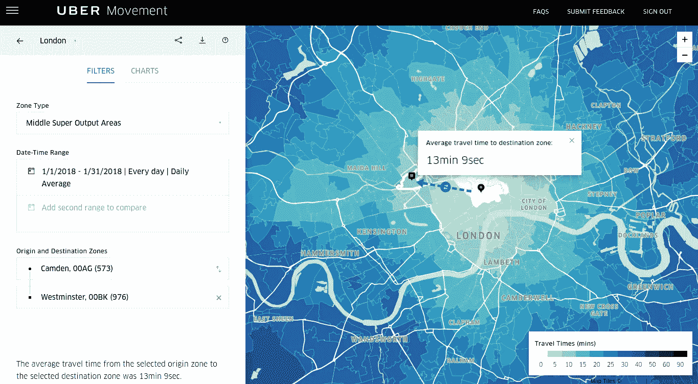

Uber Movement Tool

那么我们这里有什么？我们有一个基于所选原点的旅行时间的[等时线映射](https://en.wikipedia.org/wiki/Isochrone_map)的好例子。对于一天中的不同时间，行进时间也被分段。让我们只指定工作日和早高峰。

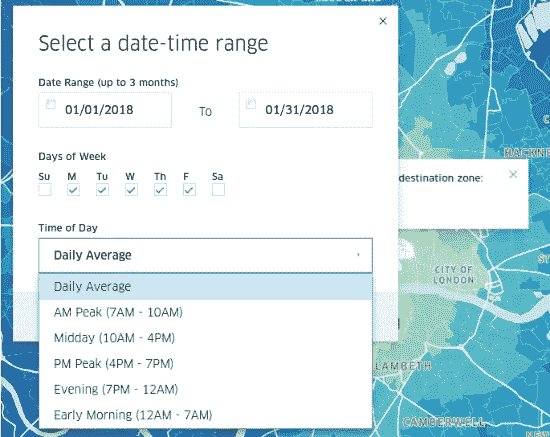

Range

对于数据科学家和分析师来说，最重要的是，这些数据可以以 CSV 格式下载。但是问题是，可以下载的数据没有按照“一天中的时间”进行分段因此，您可以下载一年中某个季度的所有出发地到所有目的地的旅行时间数据，但是可用的聚合仅限于一周中某一天的每月、每小时和每天。我们稍后会谈到这一点。

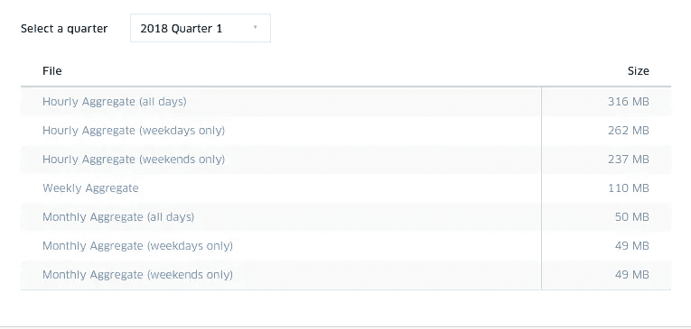

Download Options

# 移动评估即服务

移动性是智能城市项目和位置智能的朗朗上口的术语。可以把它看作是一项服务，它根据您旅行的起点和目的地以及一天中的时间，为您提供在您居住的城市中的估计旅行时间。一天中的时间甚至可以涵盖季节性，因为你不会期望在炎热的夏季午后和灰色的冬季晨雾中有相同的旅行时间。此外，选择一个精确的日期可能会产生无尽的搜索:5 月份的周末是早上的高峰，因为你在一年中的这个时候去巴塞罗那旅行；或者是夏天的中午，周五下午 15:20 左右，因为你在伦敦进行暑期实习。优步的运动数据仅仅是个开始。

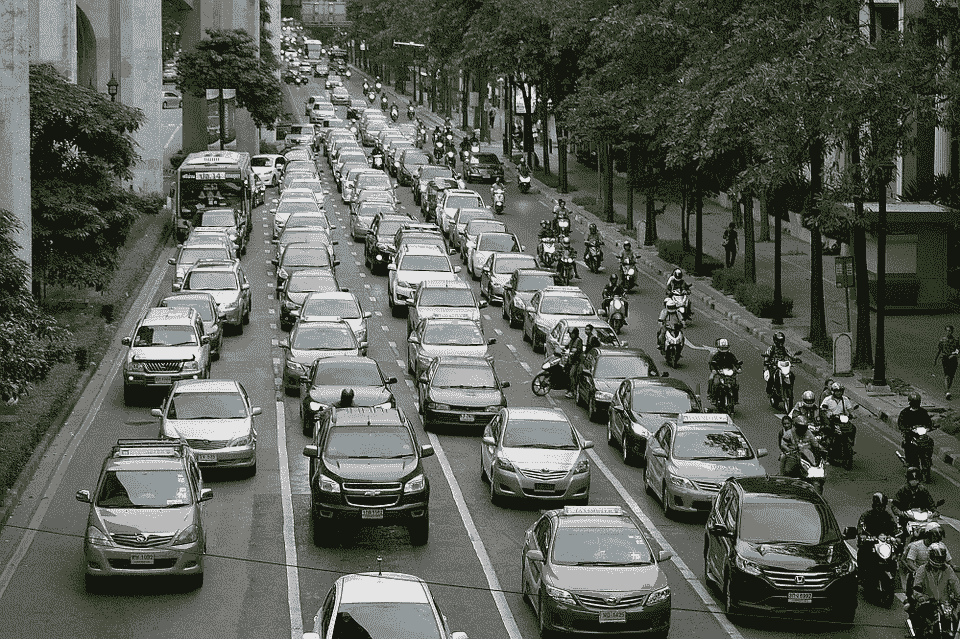

**Not that mobile, is it?**

这种服务的潜力对于试图将[位置智能整合到其服务](https://www.forbes.com/sites/louiscolumbus/2018/02/11/what-new-in-location-intelligence-for-2018/#3abb59d014b5)中的公司来说意义重大。零售和批发企业正试图[评估他们所在地区的集水区](https://www.simplybusiness.co.uk/knowledge/articles/2010/10/2010-10-25-what-starbucks-can-teach-your-business-about-location-based-marketing/)，房地产公司希望评估[位置的可达性](https://www.walkscore.com/methodology.shtml)，物流和货运公司希望(并且需要)知道旅行时间，因为他们运输货物。

# 挑战:旅行时间预测

那么，为了提供这样的服务并根据到达不同地区的时间来评估位置，我们需要知道什么呢？简而言之，旅行时间。我们要么需要一个旅行时间矩阵，要么能够即时创建一个。机器学习方法是基于足够大的历史旅行时间数据集来训练您的模型，以便它可以准确预测具有源位置、目的地位置和日期的新旅行查询的旅行时间。基本上，我们需要一个给定城市内的庞大数据集和一个合适的机器学习模型。

作为一家科技公司，优步将这个问题称为价值[十亿美元的问题](https://www.youtube.com/watch?v=FEebOd-Pdwg)。旅行时间，或者用他们的行话来说，ETA(预计到达时间)，是他们业务的关键绩效指标之一。


Not time travel! Travel time! (That’s also a billion-dollar question, though.)

机器学习爱好者可能已经记得几个 Kaggle 比赛中的这个挑战，例如[这个](https://www.kaggle.com/c/nyc-taxi-trip-duration)关于识别纽约出租车旅行持续时间的比赛，以及最近的[这个](https://www.kaggle.com/c/new-york-city-taxi-fare-prediction)关于纽约出租车费用预测的比赛。他们都广泛关注纽约市，主要覆盖曼哈顿和布鲁克林。

我的问题是，我们应该在优步运动数据的基础上建立我们的模型，这个数据的主要挑战是什么？为什么我们要对它建模而不仅仅是查询呢？

# 动机

首先，我们需要定义我们的视角。我们的移动性评估需要能够为感兴趣的城市创建月、日、甚至小时精度的高精度旅行时间预测。我们正在使用机器学习方法，所以我们需要一个大的数据集。

然而，优步的数据集存在几个问题:

*   它没有涵盖每个时间间隔的所有源和目标对。因为有时给定路线上没有足够的行程供他们汇总并添加到他们的 CSV 中，所以存在缺口。
*   它不提供可下载格式的特定日期时间范围的聚合数据。这意味着 3 个月内所有周一或下午 1 点从出发地到目的地的平均旅行时间。
*   它是按地区汇总的。它没有行程起点和终点的位置(经度/纬度)。
*   当然，它只涵盖了世界上选定的城市。它可能不包括你感兴趣的那个。

Kaggle / NYC 旅行数据也有重要问题:

*   它主要覆盖曼哈顿，这是一个比伦敦这样的大都市小得多的地区。仅仅了解整个城市的动态是不够的。
*   曼哈顿有[曼哈顿距离](https://en.wikipedia.org/wiki/Taxicab_geometry)！它涉及一个相对简单的计算模型。为世界上大多数城市构建模型时，计算两个位置之间的距离并不容易。你需要路由软件。

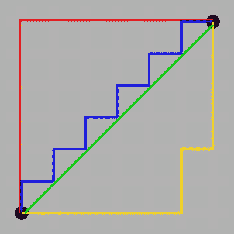

Finding your way in Manhattan

最后，为大城市创建行程时间预测的主要问题是历史数据并对其进行智能过滤。在这个领域，数据非常有价值，非常大，而且很难获取。你需要缩小它的尺寸来模拟它。想出一条特定的路线和这条路线上的旅行时间。如果你想得到每小时的精度，你的数据要乘以 24。对于周精度，乘以 7，对于一个季度的日精度，再乘以 90。它呈指数增长。然后，想想在一个大城市可能有成千上万条路线。


The exponential growth of spatiotemporal data

您可能会很快想到，您需要对这些数据进行建模，而不是将这些组合中的每一个都存储在数据库中。即使对于建模，您也可以通过选择特定的起点和终点来缩减数据，因为在一个城市中几乎有无限多种不同路线的组合。

优步运动数据和建模在这一点上发挥了作用:

*   使用优步移动数据**可以帮助您了解如何在大城市选择 OD(起点-终点)矩阵对，以便有最少的路线组合来定义最大旅行时间(因此交通拥堵)可变性**。

> 1-问问你自己:你需要选择多少个原点？
> 
> 2-然后问:有几个目的地？
> 
> 3-最后，你可以:为城市的不同部分优化你的选择。

*   以这种方式使用的优步流动数据可以帮助您了解大城市中人员的真实流动和流动性。
*   对于建模，有了模型后，只需搜索特定的位置对作为路径，而忽略数据集中缺失的数据。机器学习已经帮你解决了这个问题。

# 开拍。

介绍完毕，我将总结一下我将要向您展示的步骤:

1-下载并浏览伦敦的每周汇总数据集。(因为它是一个足够大的数据集，而且我喜欢伦敦！)

2-对于数据准备，整合和格式化数据。

3-选择一个模型并应用它。评估准确性指标。

4-在地图上可视化预测误差。将其与数据探索中的发现进行比较。

5-比较谷歌地图和模型之间的一些旅行时间结果。

6-评论模型中可能的改进。包括我们所学的部分。

# 数据理解

我们将首先访问[优步运动网站](https://movement.uber.com)并导航至伦敦。然后，我们将下载“每周汇总”的 CSV 文件在这种情况下，我们将选择截至目前的最新季度:2018 年第 1 季度。

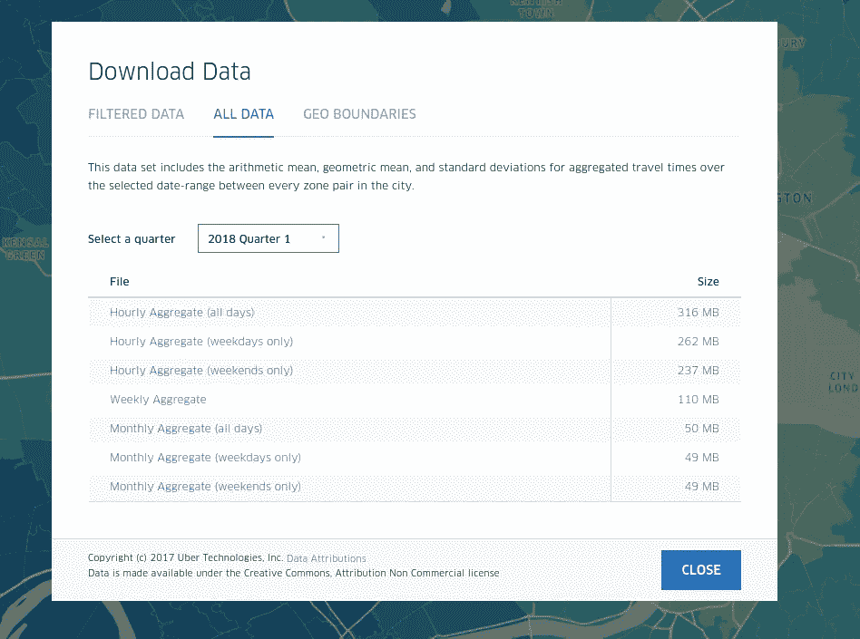

我们还需要地理边界文件来设置区域坐标。

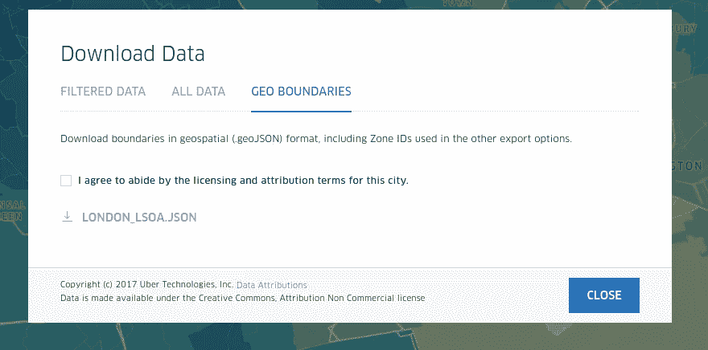

我们将汇总数据。如你所见，那里有将近 300 万张唱片！从起点区域到终点区域，我们可以找到编码为 1 到 7 的一周中每一天的平均行程时间(dow)。

```
str(my_london_mv_wa)'data.frame':	2885292 obs. of  7 variables:
 $ sourceid                                : int  705 137 131 702 
 $ dstid                                   : int  167 201 261 197 131 232 157 451 302 137 ...
 $ dow                                     : int  7 7 7 7 7 1 7 7 
 $ mean_travel_time                        : num  1699 1628 3157 
 $ standard_deviation_travel_time          : num  600 541 688 206 
 $ geometric_mean_travel_time              : num  1621 1556 3088 
 $ geometric_standard_deviation_travel_time: num  1.34 1.34 1.23 
```

我们需要将“sourceid”和“dstid”映射到区域。我们会读 geoJSON 文件。它有伦敦 983 个地区的定义。对于它们中的每一个，都有一个限定该区域的边界多边形。 [**多边形**](https://en.wikipedia.org/wiki/Polygon) 表示定义边界的一列路段。每个线段都有一个由经度和纬度定义的起点和终点。

```
library(jsonlite)library(geosphere)# load objects
my_london_regions<-jsonlite::fromJSON("london_lsoa.json")# check your region list
head(my_london_regions$features$properties)# polygon coordinates for each region
str(my_london_regions$features$geometry$coordinates)
```

现在让我们变戏法，然后解释这里发生了什么。

```
my_london_polygons=my_london_regions$features$geometry$coordinates
my_temp_poly<-my_london_polygons[[1]]
poly_len<-length(my_temp_poly)/2
poly_df<- data.frame(lng=my_temp_poly[1,1,1:poly_len,1], lat=my_temp_poly[1,1,1:poly_len,2])
my_poly_matrix<- data.matrix(poly_df)
temp_centroid<-centroid(my_poly_matrix)
```

我们将多边形坐标保存到一个对象中。作为演示，开始区域 1 的程序。因为我们的形状是一个多边形，我们可以用它的[形心](https://en.wikipedia.org/wiki/Centroid)来定义这个多边形。这是因为我们需要每个区域有一个单一的位置坐标。我们来自“地圈”包的质心函数可以计算出来。我们以要求的格式给出输入。最后，我们得到了该区域的质心。让我们想象一下，看看我们做了什么。我们将使用传单包装。

```
leaflet(temp_centroid) %>% 
 addTiles() %>% 
 addMarkers() %>% 
 addPolygons(lng= poly_df$lng, lat=poly_df$lat)
```

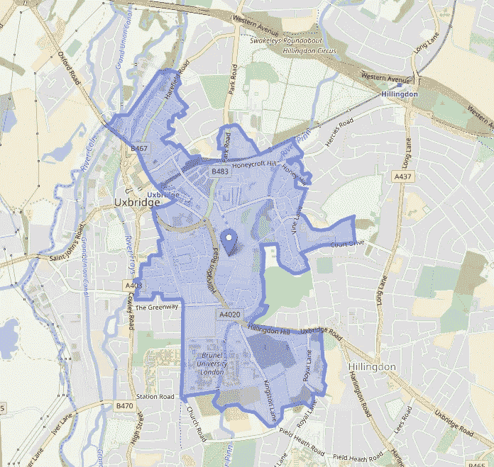

Geometrical center of the polygon is centroid.

这是我们所期望的。区域 1 有一个边界多边形，我们已经计算了它的质心。现在，区域 1 由这个位置中心定义:质心纬度和经度。很容易对每个区域重复此过程，并准备一个最终列表:

```
head(my_london_centroids_450,3)
   id         lng      lat
1 212 -0.16909585 51.49332
2  82 -0.04042633 51.39922
3 884 -0.02818667 51.45673
...
```

# 数据准备

我们的最终数据集需要有一个源位置、目的位置、日期和距离。我们已经在上一节中准备了区域的质心坐标，以便在地图上看到我们的区域。剩下的就是选择一个区域子集，然后计算每个起点和终点对之间的距离。让我们开始吧。

**a-子集化**

为什么我们不用所有的 983 地区呢？如果你还记得文章开头的那段话，近的东西更相关。附近地区的旅行时间相似。如果我们对区域进行子集划分，我们的最终数据集将会更小，建模时间也会缩短。我们还对这些区域进行了子集划分，因为计算距离的成本很高，并且子集划分会导致要计算的路线组合数量减少。

现在，我们的数据集有 983 个不同的地区，平均而言，它们有大约 450 个目的地。经过几次子集设置和建模试验(为了评估准确性)，我们将随机选择 450 个起始区域，并为每个区域选择 150 个随机目的地。让我们看看这是什么样子:

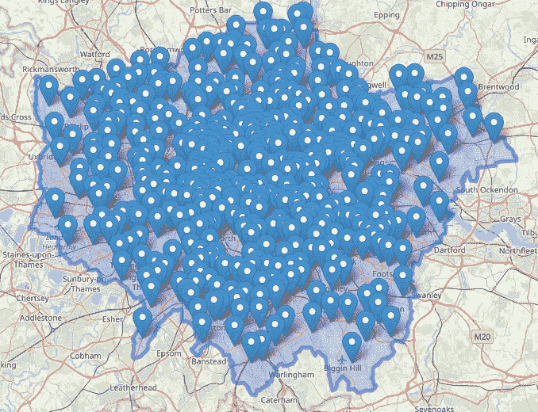

Randomly selected 450 origin region centroids inside London city boundaries.

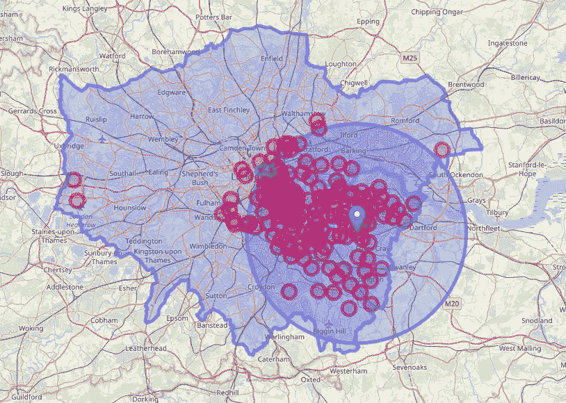

Here are 150 trips (destinations) from region 1\. The circle has a 15km radius.

因此，大多数行程的半径为 15 公里，也包括一些到希思罗机场的行程。我们可以很容易地说，通过检查其他地区，我们的模型将足够好地预测行程的旅行时间(1)大约 15 公里的距离和(2)到机场。

我们还对 450 个产地的密度分布感兴趣。r 有强大的地理空间软件包来帮助我们。

```
library(spatstat)
## create a point pattern object
my_london_centroids_450_pp<-ppp(my_london_centroids_450[,2],my_london_centroids_450[,3],c(-0.4762373 , 0.2932338) ,c(51.32092 ,51.67806))#visualize densityplot(density(my_london_centroids_450_pp))
```

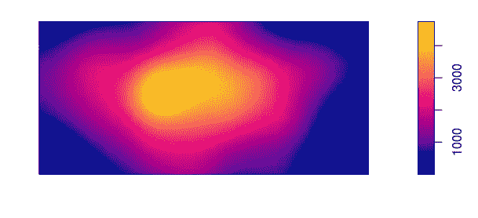

The density of our origin locations (regions).

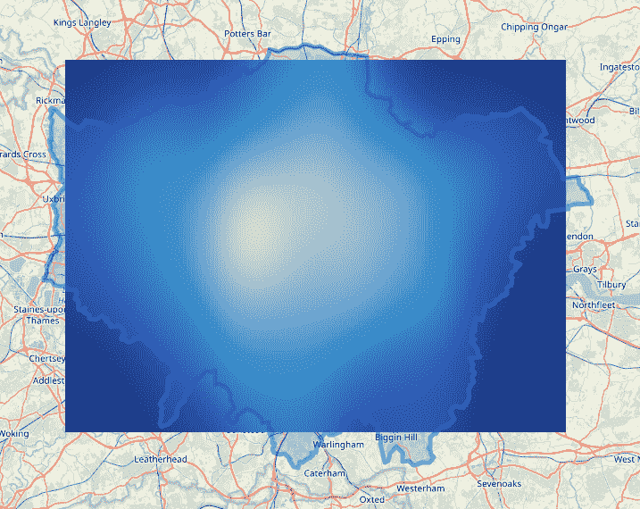

The rasterized density image on top of London map

因此，我们的原点位置的密度在中心较高，在外围较低。同样，我们可以在建模之前进行粗略的猜测，并且可以说预测误差在中心会更小，因为有更多的原点位置(区域)。

再次使用强大的“spatstat”和“geosphere”软件包，我们可以进一步分析到目的地的距离的细节。他们可以使用点模式对象、“nnwhich”和“geoDist”函数轻松地为我们提供附近邻居的 kth:

```
# closest first 5 neighbor distance to destination idshead(my_london_centroids_450_nd3[,c(1,5,6,7,11,12)]) id       gd1       gd2       gd3      gd4      gd5
1 212  573.0708  807.4307  710.0935 1694.490 1325.124
2  82 1086.2706 1370.0332 1389.9356 3018.098 2943.296
3 884  641.8115  767.1245 1204.1413 2428.555 2320.905
...
```

**b-距离计算**

让我们在建模之前考虑最后一件事:我们需要计算起点和终点对之间的距离。我们不能依赖曼哈顿距离或直线距离。它需要是一个人开车走的真实距离，所以我们需要一个路由软件，可以根据城市中的特定路线计算两点之间的距离。

为此，我们有几个选择。像[谷歌地图 API](https://developers.google.com/maps/documentation/distance-matrix/intro) 这样的付费选项可能会很贵(数百美元)，因为我们将有大约 67500 条路线(450 个起点*150 个目的地)。路由最全的免费软件是 [OSRM](http://project-osrm.org/) (开源路由机) [OpenStreetMap](https://www.openstreetmap.org/) 用的。

```
library(osrm)#calculate distance
my_route_d<-osrmRoute(src=my_london_centroids_450[my_r1,] , dst=my_london_centroids_450[my_r2,], overview = FALSE)# route segments if needed to draw a polyline
my_route<-osrmRoute(src=my_london_centroids_450[my_r1,] , dst=my_london_centroids_450[my_r2,])
```

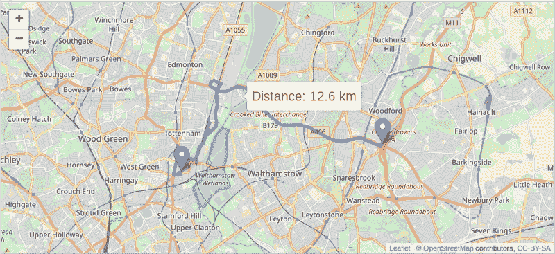

Calculations from OSRM results are drawn with Leaflet

OSRM 软件包默认使用[演示 OSRM 服务器](https://github.com/Project-OSRM/osrm-backend/wiki/Demo-server)，并且仅限于合理和负责任的使用。我们不希望通过发送成千上万的请求在演示服务器中造成瓶颈。我们需要自己的路由服务器！

这里有一个简洁的教程[描述了如何在 Ubuntu 机器上设置你自己的 OSRM 服务器。好消息是你不需要成为一个 Unix 专家来设置它。菜鸟级别的熟悉就够了。我个人用的是 Ubuntu Xenial 16.04 的 m4.xlarge 类型的](https://datawookie.netlify.com/blog/2017/09/building-a-local-osrm-instance/)[亚马逊 EC2 实例](https://aws.amazon.com/ec2/instance-types/)。

完成后，我们可以将 OSRM 服务器选项设置为新的服务器 IP:

```
options**(**osrm.server **=** "http://xxx.xx.xx.xx:5000/"**)**
```

现在，我们已经准备好计算起点和终点对的每个路线组合的距离。

# 建模

最后，我们准备好了有趣的部分。准备完毕后，让我们看看我们的数据集:

```
head(my_london_sample_wa450150)lng_o    lat_o      lng_d    lat_d     dow distance   travel_time
-0.374081 51.5598 -0.4705937 51.54076   5    10.92        1048.46
-0.399517 51.4904 -0.4705937 51.54076   3    27.86         947.94
-0.368098 51.5900 -0.4705937 51.54076   4    14.30         1550.46
...
```

我们有起点/目的地坐标、星期几、距离和以秒为单位的旅行时间。这个数据集有 421，727 行。

在行程时间预测中，有两种受欢迎的算法。同样在[的同一场演讲](https://youtu.be/FEebOd-Pdwg?t=1089)中，优步将它们列为:

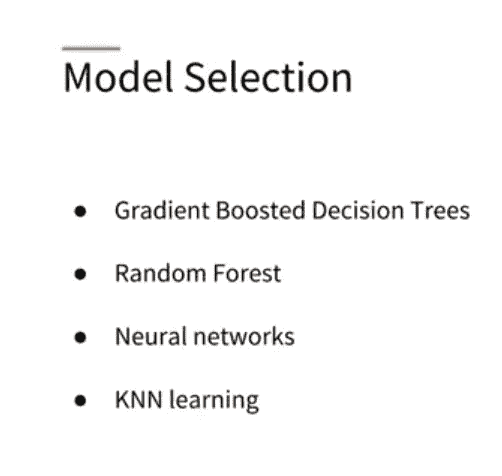

The four preferred algorithms by Uber in Travel Time Prediction

我们将尝试随机森林。这是一种开箱即用的算法，需要最少的特征工程。为数据集的 70%(大约 290，000 行)创建训练集后:

```
modFitrf<-randomForest(travel_time ~ dow+lng_o+lat_o+lng_d+lat_d+distance,data=training_shuf[,c(3:9)],ntree=100)# resultrandomForest(formula = travel_time ~ dow + lng_o + lat_o +      lng_d + lat_d + distance, data = training_shuf[, c(3:9)],      ntree = 100) 
               Type of random forest: regression
                     Number of trees: 100
No. of variables tried at each split: 2Mean of squared residuals: 18061.1
                    % Var explained: 96.84
```

在类型为 m4.2xlarge 的亚马逊 EC2 实例中，这个过程需要大约 2 个小时。

训练误差为 3.2%，测试误差为 5.4%。我们还有一个维持数据集，它引用了在对它们进行子集化时没有包含在我们的模型中的区域。对于维持数据集，从剩余区域中随机选择 100 个区域，错误率为 10.8%。

# 模型评估

让我们在伦敦地图上直观地显示我们的预测误差。

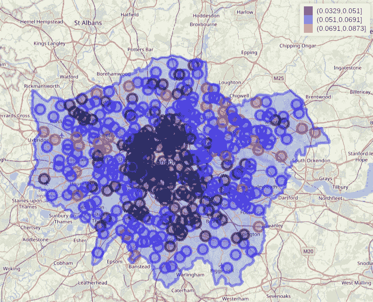

Test error rates grouped.

事实证明，我们的直觉是正确的。我们在中心区域的错误更少，希思罗机场也有一个黑点，这意味着它的错误率更低。

在数字上，我们也可以计算相关性。到中心的距离和预测误差之间的相关性是公平的。

```
cor(my_london_centroids_450_hm$distc,  my_london_centroids_450_hm$testprc)[1] 0.5463132
```

我们可以再次使用我们的空间包“spatstat”来可视化我们的错误率。这一次，我们将使用[空间插值](http://planet.botany.uwc.ac.za/nisl/GIS/spatial/chap_1_11.htm)来平滑 2 维空间上的错误率。

```
library(spatstat)# assign corresponding prediction errors to our coordinates in 2-d
marks(my_london_centroids_450_pp) <-my_london_centroids_450_hm$testprc## apply inverse distance weighting / spatial interpolation
plot(idw(my_london_centroids_450_pp))
```

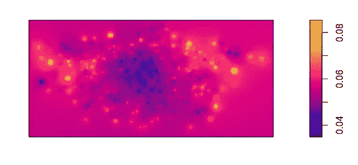

Our interpolation graphic is worth the effort. Again we can observe the regions with a low error rate

我们现在可以试试我们的伦敦旅行时间预测器。我们来做个随机对比。我们将在谷歌地图中随机选择两个点:

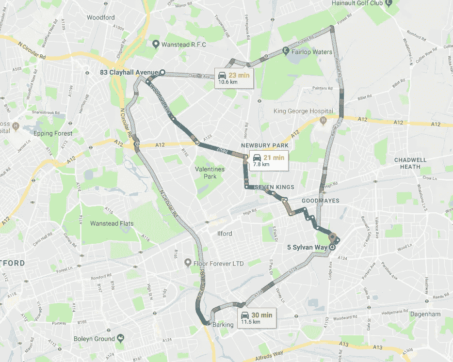

Google Maps calculates 21 minutes travel time on Monday evening

然后，我们将使用 OSRM 计算相同点之间的距离，并将所需的参数传递给我们的模型，以预测旅行时间。

```
library(osrm)lon_o<-0.054089 ; lat_o<-51.591831
lon_d<-0.114256 ; lat_d<-51.553765# calculate distance
my_distance<-osrmRoute(src = data.frame(id=1,lon= lon_o , lat=lat_o) ,
                       dst= data.frame(id=2,lon=lon_d  , lat=lat_d), overview = FALSE)[2]# get route
my_route<-osrmRoute(src = data.frame(id=1,lon= lon_o , lat=lat_o) ,
                       dst= data.frame(id=2,lon=lon_d  , lat=lat_d))# calculate travel time with our model for monday
travel_time<-predict(modFitrf, data.frame(dow=1, lng_o= lon_o,lat_o=lat_o,
                                     lng_d=lon_d ,lat_d=lat_d,distance=my_distance) )
```

让我们来看看结果:

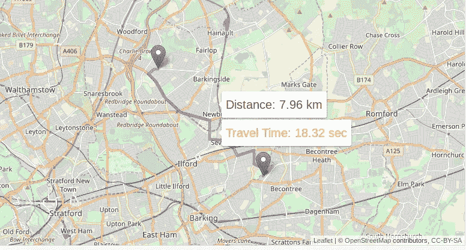

Prediction from our model visualized on Leaflet

即使在一个不靠近中心的地区，我们的模型也做出了相当不错的预测，只差几分钟就错过了谷歌地图的预测。

通过使用插值测试误差率，我们可以找到原点位置的预期测试误差率。

```
my_image[list(x= 0.054089,y=51.591831)]
[1] 0.06567522
```

因此，根据 2 维空间中测试误差率的分布，我们预计该区域的传播时间误差约为 6%。

自然，我们面临着更高的错误率，因为我们使用的优步运动数据集没有每小时的精度。我们只是对周一做了一个整体预测，无法捕捉高峰或非高峰时间。此外，请注意，我们使用的是第一季度的数据，这意味着我们主要是对冬季进行预测，但这一比较是在 2018 年 9 月进行的。我们没有真正捕捉到季节变化。

# 最终注释

基于伦敦 2018 年第一季度的优步运动数据，我们使用随机森林算法通过机器学习制作了一个旅行时间预测器。

可能的改进:

*   可以分析每小时汇总的数据。有了这些数据，我们就可以将我们的模型与来自每小时聚合数据的模型相结合，以获得更精确的结果来捕捉交通拥堵的每日变化。
*   现在我们有了第一批结果，可以更有策略地进行子集化。很明显，我们需要更多的郊区区域来进一步降低错误率。
*   我们可以为中心和郊区创建单独的模型。可以针对不同的型号单独调整型号。喜欢在随机森林的郊外有更多的树的深度。
*   我们可以尝试其他算法(KNN、XGboost 或神经网络),并将它们组合成一个整体。
*   可以对一年中的其他季度进行相同的建模，以捕捉季节性。

我们可以从中学到什么:

*   因为我们有时空数据，所以需要空间分析。
*   插值是探索和使用此类数据的强大转换工具。
*   起点和终点区域的选择是一种优化问题。我们正试图捕捉旅行时间预测中的最大可变性，同时将始发地和目的地的数量保持在最小。

想听听大家的意见和建议！

请随时通过 [LinkedIn](http://www.linkedin.com/in/alptekinuzel) 和 [Github](https://github.com/alptuzel) 联系我。