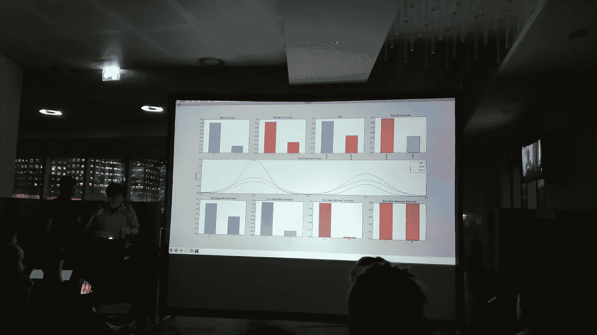
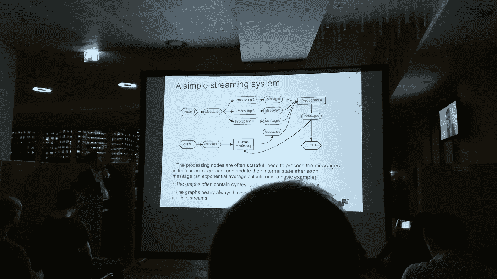
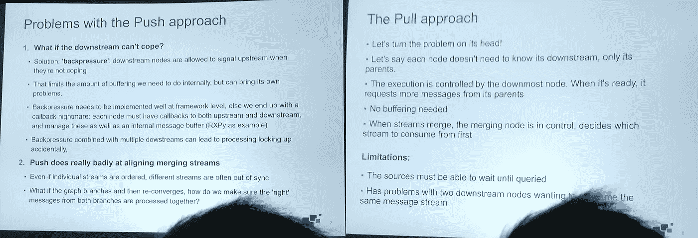
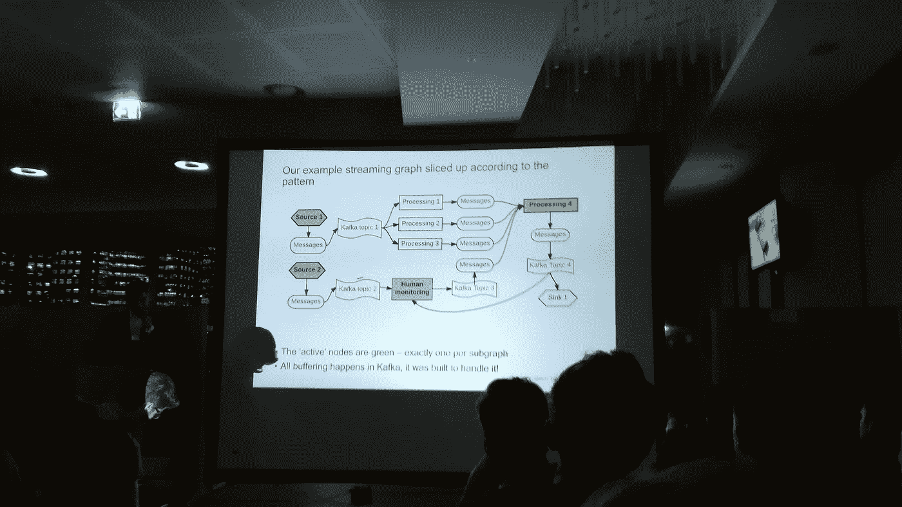
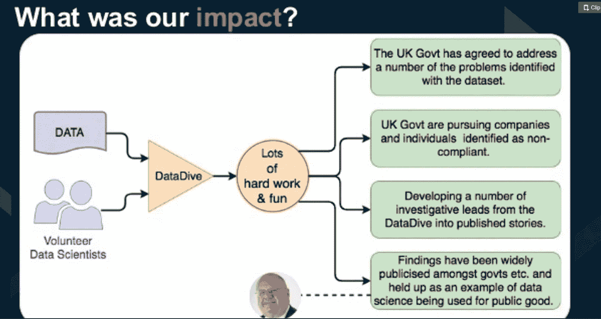
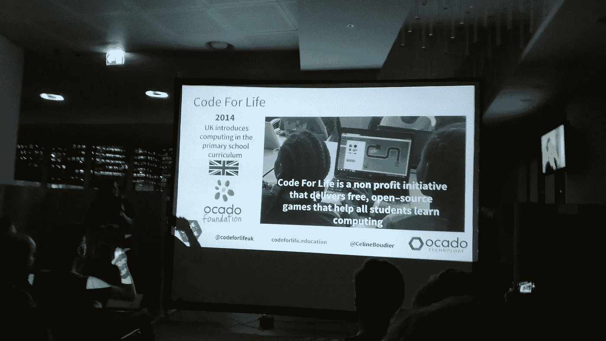

# PyData 伦敦 Meetup 2017 年 4 月评论，由初学者。

> 原文：<https://towardsdatascience.com/pydata-london-meetup-april-2017-review-by-a-beginner-fddff980a745?source=collection_archive---------4----------------------->

Will it be totally beyond me? Or not?

PyData London Meetup ，一场众所周知很难买到票的聚会。PyData London 每个月都有一个重要的等候名单，你必须非常**迅速地确认你的出席。在之前的活动后，我在酒吧见过组织者和与会者(这是 Meetup 的传统)，我知道社区和会谈的质量将是高质量的，我在正确的地方继续我的[数据科学教育](https://medium.com/towards-data-science/from-graduate-to-data-science-how-to-get-a-job-that-doesnt-yet-exist-adb0581735f3)。如果你没有买到活动的门票，但仍然想与社区成员见面，请关注 PyData London[Twitter](https://twitter.com/pydatalondon)feed，了解聚会后他们去的酒吧的位置。**

# 位置

聚会不动了。有免费的食物和啤酒你为什么要喝？这是因为 meetup 一直由 AHL 的慈善团队主办。这使得组织者可以将更多的精力花在聚会的其他方面，而不是每月寻找新的地点。因此，聚会的质量每个月都在提高。

但是，因为地点没有改变，meetup 现在经常在宣布的几天内达到最大容量。).不幸的是，这意味着每次只有 230 人可以参加，人们确实错过了。组织团队知道这一点，几乎所有的谈话都在网上结束，并分享给 meetup 小组。一个重要的小组还会在会后去附近的酒吧喝一杯。你没有参加只是错过了一点点，这要归功于组织者和演讲者。尽管由于这种制度，meetup 将存在更长时间，但难以参加的方面确保了获得门票的行为将被视为更重要的事件，实际与会者与提供的位置的比率在可预见的未来将保持高水平。

# 主要会谈

## Ju Lui 用机器学习预测泰坦尼克号幸存者

Are they even looking into each others eyes!?

用他的第二选择语言 Python 现场编码 45 分钟？对[朱露](https://twitter.com/arkh4m)来说没问题。从初学者的角度来看，这是对机器学习的完美介绍。前半部分致力于通过使用熊猫包来可视化和理解泰坦尼克号幸存者的数据，房间里的每个人都能够与演讲者保持在同一水平上。全部实时编码，没有错误。强壮。

Ju Lui visualising the data focusing on variables such as sex, class and survival.

我的统计学教育已经深入到多元线性回归分析，演讲的最后三分之一超出了我的理解范围，但并没有多到让我与演讲脱节。在达到这一步之前理解了数据，我可以理解 90%的讨论内容，并理解正在进行的监督学习。总的来说，这次谈话质量很高，富有教育意义和娱乐性。鉴于这场演讲 95%都是现场直播的，后续演讲的门槛已经定得很高了。相关 [GitHub](https://github.com/Arkham/jack-dies) 。

## 叶戈尔·克拉夫——用于实时分析的异步流式 Python

The Push approach with added silhouette. The addition of Keeping up with the Kardashians on the right is a unique aspect of PyData London.

[叶戈尔·克拉夫](https://www.linkedin.com/in/egorkraev/)，在两家大银行做了 10 年的量化分析师，现在是人工智能的负责人和 Dagon Analytics 的创始人。这个演讲集中在人工智能的另一个非常重要的部分。数据系统允许数据结构化和可访问，因此算法可以轻松完成任务。

The Logic for swapping from a Push approach to a Pull approach.

该讲座重点讨论了数据框架内的推方法，然后将其改为由 asyncio 和 Kafka 支持的拉方法。决定从推式系统转变为拉式系统背后的逻辑得到了很好的解释和可视化。讲座以一个快速演示结束，展示了在笔记本电脑上运行的系统。这次讲座比上一次的水平更高，但仍然允许那些没有相关经验的人理解和学习。又是精彩的谈话！

The Pull Solution

# 闪电谈话

最多 5 分钟。走吧。

## 马蒂·莱拉——戴着手套的手

[Matti Lyra](https://twitter.com/mattilyra) 从德国赶来参加这次演讲，并通知 PyData 伦敦社区 [PyData 柏林](https://pydata.org/berlin2017/)，这是继 [PyData 伦敦](https://pydata.org/london2017/)之后的另一场会议。在 5 分钟之内向一群人传达有用的信息是很难的。马蒂用了 2 分钟。我没有经验，所以我会给你一个描述和一个合适的 [GitHub](https://github.com/mattilyra/glove2h5) 工具的链接。

*word 2 vec 和 GloVe 形式的分布式单词表示在过去 5 年中变得非常流行。虽然斯坦福大学 NLP 小组已经发布了他们训练过的手套向量，但数据格式并不方便。我将展示一个我编写的小工具“GloVe2H5 ”,它使访问预先训练好的向量变得更加容易。*

## Adam Hill——构建企业所有权数据的图表模型以揭露潜在的腐败

Eric Pickles publically acknowledged the work done by DataKind.

[Adam Hill](https://twitter.com/AstroAdamH) 从 Matti 的演讲中抽出空闲时间，让他讨论 DataKind 如何使用公司的公开数据来了解公司所有权。最初是一个 15 分钟的演讲，将信息压缩到 7 分钟并没有降低工作的重要性。通过能够可视化和分析公司的所有权图表，可以研究许多关于避税天堂和部分所有权的见解。结果已传达给政府，政府公开承认这一良好工作，目前正在调查中使用。这里有[的幻灯片](https://www.slideshare.net/AdamHill10/diving-into-uk-corporation-ownership-with-neo4j)。

## Celine bou dier——谷歌数据工作室测试版生活教育工具数据代码仪表板

[Celine Boudier](https://twitter.com/CelineBoudier) 向我们介绍了 Ocado 的一项名为“ [Code for Life](https://www.codeforlife.education/) 的非营利计划，旨在创建免费的开源游戏，帮助儿童学习计算。第一局[快速路由器](https://www.codeforlife.education/rapidrouter/)已经在行动了！席琳想让我们了解谷歌数据工作室。Celine 和他的团队使用该软件将他们收集的数据可视化，并使其更易于与其他人交流。这些易于制作的可视化让他们能够理解他们网站上的行为，因为它是基于网络的，这有助于他们解决选择使用基于 Linux 的系统可能带来的问题(没有表格)。[幻灯片](https://www.slideshare.net/CelineBoudier/how-to-make-data-more-human-with-data-studio-code-for-life)。

# 围捕

聚会很棒，组织得很好，主题和社区都以高质量相互匹配。在聚会期间，我遇到了许多优秀的人，我期待在以后的活动中遇到更多的人！

判决:[到社区报名](https://www.meetup.com/PyData-London-Meetup/)就走！初学者或有经验者。

下一个事件: [PyData 伦敦会议](https://pydata.org/london2017/)。[在这里买票](https://www.eventbrite.com/e/pydata-london-2017-tickets-32628111560)。五月没有聚会。

截至 2017 年 7 月 4 日，我既不是数据科学家，也不是 APM。我的宏伟目标是成为一名拥有良好数据科学知识和/或背景的产品经理。如果你愿意帮助我，哪怕只是一点点，请通过 LinkedIn 联系我，或者通过 Twitter 联系我，Twitter 是 T2，robwin 是 T3。我会肯定地回答，这将是巨大的赞赏。我正在寻找一个可以一起学习和创造价值的团队。