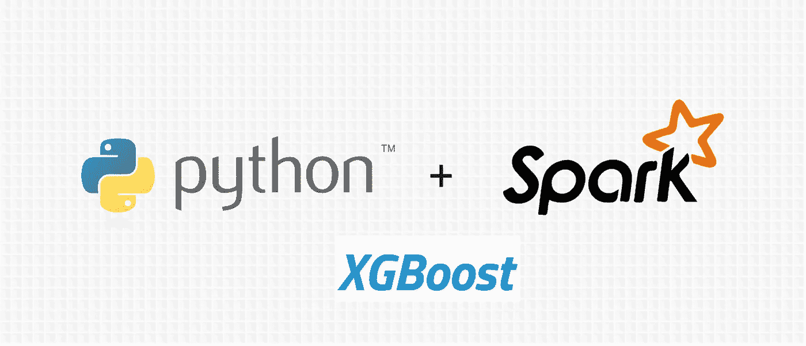

# 在 Kaggle Titanic 数据集上测试 PySpark ML 和 XGBoost 完全集成

> 原文：<https://towardsdatascience.com/pyspark-and-xgboost-integration-tested-on-the-kaggle-titanic-dataset-4e75a568bdb?source=collection_archive---------1----------------------->



在本教程中，我们将讨论如何使用标准的机器学习管道来集成 PySpark 和 XGBoost。

我们将使用来自“泰坦尼克号:机器从灾难中学习”的数据，这是众多 Kaggle 比赛之一，在 T2 举行。

**本文的新版本包括 PySpark 和 XGBoost 1.7.0+之间的原生集成，可以在** [**这里**](https://medium.com/@bogdan.cojocar/pyspark-integration-with-the-native-python-package-of-xgboost-3ac6d9082776) **找到。**

在开始之前，请了解您应该熟悉 [Apache Spark](https://spark.apache.org) 和 [Xgboost](http://xgboost.readthedocs.io/en/latest/get_started/) 和 Python。

本教程中使用的代码可以在 github 上的 Jupyther 笔记本中找到。

如果你对本教程的设置有任何问题，你可以查看另一篇解释如何在 [docker](https://medium.com/@bogdan.cojocar/pyspark-ml-and-xgboost-setup-using-a-docker-image-e2e6122cae0f) 中运行的文章。

## 步骤 1:下载或构建 XGBoost jars

python 代码需要两个 scala jars 依赖项才能工作。您可以直接从 maven 下载它们:

*   [xgboost4j](https://mvnrepository.com/artifact/ml.dmlc/xgboost4j/0.72)
*   [xgboost4j-spark](https://mvnrepository.com/artifact/ml.dmlc/xgboost4j-spark/0.72)

如果你想自己建造它们，你可以从我以前的教程[中找到方法。](https://medium.com/@bogdan.cojocar/how-to-make-xgboost-available-in-the-spark-notebook-de14e425c948)

## 步骤 2:下载 XGBoost python 包装器

你可以从[这里](https://github.com/dmlc/xgboost/files/2161553/sparkxgb.zip)下载 PySpark XGBoost 代码。这是我们将要编写的部分和 XGBoost scala 实现之间的接口。我们将在教程的后面看到如何将它集成到代码中。

## 第三步:开始一个新的 Jupyter 笔记本

我们将开始一个新的笔记本，以便能够编写我们的代码:

```
jupyter notebook 
```

## 步骤 4:将定制的 XGBoost jars 添加到 Spark 应用程序中

在启动 Spark 之前，我们需要添加之前下载的 jar。我们可以使用`--jars`标志来做到这一点:

```
import os
os.environ['PYSPARK_SUBMIT_ARGS'] = '--jars xgboost4j-spark-0.72.jar,xgboost4j-0.72.jar pyspark-shell'
```

## 步骤 5:将 PySpark 集成到 Jupyther 笔记本中

使 PySpark 可用的最简单的方法是使用`[findspark](https://github.com/minrk/findspark)`包:

```
import findspark
findspark.init()
```

## 步骤 6:开始 spark 会话

我们现在准备开始 spark 会话。我们正在创建一个 spark 应用程序，它将在本地运行，并将使用与使用`local[*]`的内核一样多的线程:

```
spark = SparkSession\
        .builder\
        .appName("PySpark XGBOOST Titanic")\
        .master("local[*]")\
        .getOrCreate()
```

## 步骤 7:添加 PySpark XGBoost 包装器代码

现在我们有了 spark 会话，我们可以添加之前下载的包装器代码:

```
spark.sparkContext.addPyFile("YOUR_PATH/sparkxgb.zip")
```

## 步骤 8:定义模式

接下来，我们定义从 csv 读取的数据的模式。这通常是一个比让 spark 推断模式更好的实践，因为它消耗更少的资源，并且我们完全控制字段。

```
schema = StructType(
  [StructField("PassengerId", DoubleType()),
    StructField("Survival", DoubleType()),
    StructField("Pclass", DoubleType()),
    StructField("Name", StringType()),
    StructField("Sex", StringType()),
    StructField("Age", DoubleType()),
    StructField("SibSp", DoubleType()),
    StructField("Parch", DoubleType()),
    StructField("Ticket", StringType()),
    StructField("Fare", DoubleType()),
    StructField("Cabin", StringType()),
    StructField("Embarked", StringType())
  ])
```

## 步骤 9:将 csv 数据读入数据帧

我们将 csv 读入一个`DataFrame`，确保我们提到我们有一个头，并且我们还用 0:

```
df_raw = spark\
  .read\
  .option("header", "true")\
  .schema(schema)\
  .csv("YOUR_PATH/train.csv")df = df_raw.na.fill(0)
```

## 步骤 10: C **将标称值转换为数值**

在浏览这一步的代码之前，让我们简单地浏览一下 Spark ML 的一些概念。他们引入了 ML pipelines 的概念，ML pipelines 是建立在`DataFrames`之上的一组高级 API，使得将多个算法合并到一个进程中变得更加容易。管道的主要元件是`Transformer`和`Estimator`。第一个可以表示一个可以将一个`DataFrame`转换成另一个`DataFrame`的算法，而后者是一个可以适合一个`DataFrame`来产生一个`Transformer`的算法。

为了将标称值转换成数值，我们需要为每列定义一个`Transformer`:

```
sexIndexer = StringIndexer()\
  .setInputCol("Sex")\
  .setOutputCol("SexIndex")\
  .setHandleInvalid("keep")

cabinIndexer = StringIndexer()\
  .setInputCol("Cabin")\
  .setOutputCol("CabinIndex")\
  .setHandleInvalid("keep")

embarkedIndexer = StringIndexer()\
  .setInputCol("Embarked")\
  .setOutputCol("EmbarkedIndex")\
  .setHandleInvalid("keep")
```

我们使用`StringIndexer`来转换这些值。对于每个`Transformer`,我们将定义包含修改值的输入列和输出列。

## 步骤 11: A **将列组装成特征向量**

我们将使用另一个`Transformer`将 XGBoost `Estimator`分类中使用的列组装成一个向量:

```
vectorAssembler = VectorAssembler()\
  .setInputCols(["Pclass", "SexIndex", "Age", "SibSp", "Parch", "Fare", "CabinIndex", "EmbarkedIndex"])\
  .setOutputCol("features")
```

## 步骤 12:定义 XGBoostEstimator

在这一步中，我们将定义产生模型的`Estimator`。这里使用的大多数参数都是默认的:

```
xgboost = XGBoostEstimator(
    featuresCol="features", 
    labelCol="Survival", 
    predictionCol="prediction"
)
```

我们只定义了`feature, label`(必须匹配来自`DataFrame`的列)和包含分类器输出的新的`prediction`列。

## 步骤 13: B **建立管道和分类器**

在我们创建了所有单独的步骤之后，我们可以定义实际的管道和操作顺序:

```
pipeline = Pipeline().setStages([sexIndexer, cabinIndexer, embarkedIndexer, vectorAssembler, xgboost])
```

输入`DataFrame`将被转换多次，最终将产生用我们的数据训练的模型。

## 步骤 14:训练模型并根据新的测试数据进行预测

我们首先将数据分为训练和测试，然后我们用训练数据拟合模型，最后我们看看我们为每个乘客获得了什么预测:

```
trainDF, testDF = df.randomSplit([0.8, 0.2], seed=24)model = pipeline.fit(trainDF)model.transform(testDF).select(col("PassengerId"), col("prediction")).show()
```