# Python 和 Slack:天生一对

> 原文：<https://towardsdatascience.com/python-and-slack-a-natural-match-60b136883d4d?source=collection_archive---------3----------------------->


([Source](https://www.pexels.com/photo/light-landscape-nature-red-33041/))

## 如何使用 Python 以编程方式发送 Slack 消息、发布绘图和监控机器学习模型

当你知道你能用 Python 做多少事情时，生活就会变得更加美好。当我阅读 [*用 Python*](https://automatetheboringstuff.com/) 自动化枯燥的东西，并看到有一些例行任务——比如任何与电子表格有关的事情——我不再需要浪费时间时，我的日常工作流程发生了第一次转变。相反，我可以花几分钟[写一个 Python 程序](/python-is-the-perfect-tool-for-any-problem-f2ba42889a85)(好吧，一开始可能要花几个小时)，运行脚本，然后坐下来看乏味的工作自行完成。

第二个转变发生在我意识到几乎任何带有 API 的服务— [应用编程接口](https://medium.freecodecamp.org/what-is-an-api-in-english-please-b880a3214a82) —都可以用 Python 操作的时候。你可以在 Spotify ( [Spotipy 库](https://spotipy.readthedocs.io/en/latest/))、Twitter([python-Twitter](https://python-twitter.readthedocs.io/en/latest/))、Wikipedia([Wikipedia API](https://pypi.org/project/wikipedia/))和 Slack([Slacker](https://github.com/os/slacker)for Python)等应用中做的任何事情，都可以通过 Python 代码来完成。

> 这意味着您不必局限于在应用程序中与这些服务进行交互，而是可以编写代码来自动化复杂的工作流或构建新工具。

在本文中，我们将看到如何使用 [Slacker Python 库](https://github.com/os/slacker)以编程方式与 Slack 交互。我们将能够从工作区检索任何数据，更改频道和用户的设置，发布消息，上传文件，创建应用程序，甚至实时监控机器学习结果。完整的代码可以在 GitHub 的 [Jupyter 笔记本上获得。](https://github.com/WillKoehrsen/Data-Analysis/blob/master/slack_interaction/Interacting%20with%20Slack.ipynb)

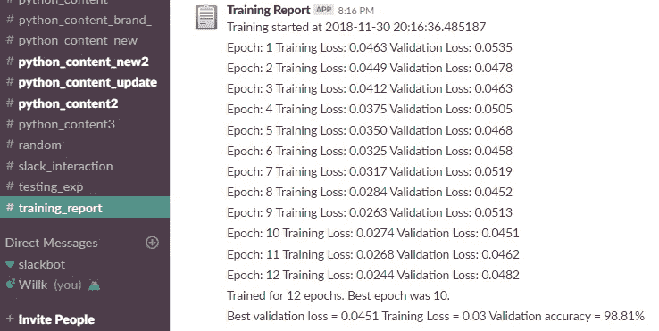

Real-time monitoring of machine learning in Slack.

# 懒鬼入门

[Slacker](https://github.com/os/slacker) 是 Slack API 的 Python 接口。它包装了 [Slack API](https://api.slack.com/) 服务(完全由 Slack 支持)，并允许我们编写 Python 代码，而不是自己格式化对 API 的请求。这意味着构建查询的时间要少得多，与 Slack 的交互也更容易。在使用 Slacker 库时,[Slacker API 方法文档](https://api.slack.com/methods)非常有用(它的文档相对较少)。无论你想在闲暇时做什么，只要你愿意做一点搜索，你都可以通过这个库来做！

## 入门指南

首先，您需要创建一个[松弛工作空间](https://slack.com)。我假设如果你有信心编写 Python 代码，你可以自己处理这一步。我建议创建一个新的工作空间，在这里你是测试交互的管理员。下一步是获取遗留 API 令牌。如果您已登录工作区，请前往[此链接](https://api.slack.com/custom-integrations/legacy-tokens)。确保将您的令牌放在安全的地方！

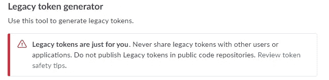

使用您的 API 令牌向 Slacker 进行身份验证，如下所示:

```
from slacker import Slacker# Authenticate with slacker
slack = Slacker(slack_api_token)
```

通过打印出工作区的名称来检查您是否已连接:

```
# Check for success
if slack.api.test().successful:
    print(
        f"Connected to {slack.team.info().body['team']['name']}.")
else:
    print('Try Again!') **Connected to Data Analysis.**
```

# 与时差互动

在 slack 中你可以做的任何事情(好的，几乎任何事情)都可以通过 Python 与 API 的接口来完成。(点击查看[完整的方法列表)。例如，下面是我们可以对渠道做的一切:](https://api.slack.com/methods)


## 信息检索

让我们从一些简单的数据检索开始。每次我们在`Slacker`中使用不同的函数时，我们都会得到一个*响应*对象，其中`body`保存结果(如果请求成功)。我们可以检索很多不同的信息。例如，以下是渠道和目的:

```
# Make a request to get the channels
r = slack.channels.list()
channels = r.body*# Iterate through channels*
for c in channels['channels']:
    print(f'Channel {c["name"]} Purpose: {c["purpose"]["value"]}') **Channel general Purpose: This channel is for workspace-wide communication and announcements. All members are in this channel.**

**Channel python_content Purpose: Data Science and Python**

**Channel random Purpose: Deep philosophical discussions****Channel testing_exp Purpose: Experimental testing of interactions.**
```

如果我们想检查用户(成员)，下面是代码和结果:

```
from IPython.display import Image# Find all users
users = slack.users.list().bodyfor u in users['members']:
    *# Print some information*
    print(f'User: {u["name"]}, Real Name: {u["real_name"]},                  
            Time Zone: {u["tz_label"]}.')
    print(f'Current Status: {u["profile"]["status_text"]}')

    *# Get image data and show*
    Image(user['profile']['image_192'])
```

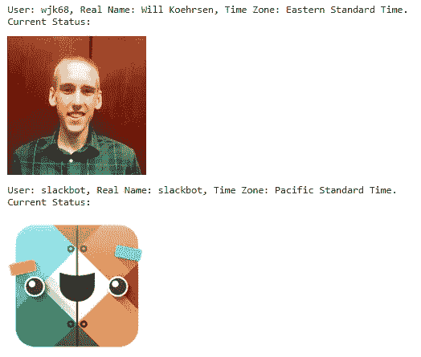

Users in our workspace

这个工作区挺寂寞的！我们可以在频道中搜索文件或消息，查看频道的历史记录，甚至查看“请勿打扰”设置:

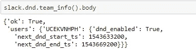

(在这种情况下，用户是指 id。我们可以找到带有`slack.users.get_user_id(username)`的用户名的用户 id。

## 更改设置和属性

我们不仅可以找到我们想要的任何信息，还可以改变属性。也许我想告诉我的团队让我一个人呆着:

```
# Set do not disturb for 2 hours
slack.dnd.set_snooze(num_minutes=120)
```

我还可以更改我的个人资料设置:

```
slack.users.profile.set(user = 'wjk68', name = 'status_text', 
                        value = 'Writing some code')
slack.users.profile.set(user = 'wjk68', name = 'status_emoji',
                        value = ':male-technologist')
```

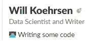

关于表情符号的话题，你可以使用[表情符号代码](https://www.webpagefx.com/tools/emoji-cheat-sheet/)来指定你想要的图标。最简单的方法就是去 Slack，搜索你想要的表情符号，然后复制出现的代码:

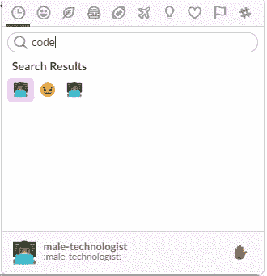

Searching for an emoji code.

想创建一个新的频道并设定目的？两行 python 代码:

```
# Create a new channel and set purpose
slack.channels.create('python_content_new')
slack.channels.set_purpose('python_content_new', 'Data Science and Python')
```

# 发布消息

当然，我们不只是想成为信息的被动消费者。我们要和世界对话！幸运的是，`Slacker`让我们可以轻松发布到任何频道:

```
# Post a message
slack.chat.post_message(channel='python_content',
                            text='Have a great day!',
                            username='Python Test',
                            icon_url='http://devarea.com/wp-content/uploads/2017/11/python-300x300.png')
```

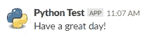

如果我们设置了`username`,那么消息将作为机器人发布。我们可以通过指定 url 或表情符号来选择图标。我们也可以用`<@user_id>`提到具体用户或者犯下终极之罪通知大家:

```
slack.chat.post_message(channel='python_content',
                            text='<!everyone> *This is not atest!*',
                            username='Alert',
                            icon_emoji=':female-firefighter:')
```


消息可以像我们想要的那样复杂。使用附件，我们可以格式化消息，甚至创建游戏！有关所有选项，请参考 [Slack API 关于格式化消息的文档](https://api.slack.com/docs/message-attachments)。

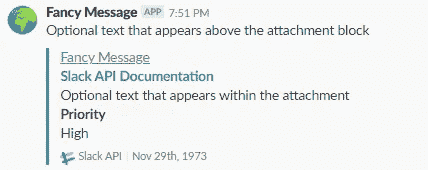

Message formatting

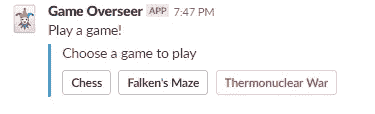

App created via a message

您可以使用交互消息构建[复杂的应用程序工作流。](https://api.slack.com/interactive-messages#building_workflows)

## 上传文件

上传本地文件是另一个单行程序:

```
slack.files.upload(file_='images/volcano_crater.jpg',
                   channels=['random'], title='Volcano Crater',
                   initial_comment='This would make a great          
                                    display background')
```


Uploaded files.

如果我们已经做了一些很酷的分析，并想与团队分享这些图，我们保存这些数字并上传:

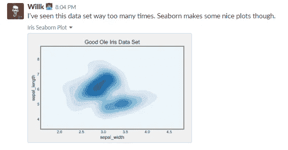

我们还可以使用 API 删除文件或消息、添加评论、创建私人聊天、邀请用户、设置提醒等等。

# 监控机器学习训练

好了，是时候认真对待一些真正的工作了。在这里，我们将发送消息来监控卷积神经网络(CNN)的训练进度。我正在使用 Keras 的[脚本来训练 CNN 识别 MNIST 数字。有了 Keras](https://github.com/keras-team/keras/blob/master/examples/mnist_cnn.py) 中的自定义[回调，我们可以在每个时期结束时用当前统计数据向 Slack 发送一条消息。S](https://keras.io/callbacks/) [ee 笔记本完整代码](http://nbviewer.jupyter.org/github/WillKoehrsen/Data-Analysis/blob/master/slack_interaction/Interacting%20with%20Slack.ipynb)，但基本轮廓在下面(这是伪代码，不会太跑):

现在，我们可以在 Slack 中获得实时深度学习更新！


在训练结束时，我们可以创建一些训练曲线并发布出来:

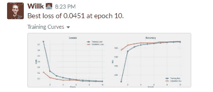

## 发布预测

最后，一旦我们的模型训练完毕，我们就可以发布来自测试集的预测:


Predictions from convolutional neural network on test set.

这款做的相当不错！对于这个简单的例子，监控可能是不必要的，但是有很多用例跟踪一个模型或者发布[持续集成结果](https://www.fullstackpython.com/continuous-integration.html)。我整夜运行模型，当我不想去命令窗口查看进度时，只查看 Slack 是有用的。

> 当有事情需要你注意时，自动发布到 Slack 或通知你的写作工具可以让你把注意力转移到更重要的事情上。最终，程序化的工作流减少了花费在繁琐任务上的时间和精力。

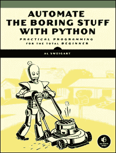

Reduce the amount of tedium in your life with Python! [(Book available for free)](https://automatetheboringstuff.com/).

# 结论

虽然 Slack 等应用程序可以用来娱乐，但如果使用得当，它们也可以提高生产率。此外，如果我们意识到这些应用程序可以通过 Python 访问它们的 API，我们就可以通过编程来控制它们，从而提高效率。

在本文中，我们看到了如何通过 Python 中的`Slacker`库与 Slack 交互。这个库让我们可以访问 Slack API，这意味着我们几乎可以控制工作空间的每个方面。除了其他事情，我们可以

*   检索频道、消息和用户信息
*   更改和管理用户、渠道和团队设置
*   发布包括应用程序在内的消息
*   跟踪机器学习的进度并绘制结果

如果 Slack 不是你最喜欢的应用程序(尽管它应该取代你的电子邮件)，看看 Python API 接口的[列表。即使这个特殊的用例对你来说没有吸引力，但是我们可以使用 Python 来完成日常任务的想法是很有说服力的，因为它使我们更有效率。](https://github.com/realpython/list-of-python-api-wrappers)

一如既往，我欢迎反馈和建设性的批评。可以通过 Twitter [@koehrsen_will](http://twitter.com/@koehrsen_will) 或者通过我的个人网站 [willk.online](https://willk.online) 找到我。