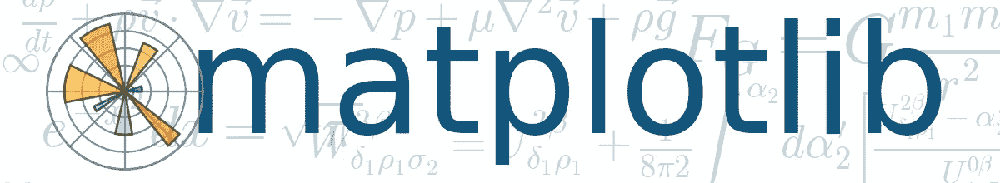

# 基于 Python 的 Matplotlib 绘图

> 原文：<https://towardsdatascience.com/python-based-plotting-with-matplotlib-8e1c301e2799?source=collection_archive---------7----------------------->

如果你是一个使用 Python 的分析师，你的面包和黄油可能由 matplotlib、pandas、numpy 和 sklearn 组成。在这篇博客中，我将讲述使用 matplotlib 绘图的基础知识。所有的 Jupyter 笔记本都在这里:
[https://github . com/snaz rul 1/PyRevolution/tree/master/matplotlib](https://github.com/snazrul1/PyRevolution/tree/master/matplotlib)

# 介绍

# 图形和轴

# 2D 策划

# 三维绘图