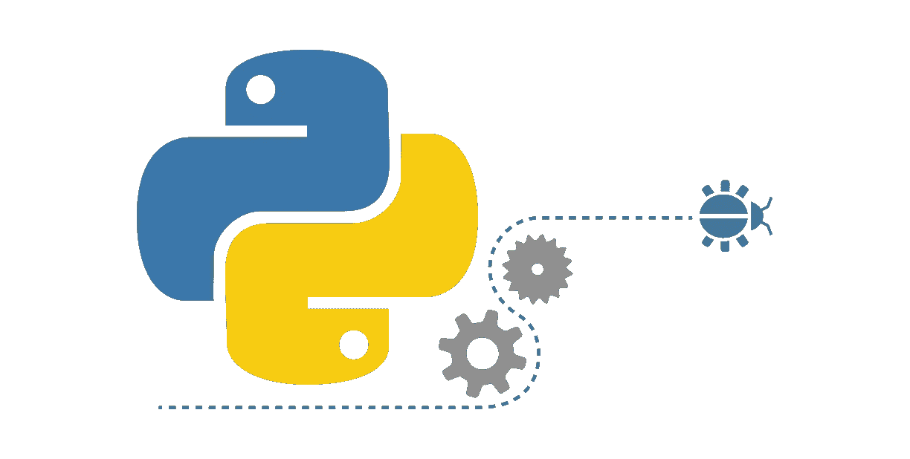

# 数据科学的 Python 基础

> 原文：<https://towardsdatascience.com/python-basics-for-data-science-6a6c987f2755?source=collection_archive---------1----------------------->

Source: [https://www.quora.com/Can-you-suggest-some-good-books-websites-for-learning-Python-for-a-layman](https://www.quora.com/Can-you-suggest-some-good-books-websites-for-learning-Python-for-a-layman)

# Python 数据类型

在 Python 中，我们有许多数据类型。最常见的有 float(浮点)、int(整数)、str(字符串)、bool(布尔)、list、dict(字典)。

*   浮点数-用于实数。
*   int——用于整数。
*   str -用于文本。我们可以用单引号`'value'`，双引号`"value"`，或者三引号`"""value"""`来定义字符串。用三重引号括起来的字符串可以在多行上，新行将包含在变量值中。它们也用于编写函数文档。
*   bool -用于真值。用于对数据执行过滤操作。
*   list -用于存储值的集合。
*   dict -用来存储一个键值对。

我们可以使用`type(variable_name)`函数来检查特定变量的类型。Python 中的运算符根据变量的类型有不同的行为，并且每种类型都有不同的内置方法。

这里我们可以看一些用 Python 创建浮点、整数、字符串和布尔值的例子。

# Python 列表

Python 列表是一种基本的序列类型。我们可以使用这种类型来存储值的集合。一个列表可以包含任何类型的值。一个列表可能包含另一个值的嵌套列表。这并不常用，但是您可以拥有一个混合了 Python 类型的列表。您可以使用方括号创建一个新的，如下所示:

`fruits = ["pineapple", "apple", "lemon", "strawberry", "orange", "kiwi"]`

## 子集列表

您可以使用索引从列表中获取一个或多个元素。在 Python 中，索引从`0.`开始，因此列表中的第一个元素将有一个索引`0`。我们也可以使用负索引来访问元素。列表中的最后一个元素将有一个索引`-1`，最后一个元素之前的元素将有一个索引`-2`，依此类推。Python 中还有一个叫做**列表切片**的东西，可以用来从一个列表中获取多个元素。我们可以这样用:`sliceable[start_index:end_index:step].`

*   `start_index`是切片的起始索引，该索引处的元素将包含在结果中，默认值为`0`。
*   `end_index`是切片的结束索引，该索引处的元素将**不包含在结果中**，默认值为`length of the list`。此外，如果步长为负，默认值可以是`- length of the list -1`。如果跳过这一步，您将获得从开始索引到结尾的所有元素。
*   `step`是指数增加的量，
    默认值为`1`。如果我们为步长设置一个负值，我们将向后移动。

## 列表操作

*   我们可以使用`append`方法或`plus operator`向列表中添加一个或多个元素。如果在两个列表上使用加号运算符，Python 将给出两个列表内容的新列表。
*   我们可以使用已经用于索引和列表切片的方括号将一个或多个元素更改为 list。
*   我们可以用`remove(value)`方法从列表中删除一个元素。此方法将删除带有传递值的列表的第一个元素。

理解 Python 中列表的幕后工作方式很重要。当你创建一个新的列表`my_list`时，你将列表存储在你的计算机内存中，列表的地址存储在`my_list`变量中。变量`my_list`不包含列表中的元素。它包含对列表的引用。如果我们像这样复制一个只有等号的列表`my_list_copy = my_list`，你将在`my_list_copy`变量中复制引用，而不是列表值。所以，如果你想复制实际值，你可以使用`list(my_list)`函数或切片`[:]`。

# Python 词典

字典用于存储**键值对**。当你想用**唯一键**索引你的值时，它们会很有帮助。在 Python 中，你可以使用**花括号**创建一个字典。此外，键和值由冒号**分隔。如果我们想得到给定键的值，我们可以这样做:`our_dict[key]`。**

## 字典与列表

让我们看一个例子，将列表和字典进行比较。假设我们有一些电影，你想为它们存储收视率。此外，我们希望通过电影名称快速访问电影的分级。我们可以通过使用两个列表或一本字典来做到这一点。在示例中,`movies.index(“Ex Machina”)`代码返回“ex 玛奇纳”电影的索引。

Movie rating using lists.

Movie ratings using a dictionary.

在这种情况下，使用字典是一种更直观和方便的方式来表示评级。

## 字典操作

我们可以**添加**、**更新**、**从我们的字典中删除**数据。当我们想要添加或更新数据时，我们可以简单地使用这个代码`our_dict[key] = value`。当我们想要删除一个键-值对时，我们这样做`del(our_dict[key])`。

我们还可以像这样检查给定的键是否在我们的字典中:`key in our_dict`。

# 功能

函数是解决特定任务的一段可重用代码。我们可以像这样使用`def`关键字来编写函数:

但是 Python 中有很多内置函数，比如`max(iterable [, key]),` 、`min(iterable [, key])`、`type(object)`、`round(number [, ndigits])`等。因此，在许多情况下，当我们需要一个函数来解决一个给定的任务时，我们可以研究一个内置的函数来解决这个任务或者一个 Python 包来解决这个问题。我们不必“[多此一举](https://en.wikipedia.org/wiki/Reinventing_the_wheel)”。

大多数函数接受一些输入并返回一些输出。这些函数有参数，Python 将函数调用中传递的输入与参数匹配。如果一个参数用方括号括起来，那么它就是可选的。

我们可以使用函数`help([object])`或`?function_name`来查看任何函数的文档。如果我们使用 Jupyter Notebook，`help`函数将显示当前单元格中的文档，而第二个选项将显示页面中的文档。

# 方法

我们已经看到，我们有字符串，浮点，整数，布尔，等等。在 Python 中。这些数据结构的每一个都是一个对象。方法是根据对象类型对给定对象可用的函数。因此，每个对象都有一个特定的类型和一组依赖于该类型的方法。

不同类型的对象可以有相同名称的方法。根据对象的类型，方法有不同的行为。

小心！一些方法可以改变它们被调用的对象。例如，在列表类型上调用的`append()`方法。

# 包装

模块是包含 Python 定义和语句的文件。模块指定了解决特定问题的函数、方法和新的 Python 类型。

包是目录中模块的集合。Python 有许多可用的包，涵盖了不同的问题。比如“NumPy”、“matplotlib”、“seaborn”、“scikit-learn”都是非常著名的数据科学包。

*   “NumPy”用于高效地处理数组
*   “matplotlib”和“seaborn”是用于数据可视化的流行库
*   “scikit-learn”是一个强大的机器学习库

默认情况下，Python 中有一些可用的包，但也有很多我们需要但默认情况下没有的包。如果我们想使用某个包，我们必须已经安装了它，或者只是使用 pip(Python 的包维护系统)来安装它。

然而，还有一种东西叫做“蟒蛇”。

> Anaconda 发行版是一个免费的、易于安装的包管理器、环境管理器和 Python 发行版，包含 1，000 多个开源包，并有免费的社区支持。

所以，如果你不想安装很多包，我会推荐你使用“Anaconda”。这个发行版中有这么多有用的包。

## 导入报表

一旦安装了所需的包，就可以将它们导入到 Python 文件中。我们可以从中导入整个包、子模块或特定功能。此外，我们可以为包添加别名。从下面的例子中，我们可以看到导入语句的不同方式。

Simple Import Statement

Import statement With an Alias

Import Submodule From a Package With an Alias

Import Only One Function From a Package

我们也可以做这样的事情`from numpy import *`。这里的星号表示从该模块导入所有内容。这个 import 语句在当前名称空间中创建对由`numpy`模块定义的所有公共对象的引用。换句话说，我们可以使用`numpy`中所有可用的函数，只使用不带前缀的名字。例如，现在我们可以使用 NumPy 的绝对函数，如`absolute()`而不是`numpy.absolute()`。
但是，我不建议您使用它，因为:

*   如果我们像那样从一些模块中导入所有的函数，那么当前的名称空间将会充满如此多的函数，如果有人查看我们的代码，他或她可能会搞不清哪个包是特定的函数。
*   如果两个模块有一个同名的函数，第二个导入将覆盖第一个的函数。

# NumPy

NumPy 是使用 Python 进行科学计算的基础包。它非常快而且容易使用。这个软件包帮助我们逐元素地进行计算。

常规的 Python 列表不知道如何对元素进行操作。当然，我们可以使用 Python 列表，但是它们很慢，并且我们需要更多的代码来实现想要的结果。在大多数情况下，更好的决定是使用`NumPy`。

与常规 Python 列表不同，NumPy 数组总是只有一种类型。如果我们将不同类型的数组传递给`np.array()`，我们可以使用参数`dtype`选择想要的类型。如果未给定此参数，则类型将被确定为保存对象所需的最小类型。

NumPy Array — Type Converting

NumPy 数组自带属性和方法。还记得 Python 中的操作符对不同的数据类型有不同的行为吗？在 NumPy 中，操作符的行为是基于元素的。

Operators on NumPy Array

如果我们检查 NumPy 数组的类型，结果将是`numpy.ndarray`。Ndarray 表示 n 维数组。在上面的例子中，我们使用了一维数组，但是没有什么可以阻止我们制作 2 维、3 维、4 维或更多维的数组。我们可以在一个数组上做子集化，与这个数组的维数无关。我将给你们展示一些二维数组的例子。

Subsetting 2-dimensional arrays

如果我们想知道数组有多少个维度，每个维度有多少个元素，我们可以使用`shape`属性。对于二维数组，元组的第一个元素是行数，第二个元素是列数。

NumPy Shape Attribute

## 基本统计

分析数据的第一步是熟悉数据。NumPy 有很多方法可以帮助我们做到这一点。我们将看到一些对数据进行统计的基本方法。

*   `np.mean()` -返回算术平均值(元素之和除以元素长度)。
*   `np.median()` -返回中间值(传递的数组的排序副本的中间值，如果数组的长度是偶数-将计算两个中间值的平均值)
*   `np.corrcoef()` -返回一个相关矩阵。当我们想知道数据集中的两个变量之间，或者换句话说，两个长度相同的数组之间，是否存在相关性时，这个函数非常有用。
*   `np.std()` -返回标准偏差

Generating Basic Statistics using NumPy

从上面的例子中，我们可以看到学习时间和成绩之间有很高的相关性。
同样，我们可以看到:

*   学习时间的平均值为 4.6 小时
*   学习时间的中位数是 4.0
*   学习时间的标准偏差是 3.2

NumPy 也有一些基本的函数，如`np.sort()`和`np.sum()`，它们也存在于基本的 Python 列表中。这里需要注意的一点是，NumPy 在数组中强制使用单一类型，这样可以加快计算速度。

# 练习

我已经准备了一些练习，包括子集，元素操作和基本统计。如果你愿意，你可以试着解决它们。

*   [子集化 Python 列表](https://gist.github.com/Ventsislav-Yordanov/fb14e1c52a2b4d18422dc7075d5a09cb)
*   [子集化二维数组](https://gist.github.com/Ventsislav-Yordanov/3ef4587b274643a161e4bea0952950ab)
*   [NumPy 元素式运算](https://gist.github.com/Ventsislav-Yordanov/48a5e73ae43c668e2f2f725a503ca96c)
*   [NumPy 基本统计](https://gist.github.com/Ventsislav-Yordanov/8b7e47cda7b63bf97cfa5c80f05f50b3)

# 互动版

[这里的](https://beta.deepnote.com/launch?template=deepnote&url=https%3A%2F%2Fstorage.googleapis.com%2Fdeepnote-public-templates%2Fvyordanov%2Fbasics.tar.gz)是在 [Deepnote](https://deepnote.com) (云托管 Jupyter 笔记本平台)上传的这篇文章的**交互版本**。请随意查看并使用示例。

# 我的其他博客文章

*   [Jupyter 笔记本快捷键](https://medium.com/@ventsislav94/jypyter-notebook-shortcuts-bf0101a98330)。
*   [Python 基础:迭代和循环](/python-basics-iteration-and-looping-6ca63b30835c)
*   [Python 基础:列表理解](/python-basics-list-comprehensions-631278f22c40)
*   [Python 数据科学:Matplotlib 数据可视化简介](/data-science-with-python-intro-to-data-visualization-and-matplotlib-5f799b7c6d82)
*   [使用 Python 的数据科学:使用 pandas 加载、子集化和过滤数据简介](/data-science-with-python-intro-to-loading-and-subsetting-data-with-pandas-9f26895ddd7f)
*   [文本自然语言处理简介](/introduction-to-natural-language-processing-for-text-df845750fb63)

# 商务化人际关系网

这是我在 LinkedIn 上的简介，如果你想和我联系的话。我将很高兴与你联系在一起。

# 最后的话

谢谢你的阅读。如果你喜欢这个帖子，请按住拍手键分享给你的朋友。另外，我很高兴听到你的反馈。如果你想在我写新博客时得到通知，你可以订阅[我的简讯](https://buttondown.email/Ventsislav)。