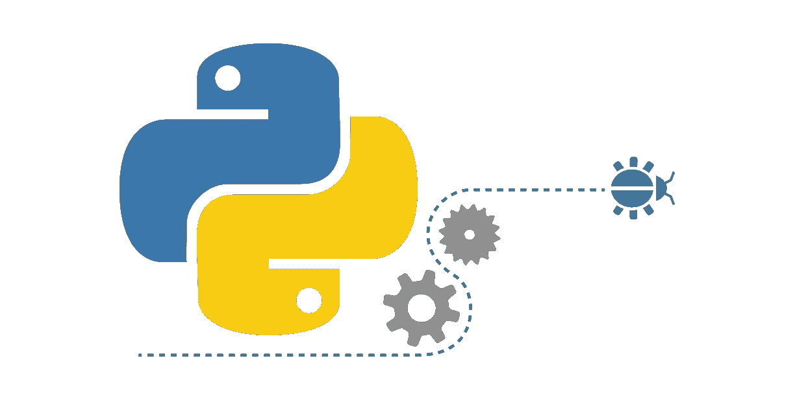
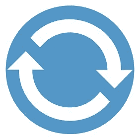

# Python 基础:迭代、可迭代对象、迭代器和循环

> 原文：<https://towardsdatascience.com/python-basics-iteration-and-looping-6ca63b30835c?source=collection_archive---------0----------------------->



Source: [https://www.quora.com/Can-you-suggest-some-good-books-websites-for-learning-Python-for-a-layman](https://www.quora.com/Can-you-suggest-some-good-books-websites-for-learning-Python-for-a-layman)

看完这篇博文，你就知道了:

*   Python 中的**迭代**如何工作**幕后**
*   什么是**迭代器**和**迭代器**以及如何创建它们
*   什么是**迭代器协议**
*   什么是**懒评**
*   什么是**发生器函数**和**发生器表达式**

# Python 的 for 循环

Python 没有传统的`for`循环。让我们来看一段伪代码，看看传统的 for 循环在许多其他编程语言中是什么样子的。

A Pseudocode of for loop

*   在进入循环之前，**初始化器部分**只执行一次。
*   **条件段**必须是一个**布尔表达式**。如果该表达式的计算结果为 True，则执行下一次循环迭代。
*   迭代器部分定义了每次迭代后发生的事情。

现在，让我们看看如何用 JavaScript 编写传统的 for 循环。

Simple For Loop in JavaScript

输出:

```
10
12
15
18
20
```

许多其他编程语言都有这种 for 循环，但是 Python 没有。不过， **Python** 有个叫`**for**` **循环**的东西，但是它**的工作方式就像是** [**foreach 循环**](https://en.wikipedia.org/wiki/Foreach_loop) 。

Simple For Loop in Python

输出:

```
10
12
15
18
20
```

从上面的例子中，我们可以看到在 Python 的`for`循环中，我们没有任何我们之前见过的部分。没有初始化、条件或迭代器部分。

# 可重复的

iterable 是一个能够让**逐个返回**其**成员** **的对象。换句话说，iterable 是可以用 Python 中的`for`循环遍历的任何东西。**

## 顺序

序列是非常常见的**类型**的**可迭代**。内置序列类型的一些示例有 [**列表**](https://docs.python.org/3.3/library/stdtypes.html#list) 、 [**字符串**](https://docs.python.org/3.3/library/stdtypes.html#str) 和 [**元组**](https://docs.python.org/3.3/library/stdtypes.html#tuple) 。

Lists, Tuples, and Strings in Python

它们通过`__getitem()__`特殊方法(索引)使用整数**索引**支持高效的**元素访问**，并定义一个返回序列的**长度**的`__length()__`方法。

Element access using indices.

输出:

```
10
blueberry
❤
```

同样，我们可以对它们使用**切片**技术。如果你不知道什么是切片，可以在我讲解的时候查一下我之前文章的[一篇](/python-basics-for-data-science-6a6c987f2755)。切片技术的解释在“子集列表”一节中。

Slicing Sequences.

输出:

```
[10, 12]
('pineapple', 'blueberry')
love Python ❤️
```

## 其他可重复项目

Python 中的很多东西都是可迭代的，但并不都是序列。**字典**、**文件对象**、**集合**、**生成器**都是可迭代的，但没有一个是序列。

Sets, Dictionaries, Files, and Generators.

# Python 的 for 循环不使用索引

让我们考虑一下如何在不使用 Python 中的`for`循环的情况下循环遍历一个 iterable。我们中的一些人可能认为我们可以使用一个`while`循环并生成索引来实现这一点。

输出:

```
1
2
3
4
5
```

这种方法似乎对列表和其他序列对象非常有效。**非序列**对象呢？他们**不支持索引**，所以这种方法对他们不适用。

输出:

```
**--------------------------------------------------------------------**
**TypeError**                          Traceback (most recent call last)
**<ipython-input-22-af1fab82d68f>** in <module>**()**
      2 numbers **=** **{1,** **2,** **3,** **4,** **5,** **6,** **7,** **8,** **9,** **10}**
      3 **while** index **<** len**(**numbers**):**
**----> 4** print**(**numbers**[**index**])**
      5     index **+=** **1**

**TypeError**: 'set' object does not support indexing
```

嗯，但是 Python 的 for 循环是如何处理这些可重复项的呢？我们可以看到它适用于集合。

Iterate over a set.

输出:

```
1
2
3
4
5
```

# 迭代器

迭代器是一个表示数据流的对象。您可以通过将`iter()`内置函数应用于**可迭代对象**来创建迭代器对象。

输出:

```
<list_iterator object at 0x000001DBCEC33B70>
<tuple_iterator object at 0x000001DBCEC33B00>
<str_iterator object at 0x000001DBCEC33C18>
```

你可以使用一个迭代器来手动循环**到**它来自的**可迭代**。迭代器向内置函数`next()`的重复传递会返回**流**中的**连续项**。一旦你消费了迭代器中的一个条目，它就消失了。当没有更多的数据可用时，产生一个`StopIteration`异常。

输出:

```
10
20
30**--------------------------------------------------------------------**
**StopIteration**                      Traceback (most recent call last)
**<ipython-input-14-fd36f9d8809f>** in <module>**()**
      4 print**(**next**(**iterator**))**
      5 print**(**next**(**iterator**))**
**----> 6** print**(**next**(**iterator**))**

**StopIteration**:
```

在幕后，Python 的`for`循环正在使用迭代器。

# 理解 Python 的 for 循环是如何工作的



Source: [https://www.incredible-web.com/blog/performance-of-for-loops-with-javascript/](https://www.incredible-web.com/blog/performance-of-for-loops-with-javascript/)

现在，我们知道了什么是 iterables 和迭代器，以及如何使用它们。我们可以尝试定义一个循环遍历 iterable 的函数，而不使用`for`循环。

为此，我们需要:

*   从给定的可迭代对象创建一个迭代器
*   从迭代器中反复获取下一个项目
*   **执行**想要的**动作**
*   **停止循环**，如果我们在尝试获取下一个项目时遇到了**Stop iteration**异常

Custom For Loop in Python. Source: [https://opensource.com/article/18/3/loop-better-deeper-look-iteration-python](https://opensource.com/article/18/3/loop-better-deeper-look-iteration-python)

让我们试着用一组**数字和`print`内置函数来使用这个函数。**

Custom For Loop in Python - Usage.

输出:

```
1
2
3
4
5
```

我们可以看到，我们定义的函数非常适合集合，集合不是序列。这一次我们可以通过**任何可迭代的**并且它将工作。在幕后，Python 中所有形式的**循环遍历 iterables** 都是这样工作的。

# 迭代器协议

迭代器对象需要支持以下**两种方法**，它们共同构成**迭代器协议**:

*   迭代器。__iter__()
    返回**迭代器对象本身**。这是允许容器(也称为集合)和迭代器与`for`和`in`语句一起使用所必需的。
*   迭代器。__next__()
    从容器中返回**下一个项目**。如果没有更多的项目，引发 **StopIteration** 异常。

从上面的方法描述中，我们看到我们可以在迭代器上循环。所以迭代器也是可迭代的。

记住，当我们将`iter()`函数应用于一个可迭代对象时，我们得到了一个迭代器。如果我们在迭代器上调用`iter()`函数**，它总是**返回给我们自己**。**

输出:

```
True
100
200
300
```

# 关于迭代器的附加注释

这听起来可能有点令人困惑。但是，如果第一次的事情没有全部理解，也不用担心。让我们回顾一下！

*   一个**可迭代的**是你可以**循环遍历**的东西。
*   一个**迭代器**是一个代表**数据流**的对象。它在一个 iterable 上进行**迭代**。

此外，在 Python 中，**迭代器也是可迭代的**，充当它们自己的**迭代器**。

然而，区别在于迭代器没有一些可迭代的特性。它们**没有长度**并且**不能被转位**。

例子

Iterators No Length Error

输出:

```
**--------------------------------------------------------------------**
**TypeError**                          Traceback (most recent call last)
**<ipython-input-15-778b5f9befc3>** in <module>**()**
      1 numbers **=** **[100,** **200,** **300]**
      2 iterator **=** iter**(**numbers**)**
**----> 3** print**(**len**(**iterator**))**

**TypeError**: object of type 'list_iterator' has no len()
```

Indexing Iterators Error

输出:

```
**--------------------------------------------------------------------**
**TypeError**                          Traceback (most recent call last)
**<ipython-input-16-64c378cb8a99>** in <module>**()**
      1 numbers **=** **[100,** **200,** **300]**
      2 iterator **=** iter**(**numbers**)**
**----> 3** print**(**iterator**[0])**

**TypeError**: 'list_iterator' object is not subscriptable
```

# 迭代器很懒

Source: [https://giphy.com/gifs/animal-lazy-spirit-gdUxfKtxSxqtq](https://giphy.com/gifs/animal-lazy-spirit-gdUxfKtxSxqtq)

> 迭代器允许我们使用和创建**惰性可迭代对象**，它们不做任何工作，直到我们向它们请求下一项。

来源:[https://open source . com/article/18/3/loop-better-deep-look-iteration-python](https://opensource.com/article/18/3/loop-better-deeper-look-iteration-python)

由于它们的懒惰，迭代器可以帮助我们处理**无限长的迭代器**。在某些情况下，我们甚至不能在内存中存储所有的信息，所以我们可以使用迭代器，它可以在我们每次请求时给出下一项。迭代器可以**为我们**节省大量**内存**和 **CPU 时间**。

这种做法叫做 [**懒评**](https://en.wikipedia.org/wiki/Lazy_evaluation) 。

# 迭代器无处不在

我们已经看到了一些迭代器的例子。此外，Python 有许多内置的迭代器类。例如，`enumerate`和`reversed`对象是迭代器。

## 列举例子

输出:

```
<class 'enumerate'>
(0, 'apple')
```

## 反例

输出:

```
<class 'reversed'>
blueberry
```

Python 的`zip`、`map`和`filer`对象也是迭代器。

## Zip 示例

输出:

```
<class 'zip'>
(1, 1)
(2, 4)
```

## 地图示例

输出:

```
<class 'map'>
1
4
```

## 过滤器示例

输出:

```
<class 'filter'>
3
```

而且 Python 中的**文件对象**也是迭代器。

输出:

```
<class '_io.TextIOWrapper'>
This is the first line.

This is the second line.

This is the third line.
```

我们还可以使用`items()`方法迭代 Python **字典**的**键值对**。

输出:

```
<class 'dict_items'>
name Ventsislav
age 24
```

很多人用 Python 解决**数据科学**问题。在某些情况下，您处理的数据可能非常大。在这种情况下，我们无法将所有数据加载到内存中。

解决方案是**将**数据分块**加载**，然后对每个块执行所需的操作，丢弃该块并加载下一个数据块。换句话说我们需要创建一个迭代器。我们可以通过使用**熊猫**中的`read_csv`函数来实现这一点。我们只需要指定**块大小**。

## 大型数据集示例

在这个例子中，我们将看到一个名为“[鸢尾物种](https://www.kaggle.com/uciml/iris)的小数据集的想法，但同样的概念也适用于非常大的数据集。我已经更改了栏目名称，你可以在这里找到我的版本。

输出:

```
{'Iris-setosa': 50, 'Iris-versicolor': 50, 'Iris-virginica': 50}
```

Python 标准库中和第三方库中有许多迭代器对象。

# 通过定义类创建自定义迭代器

在某些情况下，我们可能想要创建一个**自定义迭代器**。我们可以通过定义一个具有 **__init__** 、 **__next__** 和 **__iter__** 方法的类来做到这一点。

让我们试着创建一个自定义迭代器类，生成最小值和最大值之间的数字。

输出:

```
<class '__main__.generate_numbers'>
40
41
42
```

我们可以看到这是可行的。然而，使用**生成器函数**或**生成器表达式**来创建定制迭代器要容易得多。

# 生成器函数和生成器表达式

通常，当我们想要创建一个自定义迭代器时，我们使用一个**生成器函数**或**生成器表达式**。它们使用起来更简单，并且需要更少的 T21 代码来达到同样的效果。

## 发电机功能

让我们从 Python 文档中看看什么是生成器函数。

> 返回一个[生成器迭代器](https://docs.python.org/3.7/glossary.html#term-generator-iterator)的函数。它看起来像一个普通的函数，除了它包含用于产生一系列值**的`[**yield**](https://docs.python.org/3.7/reference/simple_stmts.html#yield)` **表达式**，这些值**可在 for 循环中使用，或者可以用`[**next(**](https://docs.python.org/3.7/library/functions.html#next)**)**` **函数**一次检索**一个。**

来源:[https://docs.python.org/3.7/glossary.html#term-generator](https://docs.python.org/3.7/glossary.html#term-generator)

现在，我们可以尝试使用生成器函数来重新创建我们的自定义迭代器。

输出:

```
<class 'generator'>
10
11
12
```

**产量表达式**是将**生成函数**与普通函数分开的东西。这个表达式帮助我们利用迭代器的**惰性**。

> 每个`[yield](https://docs.python.org/3.7/reference/simple_stmts.html#yield)`会暂时挂起处理，记住位置执行状态(包括局部变量和挂起的 try 语句)。当*生成器迭代器*恢复时，它从停止的地方继续(与每次调用都从头开始的函数相反)。

来源:[https://docs . python . org/3.7/glossary . html # term-generator-iterator](https://docs.python.org/3.7/glossary.html#term-generator-iterator)

## 生成器表达式

生成器表达式**非常类似于****列表理解**。就像列表理解一样，一般表达都是**简洁**。在大多数情况下，它们是用一行代码编写的。

> 返回迭代器的表达式。它看起来像一个普通表达式，后跟一个定义循环变量、范围的`[for](https://docs.python.org/3.7/reference/compound_stmts.html#for)`表达式和一个可选的`[if](https://docs.python.org/3.7/reference/compound_stmts.html#if)`表达式。

来源:[https://docs . python . org/3.7/glossary . html # term-generator-expression](https://docs.python.org/3.7/glossary.html#term-generator-expression)

**通式**为: **(iterable 中迭代器变量的输出表达式)**

让我们看看如何定义一个简单的生成器表达式。

输出:

```
<class 'generator'>
1
4
9
```

我们还可以在的 **iterable** 上添加一个**条件表达式。我们可以这样做:**

输出:

```
<class 'generator'>
[4, 16]
```

它们可以通过**多个条件表达式** **对****可迭代**进行更复杂的过滤。

输出:

```
<class 'generator'>
[16]
```

同样，我们可以在的**输出表达式**上添加一个 **if-else 子句** **，如下所示:**

输出:

```
<class 'generator'>
['odd', 'even', 'odd', 'even', 'odd']
```

# 要点/总结

*   一个**可迭代的**是你可以**循环遍历**的东西。
*   **序列**是**可迭代**的一种非常常见的类型。
*   Python 中的很多东西都是可迭代的，但并不都是序列。
*   一个**迭代器**是一个代表**数据流**的对象。它对一个 iterable 进行迭代。您可以使用迭代器来获取**的下一个值**或对其进行**循环。**一旦**，你在一个迭代器上循环，就没有流值了。**
*   迭代器使用**惰性评估**方法。
*   **Python 中很多内置的**类都是**迭代器**。
*   **生成器函数**是返回**迭代器**的函数。
*   一个**生成器表达式**是返回一个**迭代器**的表达式。

# 接下来读什么？

*   你可以看看 [itertools](https://docs.python.org/3/library/itertools.html#module-itertools) 库。这个库包括创建迭代器的函数，用于有效的循环。
*   你也可以阅读[文档](https://docs.python.org/3/howto/functional.html?#iterators)或者阅读/观看下面的一些资源。
*   我的下一篇文章是关于 Python 中的列表理解。

# 资源

*   [https://open source . com/article/18/3/loop-better-deep-look-iteration-python](https://opensource.com/article/18/3/loop-better-deeper-look-iteration-python)
*   [https://www.youtube.com/watch?v=V2PkkMS2Ack](https://www.youtube.com/watch?v=V2PkkMS2Ack)
*   [https://www . data camp . com/community/tutorials/python-iterator-tutorial](https://www.datacamp.com/community/tutorials/python-iterator-tutorial)
*   [https://www . data camp . com/courses/python-data-science-toolbox-part-2](https://www.datacamp.com/courses/python-data-science-toolbox-part-2)
*   [https://en.wikipedia.org/wiki/Foreach_loop](https://en.wikipedia.org/wiki/Foreach_loop)
*   [https://docs.python.org/3.7/glossary.html#term-sequence](https://docs.python.org/3.7/glossary.html#term-sequence)
*   [https://docs.python.org/3.7/glossary.html#term-generator](https://docs.python.org/3.7/glossary.html#term-generator)
*   [https://docs . python . org/3.7/library/STD types . html # iterator-types](https://docs.python.org/3.7/library/stdtypes.html#iterator-types)
*   [https://docs.python.org/3/howto/functional.html?#iterators](https://docs.python.org/3/howto/functional.html?#iterators)

# 我的其他博客文章

你也可以看看我以前的博文。

*   [Jupyter 笔记本快捷键](https://medium.com/@ventsislav94/jypyter-notebook-shortcuts-bf0101a98330)
*   [面向数据科学的 Python 基础知识](/python-basics-for-data-science-6a6c987f2755)
*   [Python 基础:列表理解](/python-basics-list-comprehensions-631278f22c40)
*   [Python 数据科学:Matplotlib 数据可视化简介](/data-science-with-python-intro-to-data-visualization-and-matplotlib-5f799b7c6d82)
*   [使用 Python 的数据科学:使用 pandas 加载、子集化和过滤数据简介](/data-science-with-python-intro-to-loading-and-subsetting-data-with-pandas-9f26895ddd7f)
*   [文本自然语言处理导论](http://Introduction to Natural Language Processing for Text)

# 时事通讯

如果你想在我发表新的博客文章时得到通知，你可以订阅[我的简讯](https://buttondown.email/Ventsislav)。

# 商务化人际关系网

这是我在 LinkedIn 上的简介，如果你想和我联系的话。我将很高兴与你联系在一起。

# 最后的话

谢谢你的阅读。我希望你喜欢这篇文章。如果你喜欢，请按住拍手键，分享给你的朋友。我很高兴听到你的反馈。如果你有什么问题，尽管问。😉