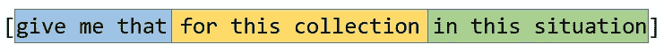
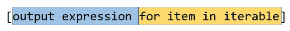
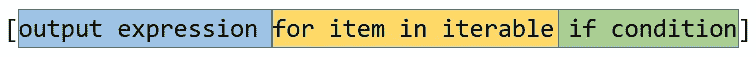
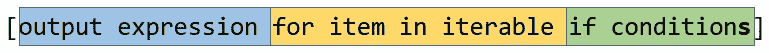
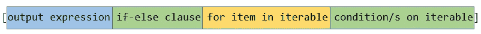

# Python 基础:列表理解

> 原文：<https://towardsdatascience.com/python-basics-list-comprehensions-631278f22c40?source=collection_archive---------1----------------------->



阅读本文后，您将了解到:

*   Python 中的**列表理解**是什么
*   什么是**集合** **理解**和**字典理解**

# 什么是列表理解？

**List comprehensions** 为我们提供了一个**简单的方法来创建一个基于一些 **iterable** 的列表**。在创建过程中，来自 iterable 的元素可以**有条件地**包含在新列表中，并根据需要**转换**。

一个**可迭代**是**你可以在**上循环的东西。如果你想要更详细的解释，你可以阅读我之前的博客文章。

列表理解的组成部分包括:

*   **输出表达式** ( **可选**)
*   **可迭代**
*   **迭代器变量**，代表可迭代对象的成员



## 例子

输出:

```
[1, 4, 9, 16, 25]
```

我们还可以创建更高级的列表理解，其中包括在 **iterable** 上的**条件语句**。



## 例子

输出:

```
[9, 16, 25]
```

# 列表理解 vs 循环

列表理解在计算上**以及在编码空间和时间上**都比循环`for`更有效。通常，它们是用单行代码编写的。****

****让我们看看使用一个`for`循环得到与上一个例子相同的结果还需要多少空间。****

****我们可以清楚地看到，上面的列表理解要容易得多。但是，请记住:****

> ****每个列表理解都可以重写为 for 循环，但不是每个 for 循环都可以重写为列表理解。****

****来源:[https://trey hunner . com/2015/12/python-list-comprehensions-now-in-color/](https://treyhunner.com/2015/12/python-list-comprehensions-now-in-color/)****

****计算速度呢？我们可以使用`timeit`库来比较`for`循环的速度和列表理解的速度。我们还可以使用`number`参数传递执行的数量。我们将这个参数设置为 100 万。****

****输出:****

```
**6.255051373276501
3.7140220287915326**
```

****我已经在我的机器上运行过了，所以你可以得到不同的结果。然而，列表理解的实现在所有情况下都会更快。****

# ****列表理解与映射和过滤****

****列表理解是从函数式编程语言 [Haskell](http://haskell.org/) 借用来的简洁符号。我们可以把它们看作是`filter`和`map`函数的语法糖。****

****我们已经看到，列表理解可以很好地替代`for`循环，因为它们更紧凑、更快。****

## ****λ函数****

****Lambda 函数是小型匿名函数。它们可以有任意数量的参数，但只能有一个表达式。****

****大多数情况下，lambda 函数是作为参数传递给函数的，这些函数需要一个函数对象作为它们的参数之一，比如`map`和`filter`。****

## ****地图功能****

****map 函数返回一个**迭代器**，该迭代器将函数应用于 *iterable* 的每一项，并产生结果。我们来对比一下列表理解。****

****输出:****

```
**[1, 4, 9, 16, 25]
[1, 4, 9, 16, 25]**
```

## ****过滤功能****

****filter 函数从传递的 ***函数*** 返回 true 的 ***iterable*** 的元素中构造一个迭代器。同样，让我们比较一下过滤函数和列表理解。****

****输出:****

```
**[2, 4]
[2, 4]**
```

# ****更复杂的列表理解****

****此外，当我们创建一个列表理解时，我们可以在 **iterable** 上有**许多条件语句**。****

********

****输出:****

```
**[6, 18]**
```

****而且，我们还可以在**输出表达式**上有一个 **if-else 子句**。****

********

****输出:****

```
**['small', 'big']**
```

# ****可读性****

****我们可以看到一些列表理解可能非常复杂，很难读懂。Python 允许在括号和大括号之间换行。我们可以利用这一点使我们复杂的理解更具可读性。****

****例如，我们可以把上一个例子转换成这样:****

****输出:****

```
**['small', 'big']**
```

****然而，要小心列表理解，在某些情况下使用`for`循环更好。如果你的代码不可读，最好使用 for 循环。****

# ****嵌套 For 循环****

****在某些情况下，我们需要嵌套的`for`循环来完成一些任务。在这种情况下，我们也可以使用列表理解来达到同样的结果。****

****假设我们有一个矩阵，我们想把它展平。我们可以像这样用两个`for`循环轻松做到这一点:****

****输出:****

```
**[1, 2, 3, 4, 5, 6, 7, 8, 9]**
```

****我们可以使用**列表理解**来达到同样的结果。
**提示**:for 子句**的**顺序**与原 for 循环中的**保持不变。****

**输出:**

```
[1, 2, 3, 4, 5, 6, 7, 8, 9]
```

# **嵌套列表理解**

**在其他情况下，我们可能需要创建一个**矩阵**。我们可以用**嵌套列表理解**做到这一点。这听起来有点疯狂，但概念很简单。**

**一个列表理解返回一个列表，对吗？因此，如果我们将一个列表理解放在另一个列表理解的输出表达式中，我们将得到一个矩阵作为结果。**

**输出:**

```
[[0, 1, 2, 3, 4], [0, 1, 2, 3, 4], [0, 1, 2, 3, 4]]
```

> **`[range](https://docs.python.org/3/library/stdtypes.html#range)`类型表示不可变的数字序列，通常用于在`[for](https://docs.python.org/3/reference/compound_stmts.html#for)`循环中循环特定的次数**

**来源:[https://docs.python.org/3/library/stdtypes.html#ranges](https://docs.python.org/3/library/stdtypes.html#ranges)**

# **其他理解**

**在 Python 中，我们还有**字典理解**和**集合理解**。我们看到的所有原则对于这些理解也是一样的。我们只需要知道一些非常小的细节就可以创建一个字典或一套理解。**

## **词典释义**

**为了创建字典理解，我们只需要将括号`[]`改为花括号`{}`。另外，在输出表达式中，我们需要用冒号`:`分隔键和值。**

**输出:**

```
{'beer': 2.0, 'fish': 5.0, 'apple': 1.0}
```

## **集合理解**

**为了创建一个集合理解，我们只需要将括号`[]`改为花括号`{}`。**

**输出:**

```
{0, 1, 100, 144, 400, 900}
```

# **生成器表达式**

**在这里，我只想提一下，Python 还有一个叫**生成器表达式**的东西。它们与列表理解非常相似。不同的是，它们使用圆括号`().`并且，它们不在内存中存储列表。他们使用 [**懒评**](https://wiki.haskell.org/Lazy_evaluation) 手法。**

> **如果你使用返回无限流或大量数据的迭代器，那么列表理解是没有用的。在这些情况下，生成器表达式**更可取**。**

**来源:[https://docs.python.org/3/howto/functional.html](https://docs.python.org/3/howto/functional.html)**

**如果你想了解更多关于生成器表达式的知识，你可以查看我在[之前的博客文章](/python-basics-iteration-and-looping-6ca63b30835c)。**

# **摘要**

*   ****列表理解**为我们提供了一个**简单的方法来创建一个基于一些**可迭代**的列表**。**
*   **这种理解比在循环中使用 a 更加有效。**
*   **我们可以在理解中使用条件语句。**
*   **对于内置的`map`和`filter` **函数**，理解是一个很好的**选择**。**
*   **我们可以有嵌套的理解。**
*   **在 Python 中，我们还有**字典理解**和**集合理解**。**
*   **当我们处理大量数据的无限流时，生成器表达式更好。**

# **资源**

*   **[https://trey hunner . com/2015/12/python-list-comprehensions-now-in-color/](https://treyhunner.com/2015/12/python-list-comprehensions-now-in-color/)**
*   **[https://www . data camp . com/community/tutorials/python-list-comprehension](https://www.datacamp.com/community/tutorials/python-list-comprehension)**
*   **[https://www.w3schools.com/python/python_lambda.asp](https://www.w3schools.com/python/python_lambda.asp)**
*   **[https://talkai . blog/2018/08/29/python IC-better-if-list-comprehension-else-map-and-filter/](https://talkai.blog/2018/08/29/pythonic-better-if-list-comprehension-else-map-and-filter/)**
*   **[https://docs.python.org/3/library/functions.html](https://docs.python.org/3/library/functions.html)T40[https://docs.python.org/3/howto/functional.html](https://docs.python.org/3/howto/functional.html)**

# **我的其他博客文章**

**你也可以看看我以前的博文。**

*   **[Jupyter 笔记本快捷键](https://medium.com/@ventsislav94/jypyter-notebook-shortcuts-bf0101a98330)**
*   **[数据科学的 Python 基础知识](/python-basics-for-data-science-6a6c987f2755)**
*   **[Python 基础:迭代、可迭代、迭代器和循环](/python-basics-iteration-and-looping-6ca63b30835c)**
*   **[Python 数据科学:Matplotlib 数据可视化简介](/data-science-with-python-intro-to-data-visualization-and-matplotlib-5f799b7c6d82)**
*   **[使用 Python 的数据科学:使用 pandas 加载、子集化和过滤数据简介](/data-science-with-python-intro-to-loading-and-subsetting-data-with-pandas-9f26895ddd7f)**
*   **[文本自然语言处理导论](http://Introduction to Natural Language Processing for Text)**

# **时事通讯**

**如果你想在我发表新的博客文章时得到通知，你可以订阅[我的简讯](https://buttondown.email/Ventsislav)。**

# **商务化人际关系网**

**这是我在 LinkedIn 上的简介，如果你想和我联系的话。我将很高兴与你联系在一起。**

# **最后的话**

**谢谢你的阅读。我希望你喜欢这篇文章。如果你喜欢，请按住拍手键，分享给你的朋友。我很高兴听到你的反馈。如果你有什么问题，尽管问。😉**