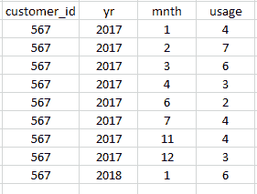

# 用于识别季节性客户的 Python 代码

> 原文：<https://towardsdatascience.com/python-code-for-identifying-seasonal-customers-4bd36dc7fcda?source=collection_archive---------5----------------------->


我以前写过如何使用时间序列来识别数据库中具有季节性使用模式的客户。如果你想详细了解，你可以在这里找到文章。

如果您想长话短说:为了识别具有季节性使用模式的客户，我采用了按月汇总的 customer_id、月、年和使用数据，并按 id、年和月排序。我们只能评估与我们在一起至少 2 年的客户的季节性，以允许算法识别模式。所以数据(完全虚构，只是为了说明)看起来像这样:



您会注意到数据中缺少了五月、八月、九月和十月。这意味着该客户在那几个月没有任何使用。因此，第一项任务是填补数据集中缺失的零。我把数据库里的数据拉进来，命名为“原创”。这里我没有提供连接数据库的代码，因为我们使用 Netezza SQL。

代码如下(有些缩进对于较长的行是不正确的，抱歉！)🙂

```
import pandas as pa 
import numpy as np ## Outfile is just because we're going to export our results as a .csv to save them. outfile = '[put your file path here].csv' ## Headings in the .csv that I'm going to output filledIn = pa.DataFrame(columns=['customer_id','yr','mnth','usage']) ##original was just the name of my dataframe with data grouped = original.groupby(by='customer_id') 
def yearmonth_to_justmonth(year, month): 
     return year * 12 + month - 1 ##Defining a function to fill in the zeros. def fillInForOwner(group): 
     min = group.head(1).iloc[0] 
     max = group.tail(1).iloc[0]       
     minMonths = yearmonth_to_justmonth(min.yr, min.mnth) 
     maxMonths = yearmonth_to_justmonth(max.yr, max.mnth)
     filled_index = pa.Index(np.arange(minMonths, maxMonths, 1),
       name="filled_months") 
     group['months'] = group.yr * 12 + group.mnth - 1 
     group = group.set_index('months') 
     group = group.reindex(filled_index) 
     group.customer_id = min.customer_id 
     group.yr = group.index // 12 group.mnth = group.index % 12 + 1
     group.usage = np.where(group.usage.isnull(), 0,
       group.usage).astype(int) 
     return group filledIn = grouped.apply(fillInForOwner) 
newIndex = pa.Index(np.arange(filledIn.customer_id.count())) ## Printing out the results to a .csv 
filledIn = filledIn.set_index(newIndex) 
filledIn.to_csv(outfile) ## I also print results on the screen 
print(filledIn)
```

接下来，我选择在 Python 中为时间序列部分运行 R。实际上，我遇到了一个值得一提的小问题。我在我的计算机上安装了 64 位和 32 位版本的 R，并指向还没有安装我的所有包的 R 版本(来自 Python)。尴尬的真相:我手动将文件从一个文件夹复制粘贴到另一个文件夹。我确信有一种更“正确”的方法，但是将它们复制并粘贴到目录中正确的文件夹是可行的。

还有一个小问题，值得一提的是，用 Python 运行 R 代码并不是我尝试的第一种方法。您实际上可以使用 Python 语言来运行 R 代码，但是我很难做到这一点，所以我选择了 rpy2 路线。

这里我导入 rpy2 来利用 Python 中的 R 代码。这些也是我需要的所有库。

```
import rpy2 as r 
     from rpy2.robjects.packages import importr 
     from rpy2.robjects import r, pandas2ri, globalenv
     pandas2ri.activate() base = importr('base') 
colorspace = importr('colorspace') 
forecast = importr('forecast') 
times = importr('timeSeries') 
stats = importr('stats')
```

接下来，我逐一查看了每位顾客。我会找到他们的开始月份/年份和结束月份/年份，并为每个客户创建一个时间序列对象。我包含了一个 try/except 语句，因为我最初尝试在没有 try/except 语句的情况下运行它，在它已经运行了几个小时之后，它被一个客户卡住了，不太理想。

在创建了时间序列对象之后，我简单地询问 R 模型中是否有季节性成分，并打印出客户 id 以及它们是否是季节性的。

```
 ##Again, this is just for saving your results to a .csv 
outfile = '[put your file path here].csv' 
seasonal_output = pa.DataFrame(columns=['customer_id', 'seasonal']) ### Now we're going to loop through our customers 
for customerid, dataForCustomer in filledIn.groupby(by=['customer_id']): 
     startYear = dataForCustomer.head(1).iloc[0].yr 
     startMonth = dataForCustomer.head(1).iloc[0].mnth 
     endYear = dataForCustomer.tail(1).iloc[0].yr 
     endMonth = dataForCustomer.tail(1).iloc[0].mnth #Creating a time series object 
     customerTS = stats.ts(dataForOwner.SENDS.astype(int),
          start=base.c(startYear,startMonth), 
          end=base.c(endYear, endMonth), frequency=12)
     r.assign('customerTS', customerTS) ##Here comes the R code piece 
     try:  
          seasonal = r(''' 
          fit<-tbats(customerTS, seasonal.periods = 12, use.parallel
          = TRUE) 
          fit$seasonal 
          ''') 
     except: 
          seasonal = 1 
     seasonal_output = seasonal_output.append({'customer_id':
          customerid, 'seasonal': seasonal}, ignore_index=True) 
     print(f' {customerid} | {seasonal} ') print(seasonal_output) 
seasonal_output.to_csv(outfile)
```

这个输出将成为我正在进行的聚类分析的一个特征。我还将做一些工作来确定每个客户的最小和最大使用月数，并将其存储在数据库中。很快，市场营销将能够利用这一点来开展更加个性化的活动。

如果你想订阅我未来的文章，你可以在这里订阅。

*原载于 2018 年 7 月 1 日*[*【datamovesme.com】*](https://datamovesme.com/2018/07/01/seasonality-python-code/)*。*