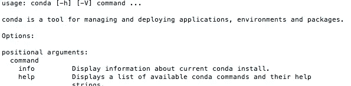
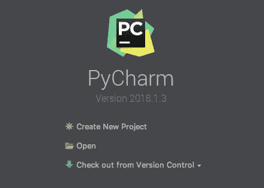
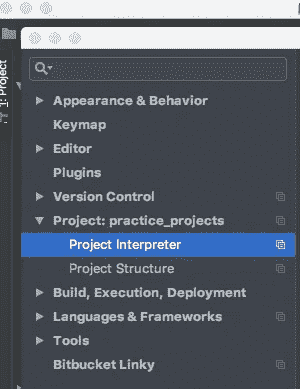
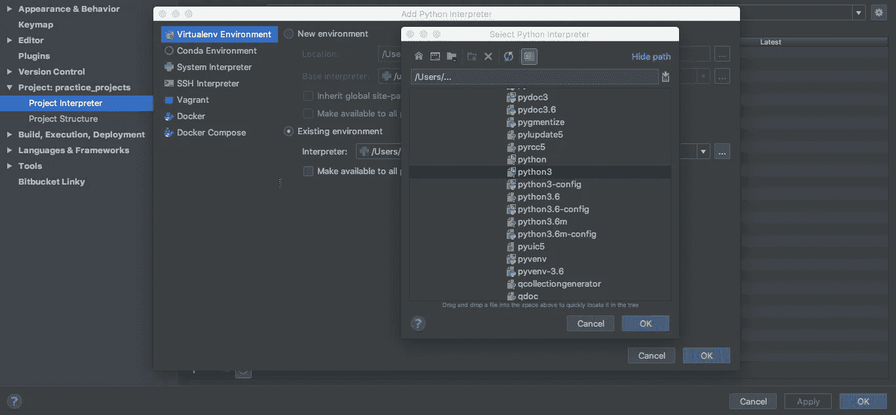

# 如何设置 Python 数据科学环境—设置使用 Python 处理数据科学问题的 Anaconda 环境

> 原文：<https://towardsdatascience.com/python-data-science-environment-setting-up-anaconda-environments-for-working-on-data-science-8b4bfbc3cd39?source=collection_archive---------2----------------------->


> *最初发表于*[*【softwarejargon.com】*](https://softwarejargon.com) *在我的博客上找到这篇文章的更新版本*[*【https://softwarejargon.com/blog】*](https://softwarejargon.com/blog/python-data-science-environment-setting-up-anaconda-environments-for-working-on-data-science-problems-using-python/)

在本文中，我将解释并展示如何使用 python 和 Anaconda 以及 PyCharm 来建立一个 Python 数据科学环境，为使用最流行的 Python 库进行机器学习/数据科学的本地实验做好准备。

这篇文章主要针对 Mac 用户，但是，不要惊慌，我将对如何在 Windows 上实现相同的结果进行简短的评论。我自己两个都用，所以没有偏好。

要求—您应该熟悉以下主题:

*   具备 bash 命令或命令行的基本知识(取决于操作系统，Mac 或 Windows)

将安装以下软件。

*   [蟒蛇](https://www.anaconda.com/what-is-anaconda/)
*   [PyCharm(社区版)](https://www.jetbrains.com/pycharm/)

下面是感兴趣的 Python 库。如果您有兴趣阅读更多内容，我提供了每个库文档的链接。

*   [numpy](https://docs.scipy.org/doc/numpy/)
*   [熊猫](http://pandas.pydata.org/pandas-docs/stable/)
*   [scikit-learn](http://scikit-learn.org/stable/documentation.html)
*   [matplotlib](https://matplotlib.org/)

# 安装 Anaconda

Anaconda 可以从[这里](https://www.anaconda.com/download/)下载。遵循安装说明。安装没有什么特别的，因此，如果你按照屏幕上的安装说明，一切都会好的。

# 安装 PyCharm

PyCharm 可以从[这里](https://www.jetbrains.com/pycharm/download/)下载。我推荐安装社区版的 PyCharm，因为它是免费的。

至于 Anaconda 安装，同样适用于 Pycharm 安装。安装软件时按照屏幕上的说明操作，一切都会好的。

# 使用 Conda CLI 创建环境

安装 Anaconda 后，打开一个终端窗口，键入`conda`并按回车键。如果你看到类似下图的东西，那么你已经成功安装了 Anaconda 和 Conda CLI。



Envs 文件夹的默认路径是`/Users/<your user name>/anaconda/envs/`，所有创建的环境都将放在这个文件夹中。

在创建一个新环境之前，我总是将 cd 放到 envs 文件夹中。所以如果你想继续 cd 到 envs 文件夹。执行以下命令。

```
cd /Users/<your user name>/anaconda/envs/
```

请记住，只有在默认目录下安装了 Anaconda，这种方法才有效。否则，导航到您的安装位置。

为了创建新的环境，请执行以下命令。

```
conda create --name TestEnv python=3
```

在我们可以在新环境中安装任何新的 python 库之前，我们需要激活该环境。要激活创建的环境，请执行以下命令。

```
conda activate TestEnv
```

接下来，我们要安装四个第三方 Python 库。为此，请执行以下命令。

```
conda install numpy pandas scikit-learn matplotlib
```

这应该会安装四个库 numpy、pandas、scikit-learn 和 matplotlib。就开始学习机器学习而言，这四个库应该会让你走得很远。

当库安装完成后，您可以通过启动 Python 控制台来检查一切是否正常。这是通过执行以下命令来实现的。

```
python
```

Python 控制台启动并运行后，对四个库分别执行以下命令并按 enter 键。

```
>>>import numpy 
>>>import pandas 
>>>import sklearn
>>>import matplotlib
```

如果库安装正确，您应该不会得到任何错误。

# 在 PyCharm 中创建项目

现在您已经安装了 Anaconda 并创建了一个环境。现在我们想使用 PyCharm 创建一个项目，并使用创建的环境执行 Python 代码。这里我假设您已经安装了 PyCharm。

首先，我们想创建一个文件夹，作为我们的项目文件夹。您可以在计算机上的任意位置创建该文件夹。我经常使用 Dropbox，因此，我所有的本地项目文件夹都是在`/Users/<your user name>/Dropbox/project_folders/`路径下创建的。

创建一个项目文件夹，例如，名为 ProjectTestEnv。

现在打开 PyCharm 点击打开。当 PyCharm 打开时，您应该会看到类似下图的内容。



浏览到最近创建的项目文件夹，然后单击打开。PyCharm 现在将开始一个新项目。

# 在 PyCharm 中为我们的项目设置解释器

现在，每次我们执行 Pycharm 项目中的代码时，我们都希望代码使用我们新创建的 Conda 环境，在那里我们已经安装了我们想要使用的库。

当 PyCharm 完成启动新项目时，导航到“py charm”->“Preferences”。



一个新窗口将会打开。选择“翻译”，点击右上角的图标，然后点击“添加…”



一个新窗口将会打开。在这里选择“虚拟环境”，然后单击“现有环境”，然后单击包含“…”的图标。一个新窗口将会打开。在这里，您必须导航到创建的环境，例如`/Users/<your user name>/anaconda/envs/TestEnv/bin/python3`。现在对所有三个打开的窗口按“确定”。PyCharm 现在应该将创建的环境设置为您的项目解释器。

仅此而已。现在，您可以使用 PyCharm 在项目文件夹中创建 python 文件，只需右键单击文件夹概述并添加新的 python 文件。然后，您可以执行项目文件夹中的任何 python 文件，方法是右键单击该文件并选择“Run ' <your file="" name="">'”</your>

# 我发现最有用的 Conda 命令列表

```
conda create --name <my environment name> python=<python version>
```

该命令由两部分组成。第一部分`conda create --name`后面是您想要为您的环境指定的名称，它创建了 conda 环境。下一部分`python=3`指定您希望在环境中安装哪个版本的 python。通过执行`conda create --name TestEnv python=2.7`，conda CLI 将创建一个安装了 Python 2.7 的名为 TestEnv 的环境。

```
source activate <my environment name>
```

该命令激活特定的环境。如果我们已经创建了一个名为 TestEnv 的环境，我们可以通过执行下面的命令`source activate TestEnv`来激活这个环境。该命令在 Windows 上略有不同。在 Windows 上，你会写`activate TestEnv`。

```
source deactivate
```

该命令停用环境。在 Windows 上也略有不同。在 Windows 上你会写`deactivate`。

```
conda install <library name>
```

激活已创建的环境后，您可能需要安装额外的库，除非您可以使用预安装的核心 Python 库进行管理。但是，当您需要安装第三方库时，您将希望使用上面的 Conda CLI 命令。例如，在激活环境 TestEnv 之后，您需要安装 pandas 库，这是通过执行`conda install pandas`来完成的。这将安装最新的可用熊猫图书馆版本。

```
conda update <library name>
```

如果您在某个时候需要更新您已经安装的库，您可以通过使用上面的命令来完成。例如，您已经安装了 pandas 库，过一会儿，您需要将库更新到一个新的版本，这是通过执行`conda update pandas`来完成的。这将把熊猫图书馆更新到最新版本。

```
conda remove --name <my environment name> <library name>
```

当您想要从激活的环境中删除已安装的库时，可以使用此命令。例如，您已经创建了环境 TestEnv 并激活了该环境，此外，您还在活动环境中安装了库 pandas。现在你需要删除图书馆熊猫。这是通过执行`conda remove --name TestEnv pandas`完成的。

```
conda remove --name <my environment name> --all
```

当您需要删除已创建的环境及其安装的第三方库时，可以使用此命令。例如，在创建环境 TestEnv 并安装库 pandas 之后。为了删除这个环境及其安装的库，您可以执行`conda remove --name TestEnv --all`。

```
conda update
```

如果需要将整个 Anaconda 安装更新到最新版本，可以执行上面的命令。

如果你有兴趣了解我更多。请访问我在 LinkedIn 上的个人简介【https://www.linkedin.com/in/vedranmarkulj/ 

感谢阅读。如果你对我将来写的关于机器学习和类似主题的帖子感兴趣，请在[媒体](https://medium.com/@vedranmarkulj)和 [LinkedIn](https://www.linkedin.com/in/vedranmarkulj/) 上关注我。更多文章即将发表。