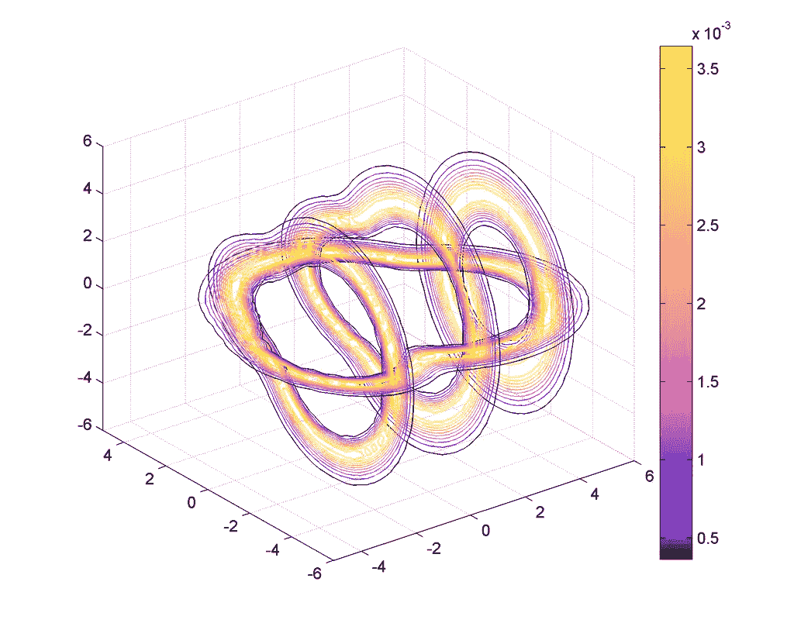
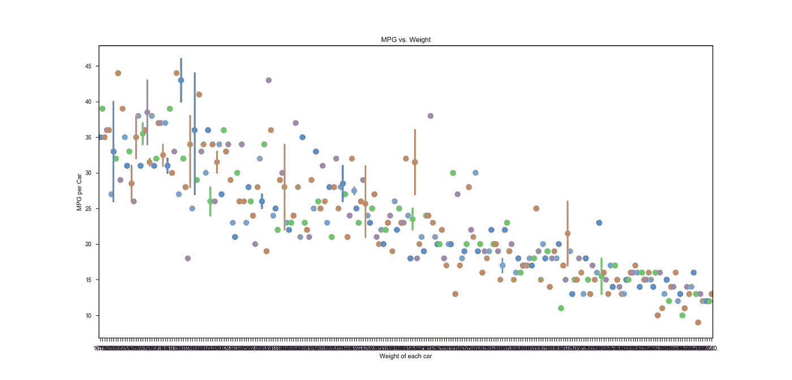
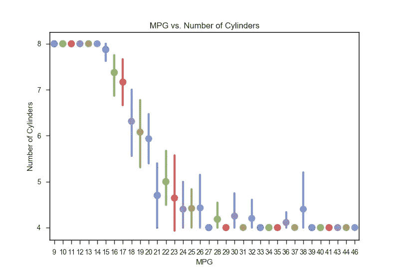
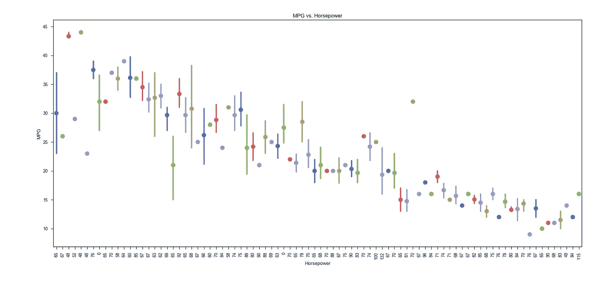

# Python 数据可视化工具

> 原文：<https://towardsdatascience.com/python-data-visualization-tools-bf44c07452d9?source=collection_archive---------10----------------------->

## Python 星期五:挑战#6

I **wish** I knew how to make this graph.

利用数据寻找相关性是一项很有价值的技能。但是能够将这些发现传达给其他不熟悉数据集的人也是非常有价值的。了解到这一点，我决定做一些谷歌搜索来找出我应该学习什么工具来展示我的数据项目。

我很快找到了[这篇关于 Python 数据可视化库的博文](https://blog.modeanalytics.com/python-data-visualization-libraries/)，有几条引起了我的注意。

## 我想尝试的可视化工具列表

*   **Seaborn**
*   散景
*   臀的
*   geoplotlib
*   闪光
*   missingno【这个我不能不演示，是口袋妖怪参考！]

我怎么能只选择其中一个呢？我不想只选择一个，但我认为 Seaborn 是一个给定的，因为它是基于 matplotlib 的，并且我已经学习了相当多的相关知识(感谢 Dataquest！).

我喜欢 geoplotlib 的想法，因为**热图**。我肯定会在未来的某个时候构建一个热图。我根本不在乎这是什么。我只想建立一个热图，并知道我做到了。

但是现在，它将会是 [**Seaborn**](https://seaborn.pydata.org/) **。**

# 挑战:3 个问题

使用我一直在用的数据集

1.  车重和 MPG 有关系吗？
2.  气缸数量与 MPG 相关吗？
3.  总马力和 MPG 有关系吗？

这些问题似乎是显而易见的，但我从未真正看到任何数据来支持这些概念。这就是它的乐趣所在。用数据支持一个想法，和一开始就有想法一样重要。

# 看看我的图表！

[这里的](https://github.com/aptlyundecided/python/tree/master/challenges/6)是生成下图的代码的 github repo。line1.py、line2.py 和 line3.py 是图表，按它们在这里出现的顺序排列。

## MPG 与重量

MPG vs Weight

汽车的重量和每加仑行驶的英里数之间有着非常紧密的联系。理所应当！移动更多的重量需要更多的能量！

## MPG 与气缸数量的关系

MPG vs. Number of Cylinders

另一个真正可靠的关联！虽然有奇怪的异常在 38 分钟的标记。我想这可能是因为有一个不完整的数据集，或者是一个主要是 4 缸发动机的不平衡的数据集…但我还没有制作一个图表来检查这一点😄

## MPG 与马力

MPG vs. Horsepower

这是我所期望的图表，但是这个图表在几个方面被搞乱了。趋势看起来是对的，但是我的 x-tick 标签顺序不对。我不确定为什么会这样，因为它用来制图的数据是正确排序的。这可能是因为 seaborn 在绘制线条时内置了一些“平均”功能。

我将不得不做更多的调查，但今晚我没有时间了。

## 我的一些“问题”

1.  进口 Seaborn 有困难。首先，我将我在 seaborn.py 上工作的文件命名为😞哇，你不能进口那种东西。我认为问题出在我的 linter 上，因为它仍然显示无法导入 seaborn，但它仍然在运行。
2.  我想皮林特是因为海伯恩被安装了蟒蛇而生气吧？我不知道，我重启了机器，它在终端中运行，但 VSCode 仍然在抱怨无法导入“seaborn ”,尽管它肯定是在终端中导入和执行的。
3.  我不知道如何在睡觉前把我的 x 轴刻度按正确的顺序排列，也不知道如何避免马力的平均值。

## **外卖**

我已经认识到，我不擅长挑选最能有效传达相关性的东西。此外，我还有很多关于组织和清理数据的知识要学，以便为制图做好准备。

感谢阅读！💚