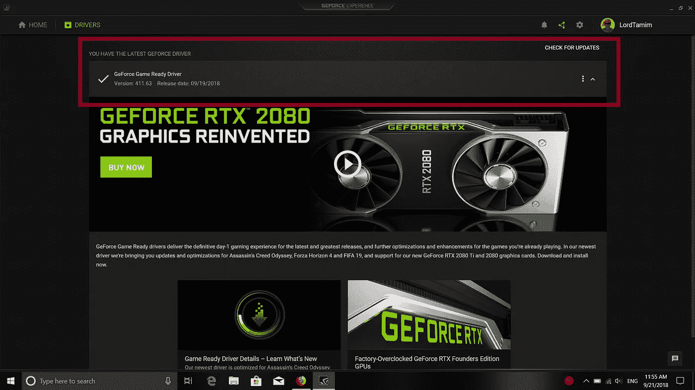
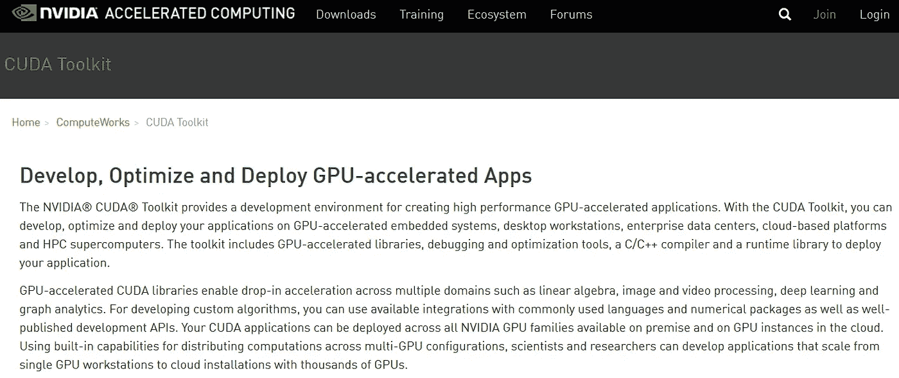
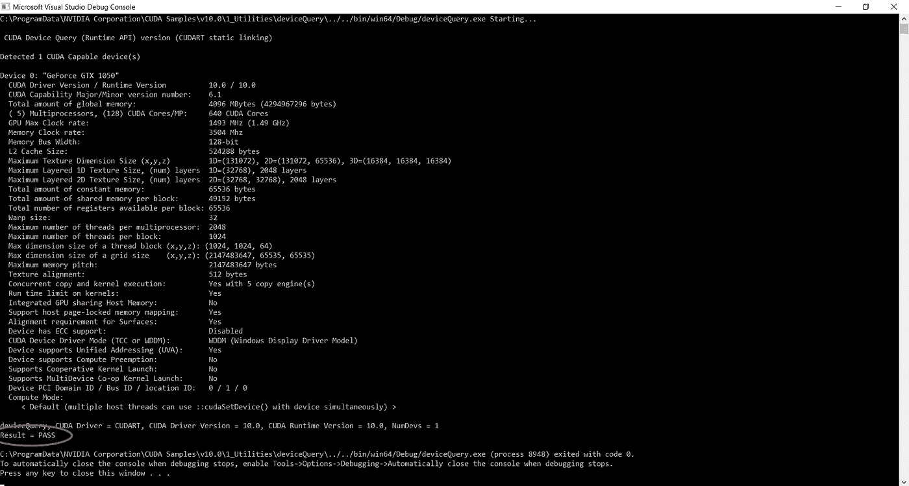
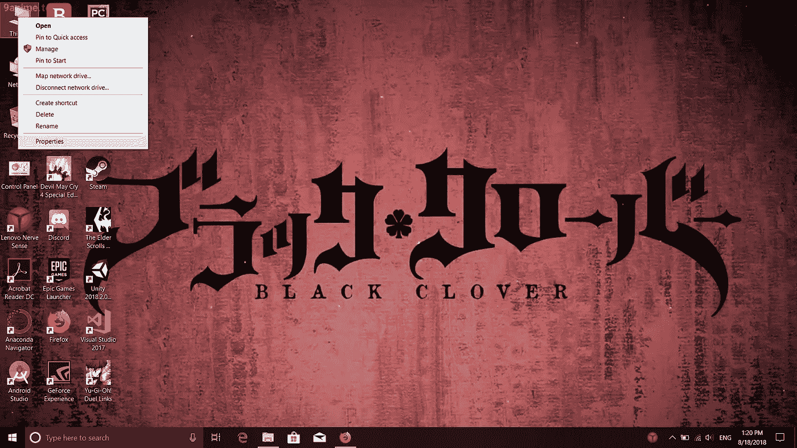
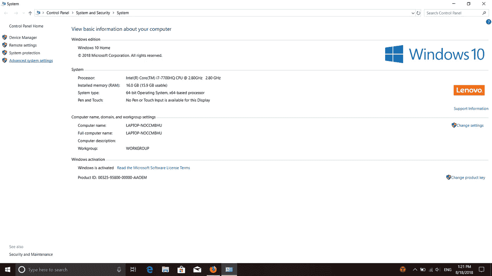
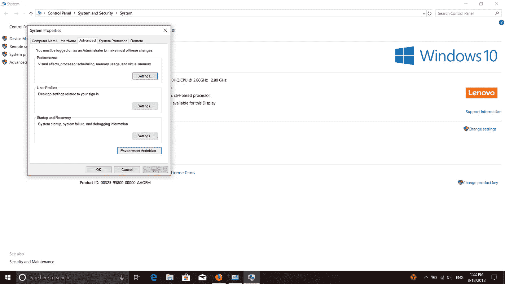
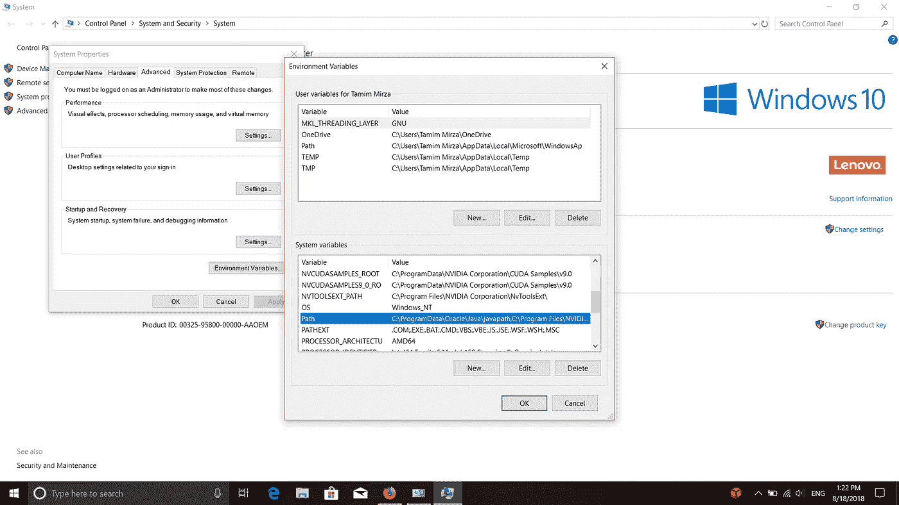
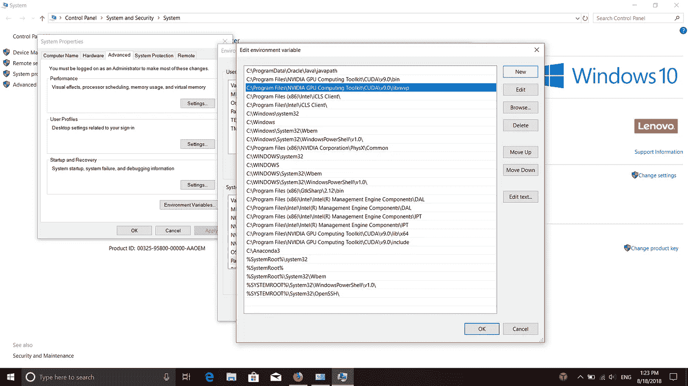
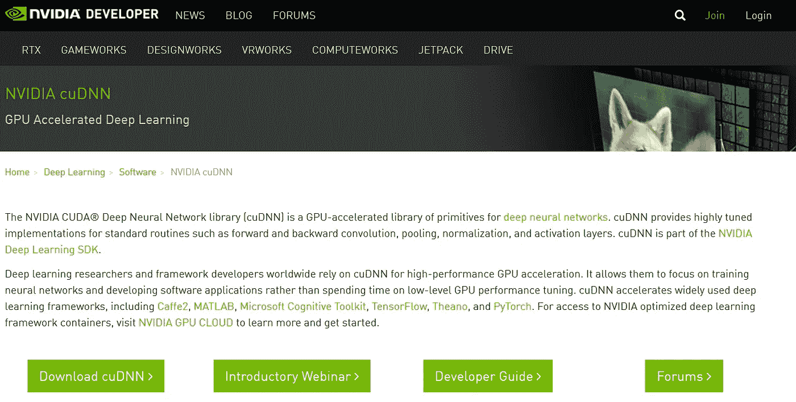

# Windows 10 上深度学习的 Python 环境设置

> 原文：<https://towardsdatascience.com/python-environment-setup-for-deep-learning-on-windows-10-c373786e36d1?source=collection_archive---------1----------------------->


TensorFlow 2.0 logo design

关于如何开始深度学习的详细介绍，从在 Microsoft Windows 10 上启用适合它的环境开始。要安装的框架将是 Keras API，使用 Google 的 TensorFlow GPU 版本作为后端引擎。

这个指南是我在自己的深度学习项目中使用的相同程序，它对我很有帮助。本指南的目的是在一个地方积累所有必要的和更新的信息，而不是在整个谷歌搜索。

让我们开始吧。

**本指南已更新至 TensorFlow 2.1 版本**

# 目录

1.  什么是深度学习？
2.  PC 硬件设置
3.  PC 软件设置
4.  Python 解释器
5.  Python IDE

# **什么是深度学习？**

深度学习是机器学习的一个子集，它利用多层人工神经网络在对象检测、语音识别、语言翻译等任务中提供最先进的准确性。

深度学习不同于传统的机器学习技术，它们可以从图像、视频或文本等数据中自动学习表示，而不需要引入手工编码的规则或人类领域知识。它们高度灵活的架构可以直接从原始数据中学习，当提供更多数据时，可以提高它们的预测准确性。

# **电脑硬件设置**


为了在任何数据集上执行深度学习，软件/程序需要足够强大的计算机系统来处理必要的计算能力。因此，需要以下最低规格:

**1)中央处理器(CPU)** —英特尔酷睿 i5 第六代处理器或更高。AMD 同等处理器也是最佳选择。

**2) RAM** —最低 8 GB，建议 16 GB 或更高。

**3)图形处理单元(GPU)** — NVIDIA GeForce GTX 940 或更高。AMD GPUs 无论如何都无法进行深度学习。

[支持深度学习的 NVIDIA CUDA GPU](https://developer.nvidia.com/cuda-gpus)

**4)操作系统** —微软 Windows 10(建议 64 位)Pro 或 Home。我建议在继续之前将 Windows 10 更新到最新版本。

**注:对于笔记本电脑，理想的选择是从任何合适的供应商处购买游戏笔记本电脑，如华硕、联想军团、宏碁掠夺者、外星人等。**

# **电脑软件设置**

现在，为了执行深度学习，我们将使用一种称为 GPU 计算的方法，该方法将复杂的数学计算导向 GPU，而不是 CPU，从而显著减少整体计算时间。为此，我们按以下顺序安装几个组件:

## Microsoft Visual Studio IDE

Visual Studio 对于接下来两个组件的安装至关重要。我推荐 Visual Studio 2019(因为我正在使用它),因为它的性能超越了它的所有前辈，安装也从未像现在这样简单快捷。但是有一个范围，你可以使用 2012 年到 2019 年的任何 VS 版本。

[下载 Visual Studio 2019](https://visualstudio.microsoft.com/vs/)

[下载 Visual Studio 2017 及更早版本](https://visualstudio.microsoft.com/vs/older-downloads/)

如果您安装了 Visual Studio 2019，则必须将其更新到 16.4 或更高版本。VS 2019 的新安装默认更新。

安装 Visual Studio 2019(或 2017，因为它与 2019 相似)后，请确保“使用 C++进行桌面开发”工作负载与以下组件一起安装:

1.  MSVC v 142-VS 2019 c++ x64/x86 构建工具(v14.24)
2.  Windows 10 SDK(任何版本)

## NVIDIA GeForce 体验

该工具旨在更新您的 NVIDIA GPU 驱动程序，这样做要容易得多，如果您有 NVIDIA GPU，强烈建议安装该工具

[下载 NVIDIA GeForce 体验](https://www.geforce.com/geforce-experience/download)

安装它，你需要创建一个帐户才能使用它。您应该会看到这样的屏幕



NVIDIA GeForce Experience Drivers page

在红色框中，您可以看到一个标记为“检查更新”的按钮。自动更新功能不可靠，因此在继续下载下一个软件之前，请手动检查更新。

如果你的驱动程序更新了，那么很好，你可以继续前进。如果没有，请更新它，虽然 CUDA 工具包附带驱动程序，但建议从这里开始更新，因为它们在发布时只包含最低驱动程序要求(因为您可能在发布日期后的某个时间使用它)。

## NVIDIA CUDA 工具包



该软件组件是使 GPU 能够进行 GPU 计算所必需的。我们将下载版本 10.0，因为这是与我们将要安装的框架兼容的版本。

**注意:TensorFlow 2.1 仅兼容 CUDA Toolkit 10.1。**

[下载 CUDA 工具包 10.1](https://developer.nvidia.com/cuda-10.0-download-archive?target_os=Windows&target_arch=x86_64&target_version=10&target_type=exelocal)

[CUDA 10.1 的官方 Windows 安装文档](https://docs.nvidia.com/cuda/archive/10.1/cuda-installation-guide-microsoft-windows/index.html)

接下来，您需要进入 CUDA 安装中的 samples 文件夹，如果您在安装过程中选择了默认路径，它位于:

`C:\ProgramData\NVIDIA Corporation\CUDA Samples\v10.1\1_Utilities\deviceQuery`

并选择适合您系统上安装的 VS 版本的 VS 解决方案，并在您安装的 Visual Studio 版本上运行它。如果您有 Visual Studio 2017，请运行 VS 2017 的 Visual Studio 解决方案。在运行解决方案的结果中，您应该已经获得



The result of deviceQuery CUDA Sample tested on CUDA 10.0 using VS2017 (Code compiles similarly across other CUDA versions).

安装通过验证后，您需要将 CUDA Toolkit 添加到 Path 环境中，这可以通过以下方法完成:

**第一步**



Right click on the ‘This PC’ shortcut and select Properties

**第二步**



Then select Advanced System Settings (left upper corner)

**第三步**



Select Environment Variables

**步骤#4**



Go to the bottom scroll-able window and select the Path variable by double clicking on it

**第 5 步**

```
C:\Program Files\NVIDIA GPU Computing Toolkit\CUDA\v10.1\bin
C:\Program Files\NVIDIA GPU Computing Toolkit\CUDA\v10.1\lib\x64
C:\Program Files\NVIDIA GPU Computing Toolkit\CUDA\v10.1\include
```



Add the CUDA 9.0 paths in the variable

## **英伟达 cuDNN**



[下载 NVIDIA cuDNN](https://developer.nvidia.com/cudnn)

你需要注册一个 NVIDIA 开发者帐户来下载它，这是免费的，没有那么麻烦。为 CUDA 10.1 下载 cuDNN 7.6.X。

下载后，解压它，你将有 3 个文件，然后做:

`a) Copy <installpath>\cuda\bin\cudnn64_7.dll to C:\Program Files\NVIDIA GPU Computing Toolkit\CUDA\v10.1\bin.`

`b) Copy <installpath>\cuda\ include\cudnn.h to C:\Program Files\NVIDIA GPU Computing Toolkit\CUDA\v10.1\include.`

`c) Copy <installpath>\cuda\lib\x64\cudnn.lib to C:\Program Files\NVIDIA GPU Computing Toolkit\CUDA\v10.1\lib\x64.`

一旦完成，你的 GPU 现在准备执行 GPU 计算。

# Python 解释器


现在我们已经配置好了 GPU，是时候安装我们的 python 解释器了，我们将在 Anaconda 中使用它。它被认为比传统的 python 安装要好用得多，而且运行起来也更好。

我们可以安装这种解释器的两种变体，称为 Anaconda 和 Miniconda。要选择搭配哪个，请参考以下指南(摘自官方文档):

如果您符合以下条件，请选择 Anaconda:

*   对 conda 或 Python 来说是新的
*   比如一下子自动安装 Python 和 150 多个科学软件包的便利
*   有时间和磁盘空间(几分钟和 5 GB)，和/或
*   不想安装你想单独使用的每个软件包。

如果您符合以下条件，请选择 Miniconda:

*   不要介意单独安装您想要使用的每个软件包。
*   没有时间或磁盘空间一次安装超过 150 个软件包，和/或
*   只是想快速访问 Python 和 conda 命令，并希望以后整理其他程序。

我自己用 Miniconda。蟒蛇很臃肿。许多软件包从未使用过，如果需要的话，仍然可以很容易地安装。

**注意:建议(但不是必须)下载您选择的解释器的 Python 3 版本，因为 Python 2 即将寿终正寝。**

[点击下载蟒蛇](https://www.anaconda.com/distribution/)

[点击下载 Miniconda](https://docs.conda.io/en/latest/miniconda.html)

一旦你安装了你选择的解释器，就该安装需要的软件包了。打开 Anaconda 提示符并键入命令:

```
conda update conda
```

**对于只支持 Anaconda 的用户，在您键入上面的命令之后，接下来键入:**

```
conda update anaconda
```

暂时不要关闭 Anaconda 提示符。

**注:TensorFlow 在 Windows 10 上支持 Python 3.5、3.6、3.7。虽然 TensorFlow 2.1 将是 TensorFlow 最终支持 Python 2 的版本(不考虑 OS)。**

现在是时候创建我们的环境了，我们可以通过 Anaconda 提示符轻松地完成这项工作(在这种情况下，我们将创建一个名为 TensorFlow-GPU 的 Python 3.7 环境):

```
conda create -n TensorFlow-GPU python=3.7
```

我们成功地创造了新的环境。

**暂时不要关闭 Anaconda 提示符。**

## 张量流

现在，我们开始安装 tensorflow GPU 版本，为此，我们首先激活我们新创建的环境。只需输入:

```
conda activate TensorFlow-GPU
```

接下来我们安装 TensorFlow 2.1(基础包 *tensorflow* 已经包含对 CPU 和 GPU 的支持，并将根据系统 *)* :

```
pip install tensorflow
```

pip 版本是官方支持的，而 conda 版本是社区支持的。谷歌建议安装 pip 版本。

TensorFlow 1.13 版及更高版本预装了 Keras，并与 tensor flow 一起构建，因此用户无需安装单独的 Keras 包。

现在要测试环境，调用命令:

```
python
```

然后键入:

```
>>import tensorflow as tf
```

如果这是您得到的结果:

```
>>import tensorflow as tf
>>
```

则意味着安装成功。现在我们转到 IDE。您可以关闭提示。

# python IDE/文本编辑器

以下两者在调试、林挺和智能自动完成 Python 代码方面都非常出色，速度和精度都快得惊人。

1.  [Visual Studio 代码](https://code.visualstudio.com/)安装了这些[必要的](https://marketplace.visualstudio.com/items?itemName=ms-python.python) [扩展](https://marketplace.visualstudio.com/items?itemName=VisualStudioExptTeam.vscodeintellicode)。
2.  PyCharm:面向专业开发人员的 Python IDE。

这样你就可以开始你的机器学习之旅了。

# 结束了

**Connect with the Raven team on** [**Telegram**](https://t.me/ravenprotocol)