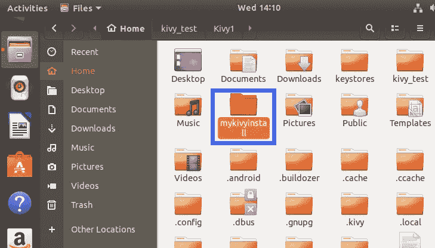
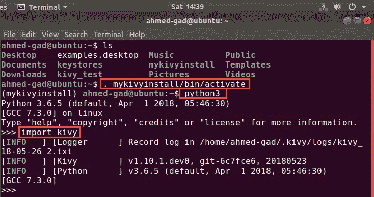
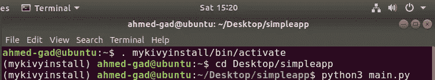
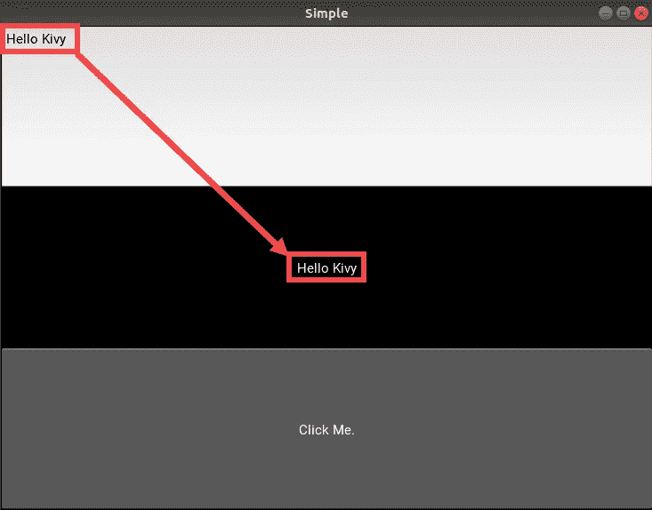
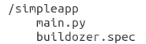
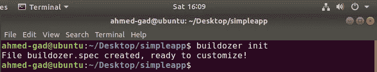
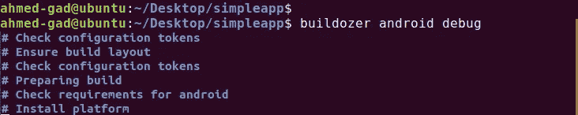
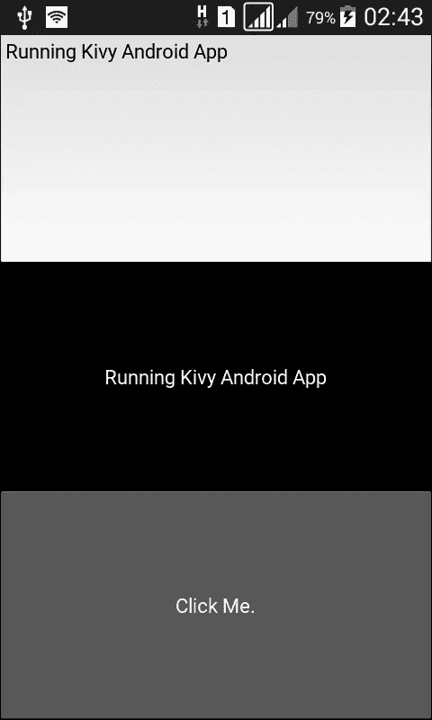

# Python for Android:开始构建 Kivy 跨平台应用程序

> 原文：<https://towardsdatascience.com/python-for-android-start-building-kivy-cross-platform-applications-6cf867d44612?source=collection_archive---------2----------------------->

本教程介绍了使用 Linux Ubuntu 发行版使用 Kivy 跨平台 Python 框架创建 Android 应用程序所需的步骤。在开始安装 Kivy 并启动和运行它之前，需要安装它的依赖项。大部分时间用于通过安装运行所需的库来准备 Kivy 环境。在本教程中，Kivy 本身将安装在一个虚拟环境中。

本教程中使用的平台是带有 Python 3.6.5 的 Linux Ubuntu 18.04。在其他平台上运行 Kivy 会存在一些差异。为了能够安装库、浏览操作系统的目录、复制/删除/提取文件、运行 Python 脚本，读者应该对 Linux 终端命令和 Python 有一个基本的了解。

本教程包含以下几个部分:

1.  介绍
2.  安装 Kivy 依赖项
3.  为安装 Kivy 创建虚拟环境
4.  安装 Cython
5.  安装 Kivy
6.  进口基维
7.  创建简单的 Kivy 应用
8.  安装 Buildozer
9.  正在创建 buildozer.spec 文件
10.  使用 Buildozer 构建 Android 应用程序
11.  参考

# 1.介绍

Kivy 用于创建自然的用户界面，具有抽象和模块化的优点。它将开发人员从不必要的复杂细节中分离出来，只给出简单的 API 来完成复杂的任务。因此，您应该确定 Kivy 将使用什么样的后端库来完成它的任务。我们将使用 SDL ( **简单直接媒体层**)跨平台库，通过 OpenGL 对图形硬件进行低级访问。除了 SDL，GStreamer 等其他库也用于处理音频和视频。因为这样的库是用 C 写的，所以需要 Cython。

# 2.安装 Kivy 依赖项

根据 Kivy Linux 安装说明(【https://kivy.org/docs/installation/installation-linux.html】T2)，下面是获得 SDL2 和 GStreamer 需要安装的库。注意，您可以选择在 Kivy 中使用哪个 Python 版本，对于 Python 2 使用 **python** 和 **python-dev** ，或者对于 python3 使用 **python3** 和 **python3-dev** 。Pip 安装在下面，供以后准备 Kivy 虚拟环境时使用。

```
**ahmed-gad@ubuntu:~$ sudo apt install -y \****python-pip \****build-essential \****git \****python3 \****python3-dev \****ffmpeg \****libsdl2-dev \****libsdl2-image-dev \****libsdl2-mixer-dev \****libsdl2-ttf-dev \****libportmidi-dev \****libswscale-dev \****libavformat-dev \****libavcodec-dev \****zlib1g-dev \****libgstreamer1.0 \****gstreamer1.0-plugins-base \****gstreamer1.0-plugins-good**
```

# 3.为安装 Kivy 创建虚拟环境

准备好 Kivy 依赖项后，我们可以通过创建虚拟环境来开始安装 Kivy。不要求使用虚拟环境来运行 Kivy，但建议将 Kivy 与其他现有项目分开。

在开始创建虚拟环境之前，我们应该确保创建虚拟环境所需的工具已经安装并更新。以下命令确保 **virtualenv** 和 **setuptools** 工具已经存在并更新。

```
**ahmed-gad@ubuntu:~$ sudo pip install --upgrade pip virtualenv setuptools**
```

**virtualenv** 用于创建隔离的 Python 环境。有关虚拟环境优势的更多信息，您可以访问本页[https://virtualenv.pypa.io/en/stable/](https://virtualenv.pypa.io/en/stable/)。 **setuptools** 用于打包 Python 项目。

之后，我们准备创建 Kivy 虚拟环境。以下命令创建了一个名为 mykivyinstall 的环境。

```
**ahmed-gad@ubuntu:~$ virtualenv --no-site-packages mykivyinstall**
```

**— no-site-packages** 参数用于将环境与主 Python 安装隔离开来。这是在不影响任何其他项目的情况下，在那个项目上自由地工作。

发出该命令后，预计会在当前目录中获得一个根据虚拟环境名称命名的新文件夹，如图 1 所示。



**Figure 1\. Creating Kivy virtual environment.**

前面的命令将在环境中使用默认的 Python 解释器。它可能是 Python 2，我们希望与 Python 3 合作。因此，我们可以使用下面的命令中的 **-p** 选项来明确指定使用哪个 Python 解释器:

```
**ahmed-gad@ubuntu:~$ virtualenv --no-site-packages -p /usr/bin/python3 mykivyinstall**
```

创建虚拟环境后，我们可以激活它来开始安装 Kivy。可以基于以下命令激活它。

```
**ahmed-gad@ubuntu:~$ . mykivyinstall/bin/activate**
```

点号(**)。**)是一个内置命令，执行作为参数传递的文件内容。它是命令源的同义词。因此，前面的命令与此命令相同:

```
**ahmed-gad@ubuntu:~$ *source* mykivyinstall/bin/activate**
```

激活虚拟环境后，命令提示符应更改如下:

```
**(mykivyinstall) ahmed-gad@ubuntu:~$**
```

# 4.安装 Cython

在安装 Kivy 之前，根据以下命令将 Cython 安装在这样的环境中:

```
**(mykivyinstall) ahmed-gad@ubuntu:~$ pip install cython=0.25.2**
```

请注意，Cython 的版本取决于要安装的 Kivy 的版本。在当前日期，最新的 **Kivy** 版本是 **1.10.0** ，它需要 **Cython 0.25.2** ，这就是为什么在上面的命令中使用它。之后，我们准备安装 Kivy。

# 5.安装 Kivy

可以根据以下命令使用 pip 安装 Kivy:

```
**(mykivyinstall) ahmed-gad@ubuntu:~$ pip install kivy**
```

在这个命令之后，Kivy 会自动下载并安装。但是请注意，Kivy 的安装是最难的部分，因为有许多依赖项是基于机器、平台以及您已经拥有和缺少的库而变化的。这个过程并不简单，您应该寻找其他方法来解决安装错误。例如，Kivy 可以通过使用 wheel 文件或根据以下命令克隆其 github 项目来安装:

```
**(mykivyinstall) ahmed-gad@ubuntu:~$ pip install git+https://github.com/kivy/kivy.git@master**
```

# 6.进口基维

达到 is 阶段后，预计 Kivy 会成功安装并运行在您的机器上。我们可以通过导入 Kivy 来测试这个环境，如图 2 所示。虚拟环境被激活，Python 被激活，Kivy 被成功导入。



**Figure 2\. Testing the virtual environment.**

在确保 Kivy 运行良好之后，我们准备创建我们的第一个 Kivy 应用程序。

# 7.创建简单的 Kivy 应用

Kivy 应用程序只是一个保存 Kivy 代码的简单 Python 文件。我们的应用程序中的文件将被命名为“ **main.py** ”。原因是在构建移动应用的时候，必须有一个名为“ **main.py** 的文件，这是应用的入口。要创建的应用程序将有三个 Kivy 小部件，分别是**文本输入**、**标签、**和**按钮**。这些小部件使用方框布局垂直显示在一个窗口中。它们将按照添加到框布局的顺序出现。换句话说，文本输入将是第一个小部件，其次是标签，最后是底部的按钮。当点击按钮时，在文本输入中输入的文本将显示在标签上。下面是应用程序的 Kivy 代码。

```
1\.  **import** kivy.app
```

1.  **导入** kivy.uix.boxlayout
2.  **导入** kivy.uix.textinput
3.  **导入** kivy.uix.label
4.  **导入** kivy.uix.button
5.  **类**简单应用程序(kivy.app.App):
6.  **def** build(自我):
7.  self . textinput = kivy . uix . textinput . textinput()
8.  self . label = kivy . uix . label . label(text = "您的消息。")
9.  self . button = kivy . uix . button . button(text = "点击我。")
10.  self . button . bind(on _ press = self . display message)
11.  self . box layout = kivy . uix . box layout . box layout(orientation = " vertical ")
12.  self . box layout . add _ widget(self . textinput)
13.  self . box layout . add _ widget(self . label)
14.  self . box layout . add _ widget(self . button)
15.  **返回** self.boxLayout
16.  **def** 显示消息(self，btn):
17.  self . label . text = self . textinput . text
18.  **如果** __name__ == "__main__ ":
19.  simpleApp = SimpleApp()
20.  simpleApp.run()

build 方法是应用程序运行后调用的方法，因此它用于初始化 Kivy GUI 窗口。这三个小部件被创建，然后被添加到框布局中。bind 方法将一个回调方法附加到单击时要执行的按钮上。回调方法名为“ **displayMessage** ”，它将标签文本设置为文本输入小部件中输入的文本。只有通过确保 if 语句中的**“_ _ name _ _**”变量具有值“**_ _ main _ _”**来执行 main.py 文件，应用程序才会运行。做那件事是好习惯。为了运行该应用程序，需要两个步骤。首先是激活先前创建的名为" **mykivyinstall** "的 Kivy 虚拟环境。第二个是在导航到应用程序文件所在的文件夹后，运行应用程序文件“ **main.py** ”。这些步骤如图 3 所示。



**Figure 3\. Activating the virtual environment.**

图 4 显示了带有之前创建的三个小部件的窗口。请注意，窗口高度在它的三个小部件之间平均分配，因此每个小部件只有窗口高度的三分之一。在本例中，在文本输入中输入了“ **Hello Kivy** ”消息。当按钮被点击时，信息将出现在标签上。



**Figure 4\. Simple Kivy application.**

至此，成功创建了一个 Kivy 桌面应用程序。我们现在可以开始将这个项目打包成一个 Android 应用程序。

# 8.安装 Buildozer

**Buildozer** 工具用于将项目打包成 Android 应用。一旦安装完毕， **Buildozer** 就会自动完成构建 Android 应用的过程。为了安装 **Buildozer** ，有一些依赖关系。除了之前安装的 Cython 和 git，还有一些其他的库需要安装。根据[http://buildozer.readthedocs.io/en/latest/installation.html](http://buildozer.readthedocs.io/en/latest/installation.html)中的安装说明，可以使用以下 Ubuntu 命令下载并安装所有依赖项:

```
**ahmed-gad@ubuntu:~$ sudo dpkg --add-architecture i386****ahmed-gad@ubuntu:~$ sudo get install build-essential ccache libncurses5:i386 libstdc++6:i386 libgtk2.0-0:i386 libpangox-1.0-0:i386 libpangoxft-1.0-0:i386 libidn11:i386 python2.7 python2.7-dev openjdk-8-jdk unzip zlib1g-dev zlib1g:i386**
```

可以使用这个命令安装 Buildozer。该命令确保 Buildozer 已安装并升级。

```
**ahmed-gad@ubuntu:~$ sudo install –upgrade buildozer**
```

成功安装 Buildozer 后，让我们准备好所有需要的文件，以便成功构建 android 应用程序。

# 9.正在创建 buildozer.spec 文件

我们的项目结构如图 5 所示。有一个名为 **simpleapp** 的文件夹，里面放着之前创建的 **main.py** 文件。Kivy 的美妙之处在于，同样的 Python 文件将在 Android 应用程序中不加修改地使用。但是还有另一个名为 **buildozer.spec** 的文件，这是构建这个应用程序所必需的。这个文件包含了 Android 应用程序的信息，比如标题和版本。如何创建该文件？



**Figure 5\. Project structure.**

可以使用 buildozer 工具生成 **buildozer.spec** 文件。将当前工作目录设为应用程序 **main.py** 文件所在的目录后，发出以下命令:

```
**ahmed-gad@ubuntu:~/Desktop/simpleapp$ buildozer init**
```

将会出现一条消息，表明 **buildozer.spec** 文件已经创建，如图 6 所示。



**Figure 6\. Generating the buildozer.spec file.**

**buildozer.spec** 文件中 Android 应用的一些重要属性如下:

```
**[app]****title = Simple Application****package.name = simpleapp****package.domain = org.simpleapp****source.dir = .****source.include_exts = py,png,jpg,kv,atlas****version = 0.1****requirements = kivy****orientation = portrait****osx.python_version = 3****osx.kivy_version = 1.9.1****fullscreen = 0**
```

例如，title 保存应用程序的标题，source directory 引用应用程序的目录，在这种情况下设置为当前目录、app 版本、Python 和 Kivy 版本等。这些字段位于规范文件的**【app】**部分。你可以在这个链接[http://buildozer . readthedocs . io/en/latest/specifications . html](http://buildozer.readthedocs.io/en/latest/specifications.html)查看 app 规范。您还可以编辑规范文件，以更改您认为值得修改的任何字段。

准备好构建 Android 应用程序所需的所有文件后，让我们开始构建它。

# 10.使用 Buildozer 构建 Android 应用程序

**Buildozer** 是构建 Android 应用程序的好工具，因为它根据所有需求准备环境，以便成功构建应用程序。这些需求比如 **python-for-android** 、Android **SDK** 、 **NDK** 等等。在 app 目录中，可以使用以下命令构建它:

```
**ahmed-gad@ubuntu:~/Desktop/simpleapp$ buildozer android release**
```

图 7 显示了输入命令时的响应。当第一次构建应用程序时，Buildozer 必须下载所有这些依赖项。下载和安装它们需要时间。耐心点。



**Figure 7\. Building the Kivy project.**

该命令执行后，APK 文件将位于项目目录 **/simpleapp/下的这个位置。buildozer/Android/platform/build/dists/simple app/bin**。APK 的文件可以转移到安卓设备上运行。此外，还可以将 Android 设备连接到机器，使用一个命令构建、部署和运行应用程序，如下所示:

```
**ahmed-gad@ubuntu:~/Desktop/simpleapp$ buildozer android release deploy run**
```

图 8 显示了 Android 应用程序的运行。



**Figure 8\. Running the Android application.**

# 11.参考

**小菲，风尘仆仆。使用 Python 在 Kivy: Mobile 中创建应用程序。“奥莱利媒体公司”，2014 年。**

https://kivy.org/docs/installation/installation-linux.html

【https://virtualenv.pypa.io/en/stable/ 

[https://kivy.org/docs/guide/architecture.html](https://kivy.org/docs/guide/architecture.html)

[https://github.com/kivy/kivy/blob/master/kivy/](https://github.com/kivy/kivy/blob/master/kivy/)

[http://buildozer.readthedocs.io/en/latest/installation.html](http://buildozer.readthedocs.io/en/latest/installation.html)

[https://buildozer.readthedocs.io/en/stable/quickstart.html](https://buildozer.readthedocs.io/en/stable/quickstart.html)

原文可在 LinkedIn 本页面查看:[https://www . LinkedIn . com/pulse/python-Android-start-building-kivy-cross-platform-applications-gad](https://www.linkedin.com/pulse/python-android-start-building-kivy-cross-platform-applications-gad)

联系作者:

电子邮件:ahmed.f.gad@gmail.com

领英:[https://linkedin.com/in/ahmedfgad](https://linkedin.com/in/ahmedfgad)