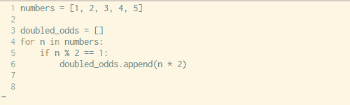
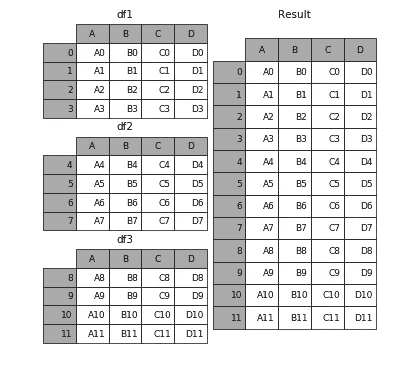
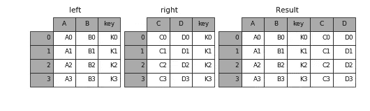
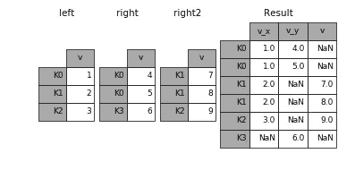

# 用于数据科学的 Python:你可能已经忘记的 8 个概念

> 原文：<https://towardsdatascience.com/python-for-data-science-8-concepts-you-may-have-forgotten-i-did-825966908393?source=collection_archive---------1----------------------->

## 掌握 Python、NumPy 和 Pandas 中的小东西


Source: [Unsplash](https://unsplash.com/photos/ourQHRTE2IM)

# 问题是

如果你曾经发现自己在编程时一遍又一遍地查找相同的问题、概念或语法，你并不孤单。

我发现自己经常这样做。

虽然在 StackOverflow 或其他资源上查找东西并不是不自然的，但它确实会使您的速度变慢，并对您是否完全理解这门语言提出质疑。

我们生活在这样一个世界里，似乎随时都有无限量的可访问的免费资源，只需一次搜索就能找到。然而，这可能是福也可能是祸。如果没有得到有效的管理，过度依赖这些资源会养成不良的习惯，这会让你长期落后。

[](https://xkcd.com/979/)

Source: xkcd

就我个人而言，我发现自己多次从类似的讨论线索中提取代码，而不是花时间学习和巩固概念，以便下次我可以自己复制代码。

这种方法是懒惰的，虽然它可能是短期内阻力最小的方法，但它最终会伤害你的成长、生产力和回忆语法的能力。

# 目标

最近，我一直在 Udemy 上学习一门名为 [Python 的在线数据科学课程(哦，天哪，我听起来像 Youtube](https://www.udemy.com/python-for-data-science-and-machine-learning-bootcamp/) 上的[那家伙)。在本系列的早期讲座中，我想起了在 Python 中执行数据分析时经常忽略的一些概念和语法。](https://www.reddit.com/r/ProgrammerHumor/comments/7g8t32/can_someone_please_remove_this_pompous_douche/)

为了一劳永逸地巩固我对这些概念的理解，并为你们节省一些 StackOverflow 搜索，这里有一些我在使用 Python、NumPy 和 Pandas 时经常忘记的东西。

我已经为每个概念提供了一个简短的描述和示例，但是为了您的利益，我还将提供视频和其他资源的链接，以便更深入地探索每个概念。

# [单行列表理解](http://treyhunner.com/2015/12/python-list-comprehensions-now-in-color/)

每次需要定义某种列表时都要编写一个 for 循环，这很繁琐，幸运的是 Python 有一个内置的方法，只用一行代码就可以解决这个问题。语法可能有点难理解，但是一旦你熟悉了这种技术，你就会经常使用它。



Source: [Trey Hunner](http://treyhunner.com/2015/12/python-list-comprehensions-now-in-color/)

看看上面和下面的例子，看看你通常是如何用 for 循环理解列表，而不是用一行简单的代码创建列表，而不需要循环。

```
x = [1,2,3,4]
out = []
for item in x:
    out.append(item**2)
print(out)**[1, 4, 9, 16]**# vs.x = [1,2,3,4]
out = [item**2 for item in x]
print(out)**[1, 4, 9, 16]**
```

# [λ函数](https://www.programiz.com/python-programming/anonymous-function)

是否厌倦了为有限的用例创建一个又一个函数？兰姆达功能来拯救！Lambda 函数用于在 Python 中创建小型、一次性和匿名的函数对象。基本上，他们让你创建一个函数，*而不创建函数*。

lambda 函数的基本语法是:

```
lambda arguments: expression
```

请注意，lambda 函数可以做常规函数能做的一切，只要只有一个表达式。查看下面的简单示例和即将播放的视频，更好地感受 lambda 函数的强大功能:

```
double = lambda x: x * 2
print(double(5))**10**
```

# [贴图和滤镜](https://prateekvjoshi.com/2015/11/10/understanding-filter-map-and-reduce-in-python/)

一旦掌握了 lambda 函数，学习将它们与 map 和 filter 函数配对会是一个强大的工具。

具体来说，map 接受一个列表，并通过对每个元素执行某种操作将其转换为一个新列表。在这个例子中，它遍历每个元素并将自身乘以 2 的结果映射到一个新的列表。请注意，list 函数只是将输出转换为列表类型。

```
# Map
seq = [1, 2, 3, 4, 5]
result = list(map(lambda var: var*2, seq))
print(result)**[2, 4, 6, 8, 10]**
```

filter 函数接受一个列表和一个规则，很像 map，但是它通过将每个元素与布尔过滤规则进行比较来返回原始列表的子集。

```
# Filter
seq = [1, 2, 3, 4, 5]
result = list(filter(lambda x: x > 2, seq))
print(result)**[3, 4, 5]**
```

# [Arange 和 Linspace](https://docs.scipy.org/doc/numpy/reference/generated/numpy.arange.html)

要创建快速简单的 Numpy 数组，只需看看 arange 和 linspace 函数就行了。每一种都有其特定的用途，但这里的吸引力(而不是使用范围)是它们输出 NumPy 数组，这通常更容易用于数据科学。

Arange 返回给定间隔内间隔均匀的值。除了起点和终点，如果需要，还可以定义步长或数据类型。请注意，停止点是一个“截止”值，因此它不会包含在数组输出中。

```
# np.arange(start, stop, step)
np.arange(3, 7, 2)**array([3, 5])**
```

Linspace 非常相似，但略有不同。Linspace 返回指定间隔内间隔均匀的数字。因此，给定一个起点和终点，以及一些值，linspace 将在一个 NumPy 数组中为您平均分配它们。这对于数据可视化和绘图时声明轴特别有帮助。

```
# np.linspace(start, stop, num)
np.linspace(2.0, 3.0, num=5)**array([ 2.0,  2.25,  2.5,  2.75, 3.0])**
```

# [轴的真正含义是什么](https://stackoverflow.com/questions/22149584/what-does-axis-in-pandas-mean)

您可能在删除 Pandas 中的列或对 NumPy 矩阵中的值求和时遇到过这种情况。如果没有，那么在某个时候你肯定会的。现在让我们以删除一列为例:

```
df.drop('Row A', axis=0)
df.drop('Column A', axis=1)
```

我不知道我写了多少遍这行代码，才知道为什么要声明 axis 是什么。正如您可能从上面推导出的那样，如果您想要处理列，请将 axis 设置为 1，如果您想要行，请将其设置为 0。但这是为什么呢？我最喜欢的推理，或者至少我记得是这样的:

```
df.shape**(# of Rows, # of Columns)**
```

从 Pandas dataframe 调用 shape 属性会返回一个元组，第一个值表示行数，第二个值表示列数。如果你想一想这在 Python 中是如何索引的，行是 0，列是 1，就像我们如何声明轴值一样。很疯狂，对吧？

# [串联](https://pandas.pydata.org/pandas-docs/stable/merging.html)，[合并，并连接](https://pandas.pydata.org/pandas-docs/stable/merging.html)

如果您熟悉 SQL，那么这些概念对您来说可能会容易得多。总之，这些函数本质上只是以特定方式组合数据帧的方法。很难跟踪哪一个在哪个时间使用是最好的，所以让我们来回顾一下。

Concat 允许用户将一个或多个数据帧附加到彼此的下方或旁边(取决于您如何定义轴)。



Merge 将用作主键的特定公共列上的多个数据帧组合在一起。



Join 与 merge 非常相似，它组合了两个数据帧。但是，它基于索引而不是某个指定的列来联接它们。



查看优秀的[熊猫文档](https://pandas.pydata.org/pandas-docs/version/0.18/merging.html)，了解具体的语法和更具体的例子，以及您可能遇到的一些特殊情况。

# [熊猫申请](http://pandas.pydata.org/pandas-docs/version/0.22/generated/pandas.DataFrame.apply.html)

把 apply 想象成一个地图函数，但是是为熊猫数据帧或者更具体地说，为系列制作的。如果您不太熟悉，Series 在很大程度上与 NumPy 数组非常相似。

Apply 根据您的指定将函数发送到列或行中的每个元素。您可能会想象这有多有用，特别是对于格式化和操作整个 DataFrame 列的值，而根本不需要循环。

# [数据透视表](https://pandas.pydata.org/pandas-docs/stable/generated/pandas.pivot_table.html)

最后但肯定不是最不重要的是数据透视表。如果您熟悉 Microsoft Excel，那么您可能在某些方面听说过数据透视表。Pandas 内置的 pivot_table 函数创建一个电子表格样式的数据透视表作为数据帧。请注意，数据透视表中的级别存储在结果数据帧的索引和列的 MultiIndex 对象中。

# 包扎

暂时就这样了。我希望这些概述能够有效地唤起您对使用 Python 进行数据科学时经常遇到的重要但有些棘手的方法、函数和概念的记忆。就我个人而言，我知道即使是写下这些并试图用简单的术语解释它们的行为也帮了我很多。

感谢阅读！请随意查看我下面的一些类似文章，并订阅我的时事通讯中的 [**和**](https://www.conordewey.com/) 以获得有趣的链接和新内容。

*   [为新的和有抱负的数据科学家汇编建议](https://www.conordewey.com/blog/compilation-of-advice-for-new-and-aspiring-data-scientists/)
*   [对于数据科学家来说，入职应该是什么样的？](https://www.conordewey.com/blog/what-should-onboarding-look-like-for-data-scientists/)
*   [13 份面向数据科学家的重要新闻简报:重新制作](https://www.conordewey.com/blog/13-essential-newsletters-for-data-scientists-remastered/)

你可以在 Medium 上关注我更多类似的帖子，也可以在 Twitter 上找到我。想了解更多关于我和我在做什么，请查看我的网站。