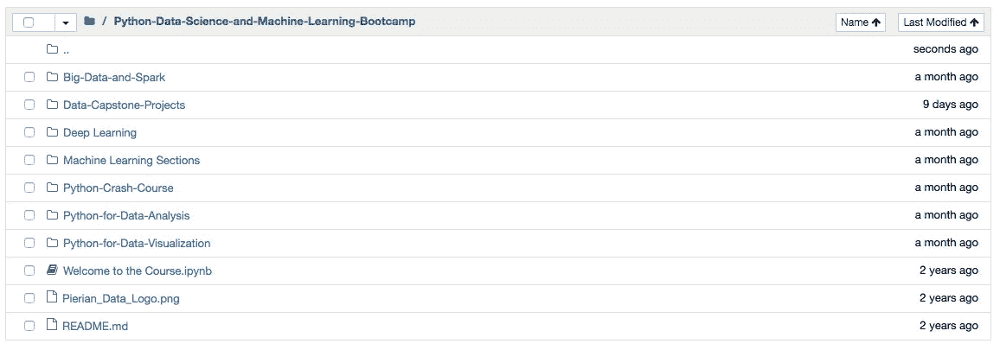

# 用于数据科学和机器学习的 Python 训练营回顾

> 原文：<https://towardsdatascience.com/python-for-data-science-and-machine-learning-bootcamp-review-48081471a96b?source=collection_archive---------3----------------------->

## 热门在线课程的思考和收获

[Python for Data Science and Machine Learning Bootcamp](https://www.udemy.com/python-for-data-science-and-machine-learning-bootcamp/learn/v4/content)

# 介绍

我今年夏天来到这里，最初的目标是回顾与使用 Python 进行数据科学相关的基本概念。我认为实现这一目标的最佳方式是通过在线课程和独立的并行项目。根据我的经验，我发现这种设置给了我适当的结构和灵活性来最有效地学习。

幸运的是，许多数据科学家已经承担了分析各种在线课程利弊的任务，所以我所要做的就是查看信息，并决定哪一个最适合我。最值得注意的是， [David Venturi](https://medium.com/u/b3eb78490b02?source=post_page-----48081471a96b--------------------------------) 在下面链接了几个非常好的帖子，就是为了做这个而设计的。

 [## 我根据数千个数据点，对互联网上的每一门数据科学导论课程进行了排名

### 一年前，我退出了加拿大最好的计算机科学项目之一。我开始创建自己的数据…

medium.freecodecamp.org](https://medium.freecodecamp.org/i-ranked-all-the-best-data-science-intro-courses-based-on-thousands-of-data-points-db5dc7e3eb8e)  [## 互联网上最好的数据科学课程，根据您的评论排名

### 一年半前，我退出了加拿大最好的计算机科学项目之一。我开始创造我自己的…

medium.freecodecamp.org](https://medium.freecodecamp.org/the-best-data-science-courses-on-the-internet-ranked-by-your-reviews-6dc5b910ea40) 

经过一些思考和更多的研究，我终于能够将我的选择缩小到 [Udemy](https://www.udemy.com/python-for-data-science-and-machine-learning-bootcamp/learn/v4/overview) 上的一门热门课程，名为*Python for Data Science and Machine Learning boot camp*。本课程分为几个小部分，涉及从数据分析到实现机器学习算法，再到开始使用 Spark 和 TensorFlow 的方方面面。下面你会发现一个更令人兴奋的正式摘录，摘自课程概述:

> 您准备好开始成为数据科学家的道路了吗！
> 
> 本综合课程将指导您学习如何使用 Python 的强大功能来分析数据，创建漂亮的可视化效果，以及使用强大的机器学习算法！
> 
> 这一综合课程可与通常花费数千美元的其他数据科学训练营相媲美，但现在您只需花费一小部分成本就可以了解所有信息！拥有超过 100 场高清视频讲座和每场讲座的详细代码笔记本这是 Udemy 上最全面的数据科学和机器学习课程之一！
> 
> 我们将教你如何用 Python 编程，如何创建令人惊叹的数据可视化，以及如何用 Python 使用机器学习！

平均来说，在过去的几个星期里，我每天都要完成一个部分，我会在接下来的几天内完成。虽然这种经历在我脑海中仍然记忆犹新，但我想我应该为那些关注 Python 数据科学课程的人写一篇关于这门课程的全面评论。如果你想了解课程本身，请点击下面的链接:

 [## Python 用于数据科学和机器学习训练营

### 了解如何使用 NumPy、Pandas、Seaborn、Matplotlib、Plotly、Scikit-Learn、机器学习、Tensorflow 等等！

www.udemy.com](https://www.udemy.com/python-for-data-science-and-machine-learning-bootcamp/learn/v4/overview) 

# 好人

首先也是最重要的一点，我喜欢整个课程中的讲座。它们大概是完美的长度，通常相当简洁，尽管我建议以至少 1.25 倍的速度观看，因为有时事情会移动得有点慢。这些概念得到了很好的解释，尤其是在早期关于 NumPy 和 Pandas 的数据分析讲座中。道具交给教官，[荷西](https://medium.com/u/703ff67f629f?source=post_page-----48081471a96b--------------------------------)给那个。

我还认为课程的结构非常好。从理论转向观察其他人将概念应用到实践中，并最终进行回顾和修正，这似乎是一条可行之路。

涵盖的主题的广度也令人印象深刻，尤其是针对初级和中级数据科学家的课程。该课程在某种程度上触及了你能想象到的一切，从 Python 基础到 NLP 再到深度学习。

Overview of topics covered

最后，课程中包含的 Jupyter 笔记本和解决方案概述是我最喜欢的部分。我发现很难有动力去完成通过网络课程布置的作业，但这里的情况并非如此。我喜欢解决练习题，并渴望事后查看解答笔记本和复习讲座。

# 坏事

尽管如此，我还是对这门课有一些批评。我发现，尽管花了一半的时间在机器学习算法上，但内容并不深入。公平地说，我认为这很大程度上是因为这个课程是针对初学者的——这一点在概述中有明确说明。

然而，我发现在第三或第四个 ML 部分之后，用最小理论应用不同的算法变得重复。就我的目的而言，我希望看到一些相同的旧的 [scikit-learn](http://scikit-learn.org/stable/) 调用被更基本的 ML 理论和概念所取代。

最后，值得一提的是，这门课程的费用约为 10 美元。这是非常合理的，我没有问题咳出多余的零钱。话虽如此，我也相信你可以从内容创作者那里免费找到同等质量甚至更好的在线内容，比如像 [Siraj](https://www.youtube.com/channel/UCWN3xxRkmTPmbKwht9FuE5A) 和[sendex](https://www.youtube.com/user/sentdex)等。

# 丑陋的

这与这门特定的课程没有任何关系，但是可能值得一提。在过去几年中，Udemy 作为一个组织受到了一些抵制。几个帖子和视频已经进入了这个话题，像[这个](https://nickjanetakis.com/blog/less-than-24-hours-on-udemy-as-an-instructor-and-i-am-close-to-leaving)来自平台上的一位前讲师，最近，下面链接的视频来自 Youtube 上一个受欢迎的内容提供商。

就我个人而言，这是我在 Udemy 上的第一次体验，我对这个平台没有任何问题，但有一些有趣的观点值得你下次注册课程时考虑。

# 最终外卖

总的来说，这门课做得非常好。尽管有付费墙，还是有超过 100，000 名学生注册了这门课程。对于数据科学的初学者来说，它是一个很好的起点，对于更有经验的从业者来说，它是一个有效的快速回顾。

然而，如果你真的想要一个强大的机器学习基础，我建议将这门课程与一门更理论化的课程配对，比如吴恩达在 Coursera 上广受好评的[机器学习](https://www.coursera.org/learn/machine-learning)课程。

最后，关于付费墙，我非常有信心，如果你足够努力的话，在网上可以免费获得同等的，甚至更好的资料。当您选择参加本课程时，您实际上是在为购买在线课程所带来的结构和责任付费。对我来说，这个选择是有意义的，最终，这个课程证明是时间和金钱的可靠投资。

## 最终评分:4/5 星

感谢阅读！如果你喜欢这篇文章，请继续向鼓掌按钮展示你的爱。对更多的帖子感兴趣吗？请务必[关注我](https://twitter.com/cdeweyx)并订阅下面的[我的简讯](https://www.conordewey.com/)以接收任何新内容。想了解更多关于我和我在做什么，请查看我的网站。