# 用于数据科学的 Python:第 3 部分

> 原文：<https://towardsdatascience.com/python-for-data-science-part-3-be9b08660af9?source=collection_archive---------5----------------------->

在“Python 用于数据科学”系列的前几部分中，我们研究了:

[第 1 部分](/python-for-data-science-part-1-759524eb493b):Python 中的基本内置特性，如函数、数据类型、日期/时间、映射、归约、过滤、lambda 函数等。

[第 2 部分](/python-for-data-science-part-2-373d6473fa40):用于创建、访问和操作数组的 Numpy 库

在本文中，我们将关注最广泛使用的数据分析库——Pandas。它的名字是怎么来的？熊猫这个名字来源于**潘**埃尔**达**塔。面板数据由对相同个体的多个时间段的观察组成。


Pandas 提供易于使用的数据结构和数据分析工具来创建和操作数据集。我们将会看到熊猫的以下特征:

1.  系列和数据框架
2.  查询系列
3.  读写文件
4.  索引
5.  合并
6.  聚集
7.  过滤

和往常一样，第一步是导入库。让我们导入熊猫和 numpy 库。

```
import pandas as pd
import numpy as np
```

# 1.熊猫系列

系列是一维数据结构，可以保存任何数据类型，如整数和字符串。它类似于 Python 中的列表。

首先，让我们创建一个列表

```
name = ['Rohan','Joseph','Rohit']
name
```

***输出:['罗汉'，'约瑟夫'，'罗希特']***

现在，让我们将同一个列表转换成熊猫系列。

```
name = pd.Series(name)
name
```

***输出:***

***0 罗汉
1 约瑟夫
2 罗希特
dtype:object***

我们可以观察到熊猫系列显示了指数以及每个位置的值。同样，让我们创建一个字典，并将其转换为熊猫系列。

```
sport = {'cricket' : 'India',
        'soccer' : 'UK',
        'Football' : 'USA'}sport = pd.Series(sport)
sport
```

***输出:***

***板球印度
足球英国
足球美国
d 类型:对象***

字典的“键”成为序列中的索引，字典的“值”保持为序列的值。让我们通过查询一个熊猫系列来进一步理解这一点。

# 2.查询熊猫系列

让我们继续上面创建的同一个系列“运动”。让我们访问系列中的第三个值

```
sport.iloc[2]
```

***输出:“美国”***

“iloc”用于根据值的整数位置选择值。现在，让我们使用值的索引来访问同一个值。

```
sport.loc['Football']
```

***输出:“美国”***

太好了，让我们把一系列的值加起来

```
a = pd.Series([1,2,3])
np.sum(a) #np sum function is a faster than the in-built function
```

***输出:6***

向现有系列添加数据。

```
a = pd.Series([1,2,3])
a.loc[‘City’] = ‘Delhi’
```

***输出:***

**0 1
1 2
2 3
城市德里
d 类型:对象 **

让我们创建一个具有相同索引的多个值的序列。

```
b = pd.Series([‘a’,’b’,’c’,’d’],index=[‘e’,’e’,’e’,’e’])
b
```

***输出:***

***e a
e b
e c
e d
d type:object***

# 3.熊猫数据框

Dataframe 是具有不同数据类型(字符串、整数、日期等)的列的二维数据结构。).

让我们在熊猫中创建一个数据框架。我们正在创建一个包含三列的数据集——姓名、职业和年龄。

```
df1 = pd.DataFrame([{'Name' : 'John', 'Occupation' :  'Data Scientist', 'Age' : 25},{'Name' : 'David', 'Occupation' :  'Analyst', 'Age' : 28},{'Name' : 'Mark', 'Occupation' :  'Teacher', 'Age' : 30}],index=['1','2','3'] )df1
```

***输出:***

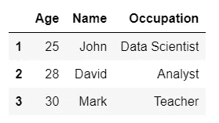

现在，让我们通过追加两个系列来创建一个数据帧。

```
s1 = pd.Series({'Name' : 'Rohan',
                   'Age':'25'})
s2 = pd.Series({'Name' : 'Rohit',
                'Age' : 28})]
df1 = pd.DataFrame([s1,s2],index=['1','2'])
df1
```

***输出:***

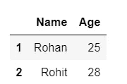

# 4.读写文件

让我们看看如何读取 csv 文件。

```
iris = pd.read_csv('C:\\Users\\rohan\\Documents\\Analytics\\Data\\iris.csv')
```

让我们看看文件的前 5 行。

```
iris.head()
```

***输出:***

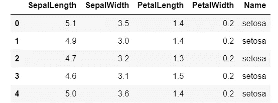

将文件保存回本地目录。

```
iris.to_csv('iris2.csv')
```

# 5.索引数据帧

检查上一步导入的 iris 数据集的索引。

```
iris.index.values
```

***输出:***

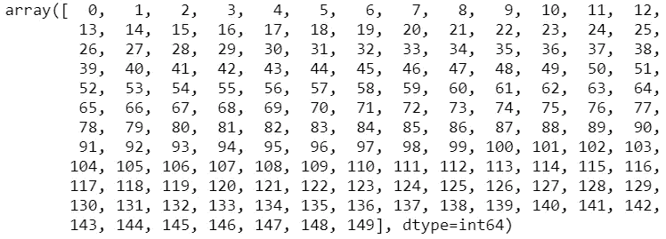

现在，将索引改为物种名称。“名称”列将显示为索引，并替换先前的索引。

```
b = iris.set_index('Name')
b.head()
```

***输出:***

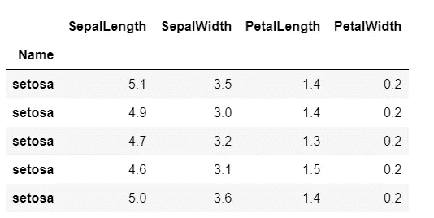

要恢复到以前的索引，只需按如下方式重置索引。

```
c = b.reset_index()
c.index.values
```

**输出:**

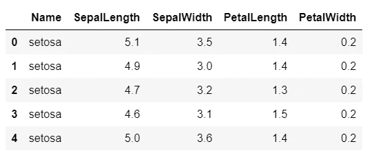

# 6.合并数据帧

让我们再次导入虹膜数据，并将其与另一个数据集合并。

```
df1 = pd.read_csv('iris.csv')
df1.head()
```

**输出:**

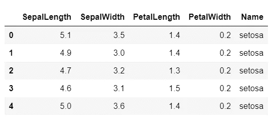

创建一个新的 dataframe 以与此合并。

```
df2 = pd.DataFrame([{'Name' : 'setosa', 'Species' : 'Species 1'},
                  {'Name':'versicolor','Species':'Species 2'},
                   {'Name':'virginica','Species':'Species 3'}])
df2
```

**输出:**


通过执行一个**内部连接**，在名称列上合并上述两个数据集**。**

```
df3 = pd.merge(df1,df2,how='inner',left_on='Name',right_on='Name')
df3.head()
```

***输出:***

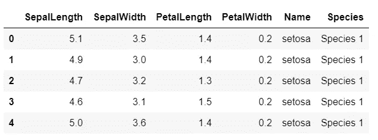

# 7.聚合函数

让我们聚集 iris 数据集中的几列。首先，让我们找出每个物种的平均萼片长度。

```
df1.groupby('Name')['SepalLength'].mean()
```

***输出:***

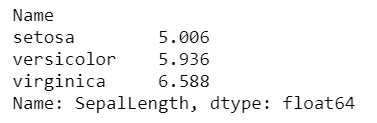

现在，让我们按物种找出所有数字列的平均值。

```
df1.groupby('Name')[['SepalLength','SepalWidth','PetalLength','PetalWidth']].mean()
```

**输出:输出:**

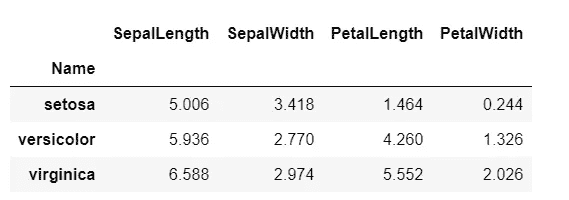

而不是找到所有列的平均值；让我们对一列(萼片长度)取平均值，对另一列(萼片宽度)求和

```
a=df1.groupby('Name').agg({'SepalLength':'mean','SepalWidth':'sum'})
a
```

**输出:输出:**

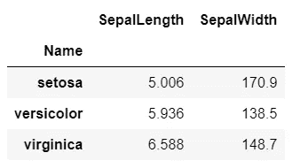

让我们重命名这些列。

```
a.rename(columns={'SepalLength':'Avg_SepalLength','SepalWidth':'Sum_SepalWidth'})
```

***输出:***

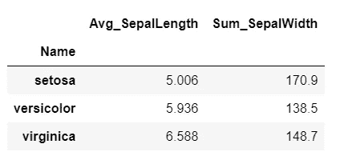

# 8.过滤数据帧

让我们再一次导入 iris 数据集，并执行操作来划分数据集的子集。首先，让我们对萼片长度大于 7 厘米的数据进行分组。

```
iris = pd.read_csv(‘iris.csv’)  #import file
a = iris[(iris.SepalLength>7)]
a.head()
```

***输出:***

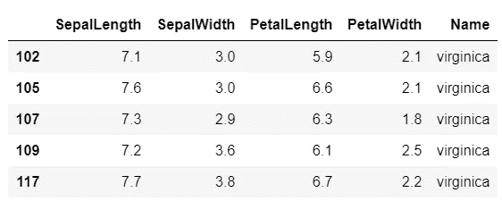

现在，让我们根据两个条件对数据进行子集划分。

```
b = iris[(iris.SepalLength>5) & (iris.PetalLength>6)]
b.head()
```

***输出:***

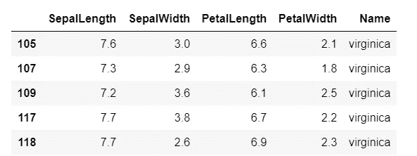

通过对“名称”列进行筛选来对数据进行子集划分。

```
c = iris[iris['Name']=='versicolor']
c.head()
```


再次过滤姓名列，但过滤两个姓名。

```
d = iris[iris['Name'].isin(['virginica','versicolor'])]
d.head()
```

**输出:**

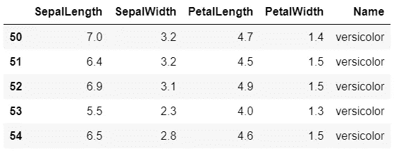

我们在这篇文章中看到的是在数据科学中使用的 Pandas 中最常用的功能，尽管还有更多功能值得了解，如广播、数据透视表、多索引和可视化。在本系列的下一部分中，我们将继续我们的旅程，看看我们如何将 Pandas 与其他功能结合起来操作数据。

在 [LinkedIn](https://www.linkedin.com/feed/) 上连接，并查看 Github(如下)以获得完整的笔记本。

[](https://github.com/rohanjoseph93/Python-for-data-science/blob/master/Python%20for%20Data%20Science%20-%20Part%203.ipynb) [## rohanjoseph 93/用于数据科学的 Python

### Python-for-data-science -用 Python 学习数据科学

github.com](https://github.com/rohanjoseph93/Python-for-data-science/blob/master/Python%20for%20Data%20Science%20-%20Part%203.ipynb)