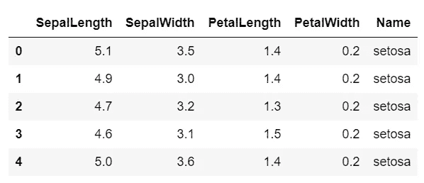
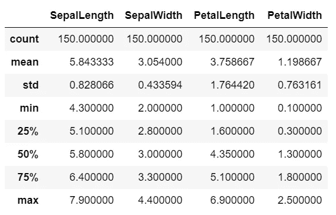
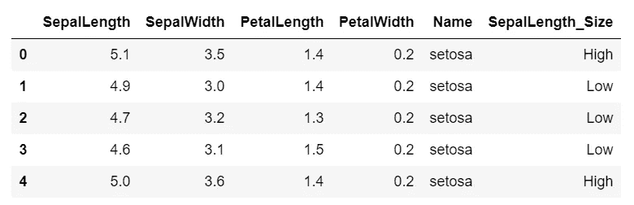
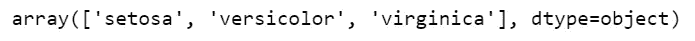
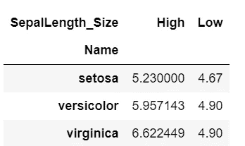
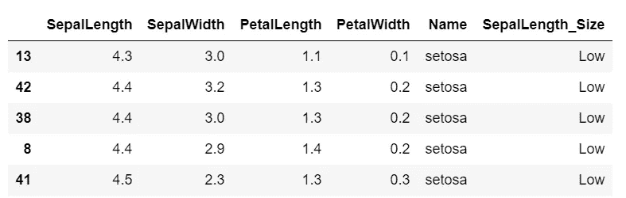
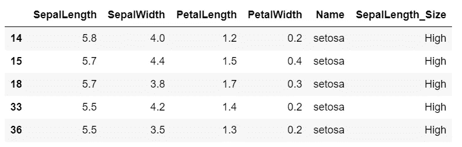
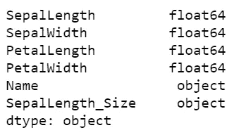
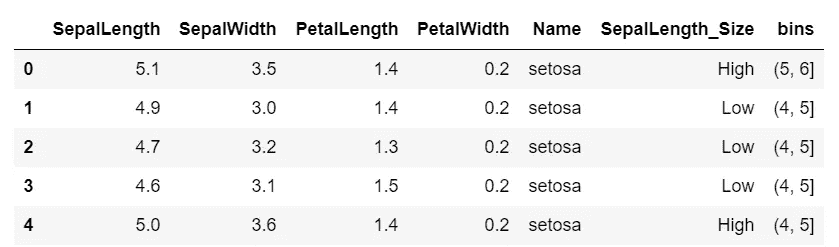
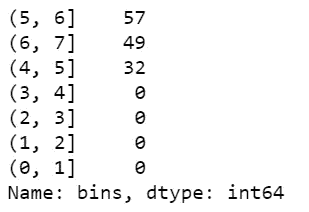

# 用于数据科学的 Python:第 4 部分

> 原文：<https://towardsdatascience.com/python-for-data-science-part-4-6087cb811a29?source=collection_archive---------16----------------------->


在 Python for data science 系列文章的第 3 部分[中，我们查看了 pandas 库及其最常用的功能——读写文件、索引、合并、聚合、过滤等。在这一部分中，我们将继续深入研究 Pandas 库，看看它如何与其他 Python 函数一起用于查询数据帧。](/python-for-data-science-part-3-be9b08660af9)

让我们从导入所有必需的库开始。

```
import pandas as pd
import os
import numpy as np
```

现在，设置工作目录并导入 iris 数据集。

```
os.chdir('C:\\Users\\rohan\\Documents\\Analytics\\Data')
a = pd.read_csv('iris.csv')
a.head()
```

***输出:***



# **1。数字列的描述性统计**

总结(平均值、标准偏差、最小值、最大值等。)使用 describe 函数的数据集的数字列。

```
a.describe()
```

***输出:***



# **2。基于条件创建列**

让我们创建一个名为' **SepalLength_Size'** 的新列，如果萼片长度≥ 5，则包含“高”，如果萼片长度< 5，则包含“低”。

有许多方法可以执行上述任务。让我们来看看四种不同的方法。

1.  首先，让我们通过使用 **np.where** 函数来执行这个任务。

```
a['SepalLength_Size'] = np.where(a['SepalLength']>=5,'High','Low')
a.head()
```

***输出:***



2.现在，使用**列表理解**(如果你忘了那是什么，在[第一部分](/python-for-data-science-part-1-759524eb493b)中检查一下)来完成同样的任务。此外，列表理解通常比所有其他方法更快。

```
a['SepalLength_Size'] = ['High' if x >= 5 else 'Low' for x in a['SepalLength'] ]
```

***输出:***


3.现在，让我们使用 pandas dataframe 中的**‘assign’**函数创建列。

```
def size(row_number):
    if row_number["SepalLength"] >=5:
        return 'High'
    else:
        return 'Low'a = a.assign(SepalLength_Size=a.apply(size, axis=1))a.head()
```

**输出:**


4.最后，让我们使用 **lambda** 函数。

```
a['SepalLength_Size'] = a['SepalLength'].map( lambda x: 'High' if x >= 5 else 'Low')
```

**输出:**


# 3.列的唯一值

```
a['Name'].unique()
```

***输出:***



仅获取“名称”列的唯一值的数量。

```
a['Name'].nunique()
```

***输出:*** 3

# **4。十字页签(类似 Excel 中的透视表)**

此函数用于查找两个或多个因子的简单交叉列表。让我们使用列“Name”和“SepalLength_Size”(我们创建的新列)，看看它是如何工作的。

```
pd.crosstab(a['Name'],a['SepalLength_Size'])
```

**输出:输出:**


上面的十字标签提供了每种组合的行数，例如，有 30 个具有高萼片长度的刚毛藻种。

让我们再做一次交叉制表，找出每个桶中萼片的平均长度。

```
pd.crosstab(a['Name'],a['SepalLength_Size'],values=a['SepalLength'],aggfunc=np.mean)
```



# 5.排序值

让我们按“萼片长度”对数据进行分类。

```
a.sort_values('SepalLength')
```

**输出:输出:**



首先按“名称”排序(升序)，然后按“萼片长度”排序(降序)。

```
a.sort_values(['Name','SepalLength'],ascending=[True,False])
```

***输出:***



检查所有列的数据类型

# **6。检查列数据类型**

```
a.dtypes
```

***输出:***



# 7.宁滨数字列

在 iris 数据集中创建一个新列来存储“萼片长度”。我们可以使用“剪切”功能来执行此操作。

```
bins = [0, 1, 2, 3, 4, 5,6,7]
a[‘bins’] = pd.cut(a[‘SepalLength’], bins)
```

***输出:***



现在，使用“value_counts”函数计算每个存储桶下有多少行。

***输出:***



这涵盖了在数据科学中经常使用的大部分熊猫函数。在接下来的部分中，我们将会看到 Python 中的可视化和假设检验。

在 LinkedIn 上连接，并查看 Github(如下)以获得完整的笔记本。

[](https://github.com/rohanjoseph93/Python-for-data-science/blob/master/Python%20for%20data%20science%20-%20Part%204.ipynb) [## rohanjoseph 93/用于数据科学的 Python

### Python-for-data-science -用 Python 学习数据科学

github.com](https://github.com/rohanjoseph93/Python-for-data-science/blob/master/Python%20for%20data%20science%20-%20Part%204.ipynb)