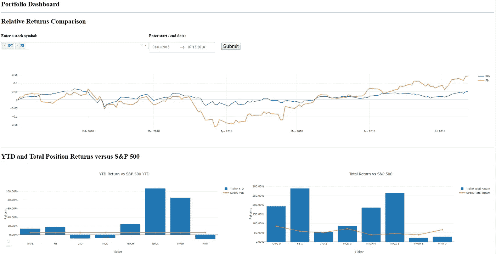

# 面向金融的 python:Dash by Plotly

> 原文：<https://towardsdatascience.com/python-for-finance-dash-by-plotly-ccf84045b8be?source=collection_archive---------3----------------------->

## 在 Dash by Plotly 中使用交互式图表扩展 Jupyter 笔记本股票投资组合分析。


By Carlos Muza on Unsplash.

# 利用 Python 进行股票投资组合分析的第 2 部分。

在本系列的第一部分[中，我讨论了由于我已经越来越习惯于使用`pandas`，我是如何显著增加使用`Python`进行财务分析的。在第 1 部分的文章中，我们回顾了如何利用`pandas`和`Yahoo Finance API`在很大程度上自动化股票投资组合绩效的跟踪和基准测试。在这篇文章结束时，你已经生成了一个丰富的数据集，可以计算出在相同的持有期内，投资组合头寸相对于同等规模的标准普尔 500 指数头寸的相对百分比和美元价值回报。你还可以确定每个头寸对你整体投资组合回报的贡献，或许最重要的是，你投资标准普尔 500 指数 ETF 或指数基金是否会更好。最后，你使用`Plotly`进行可视化，这样更容易理解哪些头寸驱动了最大的价值，它们相对于标准普尔 500 指数的年初至今势头是什么样的，如果有任何头寸下跌，你可能想考虑撤资，也就是“跟踪止损”。](/python-for-finance-stock-portfolio-analyses-6da4c3e61054)

在 Jupyter notebook 中构建这个初始过程的过程中，我学到了很多东西，我还发现写一篇文章非常有帮助，这篇文章浏览了笔记本，解释了代码，并讲述了我在每个可视化背后的想法。这篇后续文章将比前一篇更短，目的也更直接。虽然我不断发现我创建的笔记本有助于跟踪我的股票投资组合，但我一直打算学习并整合一个用于构建分析仪表板/网络应用程序的`Python`框架。对我来说，最重要的用例之一是能够选择特定的位置和时间框架，然后动态地评估每个位置的相对性能。将来，我很可能会将此评估案例扩展到我不拥有但正在考虑收购的职位。在今年剩下的时间里，我希望通过学习`Flask`，使用`Heroku`部署应用程序，以及理想情况下开发某种类型的数据管道来自动提取和加载最终 web 应用程序的新数据，来进一步加深我对构建 web 应用程序的理解。虽然我仍然处于这个过程的早期，在这篇文章中，我将讨论我上次讨论的笔记本的扩展，以及我使用`Dash by Plotly`，又名`Dash`的初始开发。

# 阴谋地破折号。

如果你已经阅读或参考了[第 1 部分](/python-for-finance-stock-portfolio-analyses-6da4c3e61054)，你会发现一旦你创建了主数据框架，你就使用`Plotly`来生成评估相对于标准普尔 500 指数的投资组合表现的可视化。Plotly 是一个非常丰富的库，相对于其他 Python 可视化库如`Seaborn`和`Matplotlib`，我更喜欢使用`Plotly`来创建可视化。在此基础上，我的最终目标是为我的投资组合分析提供一个交互式仪表板/ web 应用程序。我正在继续寻找这个问题的最佳解决方案，同时我已经开始探索`Dash`的使用。Plotly 将 [Dash](https://plot.ly/products/dash/) 定义为构建 web 应用程序的 Python 框架，其额外的好处是不需要 JavaScript。正如我链接到的登录页面上所示，它构建在 Plotly.js、React 和 Flask 之上。

到目前为止，我所看到的最初好处是，一旦您熟悉并熟悉了`Plotly`，`Dash`就是仪表板开发的自然延伸。比起简单地把你的可视化内容放在你进行分析的`Jupyter`笔记本里，我确实看到了创建一个独立的交互式网络应用的价值。`Dash`通过“下拉菜单、滑块和图表等现代 UI 元素”提供增强的交互性和操纵数据的能力。该功能直接支持我的股票投资组合分析的最终目标，包括进行“假设分析”的能力，以及交互式研究潜在机会和快速了解关键驱动因素和情景的能力。考虑到所有这些，至少对我来说，与`Dash`的学习曲线不是无关紧要的。

## 何塞·波尔蒂利亚的“使用 Plotly 和 Dash 的交互式 Python 仪表盘”

为了缩短我通读 Dash 文档并对其进行全面故障诊断的时间，我报名参加了 Udemy 网站上何塞·波尔蒂利亚的课程。该课程详细页面可以在[这里](https://www.udemy.com/interactive-python-dashboards-with-plotly-and-dash/)找到。我学过 Jose 的一些课程，目前正在学他的`Flask`课程。我认为他是一个非常可靠和有帮助的讲师——虽然他通常不认为丰富的编程经验是他的课程的先决条件，但在这个`Dash`课程中，他建议至少要非常熟悉`Python`。特别是，强烈建议您充分理解可视化的`Plotly's`语法，包括使用`pandas`。学完课程后，你仍将对你能用`Dash`构建的东西略知一二。然而，我发现这个课程是一个非常有帮助的开端，特别是因为 Jose 使用了`datareader`和财务数据和例子，包括动态绘制股票价格图表。

# 从 Jupyter 笔记本移植数据，以便在 Dash 中与之交互。

## 入门指南

类似于[第 1 部分](/python-for-finance-stock-portfolio-analyses-6da4c3e61054)，我在 GitHub 上创建了[另一个 repo，其中包含创建最终`Dash`仪表板所需的所有文件和代码。](https://github.com/kdboller/pythonsp500-plotly-dash)

下面总结了包括的内容以及如何开始:

1.  **投资组合 Python Notebook _ Dash _ blog _ example . ipynb**—这与第 1 部分的 Jupyter 笔记本非常相似；新增内容包括最后两个部分:一个是“股票回报比较”部分，这是我在使用`Dash`之前作为概念验证而构建的，还有一个是“数据输出”，在这里我为分析生成的数据创建 csv 文件；这些用作`Dash`仪表板中使用的数据源。
2.  **样本股票收购日期 _ 成本. xlsx** —这是玩具投资组合文件，您将使用或修改该文件进行投资组合评估。
3.  **requirements.txt** —这里应该有你需要的所有库。我建议在 Anaconda 中创建一个虚拟环境，下面会进一步讨论。
4.  **Mock _ Portfolio _ dash . py**—这是`Dash`仪表板的代码，我们将在下面介绍。

根据我的报告的自述文件，我建议使用 Anaconda 创建一个虚拟环境。下面是关于 Anaconda 虚拟环境的快速解释和更多细节的链接:

我推荐 Python 3.6 或更高版本，这样您就可以使用提供的 csv 文件在本地运行`Dash`仪表板。[这里的](https://medium.freecodecamp.org/why-you-need-python-environments-and-how-to-manage-them-with-conda-85f155f4353c)是关于如何在`Anaconda`中建立虚拟环境的非常详尽的解释。

最后，正如在第 1 部分中提到的，一旦您的环境设置好了，除了需求文件中的库之外，如果您想要 Yahoo Finance datareader 在笔记本中运行，您还需要在您的虚拟环境中运行`pip install fix-yahoo-finance`。

# 使用 Dash

如果您已经使用 Python 3.6 建立了一个虚拟环境，并且已经安装了必要的库，那么您应该能够使用 Dash dashboard 代码运行`Python`文件。

对于那些不太熟悉的人:一旦进入您的虚拟环境，您需要将目录 cd 更改为保存回购文件的位置。举个简单的例子，如果您打开 Anaconda 提示符，并且在 Documents 文件夹中，文件保存在您的桌面上，您可以执行以下操作:

```
cd **..** *# This will take you up one folder in the directory.*cd  Desktop *# this will take you to your Desktop.*dir *# This is the windows command to display all files in the directory.  You should see the Mock_Portfolio_Dash.py file listed.*python Mock_Portfolio_Dash**.**py *# this will run the Dash file*
*# You will then go to your browser and input the URL where Python says your dashboard is running on localhost.*
```

如果您想了解 Jupyter 笔记本和生成投资组合数据集的完整解释，请参考[第 1 部分](/python-for-finance-stock-portfolio-analyses-6da4c3e61054)。在 Jupyter 笔记本的末尾，您会在“数据输出”部分看到以下代码。这些小的添加会将 CSV 文件发送到您的本地目录。第一个是完整的投资组合数据集，您可以从中生成所有的可视化效果，第二个提供了您将在第一个新股票图表的下拉选择中使用的报价器列表。

```
*# Generate the base file that will be used for Dash dashboard.*merged_portfolio_sp_latest_YTD_sp_closing_high**.**to_csv('analyzed_portfolio.csv')
```

我将强调 Mock Portfolio Python 文件的一些关键方面，并分享如何在本地运行仪表板。

以供参考。py 文件，下面是运行这个`Dash`仪表板时应该看到的前三个图表的屏幕截图。



First three charts in Dash Stock Portfolio Analyses dashboard.

在开始的时候。py 文件中，您导入包含在 requirements.txt 文件中的库，然后编写

```
app **=** dash**.**Dash()
```

为了实例化 Dash 应用程序。然后创建两个 dataframe 对象，`tickers`和`data`。ticker 将用于图表下拉列表中的股票 ticker，而`data`数据框是用于所有可视化评估的最终数据集。

您将整个仪表板包装在一个 Div 中，然后开始在这个主 Div 中添加图表组件。中的第 35–72 行。py 文件生成“相对收益比较”图表，包括股票代码下拉列表、开始/结束日期范围、提交按钮和图表输出。为了简洁起见，我将在。py 文件。

```
html**.**H1('Relative Returns Comparison'),
	html**.**Div([html**.**H3('Enter a stock symbol:', style**=**{'paddingRight': '30px'}),
		dcc**.**Dropdown(
			id**=**'my_ticker_symbol',
			options **=** options,
			value **=** ['SPY'], 
			multi **=** True
			*# style={'fontSize': 24, 'width': 75}*
			)	]
```

如上所述，使用`Dash`意味着您不需要在应用程序中添加 JavaScript。在上面的代码块中，我们用 H1 标签标记输出，创建另一个 Div，然后使用 dash_core_components 库中的下拉菜单。您将 id 设置为“my_ticker_symbol ”,我们稍后将回顾它在何处发挥作用，从选项列表(从 tickers dataframe 生成)中设置默认值“SPY ”,然后将多选设置为真。这里有一点学习曲线，至少对我来说是这样，何塞·波尔蒂利亚的课程可以通过提供总结`Dash`文档的切实例子来缩短你的学习时间——何塞实际上在他的课程中使用了一个类似于股票列表下拉列表和日期范围选择器的例子。

在这下面的第 75–93 行，您将看到仪表板左下方图表的代码。该图表与第 1 部分中 Jupyter 笔记本中提供的相同，但是我发现在仪表板布局中使用`Dash`来显示所有这些输出比在 Jupyter 笔记本中更好的用户体验，也更容易使用(与我迄今为止使用的其他任何东西相比，我仍然更喜欢使用笔记本来进行分析)。

```
*# YTD Returns versus S&P 500 section*
	html**.**H1('YTD and Total Position Returns versus S&P 500'),
		dcc**.**Graph(id**=**'ytd1',
                figure **=** {'data':[
                            go**.**Bar(
    				x **=** data['Ticker'][0:20],
    				y **=** data['Share YTD'][0:20],
    					name **=** 'Ticker YTD'),
    		go**.**Scatter(
				x **=** data['Ticker'][0:20],
				y **=** data['SP 500 YTD'][0:20],
				name **=** 'SP500 YTD')
                            ],
               'layout':go**.**Layout(title**=**'YTD Return vs S&P 500 YTD',
                            barmode**=**'group', 
                            xaxis **=** {'title':'Ticker'},
                            yaxis **=** {'title':'Returns', 'tickformat':".2%"}
                            )}, style**=**{'width': '50%', 'display':'inline-block'}
                            )
```

对于那些习惯使用`Plotly`的人来说，在创建绘制`Plotly`图形所需的数据和布局对象方面，语法应该是熟悉的。上面包含的语法不同于笔记本中图表使用的语法，因为我更喜欢创建跟踪，基于这些跟踪生成数据对象，并在布局对象中使用`dict`语法。在学习 Jose 的课程和回顾`Dash`文档时，我发现在`Dash`中更容易遵循这种语法——在解决结束标记、括号、花括号等问题时，有时会变得难以处理，所以我专注于习惯这种结构。

```
@app.callback(Output('my_graph', 'figure'),
			[Input('submit-button', 'n_clicks')],
			[State('my_ticker_symbol', 'value'),
			State('my_date_picker', 'start_date'),
			State('my_date_picker', 'end_date') ])
**def** **update_graph**(n_clicks, stock_ticker, start_date, end_date):
	start **=** datetime**.**strptime(start_date[:10], '%Y-%m-%d')
	end **=** datetime**.**strptime(end_date[:10], '%Y-%m-%d') traces **=** []
	**for** tic **in** stock_ticker:
		df **=** web**.**DataReader(tic, 'iex', start, end)
		traces**.**append({'x':df**.**index, 'y':(df['close']**/**df['close']**.**iloc[0])**-**1, 'name': tic})

	fig **=** {
		'data': traces,
		'layout': {'title':stock_ticker}
	}
	**return** fig**if** __name__ **==** '__main__':
    app**.**run_server()
```

第 229-252 行(如上所述)驱动了第一个“相对收益比较”图表的交互性。下面是这段代码的简要概述:

*   为了创建交互式图表，`Dash`使用了一个[回调装饰器](https://dash.plot.ly/getting-started-part-2):“我们的应用程序接口的“输入”和“输出”是通过`app.callback`装饰器以声明方式描述的。”
*   在应用程序回调中，我们输出 dcc。先前指定的标识为“my_graph”的图形。
*   您使用 Submit 按钮作为输入，我们有三个默认状态，“my_ticker_symbol”和在 dcc 中声明的默认“SPY”值。之前讨论过的下拉列表，以及 2018 年 1 月 1 日的默认开始日期和今天的结束日期。
*   回调下面是回调装饰器包装的函数。如`Dash`文档所述，当输入属性改变时，装饰器包装的函数会被自动调用。“Dash 向函数提供输入属性的新值作为输入参数，Dash 使用函数返回的任何内容更新输出组件的属性。”
*   在 for 循环中，对于 y 值，我将任意给定日期`df['close']`的收盘价除以由所提供的日期范围(`df['close'].iloc[0]`)生成的序列中的第一个收盘价。
*   我这样做是为了观察指数为 0(日期范围的起点)的两只或多只股票的相对表现。鉴于股价的巨大差异，这使得比较一只交易价格超过 1800 美元的股票(如 AMZN)与另一只交易价格低于 100 美元的股票(如 WMT)的相对表现容易得多。
*   我会很快提到，有时会有一种误解，即如果一只股票以较低的价格交易，它就是“便宜的”，如果它以 AMZN 目前的价格交易，它就是“昂贵的”。鉴于这种误解，公司有时会[拆分股票](https://www.investopedia.com/ask/answers/what-stock-split-why-do-stocks-split/)，以使股价看起来更能让小投资者承受，即使公司的价值/市值保持不变。
*   不管怎样，这个图表的好处是，它允许你使用动态的日期范围，快速发现一只股票相对于标准普尔 500 的超/差表现。这提供了关于对你整个投资组合的价值贡献的有用信息，也提供了何时该考虑减持表现不佳的股票的有用信息。

# 结论和未来的考虑。

这就结束了我对`Dash`进行股票投资组合分析的初步回顾。像以前一样，您有一个可扩展的 Jupyter 笔记本和投资组合数据集，现在您可以将其作为 csv 文件读出，并在交互式`Dash`仪表板中查看。正如之前在[第一部分](/python-for-finance-stock-portfolio-analyses-6da4c3e61054)中所讨论的，这种方法仍然有一些需要改进的地方，包括需要将股息作为股东总回报的一部分，以及需要能够评估活跃和所有(包括撤资)头寸。

我发现这种方法的最大好处包括额外的交互性，以及我对所有图表的仪表板布局的偏好，而不是 Jupyter notebook 中单独的单元格。未来，我计划加入更强的互动性，包括更多的“假设分析”来评估个股对整体表现的贡献。

我目前考虑使用数据管道交付端到端 web 应用程序的其他选项包括:

*   **使用 Google BigQuery 进行模式分析:** [我在](/scaling-analytical-insights-with-python-part-2-73b45ce9584e)之前已经写过，我是多么喜欢在以前的公司使用模式分析。Mode 的好处包括它已经支持丰富的可视化(不需要编码)，包括一个内置的 Python 笔记本。然而，我不相信 Mode 有办法从金融 API 中提取数据，包括雅虎金融和 IEX。来自这些 API 源的数据可以读入一个私有数据库，例如使用 Google BigQuery，您可以连接到 Mode。然而，目前这似乎是一个限制，因为我相信我未来的更多图表和用例将需要从 API 中提取数据(而不是存储在数据库中)。
*   **Heroku with Postgres and Pipeline:**作为 Jose 课程的一部分，他向您展示了如何将`Dash`应用部署到`Heroku`(他的课程的另一个好处)。截至目前，我认为利用 Heroku 的应用程序功能是一个潜在的长期解决方案。这是我选择何塞的`Flask`课程的另一个原因；我从未构建过 web 应用程序，他展示了如何使用 SQLAlchemy 作为 Flask 应用程序的数据库。为了加深我对在 Heroku 上部署带有数据库的应用程序的理解，我的重点将是确定在一个交互式 web 应用程序中获取要分析的 finance-API 数据的最佳方式，我可以按照指定的时间表用新数据刷新该应用程序。

对我来说，长期的解决方案需要更多的学习，但这绝对是我想在今年剩下的时间里接受的挑战。我希望这篇文章对你有用，我欢迎评论中的任何反馈，包括我没有提到的，你认为更适合这个应用及其分析的其他选项。

如果你喜欢这篇文章，如果你能点击“拍手”图标让我知道并帮助增加我的作品的发行量，那将是非常棒的。

也可以在 twitter 上联系我， [@kevinboller](https://twitter.com/kevinboller) ，我的个人博客可以在这里找到。感谢阅读！