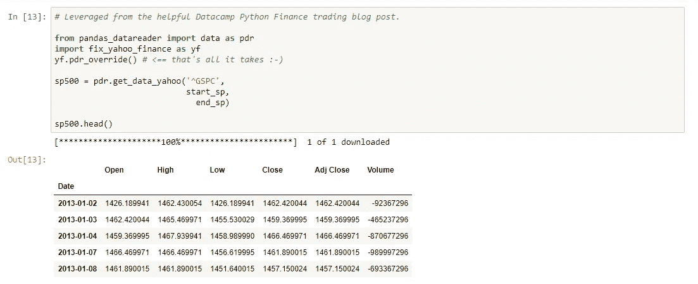
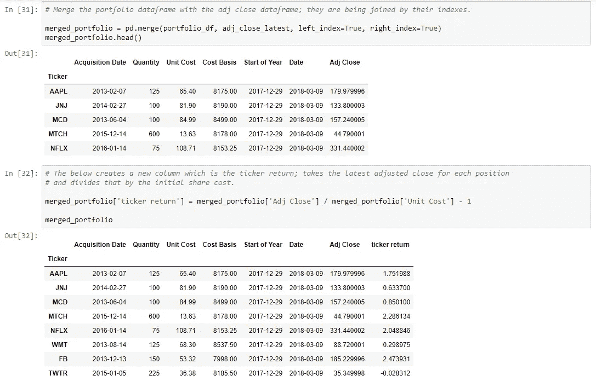
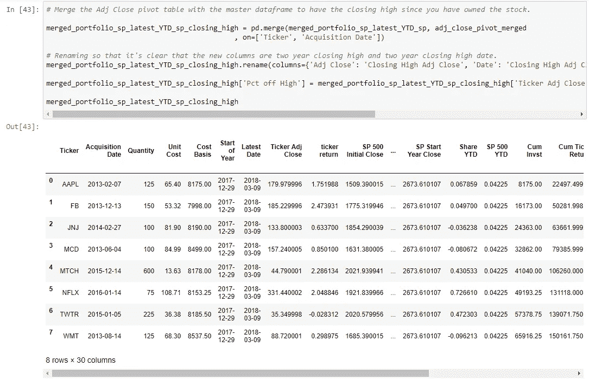
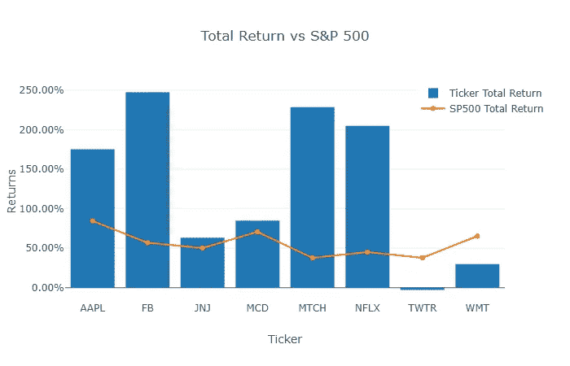
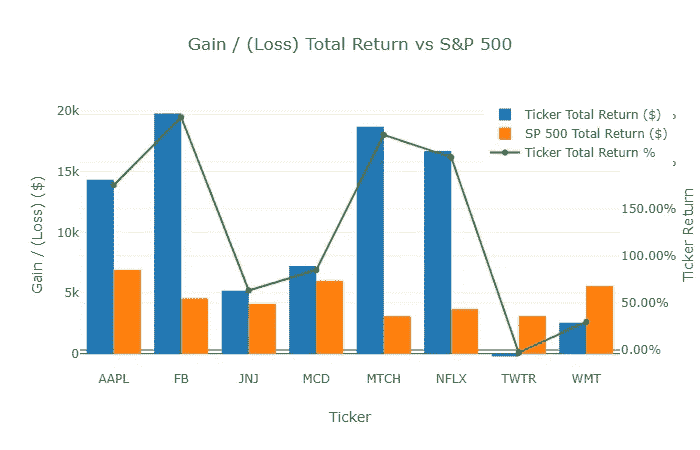
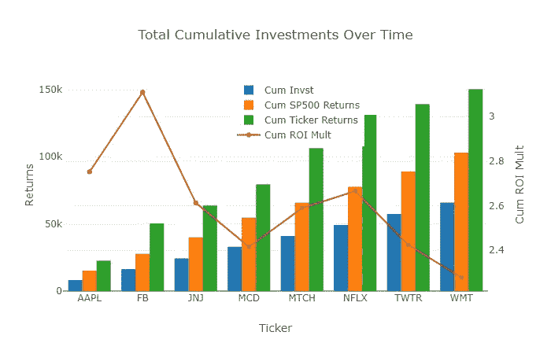
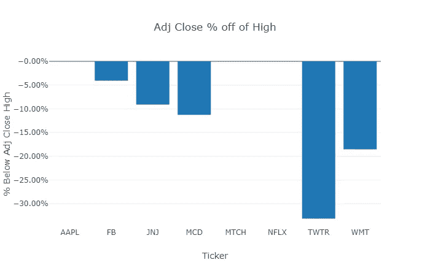

# 金融 Python:股票投资组合分析

> 原文：<https://towardsdatascience.com/python-for-finance-stock-portfolio-analyses-6da4c3e61054?source=collection_archive---------0----------------------->


我最近的两篇博文是关于用 Python 扩展分析洞察力的；第一部分可以在这里找到[，第二部分可以在](https://kdboller.github.io/2017/07/09/scaling-analytical-insights-with-python.html)[这里找到](https://kdboller.github.io/2017/10/11/scaling-analytical-insights-with-python_part2.html)。我写这些已经有几个月了，主要是因为去年 11 月我把家搬到了西雅图，加入了亚马逊；我花了大部分时间在我的主要项目上，确定我们的全球推广计划和相关的商业智能路线图。

在我离开我以前的公司 FloSports 之前，我们正在对整个组织的分析报告进行彻底检查(数据、营销、产品等)，这次彻底检查的一部分包括我们的财务报告。虽然我很早就离开了这个实现，但在过去的几个月里，我继续广泛使用 Python 进行财务分析，尤其是`pandas`。在这篇文章中，我将分享我如何利用一些非常有用的在线资源，`Yahoo Finance API`(需要一个解决方案，可能需要未来的数据源替换)，以及`Jupyter notebook`来在很大程度上自动跟踪和衡量股票投资组合的表现。

# PME 和基准个股表现概述

作为一个快速的背景，我从 2002 年开始投资我自己的股票投资组合，并在几年前为我的投资组合开发了一个金融模型。多年来，我会下载历史价格并将数据加载到金融模型中——虽然在线经纪人计算已实现和未实现的回报，以及收入和股息，但我喜欢在模型中拥有历史数据，因为我自己进行分析来评估头寸。我从未在在线经纪人和服务中发现的一个观点/报告是类似于[“公共市场等价物”](https://en.wikipedia.org/wiki/Public_Market_Equivalent)的分析。简而言之，公开市场等价物(PME)是私募股权行业中使用的一组分析，用于比较私募股权基金相对于行业基准的表现。更多细节[在这里。](http://docs.preqin.com/reports/Preqin-Special-Report-PME-July-2015.pdf)

与此相关，绝大多数股票投资组合经理无法选择长期表现优于大盘(如标准普尔 500)的股票投资组合(20 只积极管理的国内基金中有 1 只跑赢指数基金)。即使一些个股表现出色，其他股票的表现不佳也往往超过表现更好的股票，这意味着总体而言，投资者的情况比单纯投资指数基金更糟。在商学院期间，我了解了 PME，并把一个概念上类似的分析纳入了对我目前持有的公共股票的评估。为了正确地做到这一点，你应该衡量每个投资组合头寸(持有期)相对于相同持有期内标准普尔 500 等值美元投资的投资流入时间。举例来说，如果你在 2016 年 6 月 1 日购买了一只股票，并且你仍然持有它，你会想要比较这只股票在这一时期的回报率与 2016 年 6 月 1 日同等美元投资在标准普尔 500 指数中的回报率(我们的基准例子)。除此之外，你可能会发现，即使一只股票表现相对较好，它仍可能落后于同期标准普尔 500 指数的回报。

过去，我从雅虎财经(Yahoo Finance)下载历史价格数据，并在 excel 中使用指数和匹配功能来计算每个头寸相对于标准普尔 500 的相对持有期表现。虽然这是实现这一目标的好方法，但在 Jupyter notebook 中使用`pandas`进行同样的操作更具可伸缩性和可扩展性。每当您下载新数据并加载到 excel 中时，您不可避免地需要修改一些公式并验证错误。使用`pandas`，添加新的计算，比如累积 ROI 倍数(我将介绍)，几乎不需要时间就可以实现。我使用`Plotly`的视觉化效果是高度可重复的，在产生洞察力方面更有用。

**披露:** *本帖无任何内容应视为投资建议。过去的表现不一定代表未来的回报。这些是关于如何使用 pandas 导入不同时间间隔的小样本股票数据，并根据某个指数衡量其个别表现的一般示例。你应该向你的财务顾问提出所有与投资相关的问题。*

除了贡献本教程之外，我还将继续修改和构建这种方法，并在本文的最后概述了进一步开发的一些考虑因素。我相信这篇文章会对初级到中级的面向数据科学的金融专业人士有所帮助，特别是因为这应该扩展到许多其他类型的金融分析。这种方法是“类似 PME”的，因为它在相等的持有期内测量投资流入。由于公开市场投资比私募股权投资更具流动性，并且假设你遵循跟踪止损方法，在我看来，更重要的是专注于积极持股——通常可取的做法是减持表现低于基准的股票，或者出于各种原因你不再想持有的股票，而我采取长期观点，只要他们拥有我，我就很高兴持有表现出色的股票。

资源:

*   我目前是 DataCamp 的订户(未来的帖子将在 DataCamp 上发布)，这个关于 Python 金融的社区教程非常棒[。](https://www.datacamp.com/community/tutorials/finance-python-trading)
*   我为这篇文章创建了[回购，包括 Python 笔记本](https://github.com/kdboller/pythonsp500)[和 excel 文件](https://github.com/kdboller/pythonsp500/blob/master/Investment%20Portfolio%20Python%20Notebook_03_2018_blog%20example.ipynb)。
*   如果你想看完整的互动版(因为 Jupyter > GitHub 集成太牛逼了)，可以在这里用 nbviewer [查看。](http://nbviewer.jupyter.org/github/kdboller/pythonsp500/blob/b45eb79daf15d3c3032a8f398c207c9d2721ac19/Investment%20Portfolio%20Python%20Notebook_03_2018_blog%20example.ipynb)

我们想要实现的目标概述:

*   使用 Yahoo Finance API 导入标准普尔 500 和样本股票数据
*   创建一个合并的投资组合“主”文件，该文件将样本投资组合数据框架与历史股票行情和历史标准普尔 500 数据相结合
*   确定每笔投资收购日的标准普尔 500 收盘价，这样我们就可以用同样的投资金额计算标准普尔 500 的等价股票头寸
*   计算这段时间内投资组合头寸相对于标准普尔 500 回报的相对百分比和美元价值回报
*   计算累积投资组合回报和投资回报率倍数，以评估该示例投资组合与市场指数相比的表现
*   更重要的一点是:动态计算每个头寸相对于跟踪止损的表现，例如，如果一个头寸收盘时比收盘高点低 25%，考虑在下一个交易日卖出该头寸。
*   形象化
*   总回报比较——每个头寸相对于指数基准的回报百分比
*   一段时间内的累积回报——每个头寸相对于基准的收益/(损失)
*   一段时间内的累计投资——鉴于上述情况，与同等权重和时间周期的标准普尔 500 投资相比，总体投资回报如何？
*   最高价比较的调整收盘百分比——自买入以来，每个头寸相对于其调整收盘最高价的最近收盘百分比是多少？

# 投资组合 Python 笔记本

# 数据导入和数据框操作

您将从导入必要的 Python 库开始，导入`Plotly`离线模块，并读入我们的样例组合数据框架。

```
*# Import initial libraries*import pandas **as** pd
import numpy **as** np
import datetime
import matplotlib.pyplot **as** plt
import plotly.graph_objs **as** go
**%**matplotlib inline*# Imports in order to be able to use Plotly offline.*
from plotly import __version__
from plotly.offline import download_plotlyjs, init_notebook_mode, plot, iplot**print**(__version__) *# requires version >= 1.9.0*init_notebook_mode(connected**=**True)*# Import the Sample worksheet with acquisition dates and initial cost basis:*portfolio_df **=** pd**.**read_excel('Sample stocks acquisition dates_costs.xlsx', sheetname**=**'Sample')portfolio_df**.**head(10)
```

现在，您已经阅读了样本投资组合文件，您将创建几个变量来捕获标准普尔 500 和所有投资组合报价机的日期范围。请注意，这是该笔记本要求每周更新的少数几个方面之一(调整日期范围，以包括最近的交易周，在这里，我们正在运行截至 2018 年 3 月 9 日的价格)。

```
*# Date Ranges for SP 500 and for all tickers*
*# Modify these date ranges each week.**# The below will pull back stock prices from the start date until end date specified.*
start_sp **=** datetime**.**datetime(2013, 1, 1)
end_sp **=** datetime**.**datetime(2018, 3, 9)*# This variable is used for YTD performance.*
end_of_last_year **=** datetime**.**datetime(2017, 12, 29)*# These are separate if for some reason want different date range than SP.*
stocks_start **=** datetime**.**datetime(2013, 1, 1)
stocks_end **=** datetime**.**datetime(2018, 3, 9)
```

正如 Python 金融培训帖子中提到的,`pandas-datareader`包使我们能够从像 Google、Yahoo！金融与世界银行。这里我将重点介绍雅虎！金融，尽管我已经和 Quantopian 初步合作过，并且也已经开始把`quandl`作为一个数据源。正如 DataCamp 帖子中提到的，Yahoo API 端点最近发生了变化，这需要安装一个临时修复程序，以便 Yahoo！金融到工作。我在下面的代码中做了一些必要的小调整。我注意到一些小的数据问题，数据并不总是如预期的那样读入，或者最后一个交易日有时会丢失。虽然这些问题相对较少，但我会继续关注雅虎！金融将是未来最好、最可靠的数据来源。

```
*# Leveraged from the helpful Datacamp Python Finance trading blog post.*from pandas_datareader import data **as** pdr
import fix_yahoo_finance **as** yf
yf**.**pdr_override() *# <== that's all it takes :-)*sp500 **=** pdr**.**get_data_yahoo('^GSPC', 
                           start_sp,
                             end_sp)

sp500**.**head()
```

如果你用你自己的笔记本在跟踪，一旦你成功地从雅虎的 API 中读取数据，你应该会看到类似下面的内容:



在加载标准普尔 500 数据后，您将看到我检查了数据帧的头部和尾部，并压缩数据帧，使其只包含`Adj Close`列。`Adjusted Close`栏和`Close`栏的不同之处在于，调整后的收盘反映了股息(参见下面的未来发展领域)。当一家公司派发股息时，股价会因每股股息的大小而下跌，因为该公司正在分配公司收益的一部分。为了这个分析的目的，您只需要分析这个列。我还创建了一个数据框架，其中只包括标准普尔在 2017 年最后一天(2018 年初)调整后的收盘价；这是为了对单个股票相对于标准普尔 500 指数的表现进行年初至今的比较。

在下面的代码中，您在我们的投资组合样本数据框架中创建了一个所有报价机的数组。然后，您编写一个函数，将所有报价机及其相关数据读入一个新的数据框架，这与您对 S&P500 采取的方法基本相同，但适用于投资组合的所有报价机。

```
*# Generate a dynamic list of tickers to pull from Yahoo Finance API based on the imported file with tickers.*
tickers **=** portfolio_df['Ticker']**.**unique()
tickers*# Stock comparison code***def** **get**(tickers, startdate, enddate):
    **def** **data**(ticker):
        **return** (pdr**.**get_data_yahoo(ticker, start**=**startdate, end**=**enddate))
    datas **=** map(data, tickers)
    **return**(pd**.**concat(datas, keys**=**tickers, names**=**['Ticker', 'Date']))

all_data **=** get(tickers, stocks_start, stocks_end)
```

与标准普尔 500 数据框架一样，您将创建一个`adj_close`数据框架，其中只有用于您所有股票报价机的`Adj Close`列。如果你看看我上面链接的 repo 中的笔记本，这段代码被分成了比下面更多的代码块。为了在这里进行描述，我在下面列出了导致我们最初的`merged_portfolio`数据帧的所有代码。

```
*# Also only pulling the ticker, date and adj. close columns for our tickers.*adj_close **=** all_data[['Adj Close']]**.**reset_index()
adj_close**.**head()*# Grabbing the ticker close from the end of last year*
adj_close_start **=** adj_close[adj_close['Date']**==**end_of_last_year]
adj_close_start**.**head()*# Grab the latest stock close price*adj_close_latest **=** adj_close[adj_close['Date']**==**stocks_end]
adj_close_latestadj_close_latest**.**set_index('Ticker', inplace**=**True)
adj_close_latest**.**head()*# Set portfolio index prior to merging with the adj close latest.*
portfolio_df**.**set_index(['Ticker'], inplace**=**True)portfolio_df**.**head()*# Merge the portfolio dataframe with the adj close dataframe; they are being joined by their indexes.*merged_portfolio **=** pd**.**merge(portfolio_df, adj_close_latest, left_index**=**True, right_index**=**True)
merged_portfolio**.**head()*# The below creates a new column which is the ticker return; takes the latest adjusted close for each position*
*# and divides that by the initial share cost.*merged_portfolio['ticker return'] **=** merged_portfolio['Adj Close'] **/** merged_portfolio['Unit Cost'] **-** 1merged_portfolio
```



根据你对`pandas`的熟悉程度，这将会非常简单，甚至有点让人不知所措。下面，我将解开这些行是做什么的:

*   你所采取的整体方法是一个[分割-应用-组合](http://www.jstatsoft.org/v40/i01/paper)的例子(注意这下载了一个 PDF)。
*   `all_data[['Adj Close']]`行创建一个新的 dataframe，只包含列表中提供的列；这里`Adj Close`是列表中唯一提供的项目。
*   使用这一行代码`adj_close[adj_close['Date']==end_of_last_year]`，您将过滤`adj_close`数据帧，只过滤数据的`Date`列等于您之前在`end_of_last_year`变量(2017，12，29)中指定的日期的行。
*   您还可以设置`adj_close_latest`和`portfolio_df`数据帧的索引。我这样做是因为这是合并两个数据帧的方法。`merge`函数非常类似于 SQL 连接，是我经常使用的一个非常有用的函数。
*   在`merge`函数中，指定左侧数据帧(`portfolio_df`)和右侧数据帧(`adj_close_latest`)。通过指定`left_index`和`right_index`等于 True，您声明这两个数据帧共享一个公共索引，并且您将在这个索引上连接这两个数据帧。
*   最后，创建一个名为`'ticker return'`的新列。这通过将`Adj Close`除以`Unit Cost`(股票的初始购买价格)并减去 1 来计算每个股票头寸的百分比回报。这类似于在 excel 中计算一个公式并将其携带下来，但在`pandas`中，这是用一行代码完成的。

你已经获得了标准普尔 500 和个股的单个数据框架，你开始开发一个“主”数据框架，我们将使用它进行计算、可视化和任何进一步的分析。接下来，您将进一步使用 pandas `merge`函数，继续构建这个“主”数据框架。下面，您重置当前数据帧的索引，并开始将较小的数据帧与主数据帧连接起来。同样，下面的代码块在`Jupyter`笔记本中被进一步分解；在这里，我采取了与之前类似的方法，我将分享下面的代码，然后分解代码块下面的关键标注。

```
merged_portfolio**.**reset_index(inplace**=**True)*# Here we are merging the new dataframe with the sp500 adjusted closes since the sp start price based on* 
*# each ticker's acquisition date and sp500 close date.*merged_portfolio_sp **=** pd**.**merge(merged_portfolio, sp_500_adj_close, left_on**=**'Acquisition Date', right_on**=**'Date')
*# .set_index('Ticker')**# We will delete the additional date column which is created from this merge.*
*# We then rename columns to Latest Date and then reflect Ticker Adj Close and SP 500 Initial Close.***del** merged_portfolio_sp['Date_y']merged_portfolio_sp**.**rename(columns**=**{'Date_x': 'Latest Date', 'Adj Close_x': 'Ticker Adj Close'
                                    , 'Adj Close_y': 'SP 500 Initial Close'}, inplace**=**True)*# This new column determines what SP 500 equivalent purchase would have been at purchase date of stock.*
merged_portfolio_sp['Equiv SP Shares'] **=** merged_portfolio_sp['Cost Basis'] **/** merged_portfolio_sp['SP 500 Initial Close']
merged_portfolio_sp**.**head()*# We are joining the developing dataframe with the sp500 closes again, this time with the latest close for SP.*
merged_portfolio_sp_latest **=** pd**.**merge(merged_portfolio_sp, sp_500_adj_close, left_on**=**'Latest Date', right_on**=**'Date')*# Once again need to delete the new Date column added as it's redundant to Latest Date.* 
*# Modify Adj Close from the sp dataframe to distinguish it by calling it the SP 500 Latest Close.***del** merged_portfolio_sp_latest['Date']merged_portfolio_sp_latest**.**rename(columns**=**{'Adj Close': 'SP 500 Latest Close'}, inplace**=**True)merged_portfolio_sp_latest**.**head()
```

*   使用`merged_portfolio`上的`reset_index`来展平主数据框，并连接较小数据框的相关列。
*   在`merged_portfolio_sp`行，将当前主数据帧(merged_portfolio)与`sp_500_adj_close`合并；你这样做是为了得到标准普尔在每个头寸购买日的收盘价——这允许你跟踪标准普尔在持有每个头寸的同一时间段(从购买日到最近的市场收盘日)的表现。
*   这里的合并与之前略有不同，我们在左侧数据帧的`Acquisition Date`列和右侧数据帧的`Date`列进行了连接。
*   完成合并后，您将拥有不需要的额外列——因为我们的主数据框架最终将拥有大量用于分析的列，所以在此过程中删除重复和不必要的列非常重要。
*   有几种方法可以删除不必要的列并执行各种列名清理；为了简单起见，我使用`python` `del`，然后用熊猫`rename`的方法重命名几列，通过重命名为`Ticker Adj Close`来澄清股票代码的`Adj Close`列；你可以用`SP 500 Initial Close`来区分 S & P 的初始调整关闭。
*   当您计算`merged_portfolio_sp['Equiv SP Shares']`时，您这样做是为了能够计算出在您获得每个股票头寸的日期收盘时标准普尔 500 的等值:如果您在一个新的股票头寸上花费了 5000 美元，您可能已经在标准普尔 500 上花费了 5000 美元；继续这个例子，如果标准普尔 500 指数在购买时的交易价格是每股 2500 美元，你就可以购买 2 股。之后，如果标准普尔 500 指数的交易价格为每股 3000 美元，你的股份将价值 6000 美元(相当于 2 股*每股 3000 美元)，在可比的时间段内，你将有 1000 美元的账面利润。
*   在代码块的其余部分，您接下来执行类似的合并，这一次加入标准普尔 500 的最新收盘数据—这提供了计算 S&P 相对于每个头寸持有期的可比回报所需的第二部分:每个股票收购日的标准普尔 500 价格和标准普尔 500 的最新收盘数据。

现在，您已经用以下内容进一步开发了您的“主”数据框架:

*   每个投资组合头寸在头寸收购日的价格、份额和价值，以及最新的市场收盘价。
*   每只股票在等价头寸收购日的等价标准普尔 500 价格、股份和价值，以及最新的标准普尔 500 收盘价。

鉴于上述情况，您接下来将执行必要的计算，以比较每个头寸的表现，以及该策略/一篮子股票相对于可比美元投资和标准普尔 500 持有时间的整体表现。

下面是您添加到“主”数据框架的新列的摘要。

*   在第一列`['SP Return']`中，您创建了一个列来计算标准普尔 500 指数在每个头寸的持有期内的绝对百分比回报(注意，这是绝对回报，而不是年化回报)。在第二列(`['Abs. Return Compare']`)中，您比较了同一时间段内`['ticker return']`(每个仓位的回报)与`['SP Return']`。
*   在接下来的三列`['Ticker Share Value']`、`['SP 500 Value']`和`['Abs Value Compare']`中，我们根据我们持有的股票乘以最新调整后的收盘价来计算美元价值(市值)(并从股票行情自动收录器中减去 S & P 回报，以计算超额/(低于)业绩)。
*   最后，`['Stock Gain / (Loss)']`和`['SP 500 Gain / (Loss)']`栏计算我们每个头寸的未实现美元损益和可比标准普尔 500 的损益；这让我们能够比较每个头寸与简单地将这些美元投资于标准普尔 500 指数的价值影响。

```
*# Percent return of SP from acquisition date of position through latest trading day.*
merged_portfolio_sp_latest['SP Return'] **=** merged_portfolio_sp_latest['SP 500 Latest Close'] **/** merged_portfolio_sp_latest['SP 500 Initial Close'] **-** 1*# This is a new column which takes the tickers return and subtracts the sp 500 equivalent range return.*
merged_portfolio_sp_latest['Abs. Return Compare'] **=** merged_portfolio_sp_latest['ticker return'] **-** merged_portfolio_sp_latest['SP Return']*# This is a new column where we calculate the ticker's share value by multiplying the original quantity by the latest close.*
merged_portfolio_sp_latest['Ticker Share Value'] **=** merged_portfolio_sp_latest['Quantity'] ***** merged_portfolio_sp_latest['Ticker Adj Close']*# We calculate the equivalent SP 500 Value if we take the original SP shares * the latest SP 500 share price.*
merged_portfolio_sp_latest['SP 500 Value'] **=** merged_portfolio_sp_latest['Equiv SP Shares'] ***** merged_portfolio_sp_latest['SP 500 Latest Close']*# This is a new column where we take the current market value for the shares and subtract the SP 500 value.*
merged_portfolio_sp_latest['Abs Value Compare'] **=** merged_portfolio_sp_latest['Ticker Share Value'] **-** merged_portfolio_sp_latest['SP 500 Value']*# This column calculates profit / loss for stock position.*
merged_portfolio_sp_latest['Stock Gain / (Loss)'] **=** merged_portfolio_sp_latest['Ticker Share Value'] **-** merged_portfolio_sp_latest['Cost Basis']*# This column calculates profit / loss for SP 500.*
merged_portfolio_sp_latest['SP 500 Gain / (Loss)'] **=** merged_portfolio_sp_latest['SP 500 Value'] **-** merged_portfolio_sp_latest['Cost Basis']merged_portfolio_sp_latest**.**head()
```

现在，您已经了解了将您的投资组合的表现与同等投资于标准普尔 500 的投资组合进行比较所需的内容。接下来的两个代码块部分允许您 I)比较每个头寸相对于标准普尔 500 的 YTD 表现(衡量动量和您的头寸如何调整),以及 ii)比较每个投资组合头寸相对于其最近收盘高点的最近收盘价(这允许您评估头寸是否触发了跟踪止损，例如，收盘时比收盘高点低 25%。

下面，我将从 YTD 性能代码块开始，并在下面进一步提供有关代码的细节。

```
*# Merge the overall dataframe with the adj close start of year dataframe for YTD tracking of tickers.*merged_portfolio_sp_latest_YTD **=** pd**.**merge(merged_portfolio_sp_latest, adj_close_start, on**=**'Ticker')
*# , how='outer'**# Deleting date again as it's an unnecessary column.  Explaining that new column is the Ticker Start of Year Close.***del** merged_portfolio_sp_latest_YTD['Date']merged_portfolio_sp_latest_YTD**.**rename(columns**=**{'Adj Close': 'Ticker Start Year Close'}, inplace**=**True)*# Join the SP 500 start of year with current dataframe for SP 500 ytd comparisons to tickers.*merged_portfolio_sp_latest_YTD_sp **=** pd**.**merge(merged_portfolio_sp_latest_YTD, sp_500_adj_close_start
                                             , left_on**=**'Start of Year', right_on**=**'Date')*# Deleting another unneeded Date column.***del** merged_portfolio_sp_latest_YTD_sp['Date']*# Renaming so that it's clear this column is SP 500 start of year close.*
merged_portfolio_sp_latest_YTD_sp**.**rename(columns**=**{'Adj Close': 'SP Start Year Close'}, inplace**=**True)*# YTD return for portfolio position.*
merged_portfolio_sp_latest_YTD_sp['Share YTD'] **=** merged_portfolio_sp_latest_YTD_sp['Ticker Adj Close'] **/** merged_portfolio_sp_latest_YTD_sp['Ticker Start Year Close'] **-** 1*# YTD return for SP to run compares.*
merged_portfolio_sp_latest_YTD_sp['SP 500 YTD'] **=** merged_portfolio_sp_latest_YTD_sp['SP 500 Latest Close'] **/** merged_portfolio_sp_latest_YTD_sp['SP Start Year Close'] **-** 1
```

*   创建`merged_portfolio_sp_latest_YTD`数据帧时，您现在将“主”数据帧与`adj_close_start`数据帧合并；作为一个快速提醒，您是通过过滤`adj_close`数据帧来创建这个数据帧的，其中`'Date'`列等于变量`end_of_last_year`；你这样做是因为这是衡量 YTD(年初至今)股票和指数表现的方法；去年的收盘价格是下一年的起始价格。
*   从这里开始，我们再次使用`del`删除不必要的列，并使用`rename`方法阐明“主”数据帧新添加的列。
*   最后，我们获取每个股票(在`['Ticker Adj Close']`列中)并计算每个股票的 YTD 回报(对于`'SP 500 Latest Close'`列中的每个值，我们还有一个 S & P 500 等值)。

在下面的代码块中，您使用`sort_values`方法对我们的“主”数据框架进行重新排序，然后计算累积投资组合投资(您的持仓获取成本的总和)，以及投资组合持仓的累积价值和理论标准普尔 500 指数投资的累积价值。这使你能够看到你的总投资组合，包括在整个期间不同时间的投资，与你只投资于一个指数的策略相比是如何的。稍后，您将使用`['Cum Ticker ROI Mult']`来帮助您形象化每项投资对您的总体投资回报(ROI)的贡献或减少。

```
merged_portfolio_sp_latest_YTD_sp **=** merged_portfolio_sp_latest_YTD_sp**.**sort_values(by**=**'Ticker', ascending**=**True)*# Cumulative sum of original investment*
merged_portfolio_sp_latest_YTD_sp['Cum Invst'] **=** merged_portfolio_sp_latest_YTD_sp['Cost Basis']**.**cumsum()*# Cumulative sum of Ticker Share Value (latest FMV based on initial quantity purchased).*
merged_portfolio_sp_latest_YTD_sp['Cum Ticker Returns'] **=** merged_portfolio_sp_latest_YTD_sp['Ticker Share Value']**.**cumsum()*# Cumulative sum of SP Share Value (latest FMV driven off of initial SP equiv purchase).*
merged_portfolio_sp_latest_YTD_sp['Cum SP Returns'] **=** merged_portfolio_sp_latest_YTD_sp['SP 500 Value']**.**cumsum()*# Cumulative CoC multiple return for stock investments*
merged_portfolio_sp_latest_YTD_sp['Cum Ticker ROI Mult'] **=** merged_portfolio_sp_latest_YTD_sp['Cum Ticker Returns'] **/** merged_portfolio_sp_latest_YTD_sp['Cum Invst']merged_portfolio_sp_latest_YTD_sp**.**head()
```

现在，您已经接近尾声，几乎准备好开始可视化您的数据，并评估您的投资组合的单个股票和整体策略表现的优势和劣势。

和以前一样，我包含了主要的代码块，用于确定头寸相对于最近收盘价的交易位置；然后，我将在下面进一步解包代码。

```
*# Need to factor in that some positions were purchased much more recently than others.*
*# Join adj_close dataframe with portfolio in order to have acquisition date.*portfolio_df**.**reset_index(inplace**=**True)adj_close_acq_date **=** pd**.**merge(adj_close, portfolio_df, on**=**'Ticker')*# delete_columns = ['Quantity', 'Unit Cost', 'Cost Basis', 'Start of Year']***del** adj_close_acq_date['Quantity']
**del** adj_close_acq_date['Unit Cost']
**del** adj_close_acq_date['Cost Basis']
**del** adj_close_acq_date['Start of Year']*# Sort by these columns in this order in order to make it clearer where compare for each position should begin.*
adj_close_acq_date**.**sort_values(by**=**['Ticker', 'Acquisition Date', 'Date'], ascending**=**[True, True, True], inplace**=**True)*# Anything less than 0 means that the stock close was prior to acquisition.*
adj_close_acq_date['Date Delta'] **=** adj_close_acq_date['Date'] **-** adj_close_acq_date['Acquisition Date']adj_close_acq_date['Date Delta'] **=** adj_close_acq_date[['Date Delta']]**.**apply(pd**.**to_numeric)*# Modified the dataframe being evaluated to look at highest close which occurred after Acquisition Date (aka, not prior to purchase).*adj_close_acq_date_modified **=** adj_close_acq_date[adj_close_acq_date['Date Delta']**>=**0]*# This pivot table will index on the Ticker and Acquisition Date, and find the max adjusted close.*adj_close_pivot **=** adj_close_acq_date_modified**.**pivot_table(index**=**['Ticker', 'Acquisition Date'], values**=**'Adj Close', aggfunc**=**np**.**max)adj_close_pivot**.**reset_index(inplace**=**True)*# Merge the adj close pivot table with the adj_close table in order to grab the date of the Adj Close High (good to know).*adj_close_pivot_merged **=** pd**.**merge(adj_close_pivot, adj_close
                                             , on**=**['Ticker', 'Adj Close'])*# Merge the Adj Close pivot table with the master dataframe to have the closing high since you have owned the stock.*merged_portfolio_sp_latest_YTD_sp_closing_high **=** pd**.**merge(merged_portfolio_sp_latest_YTD_sp, adj_close_pivot_merged
                                             , on**=**['Ticker', 'Acquisition Date'])*# Renaming so that it's clear that the new columns are closing high and closing high date.*
merged_portfolio_sp_latest_YTD_sp_closing_high**.**rename(columns**=**{'Adj Close': 'Closing High Adj Close', 'Date': 'Closing High Adj Close Date'}, inplace**=**True)merged_portfolio_sp_latest_YTD_sp_closing_high['Pct off High'] **=** merged_portfolio_sp_latest_YTD_sp_closing_high['Ticker Adj Close'] **/** merged_portfolio_sp_latest_YTD_sp_closing_high['Closing High Adj Close'] **-** 1 merged_portfolio_sp_latest_YTD_sp_closing_high
```

*   首先，将`adj_close`数据帧与`portfolio_df`数据帧合并；这是你第三次利用这个`adj_close`数据框架来进行单独的分析，然后将它与整个“主”数据框架相结合。
*   这种初始合并不是特别有用，因为你有日期和调整后的收盘价，这些日期和价格都在你收购每个头寸的日期之前；因此，我们将对收购日期后的数据进行子集化，然后找到从那时起的`max`收盘价。
*   我再次使用`del`删除合并后的 dataframe 中不需要的列；这是我应该重构的代码，因为创建一个列表，例如`cols_to_keep`，然后用它过滤数据帧将是一个更好的方法——作为参考，多次运行`del`代码块将会抛出一个错误，您需要重新初始化您的数据帧，然后再次运行`del`代码块。
*   在删除不必要的列之后，使用`sort_values`方法，按照`'Ticker'`、`'Acquisition Date'`和`'Date'`列对值进行排序(都是升序)；您这样做是为了确保所有的股票行都排序在一起，我们按收购日期(以防我们不止一次购买同一只股票)和日期升序排序，以便过滤出您的头寸收购日期之前的日期。换句话说，你只关心收盘高点，因为你已经建仓了。
*   为了过滤我们的数据框架，您创建了一个新列`['Date Delta']`,它是通过日期和采集日期列之间的差异计算的。
*   然后将该列转换成数字列，并创建一个名为`adj_close_acq_date_modified`的新数据帧，其中`['Date Delta']`为> = 0。这确保了你只评估自你买入每个头寸之日起的收盘高点。
*   现在您已经有了`adj_close_acq_date_modified`数据框架，我们将使用一个非常强大的名为`pivot_table`的 pandas 函数。如果您熟悉 Excel 中的数据透视表，该函数与此类似，您可以基于单个或多个索引透视数据，指定要计算的值和要透视的列，还可以使用`agg functions`(利用`numpy`)。
*   使用`pivot_table`函数，我们以报价机和采集日期为中心，并指定我们希望找到每个位置的最大值(`np.max`)`Adj Close`；这允许您将每个头寸的最近调整收盘价与此最高调整收盘价进行比较。
*   现在您有了一个`adj_close_pivot`数据帧，您重置了索引并在`adj_close`数据帧上再次连接它。这就创建了`adj_close_pivot_merged`数据框架，它告诉你何时买入了每个头寸，以及自买入以来触及收盘高点的日期。
*   最后，我们将“主”数据帧与最后一个较小的数据帧`adj_close_pivot_merged`合并。
*   这样做之后，您现在能够计算所需的最后一列`['Pct off High']`。你用`['Ticker Adj Close']`除以`['Closing High Adj Close']`，然后减去 1。请注意，该百分比将始终为负，除非该股票碰巧在最近评估的交易日有最高收盘价(在这种情况下为零)(如果是这样，这通常是一个非常好的迹象)。

这是一个非常重要的提升，现在是我们期待已久的可视化的时候了。如果你继续在你自己的笔记本上跟随，你现在有一个非常丰富的数据框架，有许多计算的投资组合指标，如下所示:



# 总回报和累计回报可视化

对于所有这些可视化，您将使用`Plotly`，它允许您完全不用代码就可以制作 D3 图表。虽然我也用`Matplotlib`和`Seaborn`，但是我真的很看重`Plotly`的互动性；一旦你习惯了，语法变得相当简单，动态图表也很容易获得。

下面的第一个图表比较了每个头寸相对于标准普尔 500 的总回报(头寸和标准普尔 500 假设投资的持有期相同)。在下面，你会看到在他们不同的持有期，8 个位置中的 6 个跑赢了标准普尔。最后两个，Twitter(实际上有负回报)和沃尔玛跑输了同等时间的标准普尔 500 投资。



由于这些可视化相对相似，我将解释生成上述 Plotly 可视化所需的代码，对于其余的，我将只总结每个可视化的观察结果。

```
trace1 **=** go**.**Bar(
    x **=** merged_portfolio_sp_latest_YTD_sp_closing_high['Ticker'][0:10],
    y **=** merged_portfolio_sp_latest_YTD_sp_closing_high['ticker return'][0:10],
    name **=** 'Ticker Total Return')trace2 **=** go**.**Scatter(
    x **=** merged_portfolio_sp_latest_YTD_sp_closing_high['Ticker'][0:10],
    y **=** merged_portfolio_sp_latest_YTD_sp_closing_high['SP Return'][0:10],
    name **=** 'SP500 Total Return')

data **=** [trace1, trace2]layout **=** go**.**Layout(title **=** 'Total Return vs S&P 500'
    , barmode **=** 'group'
    , yaxis**=**dict(title**=**'Returns', tickformat**=**".2%")
    , xaxis**=**dict(title**=**'Ticker')
    , legend**=**dict(x**=.**8,y**=**1)
    )fig **=** go**.**Figure(data**=**data, layout**=**layout)
iplot(fig)
```

*   当使用`Plotly`时，您创建`traces`，它将绘制您指定的 x 和 y 数据。在这里，您在 trace1 中指定要绘制一个条形图，每个报价器在 x 轴上，每个报价器的回报率在 y 轴上。
*   在 trace2 中，为了稍微分解一下数据，我们将使用一个散点图，在 x 轴上显示股票，在 y 轴上显示 S&P 回报率。
*   当棒线在线上时，单个股票(8 次中的 6 次)的表现超过了标准普尔 500。
*   然后用这些跟踪创建一个数据对象，然后为图表提供一个布局；在这种情况下，您需要指定标题、barmode 和图例的位置。您还可以为 y 轴系列传入标题和刻度格式(小数点后两位的百分比格式)。
*   然后您使用`go.Figure`创建一个图形对象，指定数据和布局对象，您之前将它们命名为`data`和`layout`。

下面的图表显示了每个仓位相对于标准普尔 500 的盈利/(亏损)金额，以及股票总回报率%。虽然通常建议您为您的头寸分配相等的头寸规模(或可能根据隐含波动率确定头寸规模)，但情况可能并非总是如此。对于波动性较小的投资，您可能会比风险较高的头寸投资更多(或者您可能有其他头寸规模调整规则)。有鉴于此，这种可视化显示了每个位置的回报和美元价值的贡献，你的整体投资组合的回报。

在这里，你可以看到，虽然你在脸书的投资比其他头寸略少，但这只股票在这个模拟投资组合中获得了约 2 万美元的回报，比同期同等标准普尔 500 投资的 4 倍回报率还要高。



下面的图表利用了您创建的累积列:`'Cum Invst'`、`'Cum SP Returns'`、`'Cum Ticker Returns'`和`'Cum Ticker ROI Mult'`。

*   在 x 轴上，你按字母顺序对投资组合进行了排序。每个头寸显示该头寸的初始投资和总价值(投资加上收益或减去损失)，以及之前的头寸。
*   为了进一步解释，根据在 AAPL 的约 8k 美元投资，这增长到约 22.5k 美元(收益为 14k 美元)，而标准普尔的总价值为 15k 美元。这是对 AAPL 初始投资的 2.75 倍回报(8k 美元投资的 22.5k 价值是约 2.75 倍 ROI)。
*   继续说 FB，你总共投资了约 1.6 万美元(两个头寸都是 8 万美元)，现在已经超过 5 万美元，总回报超过 3 倍，这意味着 FB 扩大了你的整体投资组合投资回报率。
*   沿着 x 轴往下，您会看到 TWTR 和 WMT 都降低了整体投资组合的投资回报率，这是显而易见的，因为两者的表现都不如 S&P，但我相信通过这种可视化，贡献的幅度会更明显。
*   需要注意的是，考虑到不同的持有期，这种累积方法对于一些基于买入时间的头寸来说有点像苹果和橘子的组合。但是，您可以通过细分成更小的数据框架来隔离这种分析，并单独比较持有期更一致的头寸。例如，你可以分别比较你在 2H 2016 年和 1H 2017 年的购买情况。



# 高比较的调整收盘百分比

您的最终图表比较了每个头寸的最新收盘价与买入后调整后的收盘价的差距。这通常是要考虑的一个重要的可视化:

*   当一只股票以更高的价格收盘时，通常建议你也调整跟踪止损。举例来说，这里有一个例子:
*   一个头寸以 10 美元买入，翻倍至 20 美元——使用 25%的跟踪止损，如果第二天该头寸收于 15 美元($ 15/$ 20–1 =(25%))，你会想考虑卖出该头寸。
*   如果仓位增加到 25 美元，你可以考虑将你的跟踪止损移动到 18.75 美元($ 18.75/$ 25–1 =(25%))。
*   如前所述，*本文无意成为财务建议*；不同的交易系统有不同的跟踪止损规则，这是一个说明性的例子。
*   跟踪止损意在帮助保持收益，通常对减轻投资情绪很重要；虽然很容易看到你的头寸的当前回报，但往往需要手动(或者如果你使用跟踪止损服务，有点昂贵)计算你的头寸离跟踪止损有多近。
*   这种最终的可视化使您可以很容易地评估您正在查看的任何日期；在图表中，我们看到 AAPL、MTCH 和 NFLX 都在 2018 年 3 月 9 日收盘于收盘高点(通常是一个非常好的迹象)。
*   然而，TWTR 比最高收盘价低 25%以上(截至 2018 年 3 月 9 日，比最高收盘价低 33%)，WMT 比最高收盘价低约 20%。
*   在这种情况下，你可能想卖掉 TWTR，继续密切关注 WMT 的表现。



# 方法的限制和总结

现在，您有了一个相对可扩展的 Jupyter 笔记本和投资组合数据集，您可以使用它来评估您的股票投资组合，并在您认为合适的时候添加新的指标和可视化。

请注意，虽然本笔记本对投资组合进行了相当全面的审查，但以下内容尚未纳入考虑范围，会对整体比较产生影响，并可能为未来发展提供很大的空间:

*   如前所述，本笔记本侧重于积极持仓——理想情况下，我们将评估所有头寸，包括已平仓和积极持仓，以便对个人相对于替代方案的投资策略有一个真正全面的了解，如指数比较。
*   这里的方法不考虑分红。当我们评估调整后的收盘价(反映股息)时，总股东回报结合股价升值和股息来显示股票的总回报；虽然这更难做到，但我正在评估将来是否会包括这一点。
*   与此相关的是，投资者也可以将股息再投资于某个头寸，而不是进行现金分配；可以说，这甚至比股息会计更复杂，因为收购成本低且分散，在持有一个头寸的几年时间里，你可能每年有四个(或更多)收购日期用于股息再投资股票。

考虑到这些未来的领域，我们在这里取得了很多成就；这包括使用雅虎导入标准普尔 500 和股票数据。金融的 API，并创建一个主数据框架，将您的投资组合与历史股票和比较标准普尔 500 价格相结合。这样，你就可以计算每个头寸的绝对百分比和美元价值回报(并与同期标准普尔 500 投资进行比较)，以及每个头寸对你的整体投资组合表现的累积影响。你也可以根据自己的交易规则动态监控你的跟踪止损。你还创造了可视化效果，让你更好地洞察你的主数据框架，关注不同的指标和每个位置对每个指标的贡献。

我希望你觉得这个教程有用，我欢迎评论中的任何反馈。你也可以在推特上联系我， [@kevinboller](https://twitter.com/kevinboller) ，我的个人博客可以在这里找到。