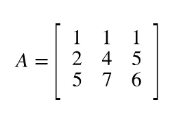
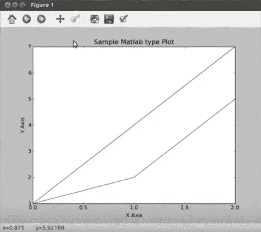

# 面向 Matlab 用户的 Python

> 原文：<https://towardsdatascience.com/python-for-matlab-users-ac3e0b8463a5?source=collection_archive---------5----------------------->


我注意到人们面临的一个普遍问题(尤其是在工程界)是从学术界到工业界的过渡。大多数学校更喜欢让我们使用 Matlab。无论你是电子工程师、化学工程师还是纳米工程师，你很可能在整个大学生涯中都不得不使用 Matlab(除了一点点 C/C++)。业界最近的一个趋势是从 Matlab 过渡到 Python。这可能是由于 1000 多美元的许可费，内存分配的低效率，缺乏开源库，甚至是大多数软件开发人员讨厌 Matlab 语法的事实。幸运的是，Matlab 和 Python 中的语法非常相似(如果你忽略 Matlab 索引从 1 开始而不是从 0 开始的事实)。在本教程中，我为 Matlab 用户介绍了数据分析和可视化领域的 Python 基础知识。

虽然代码可以在这个博客上找到，但我也在 youtube 上发布了相同的材料:

# 矩阵操作

Matlab 用户首先感兴趣的事情之一是线性代数和矩阵操作。Python 的数学库 numpy 附带了各种工具来执行简单的数学运算。

```
import numpy as np
```

让我们假设我们希望首先导出下面的矩阵， **A** :



对于那些习惯于简单 matlab 语法的人，可以使用以下内容:

```
A = np.matrix('1,1,1 ; 2,4,5 ; 5,7,6')
```

然而，Python 逻辑是以向量的形式工作的。因此，最终习惯以下语法很重要:

```
A = np.matrix([[1,1,1],[2,4,6],[5,7,6]])
```

现在我们已经定义了我们的矩阵，我们可以首先得到(0，0)值:

```
A[0,0]
```

输出:
T3 1

接下来，我们只能得到第一列:

```
A[:,0]
```

输出:
**[[1]
【2】
【5】]**

最后，就第一行:

```
A[0,:]
```

输出:
**[[1 1 1]]**

# 数学运算

既然我们已经成功地复制了矩阵操作，让我们尝试执行一些基本的数学运算。我们可以使用相同的 Numpy 库和上一节的矩阵 **A** 。

添加第一行的值:

```
np.sum(A[0,:])
```

输出:
**3**

**A** 与其自身的点积:

```
np.dot(A,A)
```

输出:
**[【8，12，13】，
【40，60，62】，
【49，75，83】]**

**A** 与其自身的叉积:

```
np.cross(A,A)
```

输出:
**[[0，0，0]，**
**【0，0，0】，
【0，0，0】]**

# 数据绘图

最后，在可视化数据时，绘图非常重要。Python 的 Matplotlib 函数提供了一组广泛的函数来执行绘图操作。

```
import matplotlib.pyplot as pltplt.figure()
plt.plot(A[:,0])
plt.plot(A[:,1])
plt.title('Sample Matlab type Plot')
plt.xlabel('X Axis')
plt.ylabel('Y Axis')
plt.show()
```

输出:

