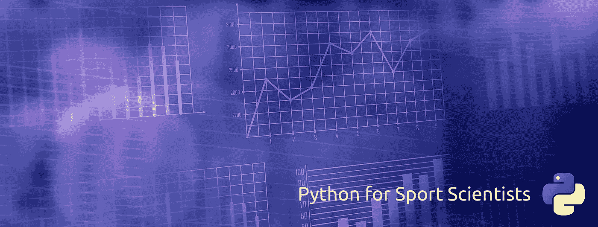
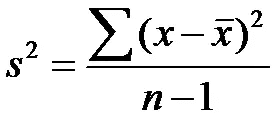
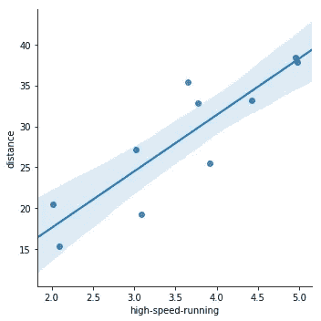
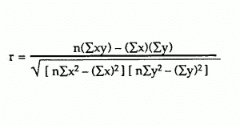

# 面向运动科学家的 Python:描述性统计

> 原文：<https://towardsdatascience.com/python-for-sport-scientists-descriptive-statistics-96ed7e66ab3c?source=collection_archive---------1----------------------->

## *了解如何使用易于理解的 Python 代码开始分析运动员相关数据集*



Python 在过去的几年里越来越受欢迎，是世界上许多数据科学家的首选语言。它也越来越受体育科学家的欢迎，这并非偶然，因为他们每天都要处理大量的数据。

虽然这篇文章可能对初学 Python 的体育科学家有所帮助，但它并不是对这种语言本身的介绍。更确切地说，它是对如何以一种更实用的方式解决问题和分析数据进行推理的介绍。

此外，本文将使用基本的描述性统计来说明如何构建可组合的函数式 Python 代码来解决问题。

在第一部分，我将介绍集中趋势的两种基本计算方法:平均值和中值。第二部分应用同样的原理计算标准差和方差。最后一部分通过计算两个变量之间的关系来介绍双变量分析。

# 第 1 部分:平均值和中位数

体育科学家一直在研究关于运动员的数据集，能够调用数据点列表上的`mean`来获得对它的总体了解是很有用的。在有异常值的数据集的情况下(我们毕竟是在和运动员一起工作)，我们可能需要使用`median`来找出第 50 百分位。

## 定义平均值

虽然 Python 有统计库可以导入这些函数，但我相信，研究这些统计库对于为以后解决更复杂的问题打下基础非常有帮助。当我们使用平方和或均方误差等可组合函数时，这将更有意义。

让我们首先创建一个`.py`文件并定义函数`mean`。下面是一个返回平均值的纯函数:

```
*# Python 3*
def mean (x):
  return sum(x) / len(x)
```

注意，`sum()`和`len()`是 python 自带的函数，它们返回 Python 数据结构的*总和*和*长度*。这里的`mean`函数是一个简单的*纯*函数，这意味着它没有副作用(给定相同的输入，它总是返回相同的结果。)

## 定义中位数

计算中值比平均值稍微复杂一些，但是足够简单。寻找数字列表的中值取决于找到排序列表的一半长度:`half = lambda arr: len(arr) / 2`。然而，这个函数有两个问题，假设我们要用它来查找索引(从 0 开始。)第一个问题是，它返回一个 float，我们需要一个整数来寻找索引处的值。第二个问题是，如果数字的长度是偶数，我们希望它返回中间两个索引中的第一个。我们可以使用`int()`函数来解决这个问题。让我们将它添加到我们的文件中:

`half()`函数现在返回中间的索引(或者在偶数列表的情况下，返回两个中间索引中的第一个):

```
evenList = [11, 12, 13, 14]
oddList = [21, 22, 23]half(evenList)
# 1half(oddList)
# 1
```

定义`median`的下一步是返回该索引处的值。如果长度是偶数，我们需要返回`arr[half(arr)]`和`arr[half(arr) + 1]`值的平均值来得到中值。因此，让我们最后编写中值函数，并将其添加到我们的文件中:

```
def median (arr):
    sortedList = sorted(arr)
    index = half(sortedList)
    if isEven(len(sortedList)):
        return mean([ sortedList[index], sortedList[index + 1] ])
    else:
        return sortedList[index]
```

瞧啊。从上面调用`median(evenList)`会返回`12.5`，调用`median(oddList)`会返回`22`。

这很酷，因为我们使用了刚刚定义的`mean()`函数！这是用函数编程最有趣的部分——它们作为简单的构件，可以用来解决任何问题。此外，请注意，我们必须在对数据集进行操作之前使用本机`sorted()`函数返回数据集的排序副本，这对于获得正确的中值至关重要。


## 把它放在一起

让我们在一个有点实际的例子中使用这两个函数。我将使用一个基本数据集，其中包含一些来自培训课程的 GPS 数据:

```
data = [
  {"name": "John",  "distance": 5602,  "high-speed-running": 504},
  {"name": "Mike",  "distance": 5242,  "high-speed-running": 622},
  {"name": "Chad",  "distance": 4825,  "high-speed-running": 453},
  {"name": "Phil",  "distance": 611,   "high-speed-running": 500},
  {"name": "Tyler", "distance": 5436,  "high-speed-running": 409}
]
```

这是一个字典列表，所以我们不能就这样叫`mean(data[“distance”])`。让我们在文件顶部导入方便的`pandas`库，将数据集转换成 Pandas 数据帧，这样我们就可以简单地对数据集的元素调用`mean`:

现在我们可以调用`mean(df['distance'])`返回`4343.2`。调用`median(df[‘distance’])`返回`5242`。

> ***要考虑的事情:*** 在这个特定的数据集中，为什么我们可能要在分析中使用`*median*`函数而不是`*mean*`？或者反之亦然。

# 第 2 部分:标准差和方差

标准差和方差密切相关。例如，方差被定义为标准偏差的平方(或者标准偏差是方差的平方根)。对于可组合的函数，这几乎太容易了！

## 差异

我们可以从方差开始，因为我们要做的就是对它求平方来得到标准差。我们在第 1 部分中定义的`mean`函数也将派上用场，还有 Python 的原生`len`函数。



查看样本方差的等式，并考虑到我们将对其求平方以获得标准差，继续定义一个值的平方函数似乎是一个好主意:

```
def square(x):
    return x * x
```

下一位有点复杂，但是我们可以用一个叫做`sumOfSquaredDifferences`的函数来计算分子:

```
def sumOfSquaredDifferences (arr):
    xBar = mean(arr)
    differences = map(lambda x: x - xBar, arr)
    squaredDifferences = map(square, differences)
    return sum(squaredDifferences)sprintEfforts = [88, 56, 51, 34, 50, 22, 61, 79, 90, 49]sumOfSquaredDifferences(sprintEfforts)
*# 4444*
```

这个函数本质上是计算每个值和平均值的差(使用高阶`map`函数)，然后求差的平方，并求出平方差的和。够简单！

现在找到样本方差很容易:

```
def variance (arr):
    n = len(arr)
    return sumOfSquaredDifferences(arr) / (n-1)variance(sprintEfforts)
*# 493.7*
```

## 标准偏差

总的来说，差异很大，但我们希望有一个我们更熟悉的衡量标准。幸运的是，计算方差的标准差轻而易举，因为它就是方差的平方根:

```
def sqrt (x):
    return x**(1/2)def stDev (arr):
    return sqrt(variance(arr))stDev(sprintEfforts)
*# 22.2*
```

除了 Python 对幂操作符(`**`)的古怪语法，这非常简单。让我们将它应用于第 1 部分中的 GPS 分数数据集:

```
stDev(df['high-speed-running'])
*# 79.62*
```

第 1 部分中更新后的文件应该是这样的:


## 关于构成函数的思考

事实证明，将具有单一目的的小而纯的函数组合在一起，有助于将基本的统计概念融入生活。这些统计计算对于实践良好的编程原则来说是完美的。

我们已经用了很多`map`和`lambda`函数。这些是处理数据列表的基础。为了最有效地构建可组合的功能性代码，尝试掌握并理解如何在任何语言中使用像`map`、`filter`和`reduce`这样的高阶函数是一个好主意。

# 第 3 部分:相关性

到目前为止，我们已经定义了单变量分析的函数，这些函数对于演示使用单个数据数组非常有用。

现在我们可以应用同样的逻辑，通过探索相关性来进行双变量分析。

## 绘制数据

使用数据集的首要规则是绘制数据以了解我们在处理什么。为了简单起见，让我们使用`import seaborn as sns`来创建情节:

该数据集基于第 1 部分和第 2 部分中使用的虚构数据集。但是，如果这些数据代表一个培训课程，则该数据集可以是相同指标的每周总计。这段代码将产生以下情节:



酷！我们马上就能看出“距离”和“高速奔跑”之间有着很强的正线性关系。

## 皮尔逊氏 r

下一步是通过找出皮尔逊相关系数来对其进行量化，皮尔逊相关系数可以用以下公式表示:



让我们把它分成几部分。我们将需要`count`代表 *n* ，`sum`代表σ，`sqrt`，以及`square`。此外，我们将需要`map`遍历每个 x 和 y 索引，并将它们相乘，以及对它们求平方。让我们从使用`count`将 n 添加到我们的文件开始:

```
# Python3
def n (arr):
  return arr.count()
```

下一步是映射每个“x”和“y”对，并返回它们乘积的总和:

```
def product (x, y):
  return x * ydef sumXTimesY (x, y):
  return sum(map(product, x, y))
```

现在我们可以很容易地定义分子:

```
def numerator (x, y):
  return n(x) * sumXTimesY(x, y) - sum(x) * sum(y)
```

分母看起来有点复杂，需要分解成最小的部分。我们来定义一下`sumOfSquares`:

```
def sumOfSquares (val):
  return sum(map(square, val))
```

现在，在第 2 部分的`sqrt`函数的帮助下，我们有了定义分母的所有工具:

```
def denominator (x, y):
  return sqrt((n(x) * sumOfSquares(x) - square(sum(x))) * (n(y) * sumOfSquares(y) - square(sum(y))))
```

现在，我们可以将它们放在文件的最终版本中:

不算太寒酸！我们不仅在`**0.88**`的 r 处看到了“距离”和“高速奔跑”之间非常强的关系，而且我们已经使用易于推理的功能性和可组合代码将它们放在一起。此外，以这种方式分解皮尔逊 r 公式，可以更深入地理解两个变量之间的关系到底是什么样子。


## 总结想法

值得重申的是，使用执行统计繁重任务的库是正确的方法，但是本文的重点是使用简单的函数概念来解决复杂的问题。

本文介绍了两个非常强大的数据可视化和分析库:Seaborn 和 Pandas。Seaborn 是一个基于 Matplotlib 的统计可视化库。由于它的简单性和灵活性，它是我进行高级统计绘图的首选库。Pandas 是一个非常棒的数据分析工具包，对于有电子表格工作背景的体育科学家来说非常有吸引力。

我写这篇文章的目的是为体育科学家提供构建功能代码库的工具，并理解如何以模块化和功能化的方式分析数据集。