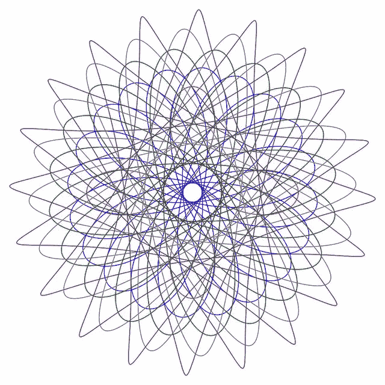
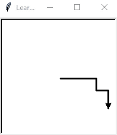
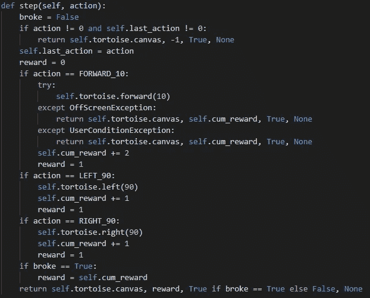
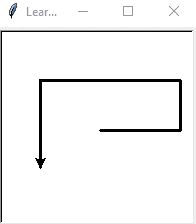
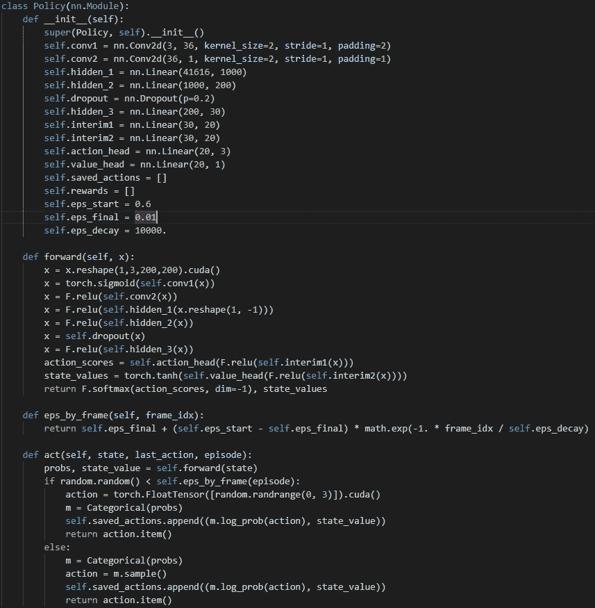
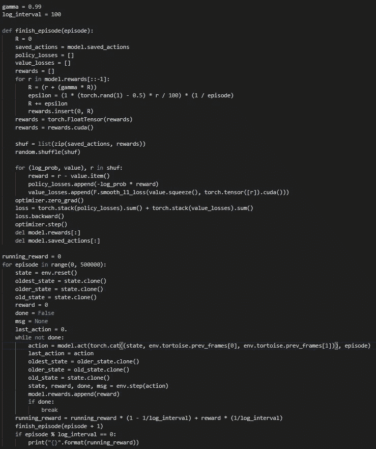

# Python 有一个内置的 Logo Turtle，非常适合强化学习

> 原文：<https://towardsdatascience.com/python-has-a-built-in-logo-turtle-and-its-great-for-reinforcement-learning-6b0dca4acb73?source=collection_archive---------13----------------------->

不久前，我在伯克利教授一门关于数据分析的课程，其中一个练习让学生通过 Python stdlib 来寻找感兴趣的模块。我也浏览了文档，很高兴地发现 Python 有一只乌龟！你还记得吗？

```
FORWARD 10
LEFT 90
```

我在 90 年代上的高中还不够富裕，无法拥有一只内置钢笔的机器乌龟(*小小提琴开始演奏*)，但我记得我被这个神奇生物在屏幕上的动作迷住了，我想当时它正在一个[橡子阿基米德](https://en.wikipedia.org/wiki/Acorn_Archimedes)上运行，这是今天芯片巨头 ARM 的早期产品。我从来不需要一个[肺活量描记器](https://en.wikipedia.org/wiki/Spirograph)，因为海龟在数学曼荼罗的生产中充分地占据了它的位置。



Thanks [SchoolCoders](https://medium.com/u/23283f685bb5?source=post_page-----6b0dca4acb73--------------------------------) ([https://www.flickr.com/photos/schoolcoders/](https://www.flickr.com/photos/schoolcoders/))

我在[这里](/deep-learning-a-monty-hall-strategy-or-a-gentle-introduction-to-deep-q-learning-and-openai-gym-d66918ac5b26)和[这里](/a-blundering-guide-to-making-a-deep-actor-critic-bot-for-stock-trading-c3591f7e29c2)之前写过关于强化学习的文章:这是一个我特别感兴趣的话题，因为它提供了一条通往 AGI(奇点)的道路，同时真正暴露了今天深度学习和人工智能的局限性。

# 框架问题和 Python 的海龟

我想创造一个代理，它能教会自己尽可能长时间地在屏幕上移动:避开屏幕的边缘，也避免撞到自己(像旧的贪吃蛇游戏那样)。



The turtle agent taking some mostly random actions early in training

直觉上，这应该会导致海龟盘绕在自己身上。

我很快发现了 Python 的内置 turtle 的一个可悲的问题:它绘制到一个 Tkinter 画布(如果你以前没有用 Python 做过 GUI 开发，就把它想象成‘某个对象’——像我一样！)而且没有办法从那个画布上读回像素。

所以，我实现了自己的 turtle 库，它包装了内置的(仍然使用它来绘制到屏幕)，但也保持画布的 NumPy 数组可用(以及指定数量的先前帧，这对 RL 很有用)。它为 RL 提供了其他一些方便的功能，你可以在我的 Github [这里](https://github.com/tomgrek/python-turtle)抓取这个库。我用来做这个项目的最终代码在那个 repo 的`examples` [文件夹](https://github.com/tomgrek/python-turtle/tree/master/examples)里。

下面是我构建的`env.step()`函数。你可以看到有 3 种可能的动作，两种结束游戏的情况(海龟离开屏幕或回到它的尾巴)，在一集结束时给出的累积奖励(向前移动会产生更高的奖励)，以及该动作的即时奖励(每个动作获得 1 个奖励)。



My ‘env.step’ function follows OpenAI’s (state, reward, done, msg) model. Going forward yields a higher reward than spinning around in place. ‘UserConditionException’ is when the turtle attempts to go back over its trail — it dies.

# 强化学习原则

早期的文章提供了更多的背景知识，但是原理非常简单:

*   一个代理在一个环境中做出一个动作，并获得一个奖励。
*   奖励由两部分组成:即时奖励(即密集奖励)(代理人吃了一个苹果)，以及延期奖励(即稀疏奖励)(代理人吃了 10 个苹果，赢得了游戏)。
*   代理人的批评部分比较它对奖励的期望(给定环境的状态和它采取的行动；那些期望开始是随机的)与它收到的实际回报。它们排列得越紧密越好:这意味着它可以用作亏损信号。
*   延期奖励(从现在到游戏结束的每一步乘以一些折扣因子)被添加到早期奖励中，这样代理人在每一时间步都知道自己在该时间步的行为最终是否带来了好的奖励。

这是演员兼评论家 RL，因为本质上有两个代理人:一个演员，和一个评论家。我们用一个有两个头的神经网络来实现它们。

行动者网络具有对应于可能动作数量的多个输出；选择的动作是其中的*软最大值*。(输出层的每个神经元的激活或值被解释为一种概率，softmax 确保在 3 种可能的操作下，每个神经元的最大激活为 0.33，因此很容易选择具有最高值的一个)。

不仅仅是批评者在学习如何更好地估计回报，行动者也在学习如何更好地行动:

*   当不可能的行动产生高回报时，损失信号增加，当行动确定性增加时，损失信号减少。一般来说，随着时间的推移，产生回报的行为应该变得更加确定。

因为行动损失和价值损失都被归为‘损失’(谁能说它们的走向是否一致？)，而且因为演员和评论家的网络没有太大的差异——显然需要大量的数据(迭代、时代、剧集、播放次数)才能实现融合。

最后一个重要因素是鼓励探索而不是开发，也就是说，避免局部最小值。有几种方法可以做到这一点，在我制作的代理中结合了这些方法:

*   Epsilon greedy(选择一个随机行动，有时随着时间的推移，概率会下降*epsilon*——当概率呈指数下降时，我们说‘退火’而不是下降，以防你想知道)
*   随机地干扰来自环境的奖励信号
*   任何神经网络的输出都不太可能达到 1.0 的概率。不要每次只选择与最大输出相对应的动作，而是从它的概率分布中取样。
*   神经网络中的丢失增加了固有的随机性。

这些方法中的每一种都需要更多的训练周期，但它们确实会产生更聪明的代理。幸运的是，在这种玩游戏的 RL 中不缺少数据；只要我们允许，代理可以玩。

# 代理及其结果

我制作的代理最终非常简单:两个卷积层，两个具有不同非线性的完全连接层，以及前面提到的由线性层组成的两个头。



It learns to avoid the edges of the canvas and avoid itself by going in a spiral

作为网络的输入，我制作了一个当前帧/画布的堆栈，加上前两个帧。(每一帧只有一个像素和/或海龟的方向不同)。



An unremarkable actor-critic network with epsilon-greedy learning built in.

# 我做这个学到的东西

如果你以前读过我的文章，你可能知道，我不会说制作这只 RL 海龟很容易。我学到的一些东西:

*   一如既往，奖励设计(即时和游戏结束时)是困难的，挑剔的，不完全直观的。
*   更多的噪音和熵源确实有助于探索阶段。不要以为一个就够了。
*   动作头和值头仅仅包含一个线性层是不够的。每个磁头有两层，中间有非线性，当固定在网络的主要“主体”上时，工作得更好。
*   RL 很容易达到稳定状态。通常五分钟训练和五小时训练后的损失没有太大区别。
*   将类似“last_action”的信号注入网络的后续层(绕过卷积层，并试图为网络提供一些有用的时间相关上下文)不一定有帮助。
*   随机选择海龟的起始位置和角度使得问题变得更加复杂。我认为这将有助于代理学习泛化，但至少在我给它的训练时间里，它大大降低了收敛速度。
*   一个 200x200 的网格，其中大部分是稀疏的(没有太多进展)，只有一个单一的像素线厚度，并且在我提供给网络的 3 个时间序列帧之间没有太大的差异，导致学习相当缓慢。



The training loop — where the ‘magic’ happens.

# 愚蠢的特工问题，未来的工作

随着时间的推移，随着它在边缘附近左转或右转的概率变得更高，我制作的代理在避免它方面变得更好，而不是学习永不超出屏幕边界的硬性规则。它没有常识！很难说代理人学到了什么。

那么，你如何将习得的或部分习得的概率分布具体化为实际的规则呢？这可以给一个更有效的代理，也可以学习得更快。有时可以打破的规则，或者当一些规则不再有用时，彻底忘记它们，又如何呢？

当然，还有一个经典的 RL 问题，代理在这里学到的东西在例如太空入侵者的游戏中是没有用的。代理没有海龟和它的踪迹以及屏幕边缘的概念，只有一串张量，它不知疲倦地一遍又一遍地相乘，并根据一些导数进行调整。奖励信号是手工编码的，当然，尽可能长时间的演奏本身就是一种不错的奖励。为什么还没有人找到内在激励人工智能的方法？

AGI 就要来了，但我们仍然需要解决巨大的工程和哲学挑战。谦逊的 Python 海龟继续为我提供了一个有趣的测试平台。

*感谢您的阅读！我喜欢和人们谈论 AGI，特别是我们如何从现在的位置开始建设，所以如果你愿意，请联系我们。接下来还有更多:)*