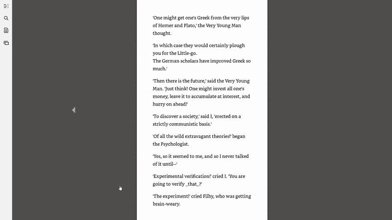

# Python 是解决任何问题的完美工具

> 原文：<https://towardsdatascience.com/python-is-the-perfect-tool-for-any-problem-f2ba42889a85?source=collection_archive---------4----------------------->


**反思我的第一个 Python 程序**

反思总是一种有益的(有时是有趣的)练习。出于怀旧的原因——如果一个人可以怀旧两年前的东西——我想分享我的第一个 Python 程序。当我还是一名航空航天工程专业的学生时，我最初选择 Python 是为了避免使用电子表格，当时我并不知道这将是一个多么好的决定。

我的 Python 教育始于 Al Sweigart 的书 [*用 Python 自动化枯燥的东西*](https://automatetheboringstuff.com/) ，这是一本优秀的基于应用程序的书，用简单的程序完成有用的任务。当我学习一个新的主题时，我会寻找任何使用它的机会，我需要用 Python 解决一个问题。幸运的是，我找到了一个课堂所需的 200 美元的教科书。我个人对教科书的限制是大约 20 美元(*自动化枯燥的东西*在网上是免费的)，我甚至拒绝租借这本书。我急切地想在第一次作业前拿到这本书，于是我看到这本书可以通过亚马逊的新账户免费试用一周。我拿到这本书一个星期，就可以做第一个作业了。虽然我可以一周一次地创建新账户，但我需要一个更好的解决方案。进入 Python 和我的第一个编程应用。

*中许多有用的库之一是 [pyautogui](https://pyautogui.readthedocs.io/en/latest/) ，它允许你通过 Python 控制键盘和鼠标。他们说，当你有一把锤子时，每个问题看起来都像钉子，这里的情况就是如此。Python 和 pyautogui 允许我按箭头键并截屏，我将这两者结合起来，提出了一个解决图书问题的方案。我写了我的第一个程序来自动翻阅书中的每一页并截图。结束程序只有 10 行长，但我为它感到自豪，就像我在航空航天工程中做的任何事情一样！以下是整个计划:*

```
import pyautogui
import time# Sleep for 5 seconds to allow me to open book
time.sleep(5)# Range can be changed depending on the number of pages
for i in range(1000): # Turn page
 pyautogui.keyDown('right')
 pyautogui.keyUp('right') # Take and save a screenshot
 pyautogui.screenshot('images/page_%d.pdf' % i)
 time.sleep(0.05)
```

运行这个程序非常简单(我鼓励任何人去尝试)。我将脚本保存为 book_screenshot.py，然后在同一个文件夹中弹出一个命令提示符并键入:

```
python book_screenshot.py
```

然后我会有 5 秒钟的时间翻到这本书，并把它全屏显示。该程序将完成剩下的工作，翻阅每一页，并截图保存为 pdf 格式。然后，我可以将所有的 pdf 文件合并成一个文件，并拥有这本书的副本(法律问题)!诚然，这是一个相当可怕的副本，因为它无法被搜索，但我尽可能使用我的“书”的任何借口。



I could watch this for hours

这个例子展示了我在继续接受数据科学教育的过程中一直铭记的两个要点:

1.  学习新技能的最好方法是找到你需要解决的问题。
2.  你不需要完全掌握一项技能才有用。

仅用几行代码和一本免费的在线书籍，我就编写了一个实际上已经投入使用的程序。学习基础知识可能很乏味，我第一次学习 Python 的尝试在几个小时内就失败了，因为我陷入了数据结构和循环之类的想法。改变策略，我开始开发解决实际问题的方法，并最终学到了基本原理。编程和数据科学需要掌握的东西太多了，但你不需要一下子学会所有的东西。挑一个你需要解决的问题，开始行动吧！

从那以后，我制作了几个[更复杂的节目](/stock-analysis-in-python-a0054e2c1a4c)，但我仍然津津有味地记得这第一个剧本！

分享你的第一个节目！我欢迎讨论、反馈和建设性的批评。可以通过 Twitter @koehrsen_will 联系到我。