# 用 Python 绘制马科维茨有效边界

> 原文：<https://towardsdatascience.com/python-markowitz-optimization-b5e1623060f5?source=collection_archive---------0----------------------->

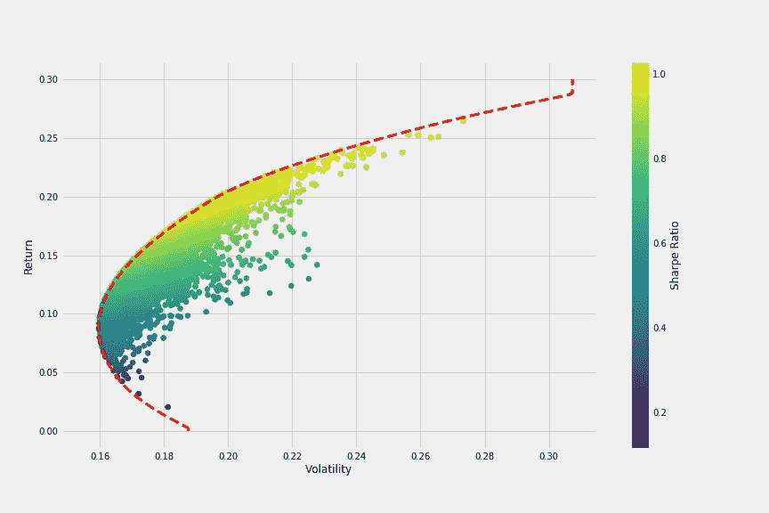

这篇文章是关于计算夏普比率的文章的后续。在知道如何获得夏普比率后，我们将模拟几千种可能的投资组合配置，并将结果绘制成图表。有了这个，我们可以很容易地找到我们愿意承担的任何给定风险水平的股票的最佳配置。

与上一篇文章一样，我们需要加载数据。我将使用四个简单的文件，有两列——日期和收盘价。你可以用自己的数据，或者在 Quandl 里找点东西，这个用途很好。我们有 4 家公司——亚马逊、IBM、思科和苹果。每个文件分别加载为 *amzn* 、 *ibm* 、*思科*和 *aapl* 。下面印的是 *aapl* 的头像。

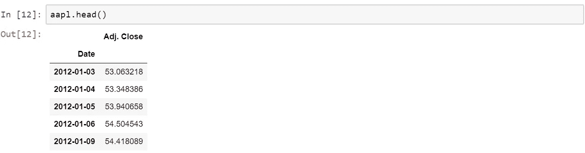

我们希望将所有价格合并到一个名为*股票*的数据框架中，这里有一种方法。

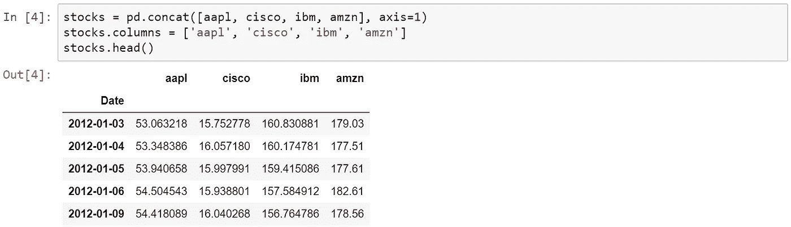

我们需要对这个数据框架做的一件事是标准化数据。我将使用对数回报，因为它更方便，而且它负责项目其余部分的标准化。将一切转换成对数回报很简单。可以把它想象成一个算术日收益率的对数(它是通过把第 n 天的价格除以第 n-1 天的价格得到的)。

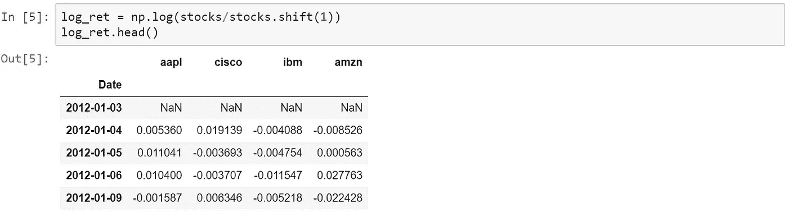

围绕这一点，事情开始变得有趣起来！我们需要为循环准备一个*，它将模拟四只股票的几种不同组合，并保存它们的夏普比率。我要用 6000 个作品集，但是如果你的电脑太慢的话可以少用一点。代码顶部的随机种子确保我每次都得到相同的随机数，以保证可重复性。*

从这里，我们可以获得模拟中出现的最大夏普比率以及它出现的行，因此我们可以获得其中的权重。

所以最佳投资组合在指数 5451 上。让我们检查该指数中的分配权重，并保存回报率和波动性数据，以便稍后在图表中使用。

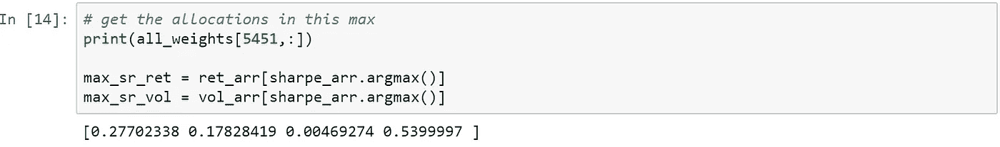

我们有了绘制图表所需的一切，可以根据波动率(或风险)和回报率来比较所有组合，并用夏普比率来着色。红点是从上面的计算中获得的，它代表具有最大夏普比率的模拟的回报和波动性。

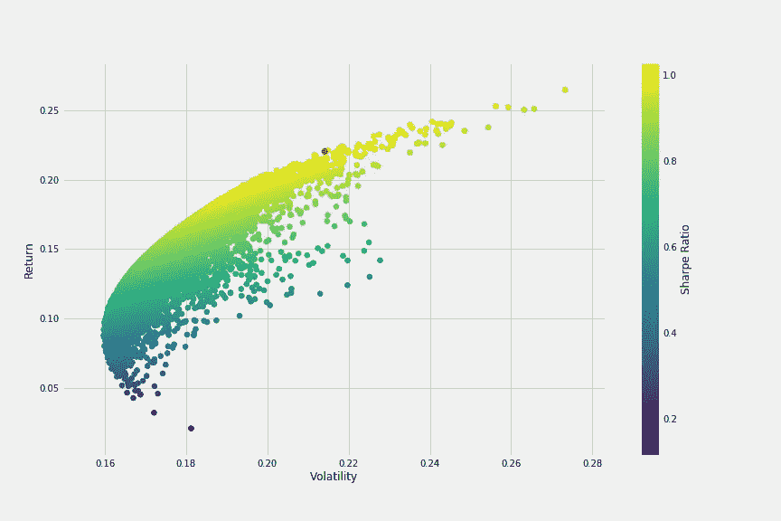

我们已经可以在图表中看到子弹形状，这种形状勾勒出了我们稍后将绘制的有效边界。为此，我们需要定义更多的函数。第一个函数 *get_ret_vol_sr* 将返回一个数组，其中包含任意给定权重集的 *return* 、*波动率*和*夏普比率*。

第二个函数 *neg_sharpe* 将从一些权重中返回负的 sharpe 比率(稍后我们将使用它来最小化)。

第三个函数 *check_sum* 将检查权重的总和，其必须为 1。如果总和为 1，它将返回 0(零)。

接下来，我们需要创建一个变量来包含我们的约束，比如 *check_sum* 。我们还将定义一个初始猜测和具体的界限，以帮助最小化更快更有效。我们最初的猜测将是每只股票 25%(或 0.25)，每只股票的界限将是一个元组(0，1)，因为权重的范围可以从 0 到 1。

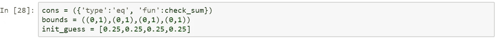

进入最小化功能。我选择了“SLSQP”方法，因为这是大多数一般最小化问题使用的方法。如果你想知道，它代表序列最小二乘规划。确保用上面定义的变量传递初始方法、边界和约束。如果我们打印变量，它看起来会像这样:

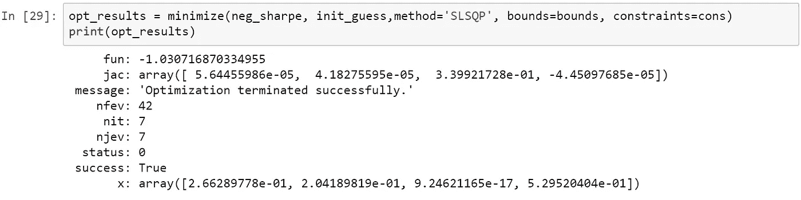

我们需要字典中的键 *x* ，它是一个数组，包含具有最大夏普比率的投资组合的权重。如果我们使用我们的函数 *get_ret_vol_sr* ，我们得到回报、波动率和夏普比率:

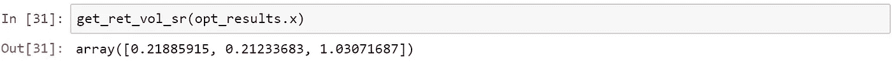

因此，我们获得了比之前模拟更好的夏普比率(1.0307，而不是之前的 1.0287)。

我们现在准备检查所有的最优投资组合，这基本上是我们的有效边界。有效边界是在任何给定的风险水平下，使我们获得最高预期回报的投资组合集合。或者从另一个角度来看，期望回报的最小风险。为了追踪这条线，我们可以定义一个变量 *frontier_y* 。回到上面的图表，我们可以看到最大回报不会比 0.3 高太多，所以 *frontier_y* 将被定义为从 0 到 0.3。

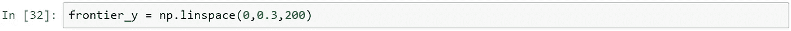

为了完成边界的绘制，我们定义了最后一个函数来帮助我们最小化波动性。它将返回给定权重的波动率(指数 1)。

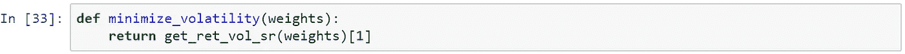

现在，帮助我们得到有效边界的 *x* 值的最后一点代码。我们使用与上面相同的代码，只是对约束做了一些修改。循环的*基本上是遍历我们之前定义的 *frontier_y* 中的每一个可能值，并获得波动率(图表中我们的 *x* 轴)的最小结果(这是关键的*【乐趣】*)。*

最后，我们可以通过传递变量 *frontier_x* 和 *frontier_y* 来绘制实际的有效边界。

Markowitz Efficient Frontier mapped in red

这些是使用 Python 进行 Markowitz 投资组合优化的步骤。当你投入更多的股票，对不同的风险策略进行结果测试时，事情就变得更有趣了。当然，这种类型的分析总是基于过去，因此它不能保证未来的结果。尽管如此，它可以给你一个特定策略的预期输出的好主意。

欢迎提问或在下方留言！编码快乐！

如果你对 Python 的金融分析感兴趣，有两本很棒的书，几乎涵盖了你需要的所有内容:

*   金融 python:[https://amzn.to/3SE6Mu0](https://amzn.to/3SE6Mu0)
*   用 Python 写金融理论:【https://amzn.to/3SC4Vpq 

*声明:本文中的一些链接是附属链接。这意味着，对你来说零成本，如果你通过链接完成购买，我将赚取代销商佣金！*